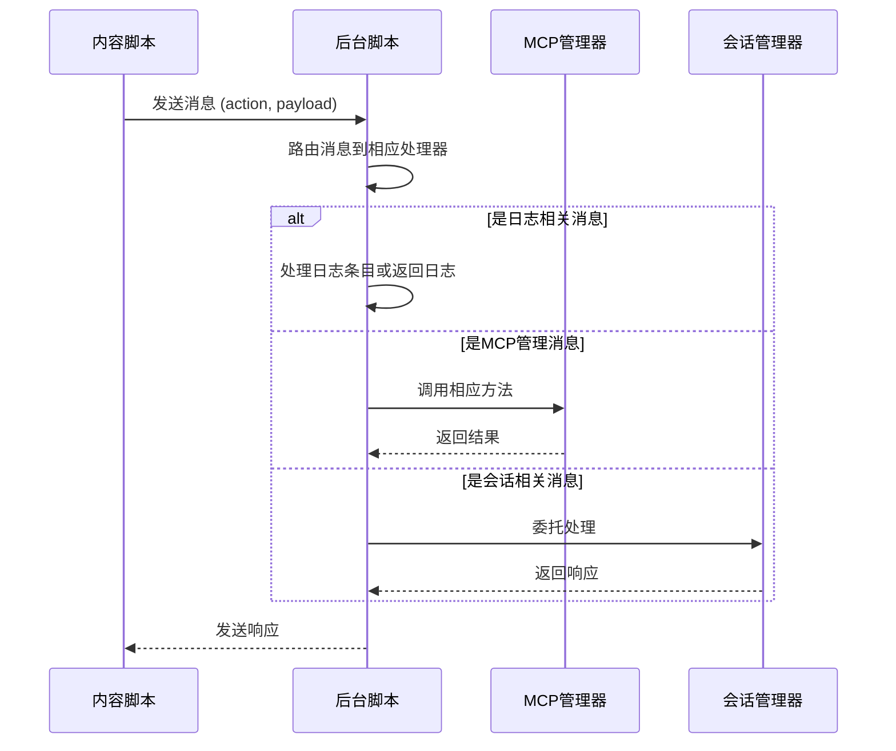
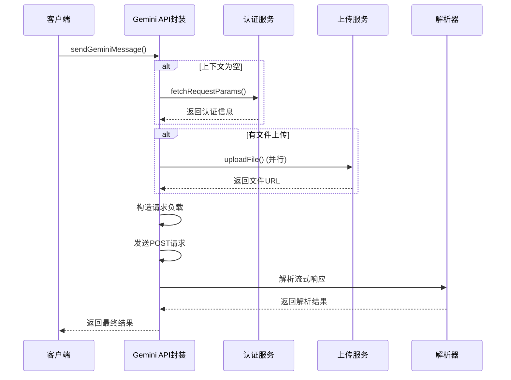
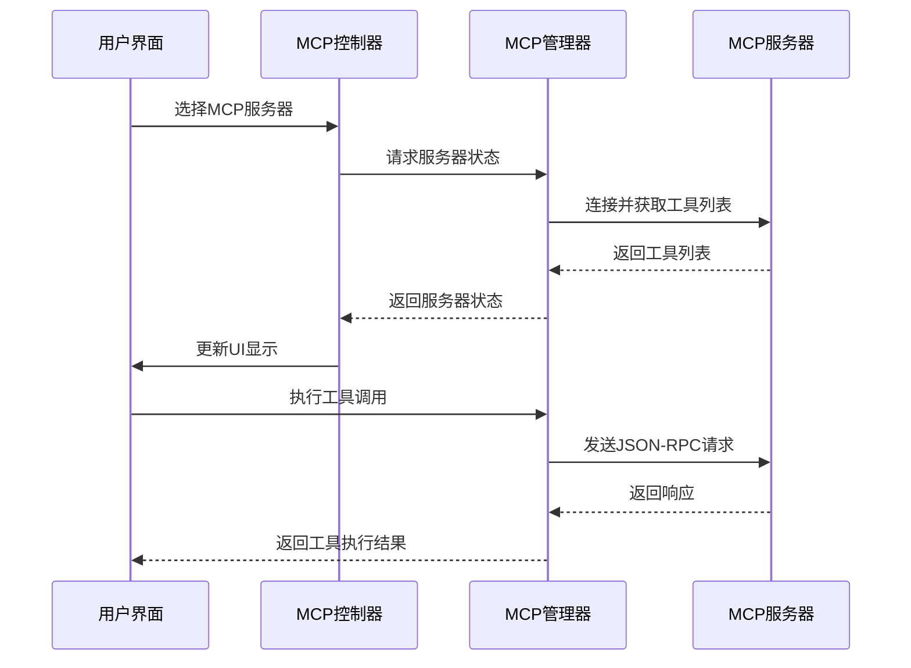
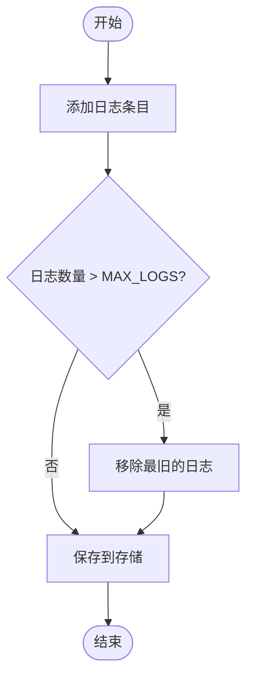

# API参考

<cite>
**本文档中引用的文件**  
- [services/gemini_api.js](file://services/gemini_api.js)
- [background/messages.js](file://background/messages.js)
- [lib/messaging.js](file://lib/messaging.js)
- [background/managers/mcp_manager.js](file://background/managers/mcp_manager.js)
- [sandbox/controllers/mcp_controller.js](file://sandbox/controllers/mcp_controller.js)
- [services/auth.js](file://services/auth.js)
- [services/upload.js](file://services/upload.js)
- [services/parser.js](file://services/parser.js)
- [background/handlers/session.js](file://background/handlers/session.js)
- [background/handlers/session/prompt_handler.js](file://background/handlers/session/prompt_handler.js)
- [background/managers/session_manager.js](file://background/managers/session_manager.js)
- [background/managers/log_manager.js](file://background/managers/log_manager.js)
- [lib/utils.js](file://lib/utils.js)
</cite>

## 目录
1. [简介](#简介)
2. [内部通信协议](#内部通信协议)
3. [Gemini API封装](#gemini-api封装)
4. [MCP协议工具调用](#mcp协议工具调用)
5. [API版本管理](#api版本管理)
6. [客户端调用最佳实践](#客户端调用最佳实践)
7. [调试方法](#调试方法)

## 简介
Gemini Nexus是一个基于Chrome扩展的智能助手系统，提供与Gemini AI模型的深度集成。本API参考文档详细描述了系统的内部通信机制、外部服务API接口、MCP（Model Context Protocol）工具调用规范以及相关的认证和错误处理机制。系统采用模块化架构，通过chrome.runtime.sendMessage实现后台脚本与内容脚本之间的IPC通信，并封装了Gemini API以支持多模型选择、文件上传和流式响应处理。

## 内部通信协议
Gemini Nexus系统使用chrome.runtime.sendMessage作为主要的IPC（进程间通信）机制，实现后台脚本（background script）与内容脚本（content script）之间的双向通信。通信协议基于JSON格式的消息对象，包含action字段标识操作类型，payload字段携带具体数据。

### 消息类型与数据格式
系统定义了多种消息类型，用于不同的功能场景：

- **LOG_ENTRY**: 用于日志记录，携带日志条目数据
- **GET_LOGS**: 请求获取所有日志，后台返回日志数组
- **OPEN_TAB_BACKGROUND**: 在后台打开新标签页，不切换焦点
- **MCP_SAVE_CONFIG**: 保存MCP服务器配置
- **MCP_GET_CONFIG**: 获取MCP服务器配置
- **MCP_GET_TOOLS**: 获取所有可用工具列表
- **MCP_GET_STATUS**: 获取MCP服务器状态信息
- **FORWARD_TO_BACKGROUND**: 从内容脚本转发消息到后台脚本
- **SAVE_SESSIONS**: 保存会话数据到存储
- **GET_THEME**: 请求主题设置
- **SAVE_THEME**: 保存主题设置



**Diagram sources**
- [background/messages.js](file://background/messages.js#L22-L80)
- [lib/messaging.js](file://lib/messaging.js#L4-L96)

**Section sources**
- [background/messages.js](file://background/messages.js#L1-L82)
- [lib/messaging.js](file://lib/messaging.js#L1-L96)

### 请求/响应模式
系统采用异步请求/响应模式进行通信。当发送方调用chrome.runtime.sendMessage时，可以提供一个回调函数来接收响应。对于需要立即响应的消息，消息处理器返回true，并在适当时候调用sendResponse函数。对于单向消息（如日志记录），处理器返回false。

### 错误码
系统定义了以下主要错误码：
- **未登录 (Session expired)**: 认证会话已过期，需要重新登录
- **请求过于频繁，请稍后再试 (Rate limited)**: 请求频率过高，被服务器限流
- **服务器无响应，请检查网络连接 (Empty response)**: 服务器无响应，可能是网络问题
- **响应解析失败，请刷新 Gemini 页面后重试 (Invalid response)**: 响应格式无效，需要刷新页面

## Gemini API封装
Gemini API封装位于services/gemini_api.js文件中，提供了sendGeminiMessage函数作为主要的API调用接口。该封装处理了认证、文件上传、请求构造和响应解析等复杂细节。

### 调用方式
通过调用sendGeminiMessage函数来与Gemini API交互：

```javascript
import { sendGeminiMessage } from './services/gemini_api.js';

const result = await sendGeminiMessage(
    prompt,      // 提示文本
    context,     // 上下文对象
    model,       // 模型名称
    files,       // 文件数组
    signal,      // 取消信号
    onUpdate,    // 更新回调
    gemId        // Gem ID（可选）
);
```

### 参数说明
| 参数 | 类型 | 必需 | 说明 |
|------|------|------|------|
| prompt | string | 是 | 用户输入的提示文本 |
| context | object | 是 | 包含认证信息和会话上下文的对象 |
| model | string | 否 | 指定使用的Gemini模型，支持'gemini-2.5-flash'、'gemini-2.5-pro'、'gemini-3.0-pro' |
| files | array | 否 | 要上传的文件数组，每个文件包含base64和name属性 |
| signal | AbortSignal | 否 | 用于取消请求的信号 |
| onUpdate | function | 否 | 流式响应更新时的回调函数 |
| gemId | string | 否 | 注入的Gem ID，用于特定功能 |

### 速率限制
系统会自动处理速率限制。当收到429状态码或"RESOURCE_EXHAUSTED"错误时，API会抛出"请求过于频繁，请稍后再试"的错误。建议客户端实现指数退避重试策略。

### 认证机制
认证通过auth.js中的fetchRequestParams函数实现。该函数从Gemini网页中提取必要的认证令牌（atValue、blValue）和用户索引。系统支持多账户切换，通过userIndex参数指定要使用的账户。



**Diagram sources**
- [services/gemini_api.js](file://services/gemini_api.js#L26-L230)
- [services/auth.js](file://services/auth.js#L7-L40)
- [services/upload.js](file://services/upload.js#L7-L39)
- [services/parser.js](file://services/parser.js#L4-L157)

**Section sources**
- [services/gemini_api.js](file://services/gemini_api.js#L1-L230)
- [services/auth.js](file://services/auth.js#L1-L41)
- [services/upload.js](file://services/upload.js#L1-L40)

## MCP协议工具调用
MCP（Model Context Protocol）协议允许Gemini模型调用外部工具来增强其功能。MCP管理器负责管理MCP服务器连接、工具发现和工具执行。

### 接口规范
MCP管理器提供了以下主要接口：

- **init()**: 初始化MCP管理器，加载配置并连接服务器
- **saveConfig(jsonStr)**: 保存MCP服务器配置
- **loadConfig()**: 从存储中加载配置
- **connectServer(id)**: 连接到指定的MCP服务器
- **disconnectAll()**: 断开所有服务器连接
- **getAllTools()**: 获取所有可用工具列表
- **getSystemPrompt()**: 生成系统提示，包含可用工具信息
- **executeTool(name, args)**: 执行指定工具

### 执行流程
工具调用的执行流程如下：

1. 用户请求触发工具调用
2. 系统检查是否有选中的MCP服务器
3. MCP管理器查找指定名称的工具
4. 根据服务器模式（SSE或HTTP）选择适当的请求方法
5. 发送JSON-RPC格式的工具调用请求
6. 等待并处理响应
7. 将结果返回给调用方



**Diagram sources**
- [background/managers/mcp_manager.js](file://background/managers/mcp_manager.js#L2-L530)
- [sandbox/controllers/mcp_controller.js](file://sandbox/controllers/mcp_controller.js#L2-L221)

**Section sources**
- [background/managers/mcp_manager.js](file://background/managers/mcp_manager.js#L1-L530)
- [sandbox/controllers/mcp_controller.js](file://sandbox/controllers/mcp_controller.js#L1-L221)

## API版本管理
系统目前采用单一版本管理策略，通过manifest.json中的version字段标识当前版本。未来的API版本管理将考虑以下策略：

- **向后兼容性**: 新版本API将保持对旧版本客户端的向后兼容
- **渐进式升级**: 通过特性开关（feature flags）逐步引入新功能
- **版本协商**: 在通信协议中包含版本信息，实现版本协商
- **弃用策略**: 对即将废弃的API提供明确的弃用通知和迁移指南

当前系统通过动态配置和灵活的解析逻辑来适应Gemini后端的变化，例如parser.js中的深度遍历算法能够适应不同模型返回的响应结构变化。

## 客户端调用最佳实践
为了确保稳定和高效的API调用，建议遵循以下最佳实践：

### 错误处理
- 实现全面的错误处理机制，捕获并妥善处理各种可能的错误
- 对于认证错误，引导用户重新登录
- 对于速率限制错误，实现指数退避重试策略
- 对于解析错误，提供清晰的错误信息和恢复建议

### 超时设置
- 为所有网络请求设置合理的超时时间
- 使用AbortController来实现请求取消功能
- 在UI中提供取消操作的选项

### 性能优化建议
- 批量处理多个文件上传，利用Promise.all实现并行上传
- 缓存认证信息，避免频繁的认证令牌获取
- 实现响应流的增量处理，提供更好的用户体验
- 合理管理内存，及时清理不再需要的数据

## 调试方法
系统提供了多种调试工具和方法，帮助开发者诊断和解决问题。

### 日志系统
LogManager提供了完整的日志记录功能，支持日志的添加、获取和清除。所有关键操作都会生成日志条目，便于追踪系统行为。



**Diagram sources**
- [background/managers/log_manager.js](file://background/managers/log_manager.js#L1-L62)

**Section sources**
- [background/managers/log_manager.js](file://background/managers/log_manager.js#L1-L62)

### 调试工具
- **MCP调试信息**: 通过MCP_GET_STATUS消息获取MCP服务器的详细状态信息
- **网络活动监控**: 收集和分析网络请求，帮助诊断连接问题
- **控制台日志**: 使用console.log和console.error输出调试信息
- **存储检查**: 检查chrome.storage.local中的数据，验证配置和状态

### 调试流程
1. 启用详细日志记录
2. 复现问题场景
3. 检查日志输出，定位问题根源
4. 使用调试工具获取更多上下文信息
5. 修复问题并验证