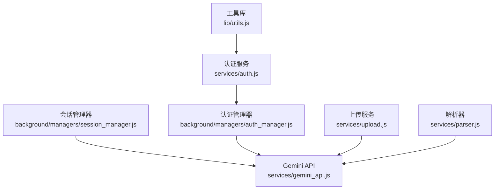
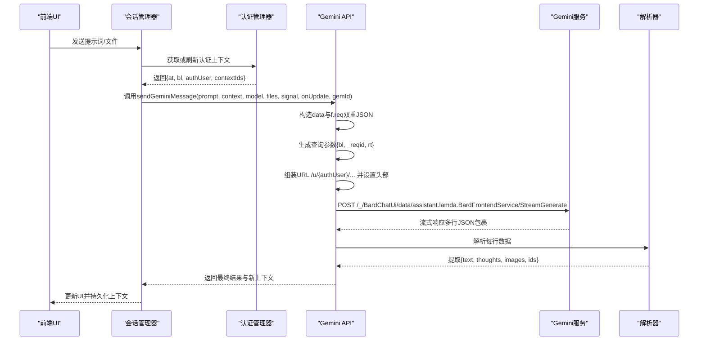
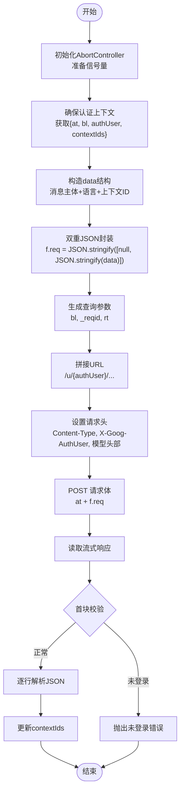
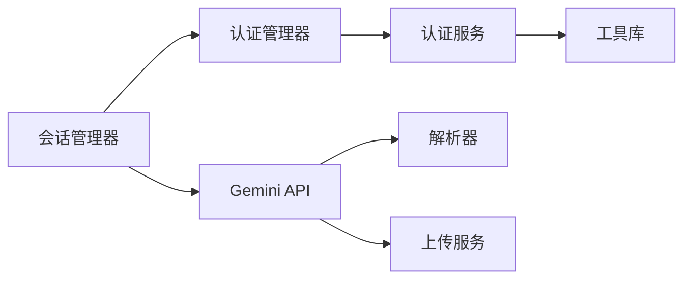

# API端点说明

<cite>
**本文引用的文件**
- [services/gemini_api.js](file://services/gemini_api.js)
- [background/managers/auth_manager.js](file://background/managers/auth_manager.js)
- [services/auth.js](file://services/auth.js)
- [services/parser.js](file://services/parser.js)
- [services/upload.js](file://services/upload.js)
- [background/managers/session_manager.js](file://background/managers/session_manager.js)
- [lib/utils.js](file://lib/utils.js)
</cite>

## 目录
1. [简介](#简介)
2. [项目结构](#项目结构)
3. [核心组件](#核心组件)
4. [架构总览](#架构总览)
5. [详细组件分析](#详细组件分析)
6. [依赖关系分析](#依赖关系分析)
7. [性能考量](#性能考量)
8. [故障排查指南](#故障排查指南)
9. [结论](#结论)

## 简介
本文件系统性说明Gemini服务中用于流式对话的StreamGenerate API端点，重点覆盖以下方面：
- 端点URL构造规则：特别是/u/{authUser}路径参数与认证账户索引的绑定
- HTTP方法与请求体：使用POST与表单编码，包含关键参数与批处理风格数据封装
- 批处理风格数据封装：f.req参数的双重JSON序列化结构及编码方式
- 查询参数：bl、_reqid、rt的作用与生成逻辑
- 动态构建请求URL：基于用户身份与认证状态的一致性保障
- 完整调用流程图：从请求初始化到流式响应接收的全过程

## 项目结构
围绕StreamGenerate端点的相关模块分布如下：
- 服务层：负责发送请求、解析响应、文件上传等
- 管理层：负责认证上下文管理、会话管理、多账户轮换
- 工具库：通用工具函数（如HTML令牌提取）

图表来源
- [background/managers/session_manager.js](file://background/managers/session_manager.js#L1-L285)
- [services/gemini_api.js](file://services/gemini_api.js#L1-L230)
- [background/managers/auth_manager.js](file://background/managers/auth_manager.js#L1-L130)
- [services/auth.js](file://services/auth.js#L1-L41)
- [services/upload.js](file://services/upload.js#L1-L40)
- [services/parser.js](file://services/parser.js#L1-L157)
- [lib/utils.js](file://lib/utils.js#L1-L59)

章节来源
- [services/gemini_api.js](file://services/gemini_api.js#L1-L230)
- [background/managers/auth_manager.js](file://background/managers/auth_manager.js#L1-L130)
- [services/auth.js](file://services/auth.js#L1-L41)
- [services/parser.js](file://services/parser.js#L1-L157)
- [services/upload.js](file://services/upload.js#L1-L40)
- [lib/utils.js](file://lib/utils.js#L1-L59)

## 核心组件
- StreamGenerate端点封装与调用：位于服务层，负责构造请求、发送POST、处理流式响应
- 认证上下文管理：负责获取/更新at、bl、authUser等令牌与索引
- 文件上传：支持多模态输入，将本地文件上传至Google内容推送服务
- 流式响应解析：逐行解析服务器返回的JSON包裹数据，提取文本、思考过程与图片

章节来源
- [services/gemini_api.js](file://services/gemini_api.js#L26-L230)
- [background/managers/auth_manager.js](file://background/managers/auth_manager.js#L50-L92)
- [services/upload.js](file://services/upload.js#L7-L39)
- [services/parser.js](file://services/parser.js#L4-L156)

## 架构总览
下图展示了从UI触发到流式响应接收的端到端流程，强调URL构造、参数注入与流式读取的关键节点。

图表来源
- [background/managers/session_manager.js](file://background/managers/session_manager.js#L21-L128)
- [services/gemini_api.js](file://services/gemini_api.js#L26-L230)
- [services/parser.js](file://services/parser.js#L4-L156)

## 详细组件分析

### StreamGenerate端点与URL构造
- 端点URL固定路径为：/_/BardChatUi/data/assistant.lamda.BardFrontendService/StreamGenerate
- 关键路径参数：/u/{authUser}/，其中{authUser}来自认证上下文，确保Cookie与目标账户匹配
- 查询参数：
  - bl：平台版本标识，来源于认证上下文
  - _reqid：随机请求ID，每次请求生成一个范围内的随机数
  - rt：运行时标记，固定为"c"
- 请求方法：HTTP POST
- 请求体：application/x-www-form-urlencoded，包含两个字段：
  - at：来自认证上下文
  - f.req：批处理风格的双重JSON序列化字符串

章节来源
- [services/gemini_api.js](file://services/gemini_api.js#L118-L151)
- [services/auth.js](file://services/auth.js#L7-L40)
- [background/managers/auth_manager.js](file://background/managers/auth_manager.js#L75-L92)

### 批处理风格数据封装与f.req
- data结构：由消息主体、语言提示、上下文ID数组等组成
- f.req格式：外层数组包含两个元素，第二个元素是data的JSON字符串；外层再进行一次JSON序列化
- 这种双重包装是针对批处理风格端点（Batchexecute）的要求，确保服务器正确识别与解包

章节来源
- [services/gemini_api.js](file://services/gemini_api.js#L91-L116)

### 头部与模型选择
- Content-Type：application/x-www-form-urlencoded;charset=UTF-8
- X-Same-Domain：1
- X-Goog-AuthUser：来自认证上下文的authUser
- x-goog-ext-525001261-jspb：通过模型配置选择不同头部值，用于指定模型族
- 可选头部：当存在gemId时，注入x-goog-ext-525005358-jspb

章节来源
- [services/gemini_api.js](file://services/gemini_api.js#L124-L137)

### 流式响应处理
- 使用ReadableStream Reader逐块读取响应
- 首块校验：若包含<html>或“Sign in”等标识，判定为未登录并抛出错误
- 行级解析：去除反劫持前缀后按行解析JSON，提取文本、思考过程与图片
- 上下文更新：解析成功后更新contextIds，供后续请求复用

章节来源
- [services/gemini_api.js](file://services/gemini_api.js#L158-L229)
- [services/parser.js](file://services/parser.js#L4-L156)

### 认证上下文与多账户轮换
- 认证上下文包含：atValue、blValue、authUser、contextIds
- 若当前无上下文，将通过fetchRequestParams获取令牌与索引
- 支持多账户索引轮换，失败时自动切换账户并重试

章节来源
- [background/managers/auth_manager.js](file://background/managers/auth_manager.js#L75-L92)
- [services/auth.js](file://services/auth.js#L7-L40)

### 多模态文件上传
- 将本地文件转换为Blob后以multipart/form-data上传至Google内容推送服务
- 上传成功后返回可嵌入消息结构的标识符

章节来源
- [services/upload.js](file://services/upload.js#L7-L39)

### 完整调用流程图

图表来源
- [services/gemini_api.js](file://services/gemini_api.js#L26-L230)
- [background/managers/auth_manager.js](file://background/managers/auth_manager.js#L75-L92)
- [services/parser.js](file://services/parser.js#L4-L156)

## 依赖关系分析
- 会话管理器依赖认证管理器获取上下文，并在成功后持久化
- Gemini API服务依赖认证服务获取令牌，依赖解析器处理流式响应
- 文件上传服务独立于主流程，仅在存在多模态输入时参与

图表来源
- [background/managers/session_manager.js](file://background/managers/session_manager.js#L1-L285)
- [services/gemini_api.js](file://services/gemini_api.js#L1-L230)
- [background/managers/auth_manager.js](file://background/managers/auth_manager.js#L1-L130)
- [services/auth.js](file://services/auth.js#L1-L41)
- [services/upload.js](file://services/upload.js#L1-L40)
- [services/parser.js](file://services/parser.js#L1-L157)
- [lib/utils.js](file://lib/utils.js#L1-L59)

章节来源
- [background/managers/session_manager.js](file://background/managers/session_manager.js#L1-L285)
- [services/gemini_api.js](file://services/gemini_api.js#L1-L230)

## 性能考量
- 并发上传：多模态文件上传采用Promise.all并发处理，提升整体吞吐
- 流式读取：使用Reader逐块读取，避免一次性加载大响应
- 重试策略：多账户轮换与有限重试，平衡稳定性与延迟
- 头部优化：通过模型头部直接选择模型族，减少payload复杂度

章节来源
- [services/gemini_api.js](file://services/gemini_api.js#L46-L56)
- [background/managers/session_manager.js](file://background/managers/session_manager.js#L43-L46)

## 故障排查指南
- 未登录/会话过期：首块包含<html>或“Sign in”时抛错，建议打开对应账户登录页
- 请求过于频繁：响应包含限流信息时，等待后重试
- 服务器无响应：空响应或超时，建议刷新页面后重试
- 响应解析失败：无法解析JSON包裹数据，建议刷新页面后重试
- 多账户轮换：若启用多账户，遇到认证错误会自动切换账户并重试

章节来源
- [services/gemini_api.js](file://services/gemini_api.js#L172-L219)
- [background/managers/session_manager.js](file://background/managers/session_manager.js#L129-L147)

## 结论
本文档系统梳理了Gemini StreamGenerate端点的URL构造、请求体格式、批处理风格封装、查询参数作用与生成逻辑，并结合实际代码路径给出动态构建URL与认证一致性保障的方法。同时提供了完整的调用流程图与故障排查建议，便于开发者快速定位问题并稳定集成该端点。