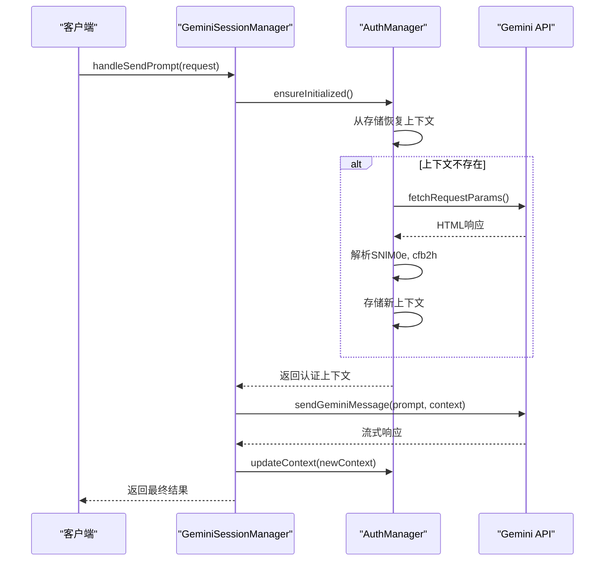
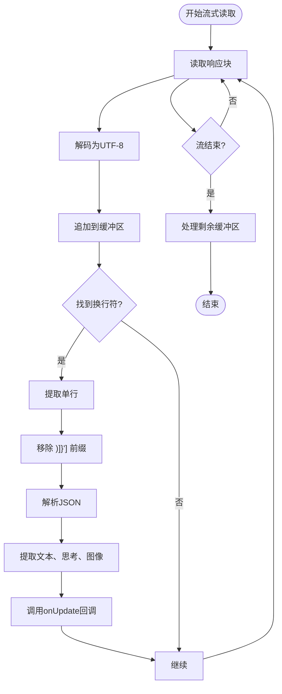
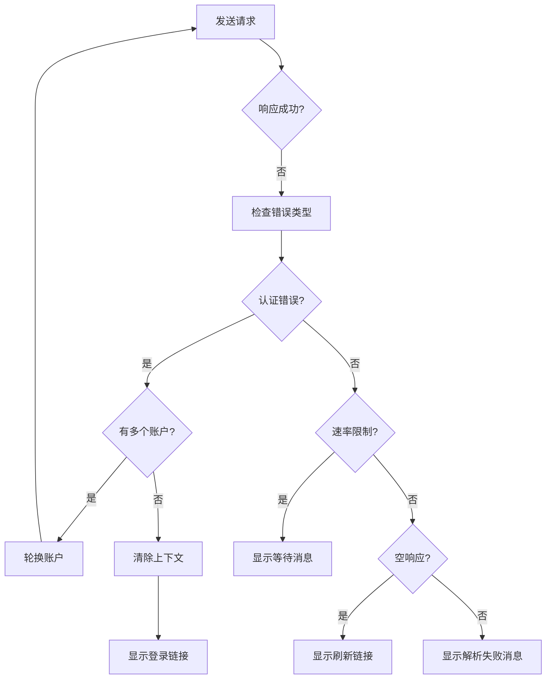

# Gemini服务API

<cite>
**本文档引用的文件**
- [gemini_api.js](file://services/gemini_api.js)
- [auth.js](file://services/auth.js)
- [upload.js](file://services/upload.js)
- [parser.js](file://services/parser.js)
- [auth_manager.js](file://background/managers/auth_manager.js)
- [session_manager.js](file://background/managers/session_manager.js)
- [history_manager.js](file://background/managers/history_manager.js)
- [builder.js](file://background/handlers/session/prompt/builder.js)
- [preamble.js](file://background/handlers/session/prompt/preamble.js)
- [utils.js](file://lib/utils.js)
</cite>

## 目录
1. [简介](#简介)
2. [核心功能](#核心功能)
3. [认证与会话管理](#认证与会话管理)
4. [多模态输入处理](#多模态输入处理)
5. [流式响应解析](#流式响应解析)
6. [请求参数与模型配置](#请求参数与模型配置)
7. [错误处理与重试策略](#错误处理与重试策略)
8. [会话上下文与历史管理](#会话上下文与历史管理)
9. [性能优化与成本控制](#性能优化与成本控制)
10. [最佳实践与示例](#最佳实践与示例)

## 简介
Gemini服务API是Gemini Nexus扩展的核心，它封装了与Google Gemini API的交互逻辑。该API提供了一个异步函数`sendGeminiMessage`，用于向Gemini发送文本和图像输入，并以流式方式接收响应。API处理了从认证、文件上传、请求构造到响应解析的完整流程，为上层应用提供了简洁的接口。它支持多种Gemini模型，并实现了会话上下文维护、错误重试和多账户轮换等高级功能。

## 核心功能
Gemini服务API的核心功能是通过`sendGeminiMessage`函数实现的，该函数负责处理与Gemini后端的完整通信周期。它接收用户提示、会话上下文、模型选择、文件输入和流式更新回调等参数，返回包含响应文本、思考过程和生成图像的结构化结果。API的设计旨在模拟浏览器中的Gemini交互，通过解析HTML获取认证令牌，并使用这些令牌构造符合Gemini后端要求的请求。

**Section sources**
- [gemini_api.js](file://services/gemini_api.js#L26-L230)

## 认证与会话管理
API的认证机制依赖于从Gemini网页中提取的动态令牌。`AuthManager`类负责管理用户的登录状态和会话上下文。它通过访问`gemini.google.com`并解析返回的HTML来获取`atValue`（SNlM0e）和`blValue`（cfb2h）等关键令牌。这些令牌被存储在浏览器的本地存储中，以避免每次请求都重新获取。

会话管理通过`GeminiSessionManager`类实现，它协调认证、请求发送和上下文更新。当模型切换时，会话上下文会被重置以确保使用正确的配置。系统支持多账户配置，当一个账户的认证失败时，会自动轮换到下一个账户进行重试。

**Diagram sources**
- [auth.js](file://services/auth.js#L7-L40)
- [auth_manager.js](file://background/managers/auth_manager.js#L5-L129)
- [session_manager.js](file://background/managers/session_manager.js#L6-L11)

**Section sources**
- [auth.js](file://services/auth.js#L7-L40)
- [auth_manager.js](file://background/managers/auth_manager.js#L5-L129)

## 多模态输入处理
API支持将文本和图像结合的多模态输入。当请求包含文件时，系统会先调用`uploadFile`函数将文件上传到Google的`content-push`服务。上传使用标准的`multipart/form-data`格式，并通过`Push-ID`头进行身份验证。上传成功后，返回的URL会被嵌入到主请求的有效载荷中。

图像文件以Base64编码的形式传递，API内部将其转换为Blob对象进行上传。对于包含图像的请求，有效载荷结构会包含一个文件列表，其中每个条目都包含上传后的URL和原始文件名。

**Section sources**
- [gemini_api.js](file://services/gemini_api.js#L41-L56)
- [upload.js](file://services/upload.js#L7-L40)

## 流式响应解析
API通过`fetch`的流式读取功能处理Gemini的流式响应。响应体被逐块读取，并通过`TextDecoder`解码为UTF-8字符串。解码后的文本被缓冲，并按行分割进行解析。

每行响应都以`)]}'`前缀开头，该前缀在解析前会被移除。解析逻辑在`parseGeminiLine`函数中实现，它将JSON字符串解析为JavaScript对象，并从中提取出响应文本、思考过程和生成的图像。对于生成的图像，系统会递归遍历响应对象，查找以`googleusercontent.com`或`ggpht.com`结尾的URL，并将其从响应文本中移除以避免显示占位符链接。

**Diagram sources**
- [gemini_api.js](file://services/gemini_api.js#L158-L207)
- [parser.js](file://services/parser.js#L4-L157)

**Section sources**
- [gemini_api.js](file://services/gemini_api.js#L158-L207)
- [parser.js](file://services/parser.js#L4-L157)

## 请求参数与模型配置
API支持多种Gemini模型，每种模型都有其特定的配置。模型配置存储在`MODEL_CONFIGS`常量中，包含用于标识模型的特殊头信息。例如，`gemini-2.5-flash`和`gemini-2.5-pro`模型使用不同的十六进制字符串作为头信息。

请求的有效载荷是一个复杂的数组结构，包含了用户提示、语言提示、会话上下文ID和可选的Gem ID。对于`gemini-3.0-pro`模型，提示结构更为丰富，包含一个额外的`1`值，表示允许富响应。请求通过POST方法发送到`StreamGenerate`端点，URL中包含用户索引以确保使用正确的Cookie。

**Section sources**
- [gemini_api.js](file://services/gemini_api.js#L7-L24)

## 错误处理与重试策略
API实现了全面的错误处理机制。在流式读取过程中，如果遇到`AbortError`，错误会被重新抛出以支持请求取消。对于网络错误，系统会根据响应状态码或响应内容抛出相应的错误。

在`GeminiSessionManager`中实现了重试策略。当认证失败（如会话过期）时，如果配置了多个账户，系统会自动轮换到下一个账户并重试请求。对于其他错误，如速率限制或空响应，系统会生成详细的、本地化的错误消息，并提供指向Gemini的链接以帮助用户解决问题。

**Diagram sources**
- [session_manager.js](file://background/managers/session_manager.js#L129-L192)

**Section sources**
- [gemini_api.js](file://services/gemini_api.js#L154-L156)
- [session_manager.js](file://background/managers/session_manager.js#L129-L192)

## 会话上下文与历史管理
会话上下文由三个ID组成：对话ID、响应ID和选择ID。这些ID在每次成功响应后都会被更新，并存储在`AuthManager`中，以确保后续请求属于同一个对话。`GeminiSessionManager`负责在请求成功后调用`updateContext`来保存新的上下文。

历史管理由`history_manager.js`中的函数处理。每次完整的交互（用户提问和AI回复）都会被保存到本地存储中，形成一个聊天历史记录。历史记录支持追加AI响应和用户消息，这对于自动化浏览器控制等场景非常有用。

**Section sources**
- [gemini_api.js](file://services/gemini_api.js#L221-L223)
- [session_manager.js](file://background/managers/session_manager.js#L118-L127)
- [history_manager.js](file://background/managers/history_manager.js#L12-L149)

## 性能优化与成本控制
API通过并行上传文件来优化性能，当请求包含多个文件时，所有上传操作会同时进行。系统还实现了`keep_alive`机制，定期向Google服务器发送请求以保持会话活跃，防止因长时间不活动而导致会话过期。

为了控制成本和避免滥用，API遵循Gemini的速率限制策略。当收到`429`状态码或`RESOURCE_EXHAUSTED`错误时，系统会提示用户等待几分钟后再试。此外，通过多账户轮换，可以分散请求负载，降低单个账户被限制的风险。

**Section sources**
- [gemini_api.js](file://services/gemini_api.js#L46-L50)
- [keep_alive.js](file://background/managers/keep_alive.js#L47-L83)

## 最佳实践与示例
在使用此API时，最佳实践包括始终处理`AbortError`以支持用户取消操作，以及在UI中实现流式更新以提供即时反馈。对于多模态应用，应确保图像在上传前已正确编码为Base64。

提示词工程可以通过`PromptBuilder`类实现，该类可以自动将网页内容或浏览器控制指令注入到用户提示中。例如，当启用浏览器控制时，系统会自动添加一个包含可用工具和输出格式的系统提示，指导Gemini如何与浏览器交互。

**Section sources**
- [gemini_api.js](file://services/gemini_api.js#L72-L73)
- [builder.js](file://background/handlers/session/prompt/builder.js#L5-L45)
- [preamble.js](file://background/handlers/session/prompt/preamble.js#L4-L109)