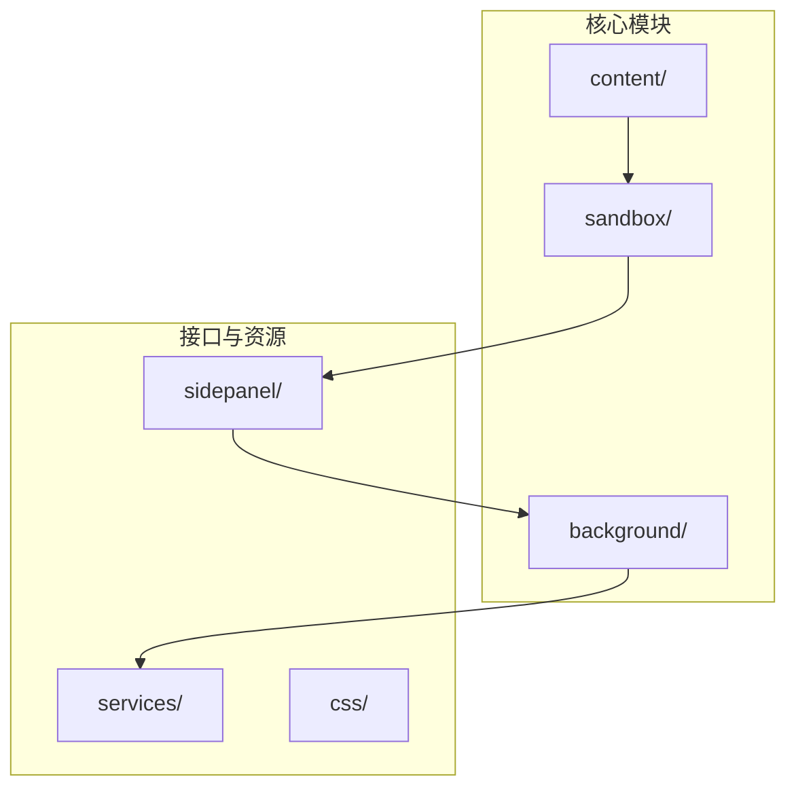
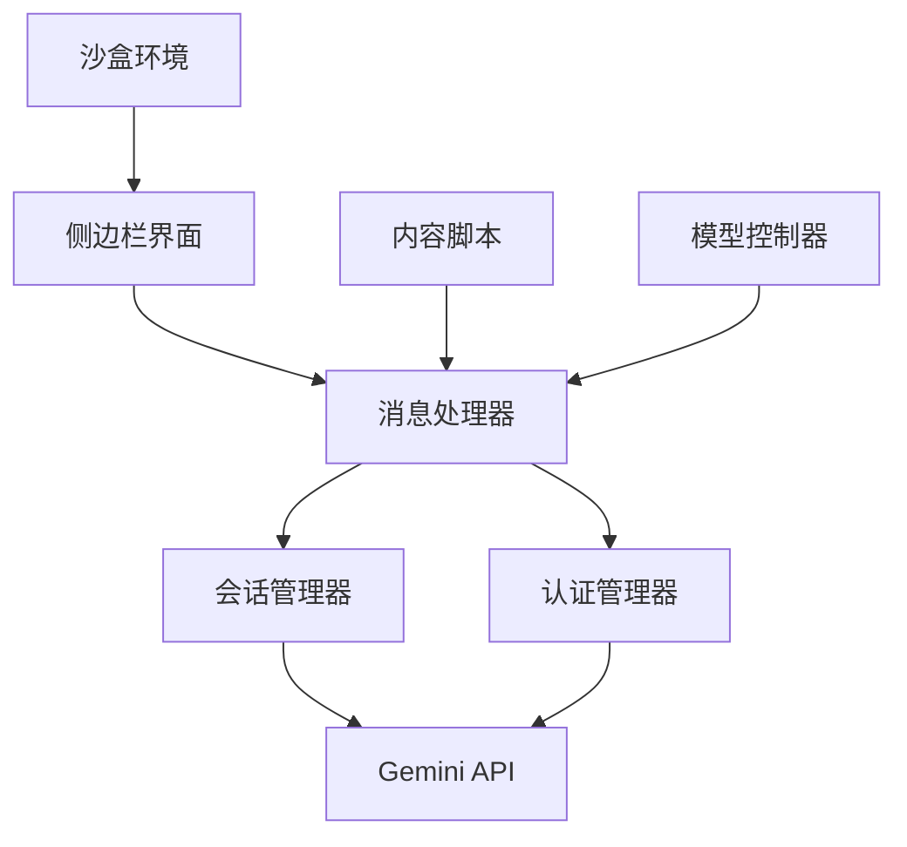
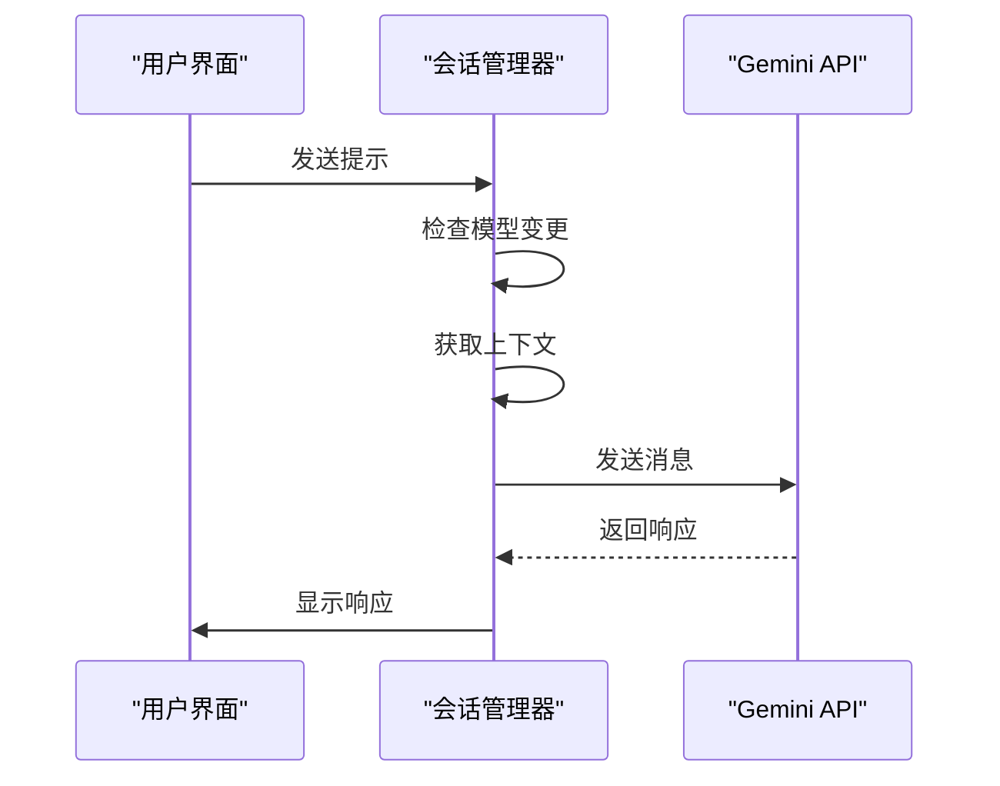
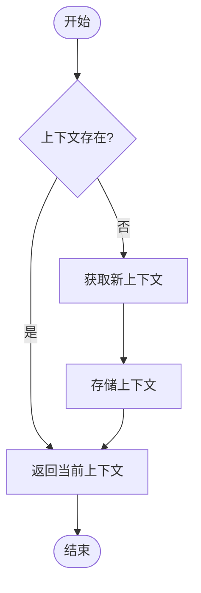
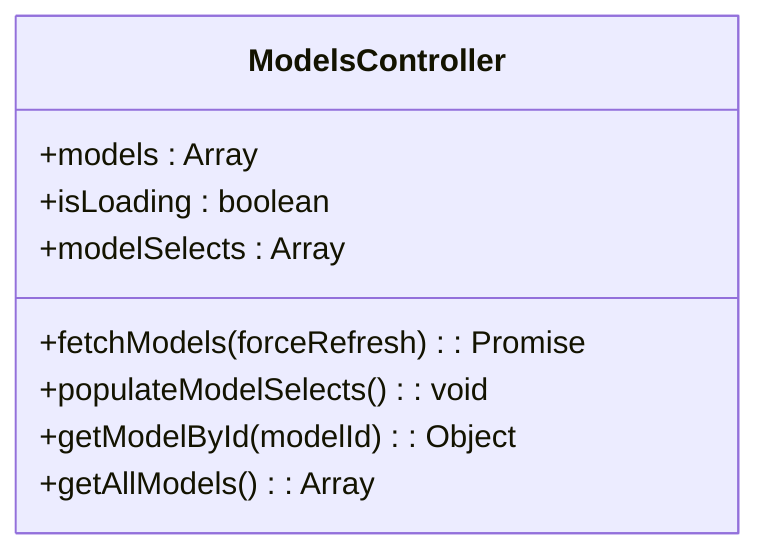
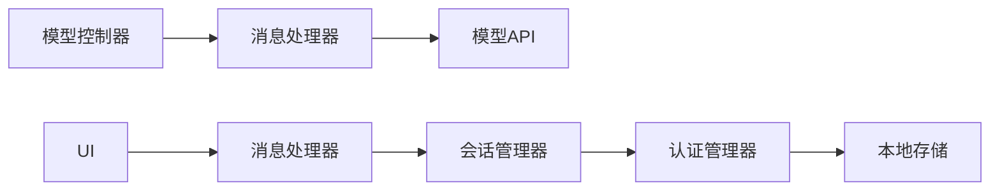

# 动态模型配置管理

<cite>
**本文档引用的文件**   
- [models_api.js](file://services/models_api.js)
- [session_manager.js](file://background/managers/session_manager.js)
- [auth_manager.js](file://background/managers/auth_manager.js)
- [models_controller.js](file://sandbox/controllers/models_controller.js)
- [messages.js](file://background/messages.js)
- [constants.js](file://lib/constants.js)
</cite>

## 目录
1. [简介](#简介)
2. [项目结构](#项目结构)
3. [核心组件](#核心组件)
4. [架构概述](#架构概述)
5. [详细组件分析](#详细组件分析)
6. [依赖分析](#依赖分析)
7. [性能考虑](#性能考虑)
8. [故障排除指南](#故障排除指南)
9. [结论](#结论)

## 简介
Gemini Nexus 是一款强大的 AI 助手 Chrome 扩展，由 Google Gemini 驱动。该扩展提供侧边栏对话、智能总结、图像分析、文本选中工具、浏览器控制、会话管理等多种功能。本项目支持深色/浅色主题自动适配系统主题，并具备完整的国际化支持。动态模型配置管理是该扩展的核心功能之一，允许用户在设置面板中切换 Gemini 模型（Flash/Pro）并管理多账号索引。

## 项目结构
项目结构清晰地划分为多个主要目录，每个目录负责不同的功能模块。`background/` 目录包含服务工作者（API 调用、会话管理），`content/` 目录包含内容脚本（浮动工具栏），`sandbox/` 目录包含沙盒环境（Markdown 渲染），`sidepanel/` 目录包含侧边栏主界面，`services/` 目录包含 Gemini API 服务，`css/` 目录包含样式文件。

**图源**
- [manifest.json](file://manifest.json#L1-L93)

**本节来源**
- [README.md](file://README.md#L1-L102)
- [manifest.json](file://manifest.json#L1-L93)

## 核心组件
核心组件包括会话管理器、认证管理器、模型控制器和消息处理器。这些组件协同工作，实现动态模型配置管理和会话处理。会话管理器负责处理与 Gemini 的通信，认证管理器管理用户会话和上下文，模型控制器管理可用的 AI 模型列表，消息处理器协调各组件之间的通信。

**本节来源**
- [session_manager.js](file://background/managers/session_manager.js#L1-L261)
- [auth_manager.js](file://background/managers/auth_manager.js#L1-L87)
- [models_controller.js](file://sandbox/controllers/models_controller.js#L1-L153)

## 架构概述
系统架构采用分层设计，前端界面与后端服务分离。侧边栏界面通过消息传递与后台服务通信，后台服务负责与 Gemini API 交互。沙盒环境用于安全地渲染 Markdown 内容，内容脚本负责在网页上注入工具栏。这种架构确保了系统的安全性和可维护性。

**图源**
- [background/index.js](file://background/index.js#L1-L30)
- [sandbox/index.js](file://sandbox/index.js#L1-L12)

## 详细组件分析

### 会话管理器分析
会话管理器是系统的核心组件，负责处理所有与 Gemini 的通信。它通过 `handleSendPrompt` 方法发送用户请求，并处理响应。该组件还负责管理 MCP（Model Context Protocol）工具调用，允许 AI 模型执行外部工具。

**图源**
- [session_manager.js](file://background/managers/session_manager.js#L1-L261)

**本节来源**
- [session_manager.js](file://background/managers/session_manager.js#L1-L261)

### 认证管理器分析
认证管理器负责管理用户会话和上下文。它通过 `getOrFetchContext` 方法获取或刷新认证上下文，并在模型变更时重置上下文。该组件还负责存储和恢复会话状态。

**图源**
- [auth_manager.js](file://background/managers/auth_manager.js#L1-L87)

**本节来源**
- [auth_manager.js](file://background/managers/auth_manager.js#L1-L87)

### 模型控制器分析
模型控制器负责管理可用的 AI 模型列表。它通过 `fetchModels` 方法从后台获取模型列表，并在界面上填充模型选择器。该组件支持强制刷新以获取最新的模型列表。

**图源**
- [models_controller.js](file://sandbox/controllers/models_controller.js#L1-L153)

**本节来源**
- [models_controller.js](file://sandbox/controllers/models_controller.js#L1-L153)

## 依赖分析
系统依赖关系清晰，各组件之间通过消息传递进行通信。会话管理器依赖认证管理器获取上下文，模型控制器通过消息处理器与后台服务通信。这种松耦合的设计提高了系统的可维护性和可扩展性。

**图源**
- [messages.js](file://background/messages.js#L1-L142)

**本节来源**
- [messages.js](file://background/messages.js#L1-L142)

## 性能考虑
系统在性能方面进行了多项优化。模型列表和 Gems 列表都实现了缓存机制，减少重复的网络请求。会话管理器在模型变更时重置上下文，确保使用正确的模型进行通信。消息处理器采用异步处理方式，避免阻塞主线程。

## 故障排除指南
常见问题包括登录失效、请求过于频繁和服务器无响应。对于登录失效问题，系统会提示用户前往 Gemini 登录页面。对于请求过于频繁问题，建议用户等待几分钟后再试。对于服务器无响应问题，建议用户刷新 Gemini 页面后重试。

**本节来源**
- [session_manager.js](file://background/managers/session_manager.js#L127-L177)

## 结论
Gemini Nexus 的动态模型配置管理系统设计合理，功能完善。通过会话管理器、认证管理器和模型控制器的协同工作，实现了灵活的模型切换和会话管理。系统的分层架构和松耦合设计确保了良好的可维护性和可扩展性。未来可以进一步优化缓存策略和错误处理机制，提升用户体验。