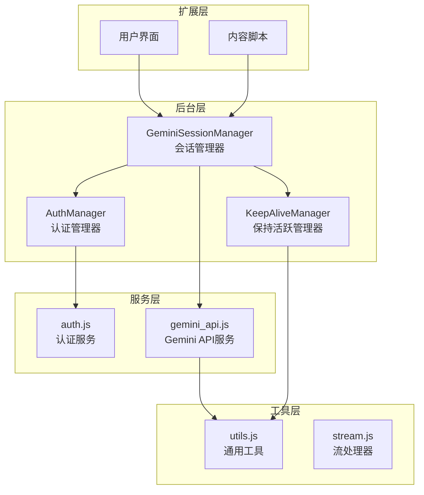
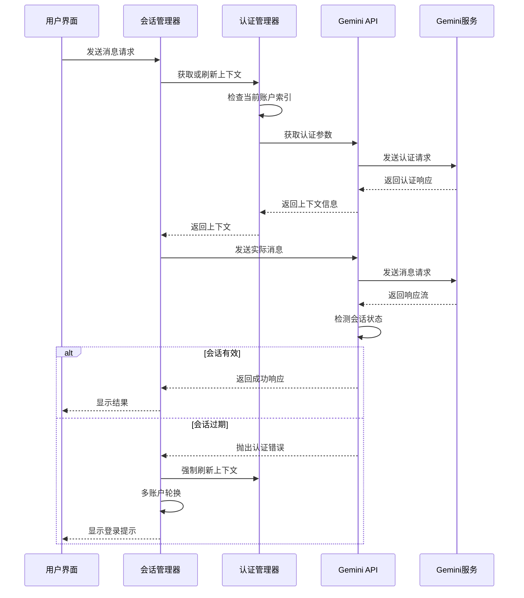
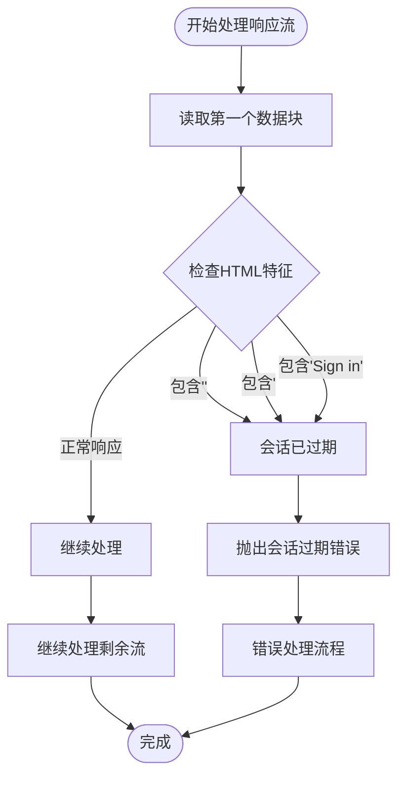
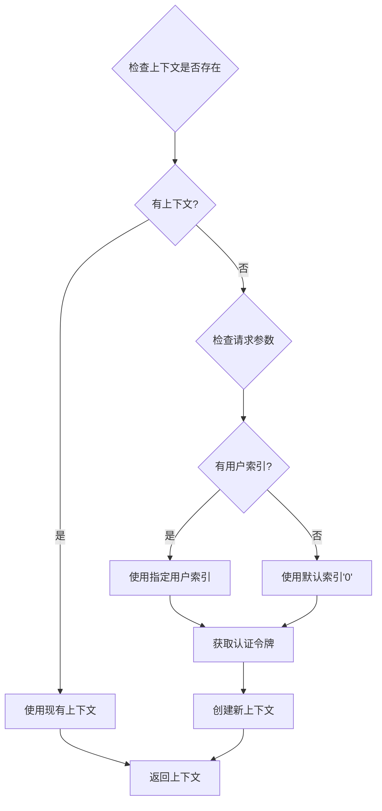
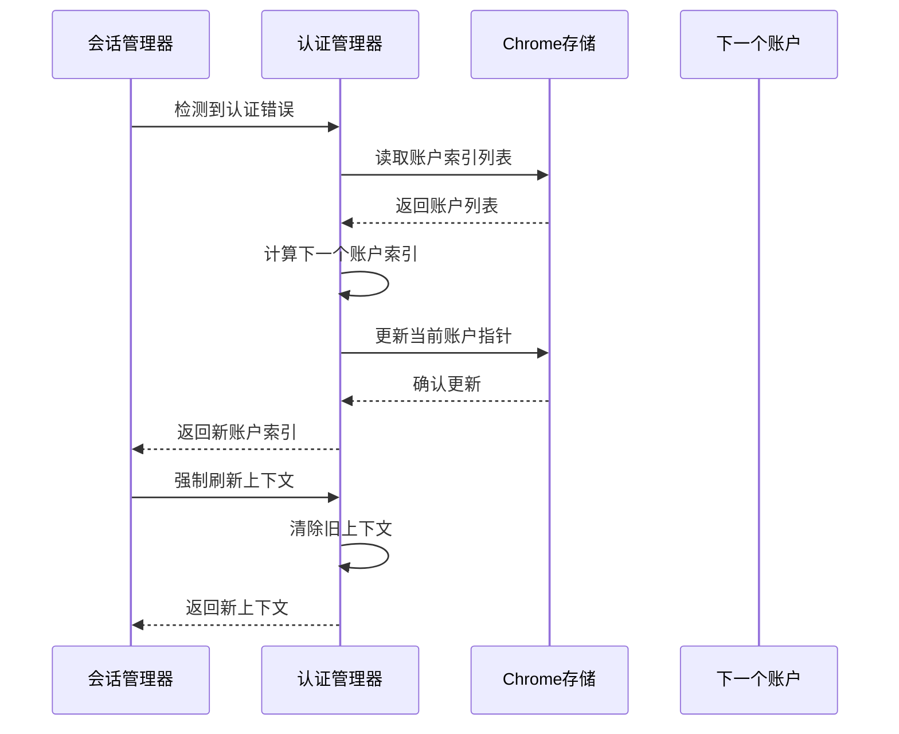
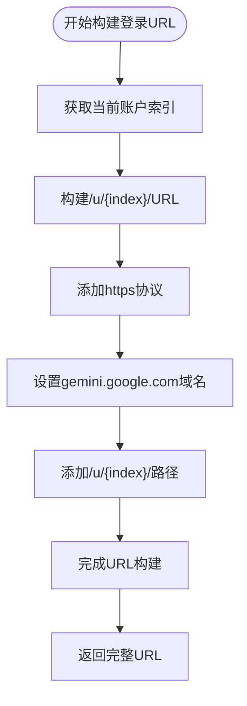
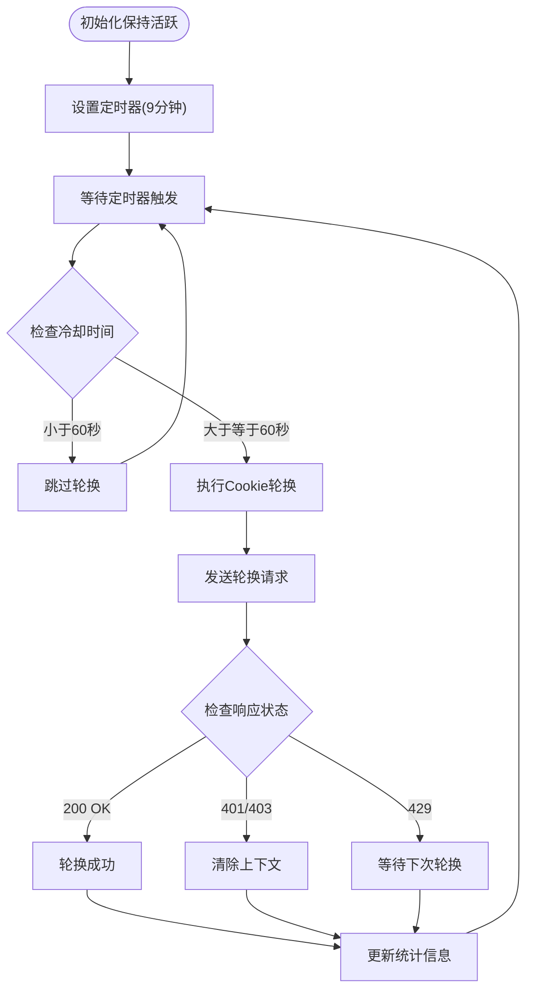
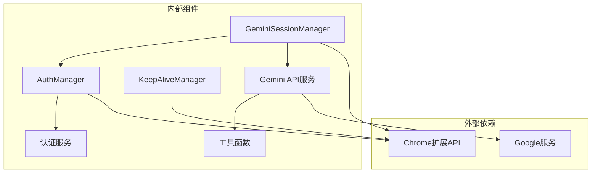

# 会话恢复与错误处理

<cite>
**本文档引用的文件**
- [background/managers/session_manager.js](file://background/managers/session_manager.js)
- [services/gemini_api.js](file://services/gemini_api.js)
- [background/managers/auth_manager.js](file://background/managers/auth_manager.js)
- [services/auth.js](file://services/auth.js)
- [background/managers/keep_alive.js](file://background/managers/keep_alive.js)
- [content/toolbar/stream.js](file://content/toolbar/stream.js)
- [lib/utils.js](file://lib/utils.js)
</cite>

## 目录
1. [简介](#简介)
2. [项目结构](#项目结构)
3. [核心组件](#核心组件)
4. [架构概览](#架构概览)
5. [详细组件分析](#详细组件分析)
6. [依赖关系分析](#依赖关系分析)
7. [性能考虑](#性能考虑)
8. [故障排除指南](#故障排除指南)
9. [结论](#结论)

## 简介

本文件深入分析了 Gemini Nexus 扩展程序中的会话认证失败检测与恢复机制。该系统通过多层防护确保在认证失效时能够自动检测并恢复，特别是在多账户环境下提供无缝的用户体验。本文重点解析以下核心功能：

- **会话过期检测**：通过检查响应流的第一个数据块是否包含HTML登录页特征来判断会话过期
- **凭证回退机制**：当context缺失时使用默认用户索引'0'进行凭证回退
- **多账户恢复**：结合session_manager.js中的forceContextRefresh和geminiContext清除操作
- **精准URL生成**：通过生成正确的/u/${currentIndex}/登录URL实现多账户环境下的精准恢复
- **错误码处理**：列举常见认证相关错误码及其对应的用户提示信息

## 项目结构

Gemini Nexus 采用模块化架构设计，主要分为以下几个层次：

**图表来源**
- [background/managers/session_manager.js](file://background/managers/session_manager.js#L1-L285)
- [background/managers/auth_manager.js](file://background/managers/auth_manager.js#L1-L130)
- [services/gemini_api.js](file://services/gemini_api.js#L1-L230)

**章节来源**
- [background/managers/session_manager.js](file://background/managers/session_manager.js#L1-L285)
- [background/managers/auth_manager.js](file://background/managers/auth_manager.js#L1-L130)
- [services/gemini_api.js](file://services/gemini_api.js#L1-L230)

## 核心组件

### 会话管理器 (GeminiSessionManager)

GeminiSessionManager 是整个认证系统的核心协调者，负责：

- **请求生命周期管理**：从初始化到响应处理的完整流程控制
- **多账户轮换**：在多个账户间自动切换以提高成功率
- **错误检测与恢复**：识别认证失败并执行相应的恢复策略
- **上下文管理**：维护和更新会话上下文状态

### 认证管理器 (AuthManager)

AuthManager 提供底层的认证支持：

- **账户索引管理**：支持多账户配置和轮换
- **上下文获取**：从存储或网络获取认证上下文
- **凭据刷新**：强制刷新认证状态
- **模型变更检测**：在模型切换时重置上下文

### Gemini API 服务

gemini_api.js 实现了与Gemini服务的实际交互：

- **会话检测**：在响应流的首个数据块中检测HTML登录页面
- **错误处理**：识别各种认证相关的错误状态
- **URL构建**：为多账户环境生成正确的登录URL

**章节来源**
- [background/managers/session_manager.js](file://background/managers/session_manager.js#L6-L202)
- [background/managers/auth_manager.js](file://background/managers/auth_manager.js#L5-L129)
- [services/gemini_api.js](file://services/gemini_api.js#L26-L230)

## 架构概览

系统采用分层架构，每层都有明确的职责分工：

**图表来源**
- [background/managers/session_manager.js](file://background/managers/session_manager.js#L21-L147)
- [services/gemini_api.js](file://services/gemini_api.js#L26-L230)

## 详细组件分析

### 会话过期检测机制

会话过期检测是系统最核心的安全特性之一。该机制通过以下方式实现：

#### 首个数据块检测

在响应流处理过程中，系统会在第一个数据块到达时进行会话状态验证：

**图表来源**
- [services/gemini_api.js](file://services/gemini_api.js#L172-L178)

#### 错误码识别

系统能够识别多种认证相关的错误状态：

| 错误类型 | 检测条件 | 用户提示 |
|---------|---------|---------|
| 未登录 | 包含"未登录"、"Not logged in" | 🔑 账号未登录或会话已过期 |
| 401未授权 | 包含"401" | 🔐 401 未授权访问 |
| 403禁止访问 | 包含"403" | 🚫 403 禁止访问 |
| 429限流 | 包含"429"、"RESOURCE_EXHAUSTED" | ⏳ 请求过于频繁 |

**章节来源**
- [services/gemini_api.js](file://services/gemini_api.js#L172-L219)
- [background/managers/session_manager.js](file://background/managers/session_manager.js#L129-L146)

### 凭证回退机制

当上下文缺失时，系统采用智能回退策略：

#### 默认用户索引回退

**图表来源**
- [services/gemini_api.js](file://services/gemini_api.js#L28-L37)

#### 多账户轮换策略

系统支持多账户环境下的自动轮换：

**图表来源**
- [background/managers/auth_manager.js](file://background/managers/auth_manager.js#L53-L69)
- [background/managers/session_manager.js](file://background/managers/session_manager.js#L138-L142)

**章节来源**
- [services/gemini_api.js](file://services/gemini_api.js#L28-L37)
- [background/managers/auth_manager.js](file://background/managers/auth_manager.js#L53-L69)

### 精准URL生成机制

系统为每个账户生成精确的登录URL，确保正确的会话恢复：

#### URL构建逻辑

**图表来源**
- [background/managers/session_manager.js](file://background/managers/session_manager.js#L164-L165)

#### 多账户环境优势

这种设计的优势在于：
- **精确性**：每个账户都有独立的登录URL
- **隔离性**：避免账户间的会话冲突
- **可恢复性**：用户可以准确地回到正确的账户

**章节来源**
- [background/managers/session_manager.js](file://background/managers/session_manager.js#L159-L171)

### 错误处理与用户提示

系统提供了丰富的错误处理和用户反馈机制：

#### 错误分类处理

| 错误类别 | 检测逻辑 | 用户界面处理 | 后台响应 |
|---------|---------|-------------|---------|
| 会话过期 | 包含"未登录"、"Session expired" | 显示登录链接 | 清除上下文并显示登录提示 |
| 限流 | 包含"429"、"Rate limited" | 显示等待提示 | 建议稍后重试 |
| 服务器无响应 | 空响应或连接失败 | 显示刷新链接 | 提供刷新选项 |
| 响应解析失败 | JSON解析错误 | 显示刷新建议 | 建议刷新页面 |

#### 国际化支持

系统支持中英文界面切换，根据浏览器语言设置自动选择合适的提示信息。

**章节来源**
- [background/managers/session_manager.js](file://background/managers/session_manager.js#L159-L192)

### 保持活跃机制

KeepAliveManager 负责维持会话的长期有效性：

#### Cookie轮换策略

**图表来源**
- [background/managers/keep_alive.js](file://background/managers/keep_alive.js#L39-L93)

**章节来源**
- [background/managers/keep_alive.js](file://background/managers/keep_alive.js#L1-L98)

## 依赖关系分析

系统各组件之间的依赖关系如下：

**图表来源**
- [background/managers/session_manager.js](file://background/managers/session_manager.js#L3-L4)
- [background/managers/auth_manager.js](file://background/managers/auth_manager.js#L3)
- [services/gemini_api.js](file://services/gemini_api.js#L3-L6)

### 关键依赖链

1. **会话管理器** → **认证管理器** → **认证服务**：建立完整的认证链路
2. **会话管理器** → **Gemini API服务**：处理实际的消息通信
3. **保持活跃管理器** → **Chrome扩展API**：维持长期会话状态

**章节来源**
- [background/managers/session_manager.js](file://background/managers/session_manager.js#L3-L4)
- [background/managers/auth_manager.js](file://background/managers/auth_manager.js#L3)
- [services/gemini_api.js](file://services/gemini_api.js#L3-L6)

## 性能考虑

### 流式处理优化

系统采用流式处理方式，避免一次性加载大量数据：

- **实时响应**：用户可以立即看到部分响应内容
- **内存效率**：只保留必要的缓冲区数据
- **错误快速检测**：在第一个数据块就能发现会话问题

### 缓存策略

- **上下文缓存**：避免重复获取认证信息
- **账户索引缓存**：减少存储访问频率
- **模型配置缓存**：优化不同模型间的切换

### 并发控制

- **请求取消**：支持中断正在进行的请求
- **轮换节流**：避免过于频繁的Cookie轮换
- **重试机制**：智能的重试策略避免过度请求

## 故障排除指南

### 常见问题诊断

#### 会话过期问题

**症状**：收到"未登录"或"会话已过期"提示

**解决步骤**：
1. 检查浏览器是否正确登录Google账户
2. 点击界面上的登录链接重新登录
3. 确认URL中的用户索引正确
4. 清除浏览器缓存后重试

#### 多账户切换问题

**症状**：切换账户后仍显示旧账户内容

**解决步骤**：
1. 检查账户索引配置
2. 强制刷新上下文
3. 确认每个账户都有独立的登录URL
4. 清除所有账户的会话数据

#### 限流问题

**症状**：频繁收到"请求过于频繁"错误

**解决步骤**：
1. 等待系统自动恢复（通常需要几分钟）
2. 减少请求频率
3. 检查是否有其他设备同时使用相同账户
4. 考虑升级到更高权限的账户

### 调试信息

系统提供了详细的日志输出，包括：
- 认证过程的详细步骤
- 错误发生的具体位置
- 账户轮换的状态变化
- Cookie轮换的成功与否

**章节来源**
- [background/managers/session_manager.js](file://background/managers/session_manager.js#L159-L192)
- [background/managers/keep_alive.js](file://background/managers/keep_alive.js#L82-L93)

## 结论

Gemini Nexus 的会话认证失败检测与恢复机制展现了现代浏览器扩展的高级安全实践。通过多层次的检测、智能的回退策略和优雅的错误处理，系统能够在各种异常情况下为用户提供稳定可靠的服务体验。

### 主要成就

1. **智能会话检测**：通过响应流的首个数据块快速识别会话状态
2. **多账户支持**：完整的多账户环境适配和恢复机制
3. **用户友好**：清晰的错误提示和一键登录功能
4. **性能优化**：流式处理和智能缓存策略
5. **安全性保障**：严格的错误检测和及时的会话清理

### 最佳实践建议

1. **定期维护**：定期检查和更新认证信息
2. **监控告警**：关注系统的错误日志和性能指标
3. **用户教育**：向用户解释多账户管理和会话恢复的重要性
4. **备份策略**：定期备份重要的会话数据

这套机制为浏览器扩展开发提供了优秀的参考模板，展示了如何在复杂的网络环境中实现可靠的认证和会话管理。