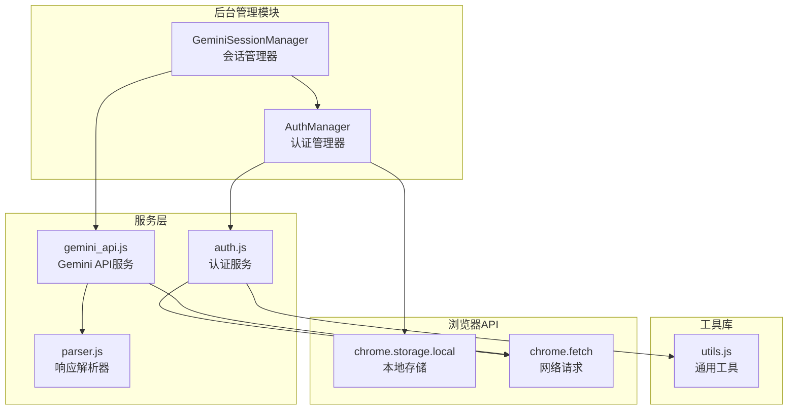
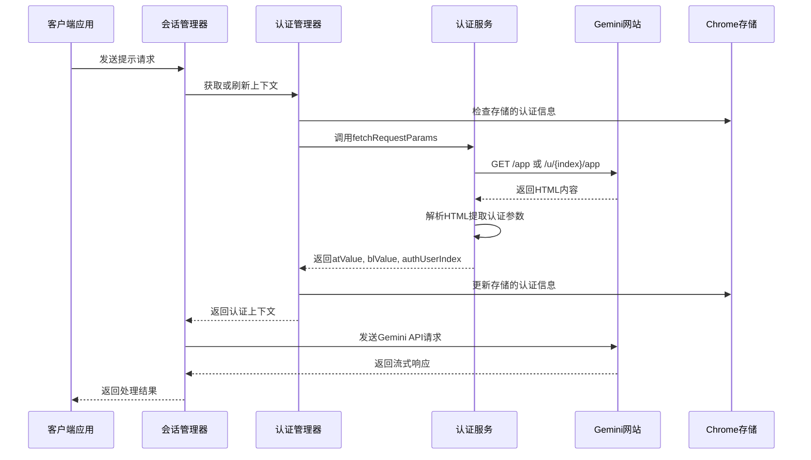
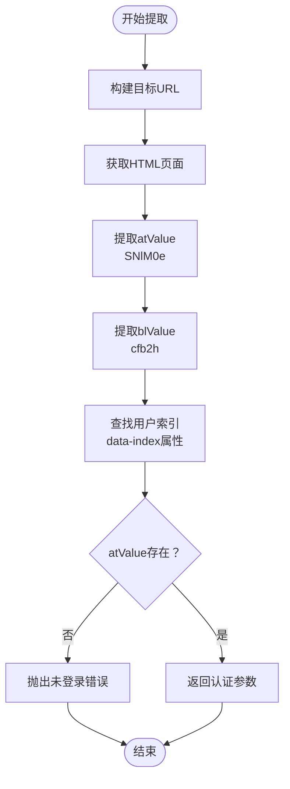
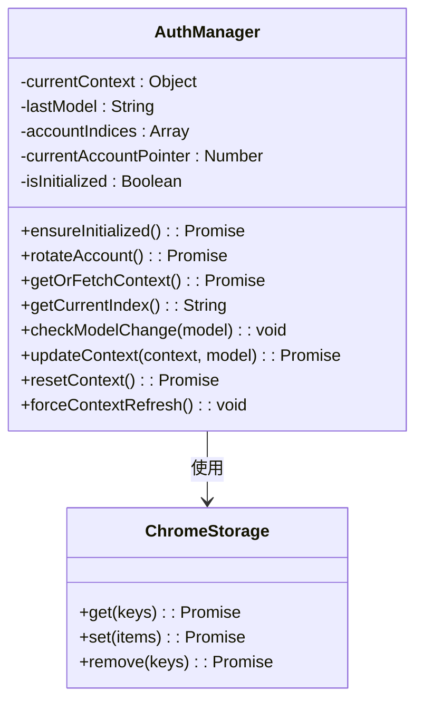
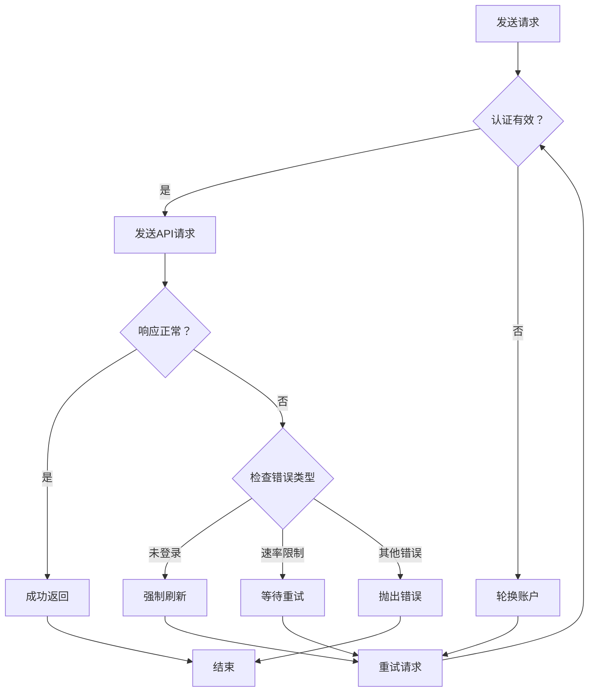
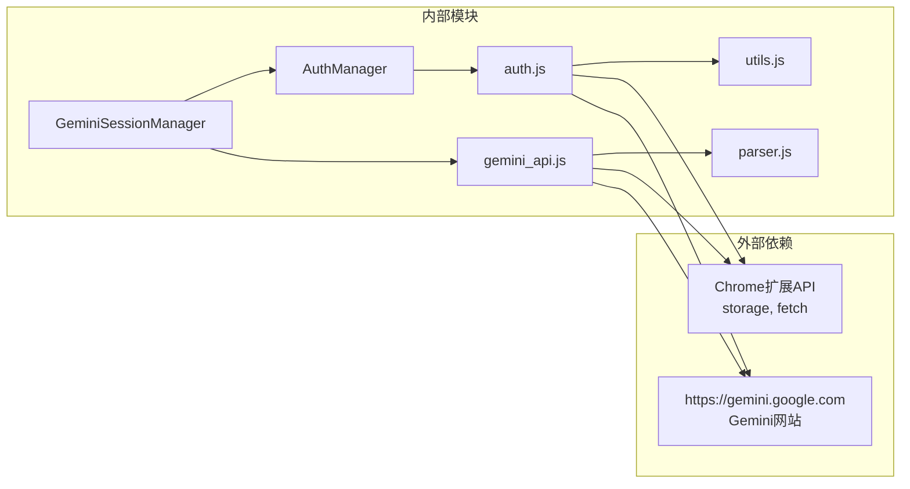

# 凭证管理

<cite>
**本文档引用的文件**
- [auth_manager.js](file://background/managers/auth_manager.js)
- [auth.js](file://services/auth.js)
- [gemini_api.js](file://services/gemini_api.js)
- [utils.js](file://lib/utils.js)
- [session_manager.js](file://background/managers/session_manager.js)
- [parser.js](file://services/parser.js)
- [manifest.json](file://manifest.json)
</cite>

## 目录
1. [简介](#简介)
2. [项目结构](#项目结构)
3. [核心组件](#核心组件)
4. [架构概览](#架构概览)
5. [详细组件分析](#详细组件分析)
6. [依赖关系分析](#依赖关系分析)
7. [性能考虑](#性能考虑)
8. [故障排除指南](#故障排除指南)
9. [结论](#结论)

## 简介

本文件深入解析Gemini Nexus扩展的凭证管理系统，重点说明`fetchRequestParams`函数如何通过访问gemini.google.com的特定URL（/app或/u/X/app）获取atValue（SNlM0e）、blValue（cfb2h）和authUserIndex三个核心认证参数。文档详细描述了HTML内容中通过正则表达式`/data-index="(\d+)"/`提取用户索引的逻辑，并解释了当用户未登录时的错误处理流程。同时，结合AuthManager类的`ensureInitialized`和`rotateAccount`方法，阐述了多账户环境下凭证的存储、恢复和轮换机制，包括如何从chrome.storage.local持久化数据并维护账户指针。

## 项目结构

Gemini Nexus扩展采用模块化架构设计，凭证管理功能分布在多个专门的模块中：

**图表来源**
- [auth_manager.js](file://background/managers/auth_manager.js#L1-L130)
- [auth.js](file://services/auth.js#L1-L41)
- [gemini_api.js](file://services/gemini_api.js#L1-L230)

**章节来源**
- [auth_manager.js](file://background/managers/auth_manager.js#L1-L130)
- [auth.js](file://services/auth.js#L1-L41)
- [gemini_api.js](file://services/gemini_api.js#L1-L230)

## 核心组件

### 认证管理器（AuthManager）

AuthManager是凭证管理的核心组件，负责：
- 多账户环境下的凭证存储和轮换
- 从chrome.storage.local恢复认证状态
- 动态获取和更新认证上下文

### 认证服务（auth.js）

提供`fetchRequestParams`函数，实现从gemini.google.com页面提取认证参数的核心逻辑。

### 会话管理器（GeminiSessionManager）

协调整个认证流程，处理错误重试和账户轮换。

**章节来源**
- [auth_manager.js](file://background/managers/auth_manager.js#L5-L129)
- [auth.js](file://services/auth.js#L7-L40)
- [session_manager.js](file://background/managers/session_manager.js#L6-L285)

## 架构概览

凭证管理系统采用分层架构，确保安全性和可维护性：

**图表来源**
- [session_manager.js](file://background/managers/session_manager.js#L21-L128)
- [auth_manager.js](file://background/managers/auth_manager.js#L75-L92)
- [auth.js](file://services/auth.js#L7-L40)

## 详细组件分析

### fetchRequestParams函数详解

`fetchRequestParams`函数是凭证提取的核心实现：

#### URL构建逻辑

函数根据用户索引动态构建目标URL：
- 默认账户（索引0）：`https://gemini.google.com/app`
- 其他账户（索引X）：`https://gemini.google.com/u/{userIndex}/app`

#### 认证参数提取流程

**图表来源**
- [auth.js](file://services/auth.js#L7-L40)

#### HTML内容中的正则表达式提取

系统使用两种不同的提取策略：

1. **令牌提取**：使用`extractFromHTML`函数从HTML中提取认证令牌
2. **用户索引提取**：使用正则表达式`/data-index="(\d+)"/`从HTML属性中提取用户索引

**章节来源**
- [auth.js](file://services/auth.js#L7-L40)
- [utils.js](file://lib/utils.js#L5-L9)

### AuthManager类的多账户管理机制

#### 初始化和状态恢复

**图表来源**
- [auth_manager.js](file://background/managers/auth_manager.js#L5-L129)

#### 账户轮换算法

AuthManager实现了智能的账户轮换机制：

1. **账户列表管理**：支持多个账户索引的动态管理
2. **循环轮换**：使用模运算实现无缝的账户切换
3. **持久化存储**：轮换状态实时保存到chrome.storage.local

**章节来源**
- [auth_manager.js](file://background/managers/auth_manager.js#L53-L69)

### 错误处理和重试机制

系统实现了多层次的错误处理和自动重试：

**图表来源**
- [session_manager.js](file://background/managers/session_manager.js#L129-L147)

**章节来源**
- [session_manager.js](file://background/managers/session_manager.js#L129-L192)

## 依赖关系分析

凭证管理系统的关键依赖关系如下：

**图表来源**
- [auth_manager.js](file://background/managers/auth_manager.js#L3)
- [auth.js](file://services/auth.js#L3)
- [gemini_api.js](file://services/gemini_api.js#L3)

### 权限配置

扩展需要以下权限来执行凭证管理功能：

- **storage权限**：用于持久化认证状态和用户配置
- **host_permissions**：允许访问gemini.google.com域
- **scripting权限**：支持脚本注入和页面交互

**章节来源**
- [manifest.json](file://manifest.json#L6-L10)

## 性能考虑

### 缓存策略

系统采用了多层次的缓存机制：
- **内存缓存**：AuthManager内部缓存当前认证上下文
- **持久化缓存**：chrome.storage.local存储长期认证状态
- **智能失效**：基于模型变更和手动刷新的上下文失效机制

### 网络优化

- **并发请求**：文件上传采用Promise.all并行处理
- **流式响应**：使用ReadableStream处理大响应体
- **超时控制**：AbortController支持请求取消

## 故障排除指南

### 常见问题及解决方案

#### 未登录错误处理

当检测到用户未登录时，系统会：
1. 强制刷新认证上下文
2. 清除存储的认证信息
3. 显示友好的登录引导界面
4. 自动重定向到正确的登录页面

#### 账户轮换失败

如果账户轮换导致认证失败：
1. 系统会自动尝试下一个可用账户
2. 最多重试两次（基于账户数量）
3. 失败时提供详细的错误信息和解决建议

#### 存储异常

当chrome.storage.local出现异常时：
1. 系统会记录错误日志
2. 继续使用内存缓存保持功能可用
3. 在下次初始化时重试存储操作

**章节来源**
- [session_manager.js](file://background/managers/session_manager.js#L159-L192)
- [auth_manager.js](file://background/managers/auth_manager.js#L115-L124)

## 结论

Gemini Nexus的凭证管理系统展现了现代浏览器扩展在安全性、可靠性和用户体验方面的最佳实践。通过精心设计的多层架构，系统能够：

1. **安全地管理认证状态**：通过严格的权限控制和数据加密保护用户的登录凭据
2. **支持多账户环境**：提供灵活的账户管理和自动轮换机制
3. **保证高可用性**：实现智能的错误处理和自动重试机制
4. **优化性能表现**：采用缓存策略和并发处理提升响应速度

该系统为类似的应用程序提供了优秀的参考模板，展示了如何在浏览器扩展环境中实现复杂的身份验证和会话管理功能。