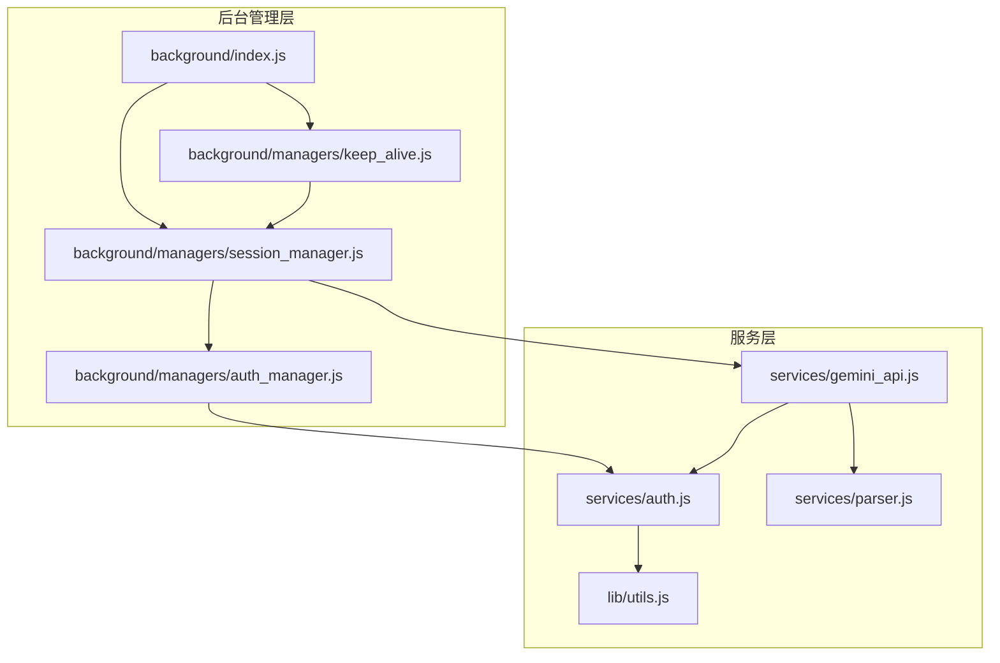
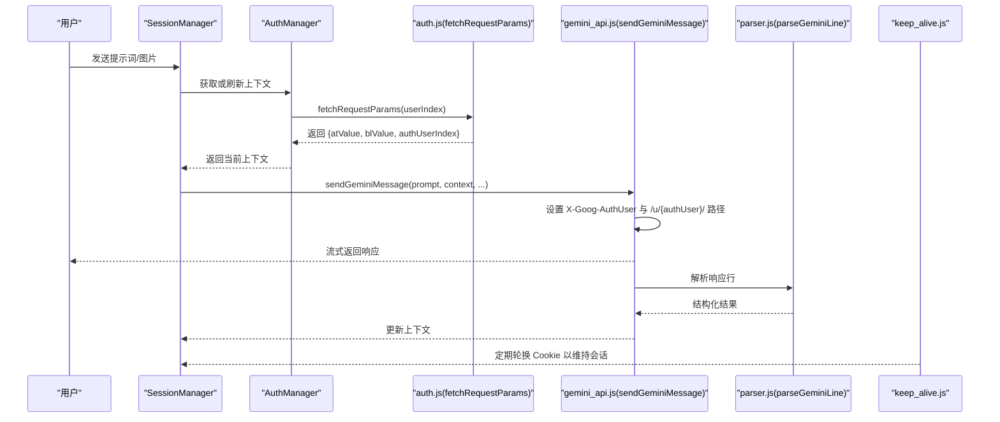
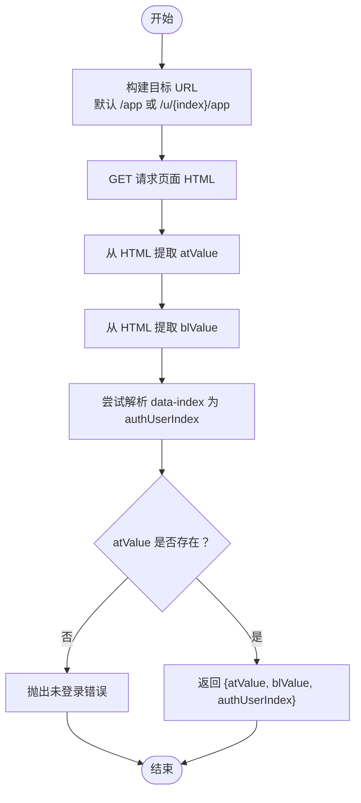
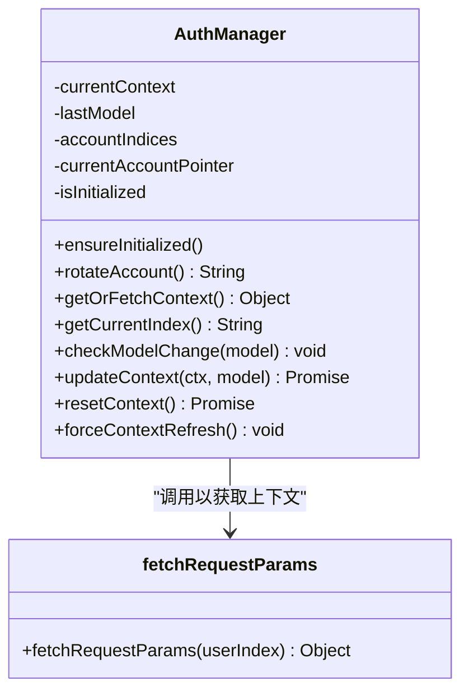
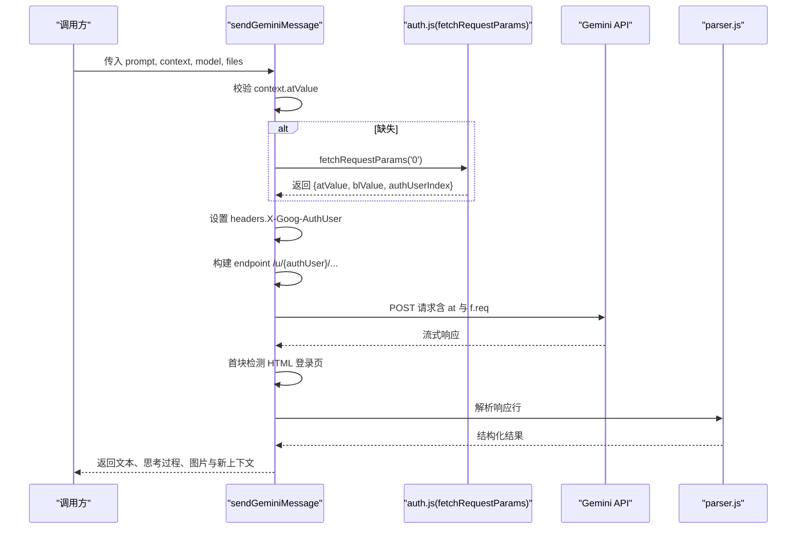
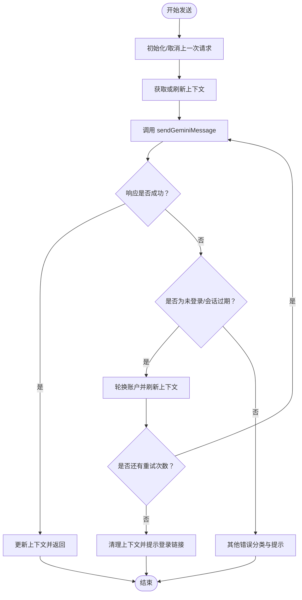
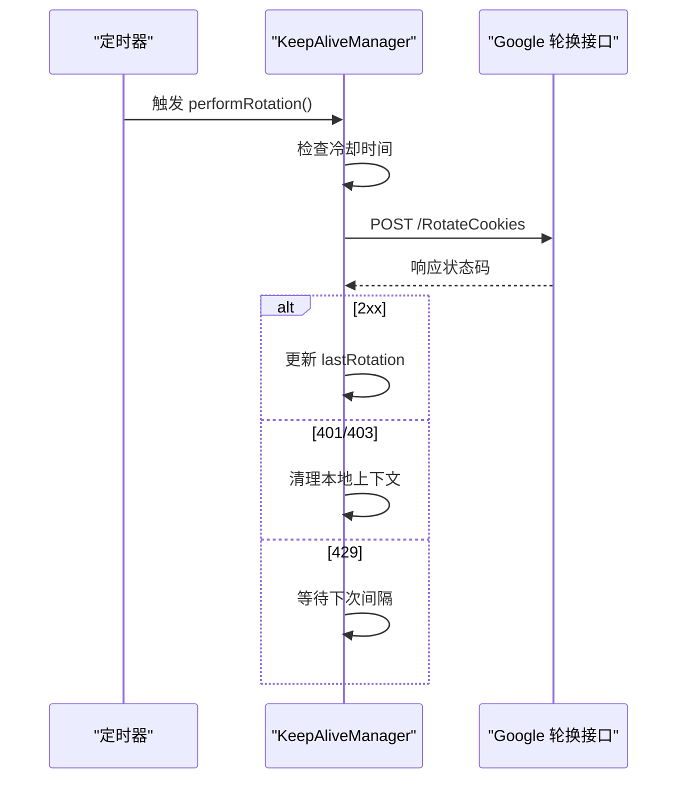
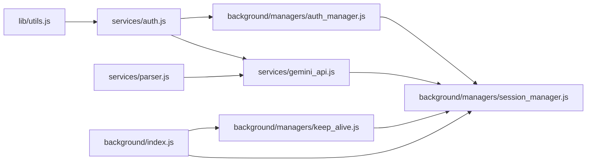

# 认证与授权

<cite>
**本文引用的文件**
- [services/auth.js](file://services/auth.js)
- [services/gemini_api.js](file://services/gemini_api.js)
- [background/managers/auth_manager.js](file://background/managers/auth_manager.js)
- [background/managers/session_manager.js](file://background/managers/session_manager.js)
- [background/managers/keep_alive.js](file://background/managers/keep_alive.js)
- [lib/utils.js](file://lib/utils.js)
- [services/parser.js](file://services/parser.js)
- [background/index.js](file://background/index.js)
</cite>

## 目录
1. [简介](#简介)
2. [项目结构](#项目结构)
3. [核心组件](#核心组件)
4. [架构总览](#架构总览)
5. [详细组件分析](#详细组件分析)
6. [依赖关系分析](#依赖关系分析)
7. [性能考量](#性能考量)
8. [故障排查指南](#故障排查指南)
9. [结论](#结论)

## 简介
本文件深入解析 Gemini API 调用中的认证机制，重点说明以下三类核心认证字段：
- atValue：会话令牌，用于标识当前登录状态
- blValue：客户端版本/能力标识，用于 API 版本协商
- authUser：用户索引，用于多账户环境下的身份匹配

文档将阐述 fetchRequestParams 如何从 auth.js 中获取会话令牌，并在 sendGeminiMessage 中集成这些凭证；解释 X-Goog-AuthUser 头字段与 URL 路径 /u/{index}/ 的关联性；分析上下文缺失时的认证回退机制（使用 '0' 作为默认用户索引）；并结合实际错误场景（如会话过期）说明认证失败的检测与处理策略，包括 HTML 登录页检测和错误抛出机制。

## 项目结构
本项目采用模块化分层设计：
- services 层：提供认证、API 调用、解析等通用服务
- background/managers 层：管理会话、认证、保持活跃等后台逻辑
- lib 层：提供工具函数（如 HTML 提取）
- sandbox/content 等：前端交互与渲染

图表来源
- [services/auth.js](file://services/auth.js#L1-L41)
- [services/gemini_api.js](file://services/gemini_api.js#L1-L230)
- [lib/utils.js](file://lib/utils.js#L1-L59)
- [services/parser.js](file://services/parser.js#L1-L157)
- [background/managers/auth_manager.js](file://background/managers/auth_manager.js#L1-L130)
- [background/managers/session_manager.js](file://background/managers/session_manager.js#L1-L285)
- [background/managers/keep_alive.js](file://background/managers/keep_alive.js#L1-L97)
- [background/index.js](file://background/index.js#L1-L30)

章节来源
- [services/auth.js](file://services/auth.js#L1-L41)
- [services/gemini_api.js](file://services/gemini_api.js#L1-L230)
- [background/managers/auth_manager.js](file://background/managers/auth_manager.js#L1-L130)
- [background/managers/session_manager.js](file://background/managers/session_manager.js#L1-L285)
- [background/managers/keep_alive.js](file://background/managers/keep_alive.js#L1-L97)
- [lib/utils.js](file://lib/utils.js#L1-L59)
- [services/parser.js](file://services/parser.js#L1-L157)
- [background/index.js](file://background/index.js#L1-L30)

## 核心组件
本节聚焦于认证相关的三大核心组件及其职责：
- fetchRequestParams：从指定用户索引的页面抓取 atValue、blValue 和 authUser
- AuthManager：维护当前会话上下文、账户轮换、持久化存储
- GeminiSessionManager：协调发送消息、错误处理与重试、MCP 工具执行

章节来源
- [services/auth.js](file://services/auth.js#L7-L40)
- [background/managers/auth_manager.js](file://background/managers/auth_manager.js#L5-L129)
- [background/managers/session_manager.js](file://background/managers/session_manager.js#L6-L285)

## 架构总览
下图展示了认证与授权的整体流程：从用户触发到 API 请求，再到响应解析与错误处理。

图表来源
- [background/managers/session_manager.js](file://background/managers/session_manager.js#L21-L202)
- [background/managers/auth_manager.js](file://background/managers/auth_manager.js#L75-L92)
- [services/auth.js](file://services/auth.js#L7-L40)
- [services/gemini_api.js](file://services/gemini_api.js#L26-L230)
- [services/parser.js](file://services/parser.js#L4-L157)
- [background/managers/keep_alive.js](file://background/managers/keep_alive.js#L39-L97)

## 详细组件分析

### 组件一：认证参数提取 fetchRequestParams
该函数负责从 Gemini 页面中提取三类关键认证信息：
- atValue：通过 HTML 中的特定变量名提取，作为会话令牌
- blValue：同样从 HTML 中提取，用于客户端能力标识
- authUserIndex：优先从页面 data-index 属性解析，若不可得则回退为请求的用户索引

实现要点：
- 支持多账户：根据 userIndex 动态选择 URL 路径 /u/{index}/ 或默认 /app
- 安全回退：若 atValue 缺失，直接抛出“未登录”错误
- 数据一致性：优先使用页面中解析到的 authUserIndex，确保与实际账户匹配

图表来源
- [services/auth.js](file://services/auth.js#L7-L40)
- [lib/utils.js](file://lib/utils.js#L5-L9)

章节来源
- [services/auth.js](file://services/auth.js#L7-L40)
- [lib/utils.js](file://lib/utils.js#L5-L9)

### 组件二：会话上下文管理 AuthManager
AuthManager 负责：
- 初始化与持久化：从本地存储恢复上下文、模型与账户索引列表
- 账户轮换：按顺序切换当前账户索引，支持多账户并发使用
- 上下文获取：若无上下文则调用 fetchRequestParams 获取新令牌
- 上下文更新：将新的上下文写入本地存储，以便后续复用

图表来源
- [background/managers/auth_manager.js](file://background/managers/auth_manager.js#L5-L129)
- [services/auth.js](file://services/auth.js#L7-L40)

章节来源
- [background/managers/auth_manager.js](file://background/managers/auth_manager.js#L5-L129)

### 组件三：消息发送与认证集成 sendGeminiMessage
sendGeminiMessage 在发送请求前完成以下认证集成：
- 上下文校验与回退：若 context 缺失或缺少 atValue，则使用默认用户索引 '0' 调用 fetchRequestParams 获取凭证
- 头部设置：X-Goog-AuthUser 使用 context.authUser，确保与 URL 路径 /u/{authUser}/ 对齐
- URL 路径：endpoint 明确包含 /u/{authUser}/，使 Cookie 与用户索引一致
- 错误检测：首块流数据中检测 HTML 登录页特征，立即抛出“未登录（会话过期）”错误
- 响应解析：通过 parser.js 将流式响应解析为结构化结果，并更新上下文

图表来源
- [services/gemini_api.js](file://services/gemini_api.js#L26-L230)
- [services/auth.js](file://services/auth.js#L7-L40)
- [services/parser.js](file://services/parser.js#L4-L157)

章节来源
- [services/gemini_api.js](file://services/gemini_api.js#L26-L230)
- [services/parser.js](file://services/parser.js#L4-L157)

### 组件四：会话管理与错误处理 GeminiSessionManager
GeminiSessionManager 协调发送消息、错误处理与重试：
- 重试策略：当配置多个账户时最多重试两次，每次重试前轮换账户并强制刷新上下文
- 错误分类：识别“未登录/会话过期”、“速率限制”、“空响应/解析失败”等错误类型
- 用户引导：针对“未登录”错误，提供跳转到对应 /u/{index}/ 登录页的链接
- 上下文更新：成功后更新本地存储的上下文与模型

图表来源
- [background/managers/session_manager.js](file://background/managers/session_manager.js#L21-L202)

章节来源
- [background/managers/session_manager.js](file://background/managers/session_manager.js#L21-L202)

### 组件五：保持活跃与会话续期 keep_alive
keep_alive 通过周期性调用 Google 的轮换接口刷新 Cookie，维持会话有效性：
- 定时任务：每 9 分钟触发一次轮换
- 成功与失败处理：成功记录时间戳，失败根据状态码进行相应处理（如 401/403 清理上下文）
- 防抖：最近 60 秒内不重复轮换，避免 429

图表来源
- [background/managers/keep_alive.js](file://background/managers/keep_alive.js#L39-L97)

章节来源
- [background/managers/keep_alive.js](file://background/managers/keep_alive.js#L39-L97)

## 依赖关系分析
- services/auth.js 依赖 lib/utils.js 的 HTML 变量提取函数
- services/gemini_api.js 依赖 services/auth.js 获取认证参数，并依赖 services/parser.js 解析响应
- background/managers/auth_manager.js 依赖 services/auth.js 获取认证参数，并与本地存储交互
- background/managers/session_manager.js 依赖 services/gemini_api.js 发送消息，并依赖 background/managers/auth_manager.js 管理上下文
- background/managers/keep_alive.js 与 session_manager.js 协作，维持会话有效性

图表来源
- [lib/utils.js](file://lib/utils.js#L1-L59)
- [services/auth.js](file://services/auth.js#L1-L41)
- [services/gemini_api.js](file://services/gemini_api.js#L1-L230)
- [services/parser.js](file://services/parser.js#L1-L157)
- [background/managers/auth_manager.js](file://background/managers/auth_manager.js#L1-L130)
- [background/managers/session_manager.js](file://background/managers/session_manager.js#L1-L285)
- [background/managers/keep_alive.js](file://background/managers/keep_alive.js#L1-L97)
- [background/index.js](file://background/index.js#L1-L30)

章节来源
- [lib/utils.js](file://lib/utils.js#L1-L59)
- [services/auth.js](file://services/auth.js#L1-L41)
- [services/gemini_api.js](file://services/gemini_api.js#L1-L230)
- [services/parser.js](file://services/parser.js#L1-L157)
- [background/managers/auth_manager.js](file://background/managers/auth_manager.js#L1-L130)
- [background/managers/session_manager.js](file://background/managers/session_manager.js#L1-L285)
- [background/managers/keep_alive.js](file://background/managers/keep_alive.js#L1-L97)
- [background/index.js](file://background/index.js#L1-L30)

## 性能考量
- 并行上传：文件上传阶段使用 Promise.all 并行处理，提升多模态请求效率
- 流式解析：响应采用流式读取与增量解析，降低内存占用并提升首包延迟表现
- 轮换冷却：keep_alive 的 60 秒冷却避免频繁轮换导致的 429
- 重试策略：多账户环境下最多一次重试，平衡成功率与等待时间

## 故障排查指南
常见错误与处理策略：
- 未登录/会话过期
  - 现象：首块流数据包含 HTML 登录页特征或包含“未登录”字样
  - 处理：清理本地上下文，提示用户前往对应 /u/{index}/ 登录
  - 触发点：sendGeminiMessage 首块检测与 keep_alive 的 401/403 处理
- 速率限制
  - 现象：响应包含 429 或 RESOURCE_EXHAUSTED
  - 处理：提示稍后再试，等待下次轮询间隔
- 空响应/解析失败
  - 现象：缓冲区为空或无法解析最终响应
  - 处理：提示刷新页面后重试
- 多账户轮换
  - 现象：同一账号多次失败
  - 处理：自动轮换至下一个账户索引并刷新上下文

章节来源
- [services/gemini_api.js](file://services/gemini_api.js#L154-L219)
- [background/managers/session_manager.js](file://background/managers/session_manager.js#L129-L198)
- [background/managers/keep_alive.js](file://background/managers/keep_alive.js#L82-L93)

## 结论
本项目的认证与授权体系围绕 atValue、blValue、authUser 三要素展开，通过：
- fetchRequestParams 从页面中可靠提取令牌与用户索引
- AuthManager 统一管理上下文与账户轮换
- sendGeminiMessage 将凭证正确注入头部与 URL 路径
- GeminiSessionManager 实施多账户重试与错误分类处理
- keep_alive 定期轮换 Cookie 维持会话有效性

上述设计在多账户、会话过期、速率限制等复杂场景下提供了稳健的容错与恢复能力，确保用户体验与系统稳定性。