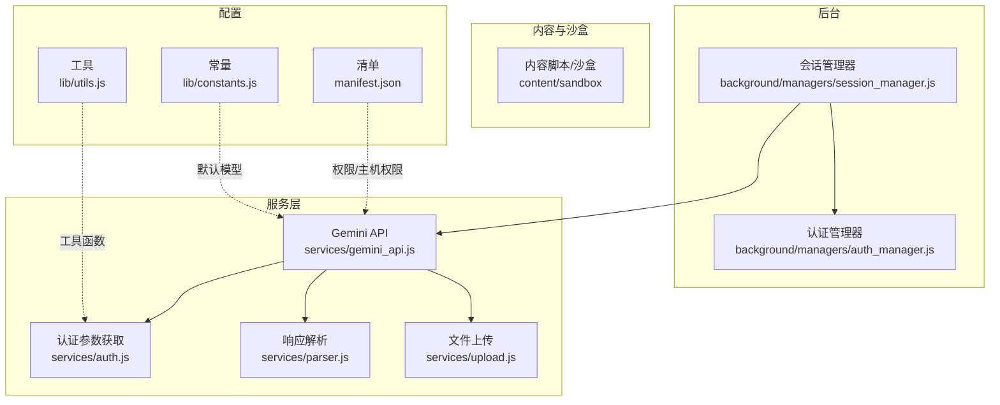
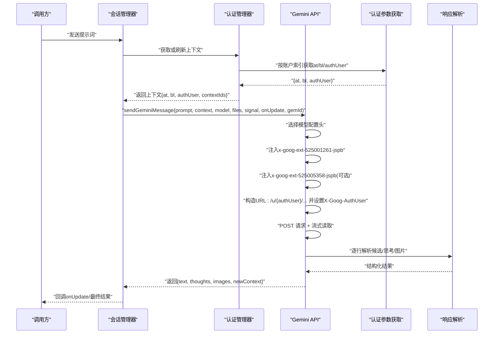
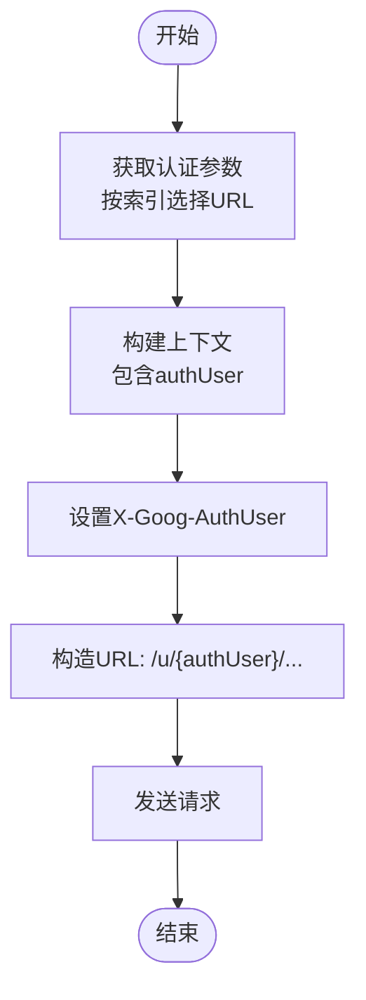
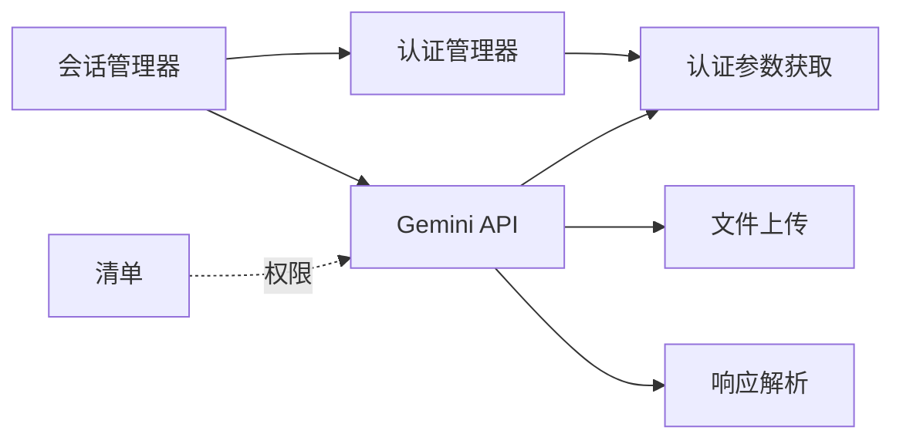

# 请求头配置

<cite>
**本文引用的文件**
- [services/gemini_api.js](file://services/gemini_api.js)
- [background/managers/auth_manager.js](file://background/managers/auth_manager.js)
- [services/auth.js](file://services/auth.js)
- [background/managers/session_manager.js](file://background/managers/session_manager.js)
- [services/parser.js](file://services/parser.js)
- [lib/utils.js](file://lib/utils.js)
- [manifest.json](file://manifest.json)
- [lib/constants.js](file://lib/constants.js)
</cite>

## 目录
1. [简介](#简介)
2. [项目结构](#项目结构)
3. [核心组件](#核心组件)
4. [架构总览](#架构总览)
5. [详细组件分析](#详细组件分析)
6. [依赖关系分析](#依赖关系分析)
7. [性能考量](#性能考量)
8. [故障排查指南](#故障排查指南)
9. [结论](#结论)

## 简介
本文件聚焦于Gemini API请求中“X-Goog-AuthUser”头字段的配置原理与行为，解释其与请求URL中“/u/{index}”路径段的一致性要求，以确保身份匹配；同时阐述content.authUser在sendGeminiMessage函数中的传递过程，并分析模型配置头（x-goog-ext-525001261-jspb）与Gems功能头（x-goog-ext-525005358-jspb）的注入机制。文档还给出针对不同模型（如gemini-3.0-pro）的特殊头信息配置示例，说明这些头信息如何影响后端服务的路由与功能启用。

## 项目结构
该项目为Chrome扩展，围绕“Gemini Nexus”构建，主要模块包括：
- 后台管理：认证、会话、图像、控制等管理器
- 服务层：Gemini API调用、认证参数获取、响应解析、文件上传
- 内容脚本与沙盒：UI交互、工具栏、渲染等
- 常量与工具：默认模型、通用工具函数

图表来源
- [services/gemini_api.js](file://services/gemini_api.js#L1-L230)
- [background/managers/auth_manager.js](file://background/managers/auth_manager.js#L1-L130)
- [services/auth.js](file://services/auth.js#L1-L41)
- [background/managers/session_manager.js](file://background/managers/session_manager.js#L1-L285)
- [services/parser.js](file://services/parser.js#L1-L157)
- [manifest.json](file://manifest.json#L1-L93)
- [lib/constants.js](file://lib/constants.js#L1-L10)
- [lib/utils.js](file://lib/utils.js#L1-L59)

章节来源
- [manifest.json](file://manifest.json#L1-L93)
- [lib/constants.js](file://lib/constants.js#L1-L10)

## 核心组件
- 发送Gemini消息：负责构造payload、注入头、上传文件、发起请求、流式读取与解析响应
- 认证参数获取：从指定用户索引页面抓取at、bl与authUser
- 认证管理器：维护当前上下文、账户轮换、上下文持久化
- 会话管理器：协调发送流程、错误处理、MCP工具调用回环
- 响应解析：从SSE流中逐行解析候选回复、思考过程与生成图片

章节来源
- [services/gemini_api.js](file://services/gemini_api.js#L26-L230)
- [services/auth.js](file://services/auth.js#L7-L40)
- [background/managers/auth_manager.js](file://background/managers/auth_manager.js#L5-L129)
- [background/managers/session_manager.js](file://background/managers/session_manager.js#L6-L285)
- [services/parser.js](file://services/parser.js#L4-L157)

## 架构总览
下图展示了从会话管理器到Gemini API的关键调用链，重点标注了X-Goog-AuthUser与URL路径段的绑定、模型配置头与Gems功能头的注入位置。

图表来源
- [background/managers/session_manager.js](file://background/managers/session_manager.js#L21-L128)
- [background/managers/auth_manager.js](file://background/managers/auth_manager.js#L75-L92)
- [services/auth.js](file://services/auth.js#L7-L40)
- [services/gemini_api.js](file://services/gemini_api.js#L26-L152)
- [services/parser.js](file://services/parser.js#L4-L157)

## 详细组件分析

### X-Goog-AuthUser与/u/{index}路径段的匹配原理
- 认证参数获取：根据用户索引选择不同的页面URL，从而抓取正确的at、bl与authUser。当用户索引非“0”时，使用“/u/{index}/app”页面。
- 上下文构建：认证管理器将authUser写入上下文对象，供后续请求使用。
- 请求阶段：sendGeminiMessage将上下文中的authUser作为X-Goog-AuthUser头字段值，并将authUser嵌入到请求URL的“/u/{index}/”路径段，确保Cookie域与请求主体一致，避免跨账户身份错配。

图表来源
- [services/auth.js](file://services/auth.js#L7-L40)
- [background/managers/auth_manager.js](file://background/managers/auth_manager.js#L75-L92)
- [services/gemini_api.js](file://services/gemini_api.js#L124-L141)

章节来源
- [services/auth.js](file://services/auth.js#L7-L40)
- [background/managers/auth_manager.js](file://background/managers/auth_manager.js#L75-L92)
- [services/gemini_api.js](file://services/gemini_api.js#L124-L141)

### content.authUser在sendGeminiMessage中的传递过程
- 入参：sendGeminiMessage接收context对象，其中包含authUser字段。
- 回退策略：若context缺失或缺少atValue，则通过fetchRequestParams('0')回退获取基础认证参数，并填充authUser。
- 头部注入：将context.authUser写入X-Goog-AuthUser头。
- URL拼接：将authUser插入到URL的/u/{index}/段，确保Cookie域与请求主体一致。

章节来源
- [services/gemini_api.js](file://services/gemini_api.js#L26-L37)
- [services/gemini_api.js](file://services/gemini_api.js#L124-L141)

### 模型配置头（x-goog-ext-525001261-jspb）的注入机制
- 配置映射：MODEL_CONFIGS根据模型名称映射到对应的头部字符串，用于指示后端模型选择与能力开关。
- 注入时机：在构造请求头时，将模型配置头写入x-goog-ext-525001261-jspb。
- 特殊模型：gemini-3.0-pro除模型配置头外，还附带额外的extraHeaders，用于启用特定功能。

章节来源
- [services/gemini_api.js](file://services/gemini_api.js#L7-L24)
- [services/gemini_api.js](file://services/gemini_api.js#L124-L132)

### Gems功能头（x-goog-ext-525005358-jspb）的注入机制
- 注入条件：当调用方传入gemId时，动态向请求头注入x-goog-ext-525005358-jspb，格式为["{gemId}",1]。
- 使用场景：用于标识特定Gems实例或会话，便于后端进行功能启用与路由分流。

章节来源
- [services/gemini_api.js](file://services/gemini_api.js#L134-L137)

### 不同模型的特殊头信息配置示例
- gemini-2.5-flash
  - 模型配置头：见模型配置映射
  - 影响：选择Flash类模型，具备快速响应能力
- gemini-2.5-pro
  - 模型配置头：见模型配置映射
  - 影响：选择Pro类模型，具备更强推理能力
- gemini-3.0-pro
  - 模型配置头：见模型配置映射
  - 额外头：x-goog-ext-525005358-jspb（启用Gems功能）、x-goog-ext-73010989-jspb（可能用于特定能力）
  - 影响：启用更丰富的响应结构与功能特性

章节来源
- [services/gemini_api.js](file://services/gemini_api.js#L7-L24)

### 请求与响应处理流程
- 文件上传：多模态场景下，先并行上传文件至Google内容推送服务，再将返回的标识符嵌入消息结构。
- 消息结构：根据是否有文件与模型类型，构造不同的消息数组；gemini-3.0-pro在无文件时附加“富响应”标记。
- 流式解析：逐行读取SSE响应，剥离前缀，解析候选文本、思考过程与生成图片链接。
- 错误处理：识别登录状态、速率限制、空响应与解析失败等情形，返回用户可读的错误信息。

章节来源
- [services/gemini_api.js](file://services/gemini_api.js#L41-L89)
- [services/gemini_api.js](file://services/gemini_api.js#L158-L229)
- [services/parser.js](file://services/parser.js#L4-L157)

## 依赖关系分析
- 会话管理器依赖认证管理器获取上下文，并在发送请求前后更新上下文。
- 认证管理器依赖认证参数获取服务，按账户索引抓取at、bl与authUser。
- Gemini API服务依赖认证参数、文件上传与响应解析服务。
- 清单文件声明了扩展权限与主机权限，确保能访问gemini.google.com并进行跨站通信。

图表来源
- [background/managers/session_manager.js](file://background/managers/session_manager.js#L3-L4)
- [background/managers/auth_manager.js](file://background/managers/auth_manager.js#L3)
- [services/gemini_api.js](file://services/gemini_api.js#L3-L5)
- [services/auth.js](file://services/auth.js#L3)
- [services/upload.js](file://services/upload.js#L3-L39)
- [services/parser.js](file://services/parser.js#L2-L3)
- [manifest.json](file://manifest.json#L6-L10)

章节来源
- [manifest.json](file://manifest.json#L6-L10)

## 性能考量
- 并行上传：多模态文件上传采用Promise.all并行执行，提升整体吞吐。
- 流式读取：使用ReadableStream Reader逐块解码，降低内存占用。
- 会话复用：上下文持久化与模型变更检测，减少重复认证与初始化开销。
- 轮转与重试：多账户轮换与一次自动重试，提高成功率与稳定性。

章节来源
- [services/gemini_api.js](file://services/gemini_api.js#L44-L56)
- [background/managers/session_manager.js](file://background/managers/session_manager.js#L43-L46)

## 故障排查指南
- 未登录/会话过期
  - 现象：响应包含登录页特征或错误码
  - 处理：清除本地上下文，触发重新认证，必要时跳转登录页面
- 速率限制
  - 现象：出现429/RESOURCE_EXHAUSTED等
  - 处理：提示稍后再试，避免频繁请求
- 空响应/解析失败
  - 现象：服务器无响应或无法解析
  - 处理：建议刷新页面后重试
- 跨账户身份不匹配
  - 现象：X-Goog-AuthUser与URL路径段不一致导致认证失败
  - 处理：确保authUser与/u/{index}/一致，检查上下文构建与URL拼接逻辑

章节来源
- [services/gemini_api.js](file://services/gemini_api.js#L154-L219)
- [background/managers/session_manager.js](file://background/managers/session_manager.js#L130-L147)

## 结论
本项目通过严格的“X-Goog-AuthUser”与“/u/{index}”路径段一致性设计，结合模型配置头与Gems功能头的精准注入，实现了对多账户、多模型与多功能场景的稳定支持。sendGeminiMessage在认证、头字段注入、URL构建与流式解析等环节均体现了清晰的职责分离与健壮的错误处理策略，为上层UI与工具链提供了可靠的底层支撑。