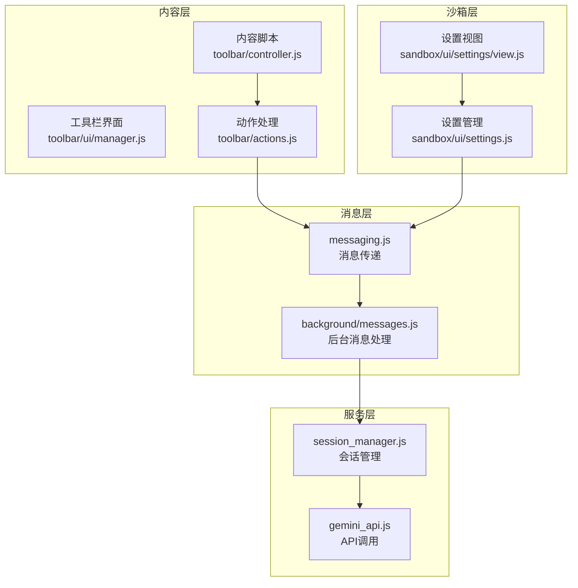
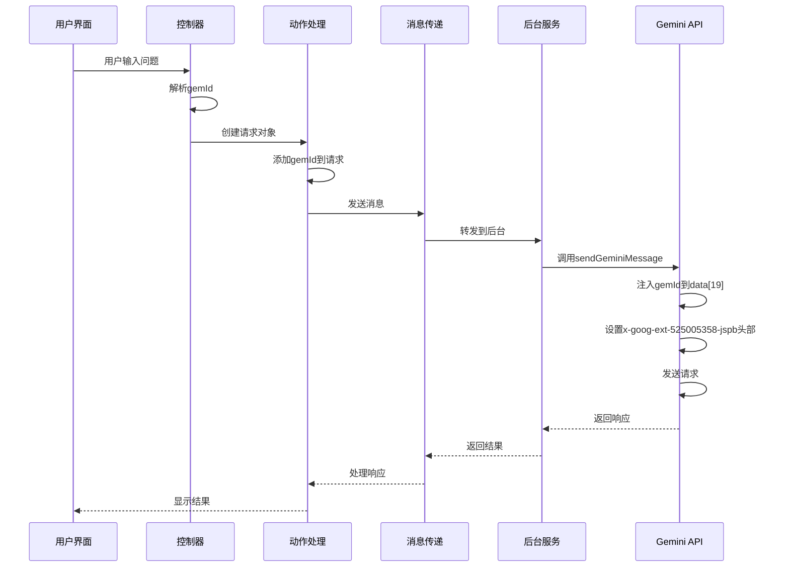
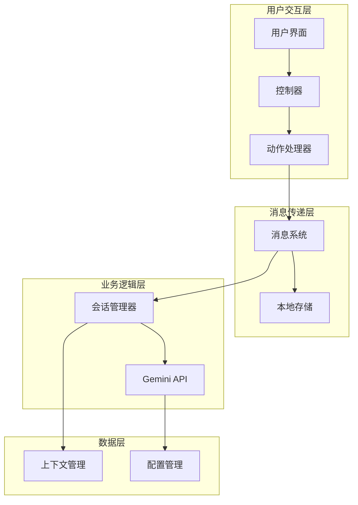
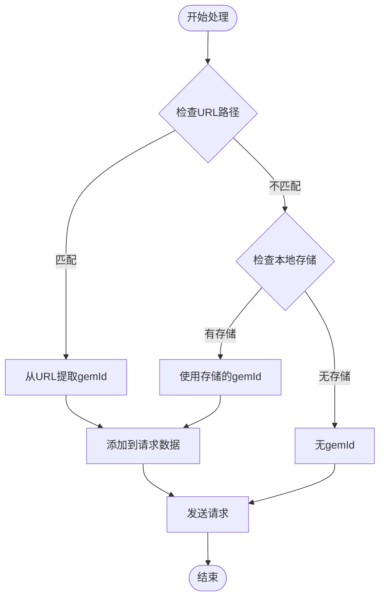
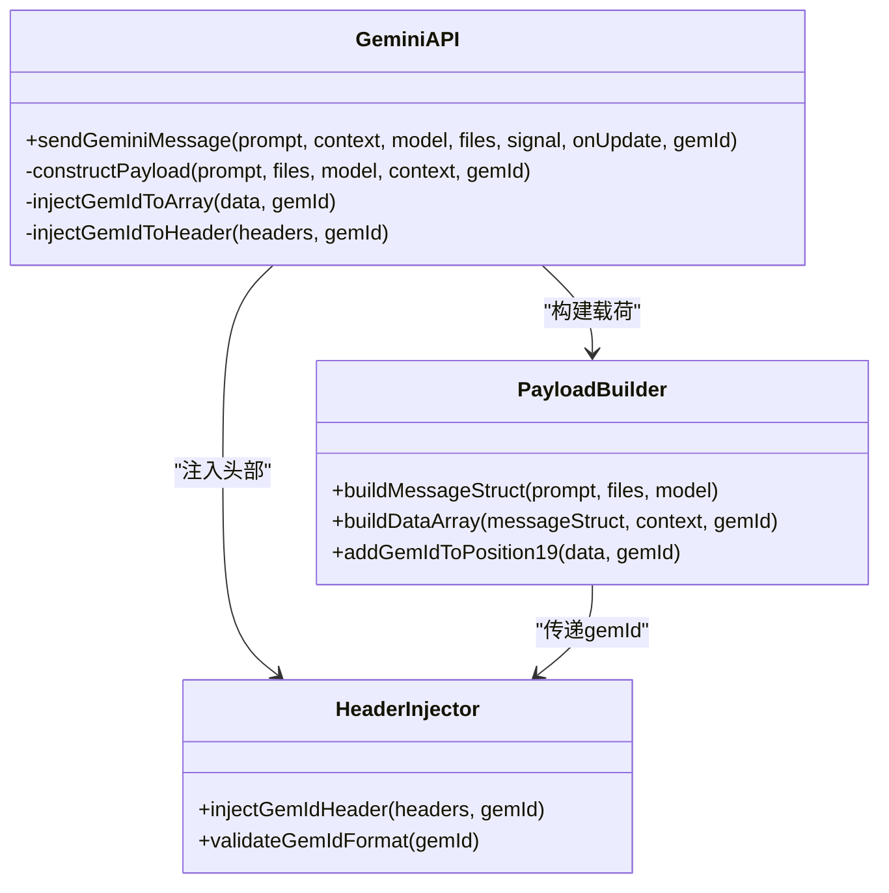
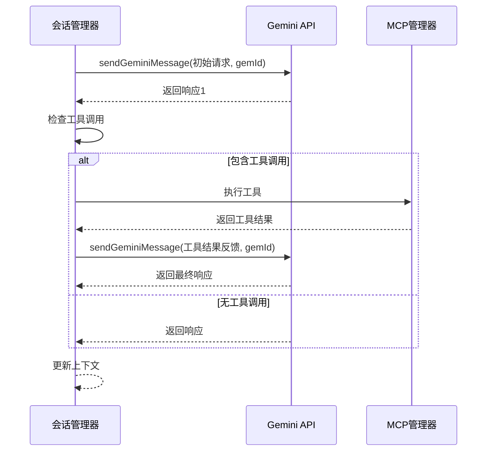
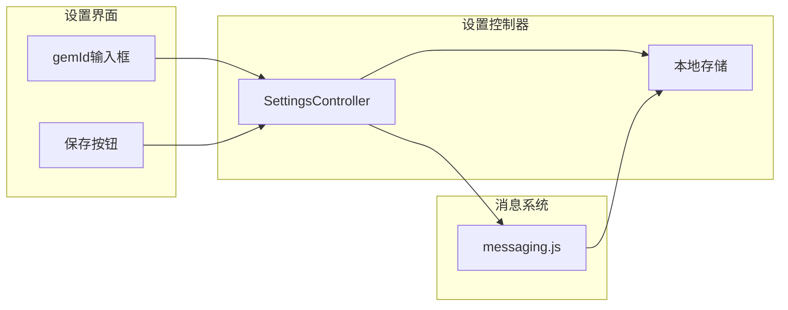
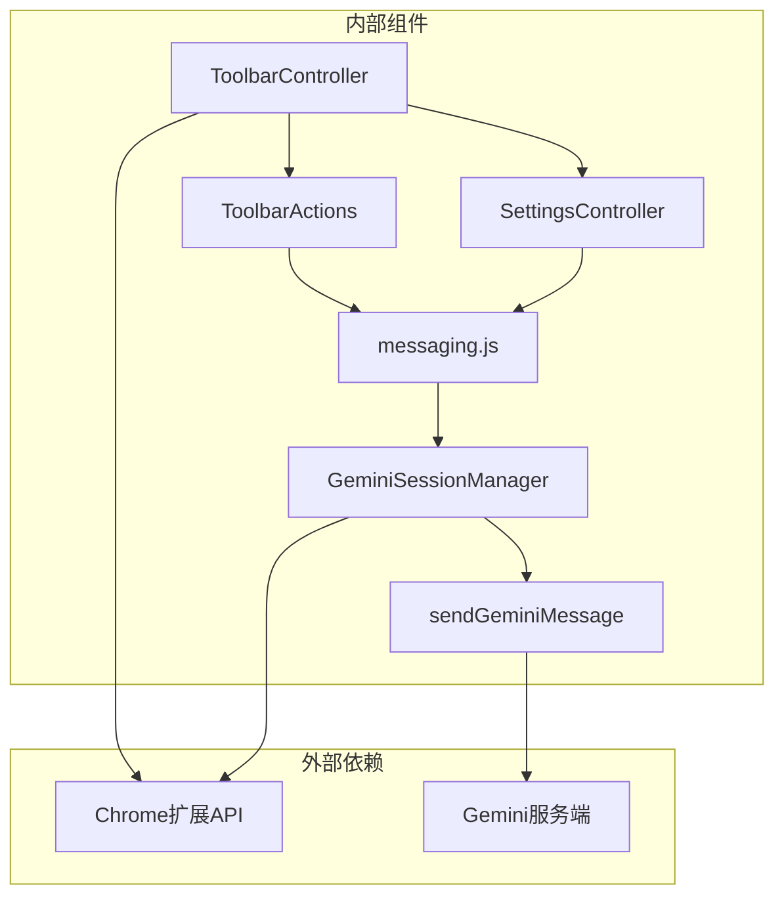

# Gem标识 (gemId)

<cite>
**本文档引用的文件**
- [gemini_api.js](file://services/gemini_api.js)
- [gems_controller.js](file://sandbox/controllers/gems_controller.js)
- [gems.js](file://services/gems.js)
- [controller.js](file://content/toolbar/controller.js)
</cite>

## 更新摘要
**已做更改**
- 更新了gemId参数在sendGeminiMessage函数中的实现细节
- 修正了gemId在请求头和数据结构中的双重注入机制描述
- 增加了gemId从URL解析和存储的详细说明
- 更新了相关架构图和序列图以反映最新代码逻辑

## 目录
1. [简介](#简介)
2. [项目结构概览](#项目结构概览)
3. [核心组件分析](#核心组件分析)
4. [架构概览](#架构概览)
5. [详细组件分析](#详细组件分析)
6. [依赖关系分析](#依赖关系分析)
7. [性能考虑](#性能考虑)
8. [故障排除指南](#故障排除指南)
9. [结论](#结论)

## 简介

Gem标识（gemId）是Gem（预设AI助手）的唯一标识符，用于在请求中指定使用特定的Gem配置。该系统通过双重注入机制确保Gem功能的正确启用和使用，包括在请求数据的第19个位置（data[19]）的数组注入，以及通过'x-goog-ext-525005358-jspb'请求头的双重注入。

## 项目结构概览

GemId系统在整个应用架构中跨越多个层次，从内容脚本到后台服务，形成了一个完整的请求处理链路：

**图表来源**
- [controller.js](file://content/toolbar/controller.js#L223-L233)
- [gemini_api.js](file://services/gemini_api.js#L26-L116)
- [session_manager.js](file://background/managers/session_manager.js#L66-L101)

## 核心组件分析

### gemId的数据结构和注入机制

gemId通过两种方式注入到请求中：

1. **数组位置注入**：在data数组的第19个位置（索引19）
2. **请求头注入**：通过'x-goog-ext-525005358-jspb'头部字段

**图表来源**
- [controller.js](file://content/toolbar/controller.js#L223-L233)
- [actions.js](file://content/toolbar/actions.js#L130-L169)
- [gemini_api.js](file://services/gemini_api.js#L111-L137)

**章节来源**
- [gemini_api.js](file://services/gemini_api.js#L91-L137)
- [controller.js](file://content/toolbar/controller.js#L223-L239)

## 架构概览

GemId系统采用分层架构设计，确保了功能的模块化和可维护性：

**图表来源**
- [session_manager.js](file://background/managers/session_manager.js#L6-L11)
- [gemini_api.js](file://services/gemini_api.js#L26-L37)

## 详细组件分析

### 内容脚本中的gemId处理

内容脚本负责从URL自动检测gemId或从用户设置中获取gemId：

**图表来源**
- [controller.js](file://content/toolbar/controller.js#L235-L239)
- [controller.js](file://content/toolbar/controller.js#L223-L231)

### API调用中的gemId注入

Gemini API服务负责将gemId注入到请求的两个关键位置：

#### 数组位置注入（data[19]）

**图表来源**
- [gemini_api.js](file://services/gemini_api.js#L26-L116)
- [gemini_api.js](file://services/gemini_api.js#L134-L137)

#### 请求头注入机制

gemId通过'x-goog-ext-525005358-jspb'头部字段进行注入，格式为`["${gemId}",1]`：

**章节来源**
- [gemini_api.js](file://services/gemini_api.js#L111-L137)

### 会话管理器中的gemId传递

会话管理器负责在整个请求生命周期中保持gemId的一致性：

**图表来源**
- [session_manager.js](file://background/managers/session_manager.js#L66-L101)

**章节来源**
- [session_manager.js](file://background/managers/session_manager.js#L66-L101)

### 设置系统中的gemId管理

设置系统提供了gemId的配置和持久化功能：

**图表来源**
- [settings.js](file://sandbox/ui/settings.js#L113-L136)
- [settings_view.js](file://sandbox/ui/settings/view.js#L125-L126)

**章节来源**
- [settings.js](file://sandbox/ui/settings.js#L113-L136)
- [settings_view.js](file://sandbox/ui/settings/view.js#L125-L126)

## 依赖关系分析

GemId系统的依赖关系展示了各组件之间的耦合度和交互模式：

**图表来源**
- [controller.js](file://content/toolbar/controller.js#L1-L50)
- [session_manager.js](file://background/managers/session_manager.js#L1-L20)

**章节来源**
- [controller.js](file://content/toolbar/controller.js#L1-L50)
- [session_manager.js](file://background/managers/session_manager.js#L1-L20)

## 性能考虑

### gemId注入的性能影响

1. **内存开销**：gemId字符串在请求生命周期中需要保持不变
2. **网络延迟**：双重注入增加了请求头大小，但影响微乎其微
3. **缓存策略**：gemId应该在会话期间缓存，避免重复计算

### 优化建议

1. **延迟注入**：只在需要时才注入gemId
2. **格式验证**：在注入前验证gemId格式
3. **错误处理**：优雅处理gemId缺失的情况

## 故障排除指南

### 常见问题及解决方案

#### 问题：gemId未生效

**可能原因**：
1. gemId格式不正确
2. 请求头注入失败
3. 数组位置注入错误

**解决步骤**：
1. 验证gemId格式是否符合预期
2. 检查请求头是否正确设置
3. 确认data数组的第19个位置是否正确

#### 问题：Gem功能无法启用

**可能原因**：
1. gemId未正确设置
2. 会话上下文问题
3. 权限不足

**诊断方法**：
1. 检查浏览器控制台错误
2. 验证gemId是否在所有请求中传递
3. 确认用户已登录Gemini账户

**章节来源**
- [gemini_api.js](file://services/gemini_api.js#L134-L137)
- [session_manager.js](file://background/managers/session_manager.js#L66-L101)

## 结论

GemId系统通过双重注入机制确保了Gem功能的可靠启用和使用。该系统的设计体现了以下特点：

1. **可靠性**：通过数组位置和请求头双重注入，确保gemId不会丢失
2. **灵活性**：支持从URL自动检测和用户手动设置两种方式
3. **一致性**：在整个请求生命周期中保持gemId的完整性
4. **可维护性**：清晰的分层架构便于维护和扩展

正确的gemId配置对于启用特定功能的Gem至关重要。未正确设置gemId可能导致Gem功能无法正常工作，用户应该通过设置界面或直接访问Gem页面来正确配置gemId。