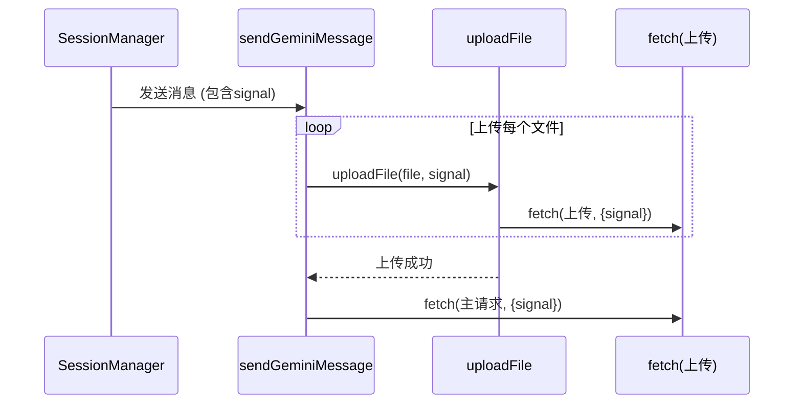
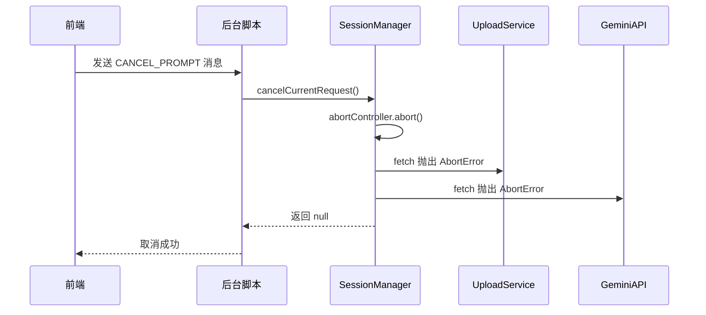

# 中止信号 (signal)

<cite>
**本文档引用的文件**   
- [session_manager.js](file://background/managers/session_manager.js)
- [gemini_api.js](file://services/gemini_api.js)
- [upload.js](file://services/upload.js)
</cite>

## 目录
1. [简介](#简介)
2. [核心实现](#核心实现)
3. [中止信号的统一处理](#中止信号的统一处理)
4. [前端中止控制器的使用](#前端中止控制器的使用)
5. [最佳实践](#最佳实践)

## 简介
中止信号（AbortSignal）是本项目中用于取消正在进行的网络请求的关键机制。它通过 `AbortController` 实例创建，并作为 `signal` 参数传递给 `fetch` 调用，以防止在用户取消操作或请求超时时产生不必要的资源浪费。该机制在文件上传和主请求处理中被统一应用，确保了调用链的中止行为一致。

## 核心实现

`signal` 参数在 `session_manager.js` 中被创建，并贯穿于整个请求流程。当用户发起一个提示（prompt）时，会首先创建一个新的 `AbortController` 实例，其 `signal` 属性随后被传递给文件上传和主消息发送函数。

**Section sources**
- [session_manager.js](file://background/managers/session_manager.js#L24-L27)
- [session_manager.js](file://background/managers/session_manager.js#L70-L71)
- [session_manager.js](file://background/managers/session_manager.js#L98-L99)

## 中止信号的统一处理

### 文件上传处理
在 `upload.js` 文件中，`uploadFile` 函数接收 `signal` 参数，并将其直接传递给 `fetch` 调用。这使得文件上传请求可以被外部信号中止。



**Diagram sources **
- [upload.js](file://services/upload.js#L23)
- [gemini_api.js](file://services/gemini_api.js#L47)
- [gemini_api.js](file://services/gemini_api.js#L145)

**Section sources**
- [upload.js](file://services/upload.js#L7-L39)
- [gemini_api.js](file://services/gemini_api.js#L42-L56)

### 主请求处理
在 `gemini_api.js` 文件中，`sendGeminiMessage` 函数同样接收 `signal` 参数。该信号不仅用于主 `fetch` 请求，还用于在文件上传过程中。当 `signal` 触发中止时，`fetch` 会抛出一个 `AbortError`，此错误在 `gemini_api.js` 和 `session_manager.js` 的 `catch` 块中被捕获。

```mermaid
flowchart TD
A[发起请求] --> B[创建 AbortController]
B --> C[获取 signal]
C --> D[调用 sendGeminiMessage]
D --> E{上传文件?}
E --> |是| F[调用 uploadFile]
F --> G[fetch 上传 (signal)]
G --> H[成功/失败]
H --> I[主 fetch 请求 (signal)]
I --> J{响应}
J --> |成功| K[处理流]
J --> |失败| L{错误类型}
L --> |AbortError| M[返回 null]
L --> |其他错误| N[处理错误]
```

**Diagram sources **
- [gemini_api.js](file://services/gemini_api.js#L145)
- [gemini_api.js](file://services/gemini_api.js#L198)
- [session_manager.js](file://background/managers/session_manager.js#L150-L152)

**Section sources**
- [gemini_api.js](file://services/gemini_api.js#L26-L230)
- [session_manager.js](file://background/managers/session_manager.js#L149-L152)

## 前端中止控制器的使用
前端通过监听 `CANCEL_PROMPT` 消息来触发中止。在 `session_manager.js` 中，`cancelCurrentRequest` 方法会调用 `AbortController` 的 `abort()` 方法，从而触发 `AbortError` 并取消所有相关的网络请求。



**Diagram sources **
- [session_manager.js](file://background/managers/session_manager.js#L204-L211)
- [handlers/session.js](file://background/handlers/session.js#L38-L41)

**Section sources**
- [session_manager.js](file://background/managers/session_manager.js#L204-L211)
- [handlers/session.js](file://background/handlers/session.js#L38-L41)

## 最佳实践
- **统一信号**：确保 `signal` 在整个请求链中（从文件上传到主请求）保持一致，以便一次中止操作能取消所有相关请求。
- **错误处理**：在 `catch` 块中检查 `error.name === 'AbortError'`，以区分用户取消和网络错误，并做出相应处理（如静默返回）。
- **资源清理**：在 `finally` 块中将 `abortController` 置为 `null`，以避免内存泄漏。
- **超时处理**：虽然本代码库未直接实现，但可以在创建 `AbortController` 后设置一个定时器，在超时后自动调用 `abort()`。