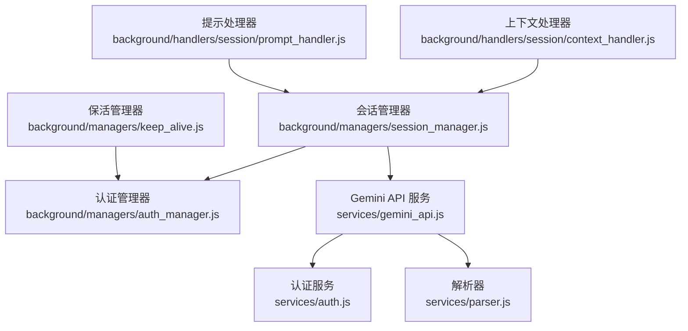
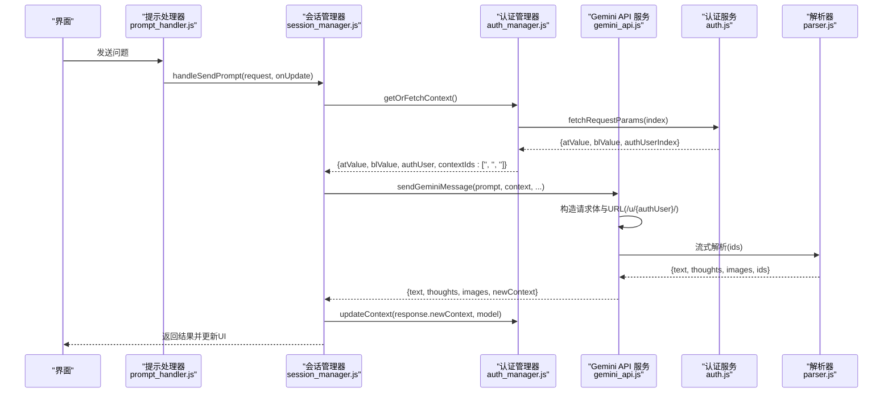
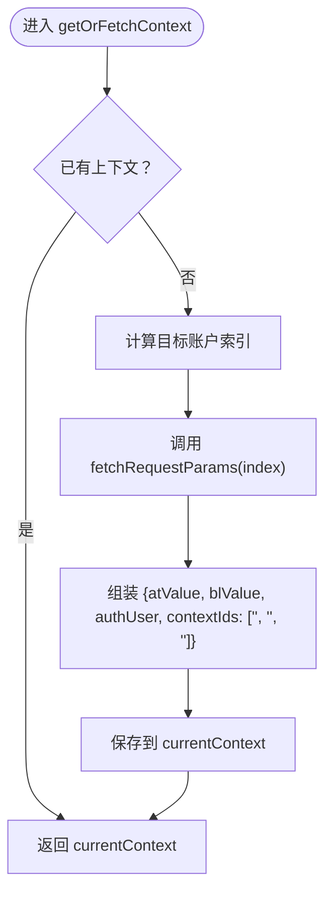
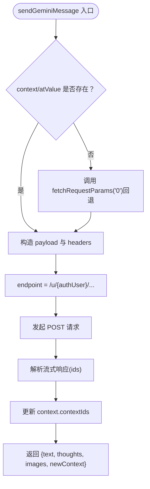
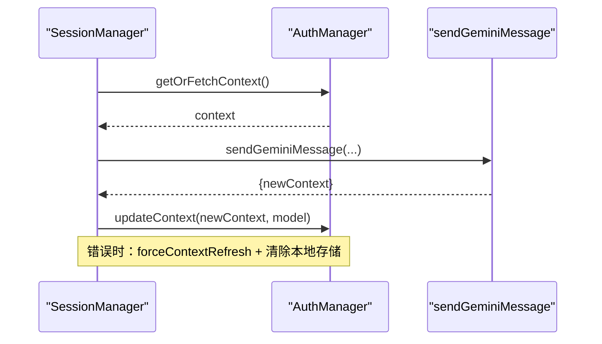
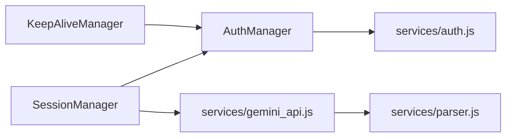

# 会话上下文 (context)

<cite>
**本文引用的文件**
- [background/handlers/session/context_handler.js](file://background/handlers/session/context_handler.js)
- [background/managers/session_manager.js](file://background/managers/session_manager.js)
- [background/managers/auth_manager.js](file://background/managers/auth_manager.js)
- [services/gemini_api.js](file://services/gemini_api.js)
- [services/auth.js](file://services/auth.js)
- [services/parser.js](file://services/parser.js)
- [background/index.js](file://background/index.js)
- [background/handlers/session/prompt_handler.js](file://background/handlers/session/prompt_handler.js)
- [background/managers/keep_alive.js](file://background/managers/keep_alive.js)
</cite>

## 目录
1. [简介](#简介)
2. [项目结构](#项目结构)
3. [核心组件](#核心组件)
4. [架构总览](#架构总览)
5. [详细组件分析](#详细组件分析)
6. [依赖关系分析](#依赖关系分析)
7. [性能考量](#性能考量)
8. [故障排查指南](#故障排查指南)
9. [结论](#结论)
10. [附录：context 对象结构示例](#附录context-对象结构示例)

## 简介
本文件系统性地文档化了 Gemini Nexus 中“会话上下文”（context）参数的结构、作用与生命周期，重点覆盖以下方面：
- context 的字段定义：atValue、blValue、authUser、contextIds
- 在 context 缺失时，如何通过 fetchRequestParams('0') 进行回退获取令牌
- contextIds 数组 [conversationId, responseId, choiceId] 如何在维持对话连续性中起关键作用
- sendGeminiMessage 函数如何在响应后更新 context.contextIds 以供后续请求使用
- authUser 索引在请求 URL 中的应用（/u/{index}/）及其对多账户支持的意义
- 提供 context 对象的完整结构示例
- 列出因会话过期导致请求失败的常见错误及对应解决方案

## 项目结构
围绕 context 的关键模块与职责如下：
- 会话管理器：负责构建请求、调用 Gemini API、处理工具链、维护上下文与重试策略
- 认证管理器：负责从页面抓取令牌、维护当前上下文、多账户轮换与强制刷新
- Gemini API 服务：封装发送消息、解析响应、构造请求参数与 URL
- 解析器：从流式响应中提取文本、思考过程、图片与 ids（即 contextIds）
- 上下文处理器：对外暴露设置/重置上下文的接口
- 保活管理器：周期性轮换 Cookie，避免会话过期

图表来源
- [background/managers/session_manager.js](file://background/managers/session_manager.js#L1-L285)
- [background/managers/auth_manager.js](file://background/managers/auth_manager.js#L1-L130)
- [services/gemini_api.js](file://services/gemini_api.js#L1-L230)
- [services/auth.js](file://services/auth.js#L1-L41)
- [services/parser.js](file://services/parser.js#L1-L157)
- [background/handlers/session/context_handler.js](file://background/handlers/session/context_handler.js#L1-L21)
- [background/handlers/session/prompt_handler.js](file://background/handlers/session/prompt_handler.js#L1-L103)
- [background/managers/keep_alive.js](file://background/managers/keep_alive.js#L1-L97)

章节来源
- [background/index.js](file://background/index.js#L1-L30)

## 核心组件
- context 对象字段
  - atValue：会话令牌，用于请求签名
  - blValue：会话标识，用于请求参数
  - authUser：认证用户索引（用于 /u/{index}/ 路径），支持多账户
  - contextIds：三元组 [conversationId, responseId, choiceId]，用于维持对话连续性
- 回退机制
  - 当 context 缺失或不完整时，sendGeminiMessage 会调用 fetchRequestParams('0') 获取默认账户的令牌
- 多账户支持
  - 通过 authUser 索引拼接 /u/{index}/ 到请求 URL，确保 Cookie 与用户一致
- 连续性维护
  - 解析器从响应中提取 ids 并写入 context.contextIds，随后 sendGeminiMessage 将其作为请求参数传递

章节来源
- [services/gemini_api.js](file://services/gemini_api.js#L26-L37)
- [services/auth.js](file://services/auth.js#L7-L40)
- [services/parser.js](file://services/parser.js#L143-L148)
- [background/managers/auth_manager.js](file://background/managers/auth_manager.js#L75-L92)

## 架构总览
下面的序列图展示了从 UI 触发到最终返回结果的端到端流程，重点标注 context 的生成、传递与更新。

图表来源
- [background/handlers/session/prompt_handler.js](file://background/handlers/session/prompt_handler.js#L13-L101)
- [background/managers/session_manager.js](file://background/managers/session_manager.js#L21-L202)
- [background/managers/auth_manager.js](file://background/managers/auth_manager.js#L75-L113)
- [services/gemini_api.js](file://services/gemini_api.js#L26-L229)
- [services/auth.js](file://services/auth.js#L7-L40)
- [services/parser.js](file://services/parser.js#L143-L148)

## 详细组件分析

### 组件一：上下文生成与回退（AuthManager 与 fetchRequestParams）
- getOrFetchContext 逻辑
  - 若已有上下文则直接返回
  - 否则根据当前账户索引调用 fetchRequestParams，组装 {atValue, blValue, authUser, contextIds: ['', '', '']}
- fetchRequestParams
  - 支持 /u/{index}/ 路径以获取指定账户的令牌
  - 从 HTML 中提取 SNlM0e（atValue）、cfb2h（blValue），并尝试从 data-index 提取 authUserIndex
  - 若未找到 atValue，则抛出“未登录”错误

图表来源
- [background/managers/auth_manager.js](file://background/managers/auth_manager.js#L75-L92)
- [services/auth.js](file://services/auth.js#L7-L40)

章节来源
- [background/managers/auth_manager.js](file://background/managers/auth_manager.js#L75-L92)
- [services/auth.js](file://services/auth.js#L7-L40)

### 组件二：请求发送与 URL 注入（sendGeminiMessage）
- 缺失回退
  - 若 context 或 atValue 缺失，调用 fetchRequestParams('0') 获取默认账户令牌，并初始化 contextIds 为三个空字符串
- URL 与头部
  - endpoint 使用 /u/{authUser}/ 保证 Cookie 与用户一致
  - X-Goog-AuthUser 头部也携带 authUser
- 请求体
  - data 结构包含 contextIds（索引 2），用于维持对话连续性
- 响应解析与更新
  - 解析器提取 ids 并写入 context.contextIds
  - 返回 newContext 供后续请求使用

图表来源
- [services/gemini_api.js](file://services/gemini_api.js#L26-L37)
- [services/gemini_api.js](file://services/gemini_api.js#L118-L151)
- [services/gemini_api.js](file://services/gemini_api.js#L221-L229)
- [services/parser.js](file://services/parser.js#L143-L148)

章节来源
- [services/gemini_api.js](file://services/gemini_api.js#L26-L37)
- [services/gemini_api.js](file://services/gemini_api.js#L118-L151)
- [services/gemini_api.js](file://services/gemini_api.js#L221-L229)
- [services/parser.js](file://services/parser.js#L143-L148)

### 组件三：会话管理与上下文持久化（SessionManager 与 AuthManager）
- handleSendPrompt
  - 调用 getOrFetchContext 获取上下文
  - 调用 sendGeminiMessage 发送请求
  - 成功后调用 updateContext 更新存储
  - 遇到“未登录/会话过期”等错误时，清除本地上下文并提示用户登录
- 多账户轮换
  - 当检测到认证错误且配置了多个账户时，自动轮换账户并强制刷新上下文后重试

图表来源
- [background/managers/session_manager.js](file://background/managers/session_manager.js#L21-L202)
- [background/managers/auth_manager.js](file://background/managers/auth_manager.js#L105-L113)

章节来源
- [background/managers/session_manager.js](file://background/managers/session_manager.js#L21-L202)
- [background/managers/auth_manager.js](file://background/managers/auth_manager.js#L105-L113)

### 组件四：上下文处理器（ContextHandler）
- 提供 SET_CONTEXT 与 RESET_CONTEXT 接口，委托给会话管理器执行
- 便于外部模块（如 UI 或设置页）主动设置或重置上下文

章节来源
- [background/handlers/session/context_handler.js](file://background/handlers/session/context_handler.js#L9-L19)

### 组件五：解析器与 contextIds 的形成
- 解析器从候选节点中提取 conversationId、responseId、choiceId，并以 [conversationId, responseId, choiceId] 形式返回
- sendGeminiMessage 将该 ids 写入 context.contextIds，作为后续请求的 contextIds 参数

章节来源
- [services/parser.js](file://services/parser.js#L125-L148)
- [services/gemini_api.js](file://services/gemini_api.js#L221-L229)

### 组件六：保活与会话过期处理（KeepAliveManager）
- 定期轮换 Cookie，避免 401/403 导致的会话过期
- 若轮换失败且状态码为 401/403，清理本地上下文，促使下次请求重新获取令牌

章节来源
- [background/managers/keep_alive.js](file://background/managers/keep_alive.js#L39-L93)

## 依赖关系分析
- 低耦合高内聚
  - AuthManager 仅依赖 fetchRequestParams，职责清晰
  - Gemini API 服务独立于 UI，专注请求与解析
  - Parser 专注于响应解析，输出标准化数据
- 关键依赖链
  - SessionManager -> AuthManager -> fetchRequestParams -> services/auth.js
  - SessionManager -> sendGeminiMessage -> services/parser.js
  - KeepAliveManager 间接影响 AuthManager 的上下文有效性

图表来源
- [background/managers/session_manager.js](file://background/managers/session_manager.js#L1-L285)
- [background/managers/auth_manager.js](file://background/managers/auth_manager.js#L1-L130)
- [services/gemini_api.js](file://services/gemini_api.js#L1-L230)
- [services/auth.js](file://services/auth.js#L1-L41)
- [services/parser.js](file://services/parser.js#L1-L157)
- [background/managers/keep_alive.js](file://background/managers/keep_alive.js#L1-L97)

## 性能考量
- 并行上传文件：在 sendGeminiMessage 中对多模态文件上传采用并行 Promise，提升吞吐
- 流式解析：边读取边解析，降低内存占用与延迟
- 保活轮换：定期轮换 Cookie，减少因会话过期导致的重试与失败
- 多账户轮换：在认证错误时自动切换账户，提高成功率

章节来源
- [services/gemini_api.js](file://services/gemini_api.js#L46-L56)
- [background/managers/keep_alive.js](file://background/managers/keep_alive.js#L39-L93)

## 故障排查指南
- 常见错误类型与表现
  - 未登录/会话过期：响应中出现登录页面特征或包含“未登录”字样；SessionManager 会清除本地上下文并提示用户登录
  - 请求过于频繁：响应包含限流信息；建议等待后重试
  - 服务器无响应：空响应或网络异常；建议刷新 Gemini 页面后重试
  - 响应解析失败：无法解析流式数据；建议刷新后重试
- 解决方案
  - 手动登录并刷新页面，确保 atValue 有效
  - 清理浏览器缓存与 Cookie，重新获取令牌
  - 使用多账户轮换功能，切换到其他账户
  - 等待一段时间后重试，避开限流窗口
  - 检查网络连通性与代理设置

章节来源
- [background/managers/session_manager.js](file://background/managers/session_manager.js#L159-L198)
- [services/gemini_api.js](file://services/gemini_api.js#L172-L219)

## 结论
- context 是维持 Gemini 会话连续性的关键载体，其中 contextIds 的三元组结构确保了跨请求的上下文一致性
- 在缺失上下文时，系统通过 fetchRequestParams('0') 实现安全回退，保障基本可用性
- authUser 索引与 /u/{index}/ 路径的结合，使多账户场景下的 Cookie 匹配与会话隔离成为可能
- 通过解析器提取 ids 并在 sendGeminiMessage 中更新 context.contextIds，实现了“响应即更新”的闭环
- 保活与多账户轮换机制进一步增强了系统的鲁棒性与可用性

## 附录：context 对象结构示例
- 字段说明
  - atValue：会话令牌（SNlM0e）
  - blValue：会话标识（cfb2h）
  - authUser：认证用户索引（用于 /u/{index}/）
  - contextIds：三元组 [conversationId, responseId, choiceId]
- 示例结构
  - atValue: "具体令牌值"
  - blValue: "具体标识值"
  - authUser: "0" 或 "1" 等账户索引
  - contextIds: ["会话ID", "响应ID", "选择ID"]

章节来源
- [services/gemini_api.js](file://services/gemini_api.js#L26-L37)
- [services/parser.js](file://services/parser.js#L143-L148)