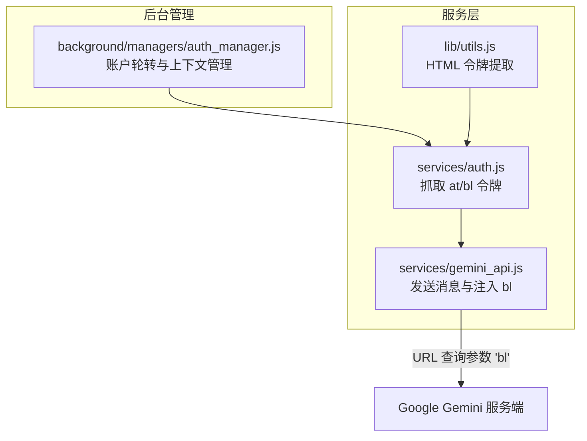
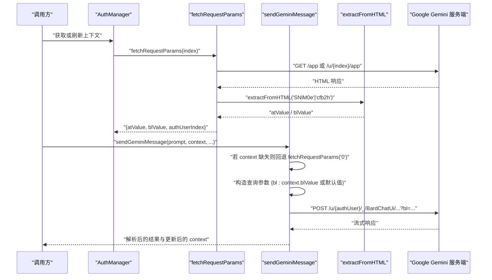
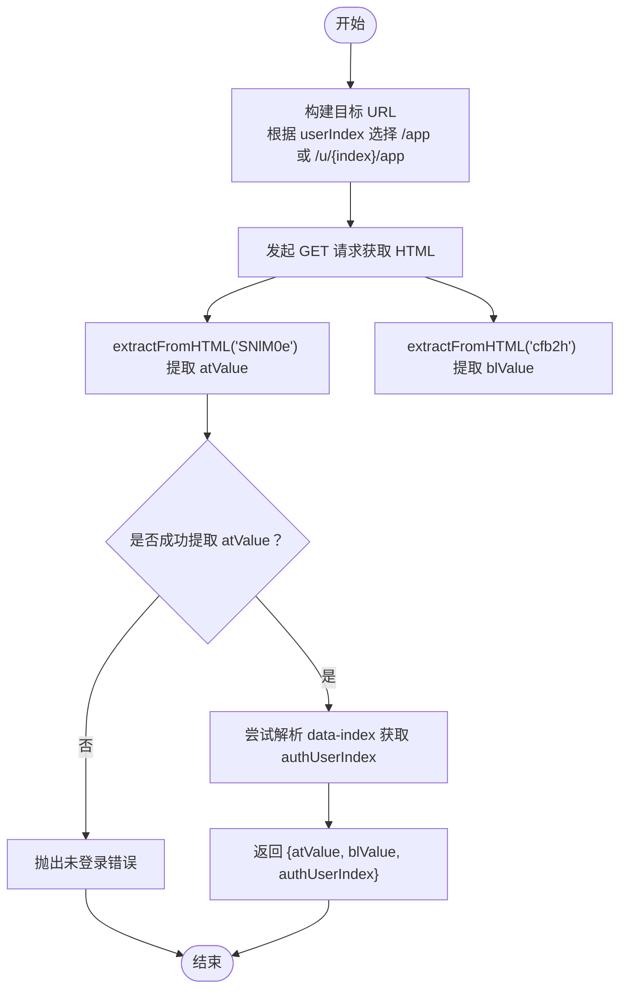
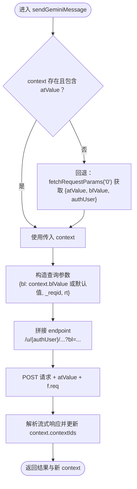
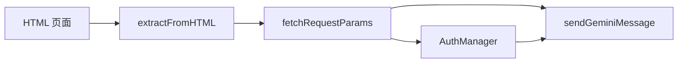

# 会话标识符 (blValue)

<cite>
**本文引用的文件**
- [services/gemini_api.js](file://services/gemini_api.js)
- [services/auth.js](file://services/auth.js)
- [background/managers/auth_manager.js](file://background/managers/auth_manager.js)
- [lib/utils.js](file://lib/utils.js)
</cite>

## 目录
1. [简介](#简介)
2. [项目结构](#项目结构)
3. [核心组件](#核心组件)
4. [架构总览](#架构总览)
5. [详细组件分析](#详细组件分析)
6. [依赖关系分析](#依赖关系分析)
7. [性能考量](#性能考量)
8. [故障排查指南](#故障排查指南)
9. [结论](#结论)

## 简介
本文聚焦于 context 参数中的 blValue 字段，系统性说明其作为 Bard 前端服务会话标识符的用途与工作机理。重点覆盖以下方面：
- blValue 在 sendGeminiMessage 函数中如何被注入到 URL 查询参数 'bl' 中（第 118-119 行）
- 默认值 'boq_assistant-bard-web-server_20230713.13_p0' 的结构含义与来源
- 当 context 缺失时，系统如何通过 fetchRequestParams('0') 获取有效的 blValue（第 30-35 行）
- blValue 在维持服务端会话状态中的作用
- 实际 HTTP 请求中 blValue 与 atValue 协同工作的机制与示例

## 项目结构
本项目采用模块化分层设计，围绕“认证与会话管理”“服务调用”“内容脚本与 UI”等维度组织代码。与 blValue 相关的关键文件位于 services 与 background/managers 目录中：
- services/auth.js：负责从目标用户页面抓取 at 和 bl 令牌
- services/gemini_api.js：封装发送消息的完整流程，包含 blValue 注入与会话维护
- background/managers/auth_manager.js：管理账户索引轮转、上下文持久化与刷新
- lib/utils.js：通用工具函数，包括从 HTML 中提取令牌的正则解析

图表来源
- [services/auth.js](file://services/auth.js#L7-L40)
- [services/gemini_api.js](file://services/gemini_api.js#L26-L156)
- [background/managers/auth_manager.js](file://background/managers/auth_manager.js#L75-L92)
- [lib/utils.js](file://lib/utils.js#L5-L9)

章节来源
- [services/auth.js](file://services/auth.js#L1-L41)
- [services/gemini_api.js](file://services/gemini_api.js#L1-L230)
- [background/managers/auth_manager.js](file://background/managers/auth_manager.js#L1-L130)
- [lib/utils.js](file://lib/utils.js#L1-L59)

## 核心组件
- blValue 的来源与解析
  - 通过 fetchRequestParams(userIndex) 发起对 https://gemini.google.com/app 或 https://gemini.google.com/u/{index}/app 的 GET 请求，解析 HTML 并提取 blValue
  - 提取逻辑基于 extractFromHTML 变量名 'cfb2h' 的正则匹配
- blValue 的注入与默认回退
  - 在 sendGeminiMessage 中，若 context 或 context.atValue 缺失，则回退到 fetchRequestParams('0') 获取 blValue
  - 将 blValue 注入到请求 URL 的查询参数 'bl'，若未提供则使用默认值 'boq_assistant-bard-web-server_20230713.13_p0'
- 会话状态维持
  - 服务端通过 blValue 识别前端会话上下文，结合 atValue 与 /u/{authUser}/ 路径确保 Cookie 与用户身份一致
  - 成功响应后，更新 context.contextIds 以延续后续请求的会话链路

章节来源
- [services/auth.js](file://services/auth.js#L7-L40)
- [services/gemini_api.js](file://services/gemini_api.js#L26-L156)
- [lib/utils.js](file://lib/utils.js#L5-L9)

## 架构总览
下图展示 blValue 在认证与请求流程中的关键位置与依赖关系：

图表来源
- [background/managers/auth_manager.js](file://background/managers/auth_manager.js#L75-L92)
- [services/auth.js](file://services/auth.js#L7-L40)
- [lib/utils.js](file://lib/utils.js#L5-L9)
- [services/gemini_api.js](file://services/gemini_api.js#L26-L156)

## 详细组件分析

### 组件一：blValue 的来源与解析（services/auth.js）
- 功能职责
  - 根据用户索引选择正确的页面 URL（默认 /app 或 /u/{index}/app）
  - 通过 GET 请求获取页面 HTML
  - 使用 extractFromHTML 提取 atValue 与 blValue
  - 解析 data-index 以确定 authUserIndex，确保多账号场景正确性
- 关键点
  - 变量名 'cfb2h' 对应 blValue 的提取
  - 若未提取到 atValue，抛出“未登录”的错误提示
- 与 blValue 的关系
  - 为后续 sendGeminiMessage 提供可靠的 blValue 基础

图表来源
- [services/auth.js](file://services/auth.js#L7-L40)
- [lib/utils.js](file://lib/utils.js#L5-L9)

章节来源
- [services/auth.js](file://services/auth.js#L7-L40)
- [lib/utils.js](file://lib/utils.js#L5-L9)

### 组件二：blValue 的注入与默认回退（services/gemini_api.js）
- 功能职责
  - 在 sendGeminiMessage 中处理 context 缺失的回退逻辑
  - 将 blValue 注入到请求 URL 的查询参数 'bl'
  - 若未提供 blValue，则使用默认值 'boq_assistant-bard-web-server_20230713.13_p0'
  - 结合 atValue 与 /u/{authUser}/ 路径确保会话与用户身份一致
- 关键点
  - 回退路径：当 context 或 context.atValue 缺失时，调用 fetchRequestParams('0')
  - 注入位置：URLSearchParams 中的 'bl' 键
  - 会话延续：成功响应后更新 context.contextIds

图表来源
- [services/gemini_api.js](file://services/gemini_api.js#L26-L156)

章节来源
- [services/gemini_api.js](file://services/gemini_api.js#L26-L156)

### 组件三：会话管理与多账号轮转（background/managers/auth_manager.js）
- 功能职责
  - 管理账户索引列表与当前指针，支持多账号轮转
  - 从存储恢复上下文，若不存在则通过 fetchRequestParams 获取
  - 更新与持久化上下文，必要时强制刷新
- 与 blValue 的关系
  - 通过 authUserIndex 确保 /u/{authUser}/ 路径与 blValue 会话一致
  - 在会话过期或模型变更时重置上下文，触发重新获取 blValue

章节来源
- [background/managers/auth_manager.js](file://background/managers/auth_manager.js#L1-L130)

### 组件四：HTML 令牌提取（lib/utils.js）
- 功能职责
  - 通用的令牌提取函数，基于变量名与 HTML 文本进行正则匹配
- 与 blValue 的关系
  - 为 fetchRequestParams 提供底层解析能力，使 blValue 与 atValue 能从页面 HTML 中稳定提取

章节来源
- [lib/utils.js](file://lib/utils.js#L5-L9)

## 依赖关系分析
- 组件耦合
  - sendGeminiMessage 依赖 fetchRequestParams 以获取 blValue
  - fetchRequestParams 依赖 extractFromHTML 从 HTML 中提取令牌
  - AuthManager 依赖 fetchRequestParams 管理多账号上下文
- 关键依赖链
  - HTML 页面 -> extractFromHTML -> fetchRequestParams -> sendGeminiMessage
  - AuthManager -> fetchRequestParams -> 上下文持久化

图表来源
- [services/auth.js](file://services/auth.js#L7-L40)
- [lib/utils.js](file://lib/utils.js#L5-L9)
- [services/gemini_api.js](file://services/gemini_api.js#L26-L156)
- [background/managers/auth_manager.js](file://background/managers/auth_manager.js#L75-L92)

章节来源
- [services/auth.js](file://services/auth.js#L7-L40)
- [lib/utils.js](file://lib/utils.js#L5-L9)
- [services/gemini_api.js](file://services/gemini_api.js#L26-L156)
- [background/managers/auth_manager.js](file://background/managers/auth_manager.js#L75-L92)

## 性能考量
- 请求频率与速率限制
  - 服务端可能对请求频率进行限制，出现 429/RESOURCE_EXHAUSTED 时需等待重试
- 会话复用与上下文更新
  - 通过更新 context.contextIds 实现多轮对话的连续性，减少重复初始化成本
- 多账号轮转
  - AuthManager 的轮转策略有助于分散请求压力，避免单一账户被限流

## 故障排查指南
- 未登录或会话过期
  - 现象：响应包含登录相关提示或报错
  - 处理：触发强制上下文刷新，清除本地存储的上下文，重新获取 blValue
- 请求过于频繁
  - 现象：出现 429/RESOURCE_EXHAUSTED
  - 处理：降低请求频率，等待冷却后重试
- 响应为空或解析失败
  - 现象：空响应或无法解析
  - 处理：检查网络连接，确认页面可正常打开，必要时刷新页面后重试

章节来源
- [services/gemini_api.js](file://services/gemini_api.js#L154-L219)
- [background/managers/auth_manager.js](file://background/managers/auth_manager.js#L154-L165)

## 结论
- blValue 是 Bard 前端服务的会话标识符，用于在服务端建立与前端的会话关联
- 在 sendGeminiMessage 中，blValue 通过 URL 查询参数 'bl' 注入，若缺失则回退到 fetchRequestParams('0') 获取，或使用默认值
- blValue 与 atValue、/u/{authUser}/ 路径共同确保会话状态与用户身份一致，配合 context.contextIds 实现多轮对话的延续
- 通过 AuthManager 的多账号轮转与上下文持久化，系统在复杂场景下仍能保持稳定的会话状态与用户体验