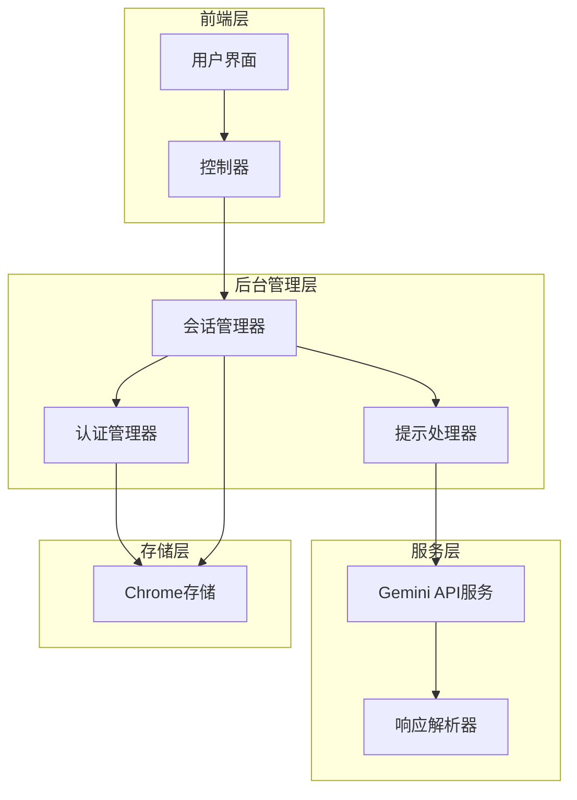
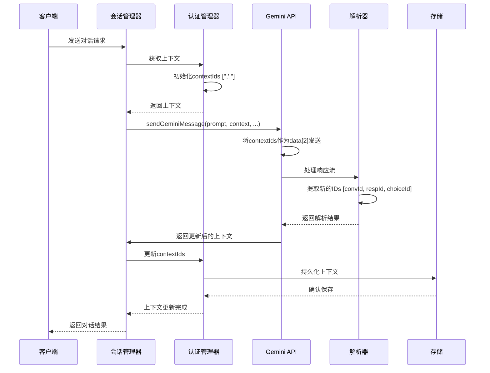
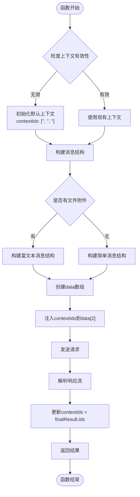
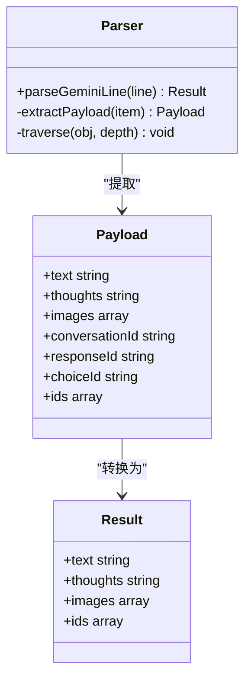
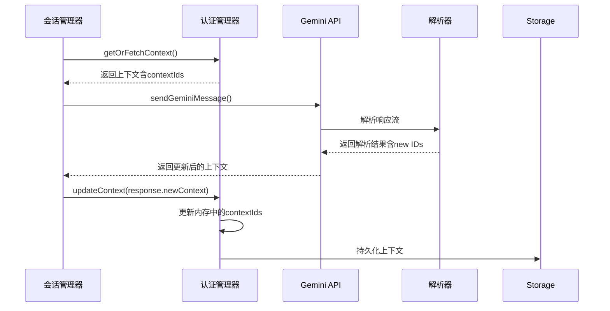
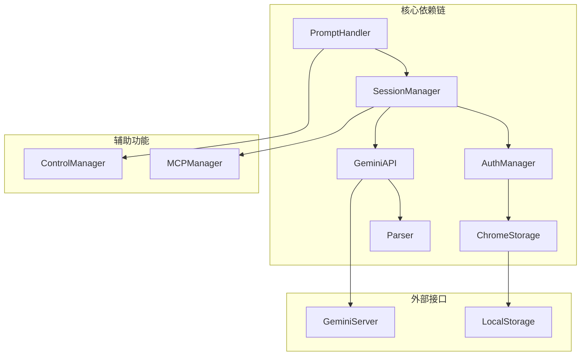

# 对话上下文ID数组

<cite>
**本文档引用的文件**
- [services/gemini_api.js](file://services/gemini_api.js)
- [background/managers/auth_manager.js](file://background/managers/auth_manager.js)
- [background/managers/session_manager.js](file://background/managers/session_manager.js)
- [services/parser.js](file://services/parser.js)
- [background/handlers/session/prompt_handler.js](file://background/handlers/session/prompt_handler.js)
</cite>

## 目录
1. [简介](#简介)
2. [项目结构](#项目结构)
3. [核心组件](#核心组件)
4. [架构概览](#架构概览)
5. [详细组件分析](#详细组件分析)
6. [依赖关系分析](#依赖关系分析)
7. [性能考虑](#性能考虑)
8. [故障排除指南](#故障排除指南)
9. [结论](#结论)

## 简介

本文档深入分析了Gemini Nexus项目中对话上下文ID数组（contextIds）的实现机制。contextIds数组采用三元组结构[conversationId, responseId, choiceId]，在维持对话连续性和实现上下文感知响应生成方面发挥着关键作用。

该数组在sendGeminiMessage函数中被直接作为请求数据的第三项（索引2）发送给Gemini服务，随后通过服务端响应解析提取新的ID值，最终更新到上下文中形成完整的对话链路。本文将详细解释这一机制的工作原理、数据流向以及在不同场景下的使用方式。

## 项目结构

Gemini Nexus项目采用模块化架构设计，对话上下文管理涉及多个层次的组件协作：



**图表来源**
- [services/gemini_api.js](file://services/gemini_api.js#L26-L230)
- [background/managers/auth_manager.js](file://background/managers/auth_manager.js#L5-L129)
- [background/managers/session_manager.js](file://background/managers/session_manager.js#L6-L285)

**章节来源**
- [services/gemini_api.js](file://services/gemini_api.js#L1-L230)
- [background/managers/auth_manager.js](file://background/managers/auth_manager.js#L1-L130)

## 核心组件

### contextIds三元组结构

contextIds数组采用严格的三元组结构，每个元素都有特定的语义含义：

- **conversationId**: 会话标识符，用于标识整个对话会话
- **responseId**: 响应标识符，用于标识当前响应序列
- **choiceId**: 选择标识符，用于标识候选回复选项

这种结构确保了Gemini服务能够准确识别和维护对话状态，实现真正的上下文感知对话。

### 上下文初始化机制

当没有有效上下文时，系统会自动初始化一个包含空字符串的三元组数组：
- `contextIds: ['', '', '']`

这种初始化确保了首次请求能够正常进行，同时为后续的上下文更新做好准备。

**章节来源**
- [services/gemini_api.js](file://services/gemini_api.js#L28-L37)
- [background/managers/auth_manager.js](file://background/managers/auth_manager.js#L75-L92)

## 架构概览

对话上下文ID数组在整个系统中的流转过程如下：



**图表来源**
- [services/gemini_api.js](file://services/gemini_api.js#L26-L230)
- [background/managers/session_manager.js](file://background/managers/session_manager.js#L21-L202)
- [services/parser.js](file://services/parser.js#L4-L157)

## 详细组件分析

### sendGeminiMessage函数中的contextIds处理

sendGeminiMessage函数是上下文ID处理的核心实现点，负责将contextIds数组嵌入到请求数据结构中：



**图表来源**
- [services/gemini_api.js](file://services/gemini_api.js#L26-L230)

#### 关键实现细节

1. **上下文验证与初始化**：当上下文不存在或无效时，系统会自动创建包含空字符串的三元组数组
2. **消息结构构建**：根据是否包含文件附件构建不同的消息结构
3. **contextIds注入**：将contextIds直接放置在data数组的第三个位置（索引2）
4. **响应解析与更新**：从解析器获取新的ID值并更新到上下文中

**章节来源**
- [services/gemini_api.js](file://services/gemini_api.js#L26-L116)
- [services/gemini_api.js](file://services/gemini_api.js#L165-L230)

### 响应解析器中的ID提取

解析器负责从Gemini服务的响应中提取必要的上下文信息：



**图表来源**
- [services/parser.js](file://services/parser.js#L4-L157)

解析器通过深度遍历候选回复结构，提取以下关键信息：
- conversationId: 从payload[1][0]获取
- responseId: 从payload[1][1]获取  
- choiceId: 从第一个候选回复的索引0获取

然后将这些信息组合成三元组数组返回给调用方。

**章节来源**
- [services/parser.js](file://services/parser.js#L16-L157)

### 会话管理器中的上下文更新

会话管理器负责协调整个上下文更新流程：



**图表来源**
- [background/managers/session_manager.js](file://background/managers/session_manager.js#L21-L202)
- [background/managers/auth_manager.js](file://background/managers/auth_manager.js#L105-L113)

**章节来源**
- [background/managers/session_manager.js](file://background/managers/session_manager.js#L21-L202)
- [background/managers/auth_manager.js](file://background/managers/auth_manager.js#L105-L113)

### 连续对话中的ID变化示例

为了更好地理解contextIds在连续对话中的变化，以下是典型场景的示例：

#### 场景一：首次对话
```
请求1:
- 输入: "你好"
- contextIds: ['', '', '']
- 输出: response1.text
- 新的contextIds: ['conv_001', 'resp_001', 'choice_001']

请求2:
- 输入: "请继续"
- contextIds: ['conv_001', 'resp_001', 'choice_001']
- 输出: response2.text  
- 新的contextIds: ['conv_001', 'resp_002', 'choice_002']
```

#### 场景二：多轮对话
```
请求1:
- contextIds: ['', '', ''] → ['conv_A', 'resp_A', 'choice_A']

请求2:
- contextIds: ['conv_A', 'resp_A', 'choice_A'] → ['conv_A', 'resp_B', 'choice_B']

请求3:
- contextIds: ['conv_A', 'resp_B', 'choice_B'] → ['conv_A', 'resp_C', 'choice_C']
```

#### 场景三：模型切换
当用户切换不同的Gemini模型时，系统会检测到模型变更并重置上下文：
```
模型切换前:
- contextIds: ['conv_X', 'resp_Y', 'choice_Z']

模型切换后:
- contextIds: ['', '', ''] (重新初始化)
```

**章节来源**
- [background/managers/auth_manager.js](file://background/managers/auth_manager.js#L98-L103)
- [background/managers/session_manager.js](file://background/managers/session_manager.js#L98-L118)

## 依赖关系分析

### 组件间依赖关系



**图表来源**
- [background/handlers/session/prompt_handler.js](file://background/handlers/session/prompt_handler.js#L1-L103)
- [background/managers/session_manager.js](file://background/managers/session_manager.js#L1-L285)
- [background/managers/auth_manager.js](file://background/managers/auth_manager.js#L1-L130)

### 数据流向分析

上下文ID数组在整个系统中的数据流向可以概括为：

1. **输入阶段**：从认证管理器获取当前上下文（包含contextIds）
2. **传输阶段**：通过Gemini API服务发送到Gemini服务器
3. **处理阶段**：Gemini服务器基于contextIds维护对话状态
4. **输出阶段**：服务器返回包含新ID值的响应
5. **更新阶段**：解析器提取新ID，会话管理器更新上下文

**章节来源**
- [services/gemini_api.js](file://services/gemini_api.js#L91-L116)
- [services/parser.js](file://services/parser.js#L143-L148)

## 性能考虑

### 上下文持久化策略

系统采用异步存储机制来优化性能：
- 使用Chrome本地存储API进行非阻塞写入
- 在会话管理器中批量更新上下文
- 避免频繁的存储操作影响用户体验

### 内存管理

- 上下文对象在内存中保持活跃状态
- 及时清理不再使用的上下文引用
- 支持多账户轮换机制避免单点过载

### 错误恢复机制

系统实现了多层次的错误恢复：
- 自动重试机制（支持多账户轮换）
- 上下文失效检测和自动刷新
- 断线重连和状态同步

## 故障排除指南

### 常见问题及解决方案

#### 问题1：上下文ID为空
**症状**：对话无法维持连续性
**原因**：contextIds数组包含空字符串
**解决**：确认认证管理器正确初始化了上下文

#### 问题2：模型切换导致上下文丢失
**症状**：切换模型后之前的对话历史消失
**原因**：系统检测到模型变更自动重置上下文
**解决**：重新开始对话或手动恢复上下文

#### 问题3：响应解析失败
**症状**：无法正确提取新的ID值
**原因**：Gemini服务器响应格式变化
**解决**：更新解析器以适配新的响应格式

**章节来源**
- [background/managers/auth_manager.js](file://background/managers/auth_manager.js#L98-L103)
- [services/parser.js](file://services/parser.js#L152-L156)

## 结论

Gemini Nexus项目中的contextIds数组机制展现了现代AI对话系统的复杂性和精密性。通过三元组结构[conversationId, responseId, choiceId]，系统实现了：

1. **精确的状态跟踪**：每个对话元素都有明确的身份标识
2. **可靠的上下文维护**：确保对话的连续性和一致性
3. **灵活的扩展能力**：支持多模型、多账户等高级功能
4. **高效的性能表现**：通过合理的缓存和存储策略优化用户体验

这一机制的成功实施为构建高质量的AI对话应用提供了坚实的技术基础，也为类似系统的开发提供了宝贵的参考经验。