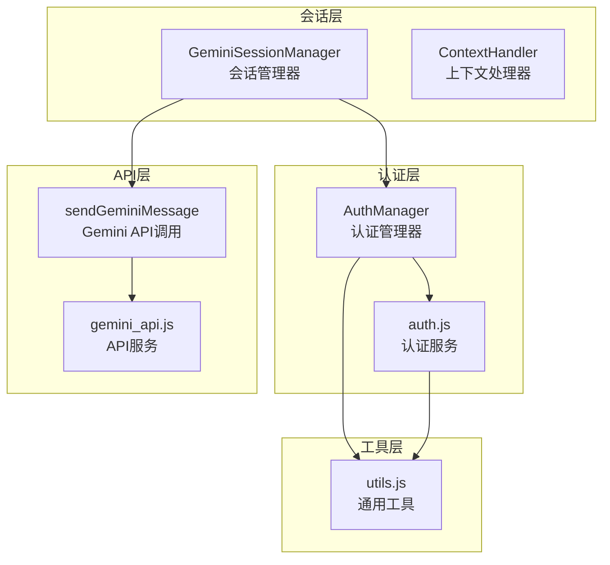
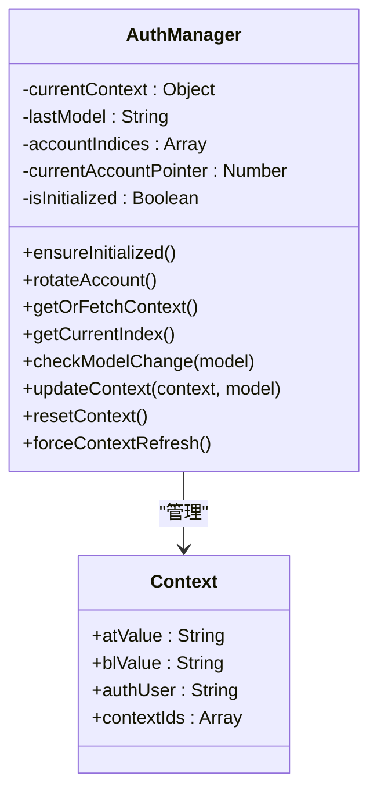
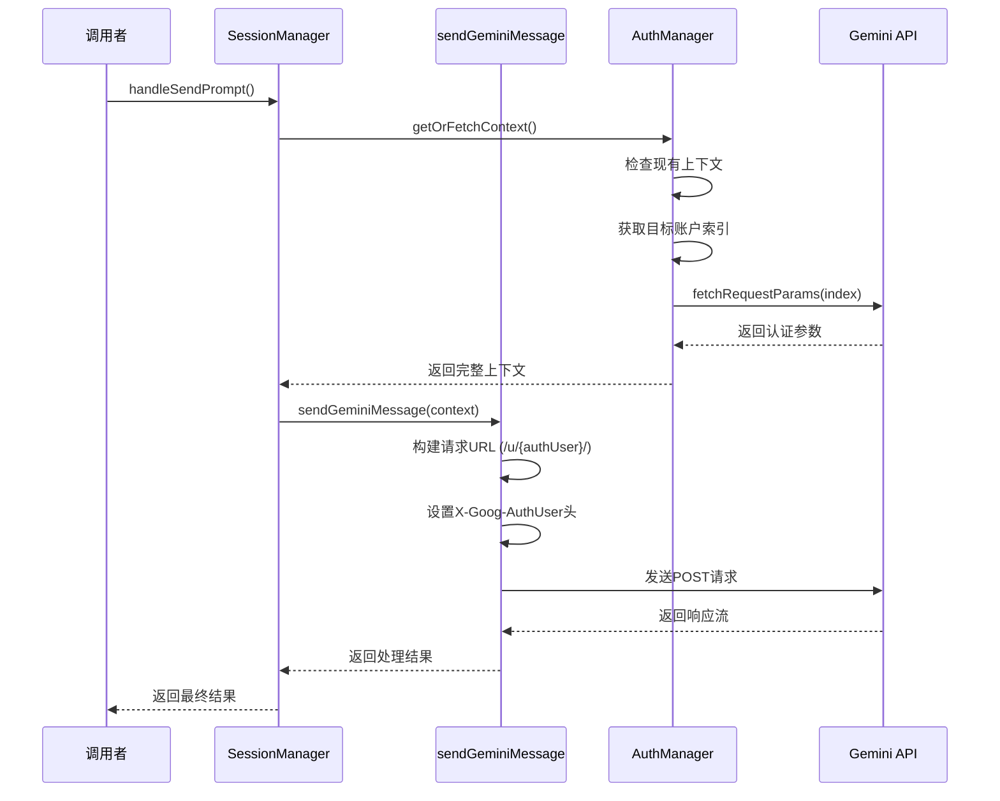
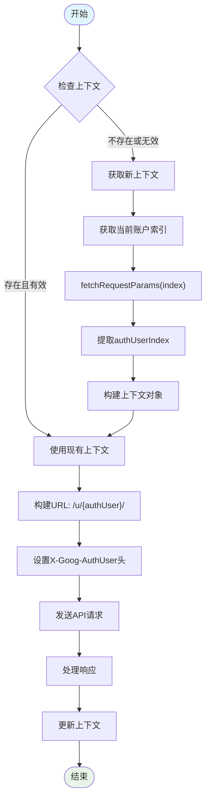
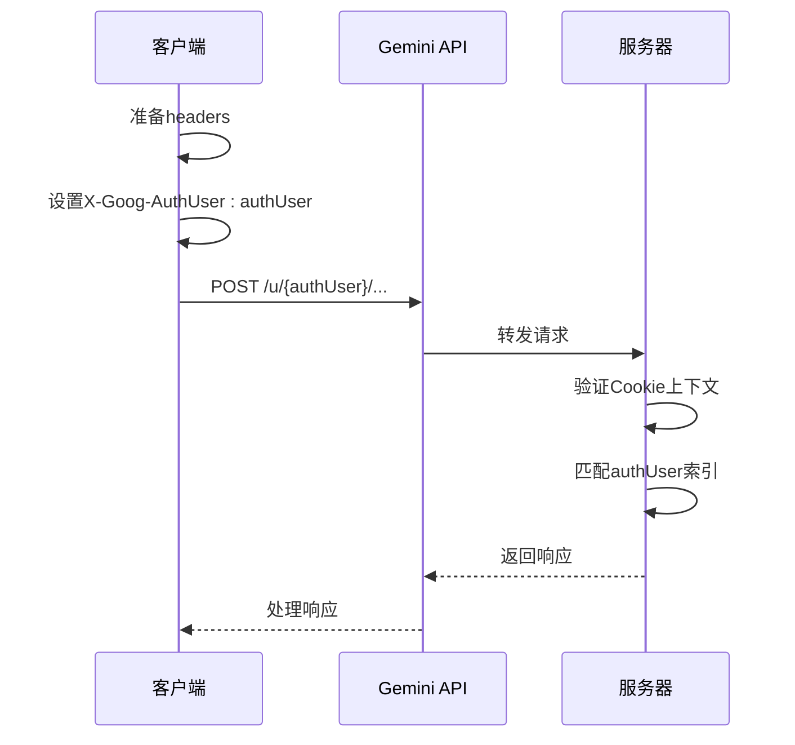
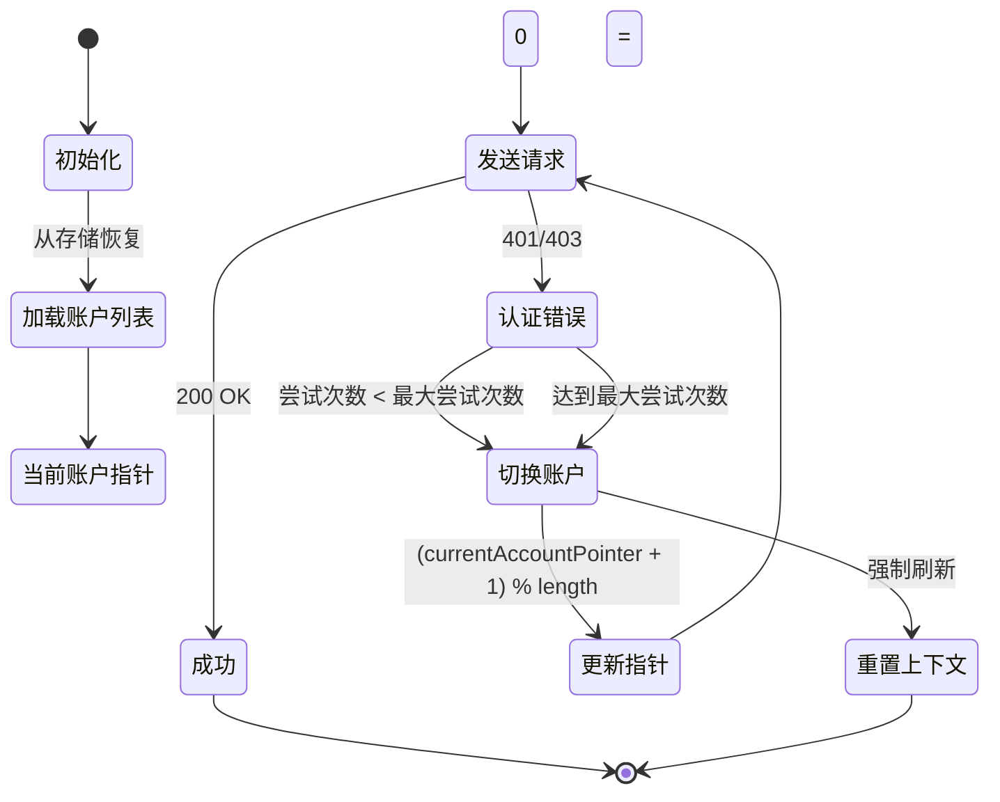
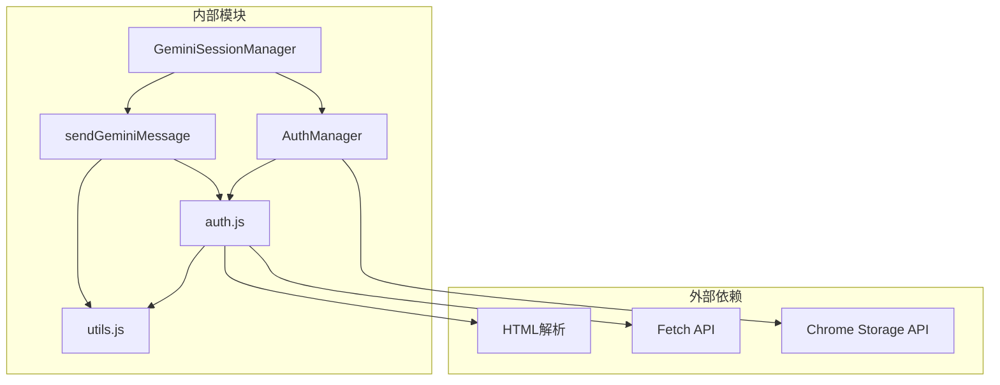
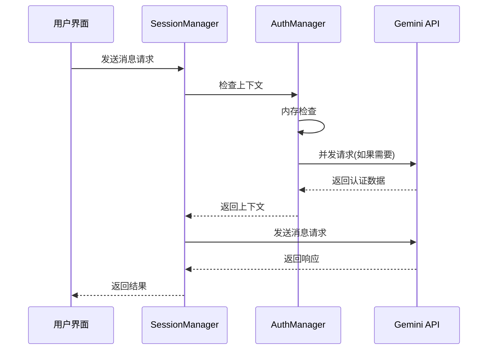

# 用户身份索引 (authUser)

<cite>
**本文档引用的文件**
- [auth_manager.js](file://background/managers/auth_manager.js)
- [gemini_api.js](file://services/gemini_api.js)
- [auth.js](file://services/auth.js)
- [session_manager.js](file://background/managers/session_manager.js)
- [utils.js](file://lib/utils.js)
</cite>

## 目录
1. [简介](#简介)
2. [项目结构概览](#项目结构概览)
3. [核心组件分析](#核心组件分析)
4. [架构总览](#架构总览)
5. [详细组件分析](#详细组件分析)
6. [依赖关系分析](#依赖关系分析)
7. [性能考虑](#性能考虑)
8. [故障排除指南](#故障排除指南)
9. [结论](#结论)

## 简介

本文档深入分析了Gemini Nexus扩展中`authUser`字段在多账户管理系统中的关键作用。`authUser`作为用户身份索引，在Google Gemini API的多账户环境中扮演着至关重要的角色，确保Cookie上下文与API请求正确匹配，从而实现无缝的多账户切换和管理。

该字段不仅影响请求URL的路径构造（`/u/{index}/`），还通过`X-Goog-AuthUser`请求头传递认证上下文，是实现多Google账户登录支持的核心机制。

## 项目结构概览

Gemini Nexus采用模块化的架构设计，将认证管理、API通信和会话处理分离到不同的模块中：



**图表来源**
- [auth_manager.js](file://background/managers/auth_manager.js#L1-L129)
- [gemini_api.js](file://services/gemini_api.js#L1-L230)
- [auth.js](file://services/auth.js#L1-L40)

**章节来源**
- [auth_manager.js](file://background/managers/auth_manager.js#L1-L129)
- [gemini_api.js](file://services/gemini_api.js#L1-L230)
- [auth.js](file://services/auth.js#L1-L40)

## 核心组件分析

### AuthManager类

AuthManager是多账户管理的核心组件，负责维护当前认证上下文和账户索引列表：



**图表来源**
- [auth_manager.js](file://background/managers/auth_manager.js#L5-L129)

### sendGeminiMessage函数

该函数是Gemini API调用的核心入口点，直接使用`authUser`字段进行请求构建：



**图表来源**
- [session_manager.js](file://background/managers/session_manager.js#L21-L147)
- [gemini_api.js](file://services/gemini_api.js#L26-L156)
- [auth_manager.js](file://background/managers/auth_manager.js#L75-L92)

**章节来源**
- [auth_manager.js](file://background/managers/auth_manager.js#L50-L96)
- [gemini_api.js](file://services/gemini_api.js#L26-L156)

## 架构总览

Gemini Nexus的多账户架构通过以下机制实现：



**图表来源**
- [auth_manager.js](file://background/managers/auth_manager.js#L75-L92)
- [gemini_api.js](file://services/gemini_api.js#L140-L141)
- [auth.js](file://services/auth.js#L26-L33)

## 详细组件分析

### authUser字段的作用机制

#### URL路径构建中的authUser

在Gemini API调用中，`authUser`字段直接影响请求URL的路径部分：

```mermaid
flowchart LR
A[sendGeminiMessage函数] --> B[检查context.authUser]
B --> C{authUser存在?}
C --> |是| D[使用context.authUser]
C --> |否| E[使用默认值'0']
D --> F[/u/{authUser}/路径]
E --> G[/u/0/路径]
F --> H[构建完整endpoint]
G --> H
H --> I[发送请求]
```

**图表来源**
- [gemini_api.js](file://services/gemini_api.js#L140-L141)

#### X-Goog-AuthUser请求头的传递

`authUser`值同时作为`X-Goog-AuthUser`请求头传递，确保服务器端正确识别认证上下文：



**图表来源**
- [gemini_api.js](file://services/gemini_api.js#L125-L132)

**章节来源**
- [gemini_api.js](file://services/gemini_api.js#L125-L141)

### 默认值获取机制

当`context`参数缺失时，系统通过以下流程获取默认的`authUser`值：

```mermaid
flowchart TD
A[sendGeminiMessage调用] --> B{context参数存在?}
B --> |否| C[使用默认值'0']
B --> |是| D[检查context.atValue]
D --> E{atValue存在?}
E --> |否| F[使用默认值'0']
E --> |是| G[使用现有context]
C --> H[fetchRequestParams('0')]
F --> H
H --> I[extractFromHTML提取authUserIndex]
I --> J[设置context.authUser]
G --> K[继续执行]
J --> K
```

**图表来源**
- [gemini_api.js](file://services/gemini_api.js#L28-L37)
- [auth.js](file://services/auth.js#L26-L33)

**章节来源**
- [gemini_api.js](file://services/gemini_api.js#L28-L37)
- [auth.js](file://services/auth.js#L26-L33)

### 多账户切换机制

系统支持动态的多账户切换，通过以下流程实现：



**图表来源**
- [session_manager.js](file://background/managers/session_manager.js#L43-L147)
- [auth_manager.js](file://background/managers/auth_manager.js#L53-L69)

**章节来源**
- [session_manager.js](file://background/managers/session_manager.js#L43-L147)
- [auth_manager.js](file://background/managers/auth_manager.js#L53-L69)

### 示例场景：多账户切换

以下是一些典型的多账户切换场景：

#### 场景1：自动轮换
当配置多个账户且遇到认证错误时，系统自动切换到下一个账户：

```javascript
// 配置: ['0', '1', '2']
// 当前: '0'
// 错误: 401 Unauthorized
// 结果: 切换到 '1'
```

#### 场景2：手动选择
用户可以通过界面选择特定的账户索引：

```javascript
// 用户选择账户 '2'
// 系统使用 authUser = '2'
// URL: /u/2/
// 头部: X-Goog-AuthUser: 2
```

#### 场景3：默认回退
当所有账户都失效时，系统回退到默认账户：

```javascript
// 所有账户都失效
// 系统回退到 '0'
// 使用默认认证参数
```

**章节来源**
- [session_manager.js](file://background/managers/session_manager.js#L138-L146)
- [auth_manager.js](file://background/managers/auth_manager.js#L53-L69)

## 依赖关系分析

### 组件间依赖关系



**图表来源**
- [auth_manager.js](file://background/managers/auth_manager.js#L1-L12)
- [gemini_api.js](file://services/gemini_api.js#L1-L6)
- [auth.js](file://services/auth.js#L1-L4)

**章节来源**
- [auth_manager.js](file://background/managers/auth_manager.js#L1-L12)
- [gemini_api.js](file://services/gemini_api.js#L1-L6)
- [auth.js](file://services/auth.js#L1-L4)

### 数据流分析

`authUser`字段在整个数据流中的传递过程：

```mermaid
flowchart LR
A[用户输入] --> B[SessionManager]
B --> C[AuthManager.getOrFetchContext]
C --> D[fetchRequestParams]
D --> E[extractFromHTML]
E --> F[authUserIndex提取]
F --> G[AuthManager构建上下文]
G --> H[sendGeminiMessage]
H --> I[URL构建: /u/{authUser}/]
H --> J[头部设置: X-Goog-AuthUser]
I --> K[API请求]
J --> K
K --> L[响应处理]
L --> M[上下文更新]
M --> N[存储持久化]
```

**图表来源**
- [session_manager.js](file://background/managers/session_manager.js#L50-L74)
- [auth_manager.js](file://background/managers/auth_manager.js#L75-L92)
- [gemini_api.js](file://services/gemini_api.js#L140-L141)

**章节来源**
- [session_manager.js](file://background/managers/session_manager.js#L50-L74)
- [auth_manager.js](file://background/managers/auth_manager.js#L75-L92)
- [gemini_api.js](file://services/gemini_api.js#L140-L141)

## 性能考虑

### 缓存策略

系统采用了多层次的缓存机制来优化性能：

1. **内存缓存**: `AuthManager.currentContext`避免重复的API调用
2. **存储缓存**: Chrome本地存储持久化认证状态
3. **账户索引缓存**: 避免重复解析HTML内容

### 并发控制



**图表来源**
- [auth_manager.js](file://background/managers/auth_manager.js#L75-L92)
- [session_manager.js](file://background/managers/session_manager.js#L21-L74)

## 故障排除指南

### 常见问题及解决方案

#### 问题1：authUser不匹配导致的认证失败

**症状**: 请求返回401或403错误

**原因**: URL路径中的账户索引与Cookie上下文不匹配

**解决方案**:
1. 检查`context.authUser`是否正确设置
2. 确认URL包含正确的`/u/{authUser}/`路径
3. 验证`X-Goog-AuthUser`头部值

#### 问题2：多账户切换失败

**症状**: 自动切换后仍然认证失败

**原因**: 账户列表配置错误或账户状态异常

**解决方案**:
1. 检查`geminiAccountIndices`存储值
2. 验证每个账户的登录状态
3. 清除认证缓存并重新初始化

#### 问题3：默认值获取失败

**症状**: 使用默认账户索引'0'但仍然失败

**原因**: 网络问题或Google服务不可用

**解决方案**:
1. 检查网络连接
2. 验证Google服务状态
3. 手动登录验证账户有效性

**章节来源**
- [session_manager.js](file://background/managers/session_manager.js#L138-L146)
- [auth.js](file://services/auth.js#L35-L37)

## 结论

`authUser`字段在Gemini Nexus的多账户管理系统中发挥着核心作用，它不仅是用户身份的标识符，更是确保API请求正确路由和认证的关键机制。通过精确的URL路径构建和头部传递，系统实现了对多个Google账户的无缝支持。

该设计的主要优势包括：

1. **精确的身份绑定**: `authUser`确保请求与正确的Cookie上下文匹配
2. **灵活的账户管理**: 支持动态的多账户切换和轮换
3. **可靠的默认机制**: 在上下文缺失时提供安全的回退策略
4. **高效的性能表现**: 通过缓存和并发控制优化用户体验

未来可以考虑的改进方向：
- 增强账户状态监控和自动修复机制
- 提供更详细的账户切换日志和诊断信息
- 实现智能的账户优先级排序和负载均衡