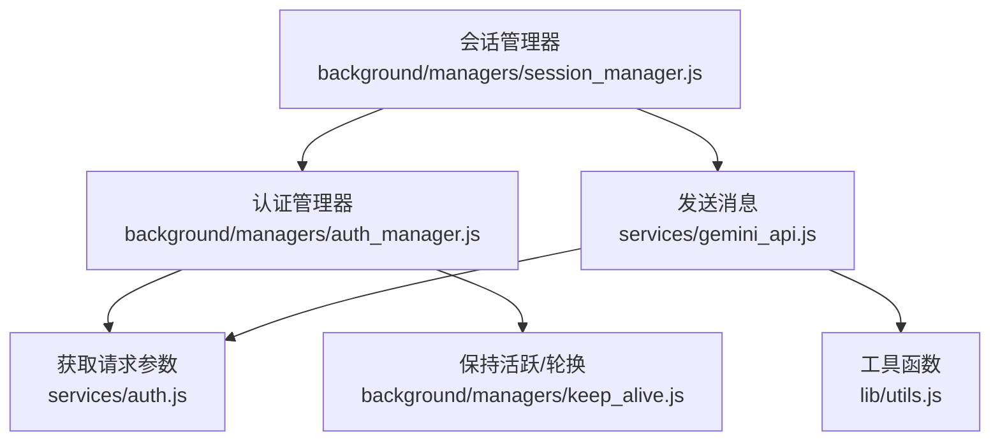
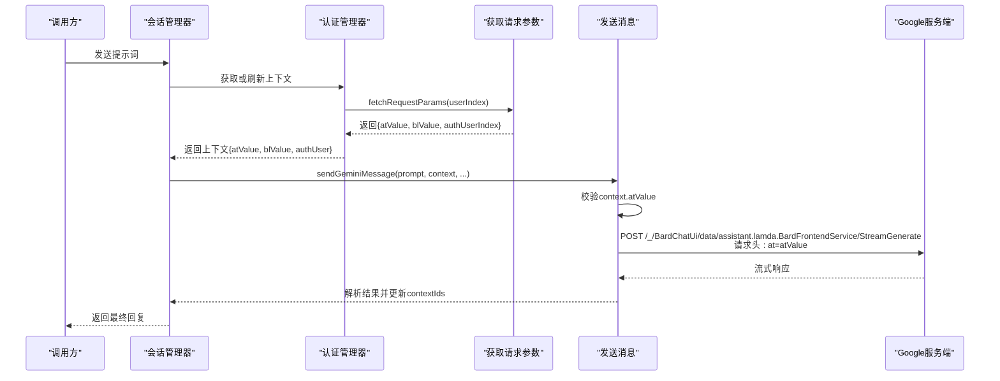
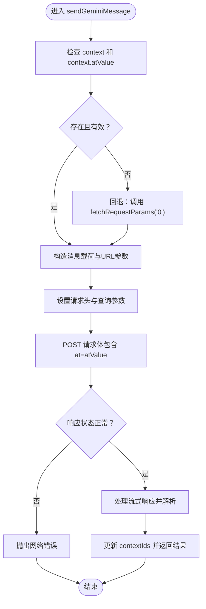
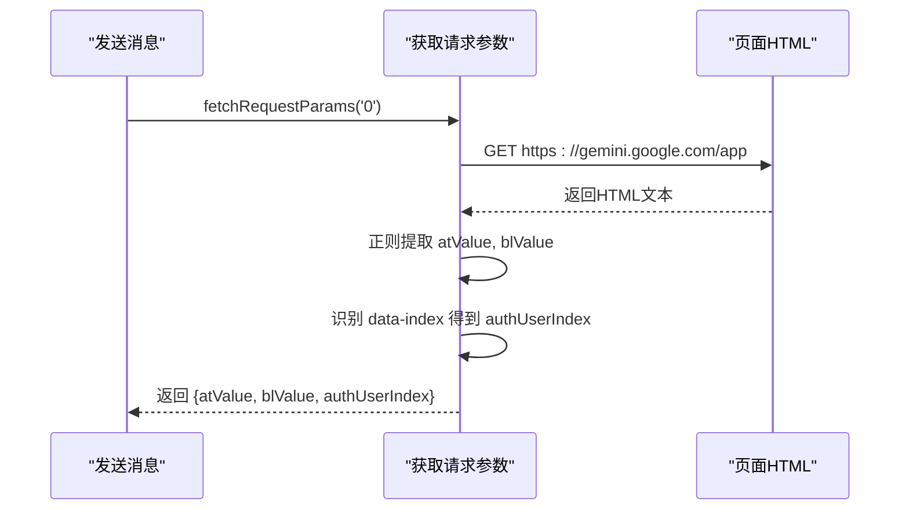
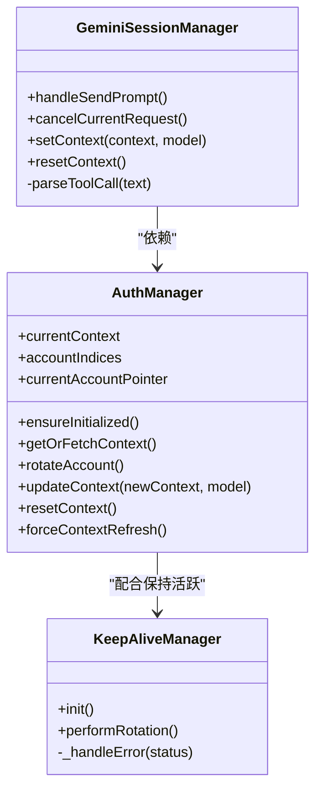
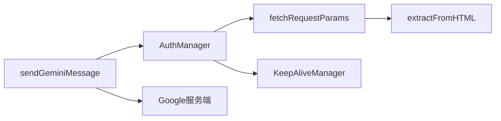

# 认证令牌 (atValue)

<cite>
**本文引用的文件**
- [services/gemini_api.js](file://services/gemini_api.js)
- [services/auth.js](file://services/auth.js)
- [background/managers/auth_manager.js](file://background/managers/auth_manager.js)
- [background/managers/session_manager.js](file://background/managers/session_manager.js)
- [lib/utils.js](file://lib/utils.js)
- [background/managers/keep_alive.js](file://background/managers/keep_alive.js)
</cite>

## 目录
1. [简介](#简介)
2. [项目结构](#项目结构)
3. [核心组件](#核心组件)
4. [架构总览](#架构总览)
5. [详细组件分析](#详细组件分析)
6. [依赖关系分析](#依赖关系分析)
7. [性能考量](#性能考量)
8. [故障排查指南](#故障排查指南)
9. [结论](#结论)

## 简介
本文件聚焦于Google身份认证中的“访问令牌”（Access Token）在系统内的关键角色，特别是context参数中的atValue字段。我们将解释：
- atValue在sendGeminiMessage函数中如何作为请求头的'at'参数使用
- 当context缺失或atValue无效时，系统如何通过fetchRequestParams('0')回退机制重新获取有效令牌
- atValue的格式特征与来源
- 因令牌过期或无效导致“未登录 (Session expired)”错误的常见场景与刷新认证的解决方案

## 项目结构
围绕认证令牌的关键模块分布如下：
- 服务层：负责从网页HTML中提取令牌、构造请求参数
- 管理层：维护认证上下文、账户轮换、强制刷新
- 会话层：发起消息请求、处理流式响应、错误分类与恢复

图表来源
- [background/managers/session_manager.js](file://background/managers/session_manager.js#L1-L285)
- [background/managers/auth_manager.js](file://background/managers/auth_manager.js#L1-L130)
- [services/gemini_api.js](file://services/gemini_api.js#L1-L230)
- [services/auth.js](file://services/auth.js#L1-L40)
- [lib/utils.js](file://lib/utils.js#L1-L59)
- [background/managers/keep_alive.js](file://background/managers/keep_alive.js#L1-L97)

章节来源
- [services/gemini_api.js](file://services/gemini_api.js#L26-L152)
- [services/auth.js](file://services/auth.js#L7-L39)
- [background/managers/auth_manager.js](file://background/managers/auth_manager.js#L75-L92)
- [background/managers/session_manager.js](file://background/managers/session_manager.js#L47-L147)
- [lib/utils.js](file://lib/utils.js#L5-L9)
- [background/managers/keep_alive.js](file://background/managers/keep_alive.js#L4-L83)

## 核心组件
- atValue：Google前端页面中以特定键名存储的访问令牌值，用于在请求头中携带以完成身份验证。
- fetchRequestParams：从目标用户索引的页面中抓取atValue、blValue等认证参数。
- AuthManager：维护当前认证上下文、账户轮换、强制刷新。
- GeminiSessionManager：协调认证与消息发送流程，处理登录态异常与重试。
- 工具函数extractFromHTML：从HTML文本中按固定键名提取令牌值。

章节来源
- [services/gemini_api.js](file://services/gemini_api.js#L26-L37)
- [services/auth.js](file://services/auth.js#L7-L39)
- [background/managers/auth_manager.js](file://background/managers/auth_manager.js#L75-L92)
- [background/managers/session_manager.js](file://background/managers/session_manager.js#L129-L146)
- [lib/utils.js](file://lib/utils.js#L5-L9)

## 架构总览
下图展示了从会话管理到认证获取再到消息发送的整体调用链，重点标注了atValue在请求头中的注入位置。

图表来源
- [background/managers/session_manager.js](file://background/managers/session_manager.js#L47-L118)
- [background/managers/auth_manager.js](file://background/managers/auth_manager.js#L75-L92)
- [services/auth.js](file://services/auth.js#L7-L39)
- [services/gemini_api.js](file://services/gemini_api.js#L26-L152)

## 详细组件分析

### atValue字段的定义与作用
- 定义来源：系统通过解析目标页面HTML中的特定键名，提取出atValue作为访问令牌。
- 作用位置：在发送消息时，将atValue放入请求体的查询参数中，作为请求头的'at'参数，用于标识当前会话的身份。
- 关联上下文：与blValue、authUser共同构成请求上下文，确保请求与正确的用户会话绑定。

章节来源
- [services/auth.js](file://services/auth.js#L23-L24)
- [services/gemini_api.js](file://services/gemini_api.js#L148-L150)

### sendGeminiMessage中的atValue使用
- 上下文校验：若context不存在或缺少atValue，则触发回退逻辑，调用fetchRequestParams('0')获取新令牌。
- 请求头注入：在POST请求体中以查询参数形式包含'at'键，值为context.atValue。
- URL构建：endpoint中包含/u/{authUser}/路径段，确保Cookie与authUser匹配。

图表来源
- [services/gemini_api.js](file://services/gemini_api.js#L26-L37)
- [services/gemini_api.js](file://services/gemini_api.js#L118-L152)

章节来源
- [services/gemini_api.js](file://services/gemini_api.js#L26-L37)
- [services/gemini_api.js](file://services/gemini_api.js#L118-L152)

### fetchRequestParams('0')回退机制
- 触发条件：当context缺失或atValue为空时，系统自动回退到用户索引'0'，从默认页面抓取令牌。
- 执行流程：访问对应URL -> 获取HTML -> 提取atValue与blValue -> 识别authUserIndex -> 返回参数对象。
- 错误处理：若未提取到atValue，直接抛出“未登录”的错误信息，提示用户登录。

图表来源
- [services/auth.js](file://services/auth.js#L7-L39)
- [lib/utils.js](file://lib/utils.js#L5-L9)

章节来源
- [services/auth.js](file://services/auth.js#L7-L39)
- [lib/utils.js](file://lib/utils.js#L5-L9)

### 认证上下文与账户轮换
- 上下文存储：AuthManager维护currentContext，并持久化到本地存储；支持多账户索引列表与当前指针。
- 轮换策略：当检测到登录错误或达到最大尝试次数时，切换到下一个账户索引并强制刷新上下文。
- 强制刷新：forceContextRefresh清空当前上下文，确保下次请求触发新的令牌获取。

图表来源
- [background/managers/auth_manager.js](file://background/managers/auth_manager.js#L1-L130)
- [background/managers/session_manager.js](file://background/managers/session_manager.js#L1-L285)
- [background/managers/keep_alive.js](file://background/managers/keep_alive.js#L1-L97)

章节来源
- [background/managers/auth_manager.js](file://background/managers/auth_manager.js#L75-L92)
- [background/managers/session_manager.js](file://background/managers/session_manager.js#L129-L146)
- [background/managers/keep_alive.js](file://background/managers/keep_alive.js#L4-L83)

### 令牌格式特征与来源
- 来源：系统从目标页面HTML中提取，键名为特定字符串，值为访问令牌。
- 提取方式：通过工具函数正则匹配，返回对应的令牌字符串。
- 作用范围：与blValue、authUser共同构成请求上下文，确保请求与正确用户会话关联。

章节来源
- [services/auth.js](file://services/auth.js#L23-L24)
- [lib/utils.js](file://lib/utils.js#L5-L9)

### 常见错误场景与刷新方案
- “未登录 (Session expired)”错误
  - 触发点：首次流式响应片段包含登录页特征或响应体包含登录关键字。
  - 处理：会话管理器清除本地上下文并提示用户前往登录页面。
- 401/403状态码
  - 触发点：保持活跃轮换失败或服务端拒绝访问。
  - 处理：清除本地上下文，等待用户重新登录。
- 重试与账户轮换
  - 当检测到登录错误且存在多个账户时，自动轮换账户并强制刷新上下文后重试。

章节来源
- [services/gemini_api.js](file://services/gemini_api.js#L172-L177)
- [background/managers/session_manager.js](file://background/managers/session_manager.js#L159-L171)
- [background/managers/keep_alive.js](file://background/managers/keep_alive.js#L82-L93)

## 依赖关系分析
- sendGeminiMessage依赖AuthManager提供的上下文；若上下文缺失或无效，则回退到fetchRequestParams。
- fetchRequestParams依赖lib/utils.js中的extractFromHTML进行令牌提取。
- 会话管理器在遇到登录错误时，调用AuthManager的轮换与刷新能力，并清理本地存储。

图表来源
- [services/gemini_api.js](file://services/gemini_api.js#L26-L37)
- [background/managers/auth_manager.js](file://background/managers/auth_manager.js#L75-L92)
- [services/auth.js](file://services/auth.js#L7-L39)
- [lib/utils.js](file://lib/utils.js#L5-L9)
- [background/managers/keep_alive.js](file://background/managers/keep_alive.js#L4-L83)

章节来源
- [services/gemini_api.js](file://services/gemini_api.js#L26-L37)
- [background/managers/auth_manager.js](file://background/managers/auth_manager.js#L75-L92)
- [services/auth.js](file://services/auth.js#L7-L39)
- [lib/utils.js](file://lib/utils.js#L5-L9)
- [background/managers/keep_alive.js](file://background/managers/keep_alive.js#L4-L83)

## 性能考量
- 并行上传：在多模态场景下，文件上传采用并行处理，减少整体等待时间。
- 流式读取：响应以流式方式读取，尽早开始解析，提升交互体验。
- 轮询与节流：保持活跃管理器对轮换操作进行节流，避免频繁请求导致限流。

## 故障排查指南
- 现象：出现“未登录 (Session expired)”或401/403错误
  - 排查步骤：
    - 清除本地上下文并重新登录
    - 检查是否选择了正确的用户索引
    - 确认浏览器权限允许跨域Cookie
- 现象：请求过于频繁或响应为空
  - 排查步骤：
    - 等待一段时间后重试
    - 刷新Gemini页面后再试
- 现象：多账户轮换后仍失败
  - 排查步骤：
    - 手动切换到其他账户索引
    - 检查账户是否被限制访问

章节来源
- [background/managers/session_manager.js](file://background/managers/session_manager.js#L159-L192)
- [background/managers/keep_alive.js](file://background/managers/keep_alive.js#L82-L93)

## 结论
atValue作为Google身份认证的核心令牌，在sendGeminiMessage中通过请求头的'at'参数传递给服务端，确保每次请求都与有效的用户会话关联。当上下文缺失或令牌失效时，系统通过fetchRequestParams('0')回退机制自动重新获取令牌，并结合会话管理器的错误处理与账户轮换策略，提供稳健的认证恢复能力。理解atValue的来源、格式与使用方式，有助于快速定位登录态问题并采取正确的刷新与切换措施。