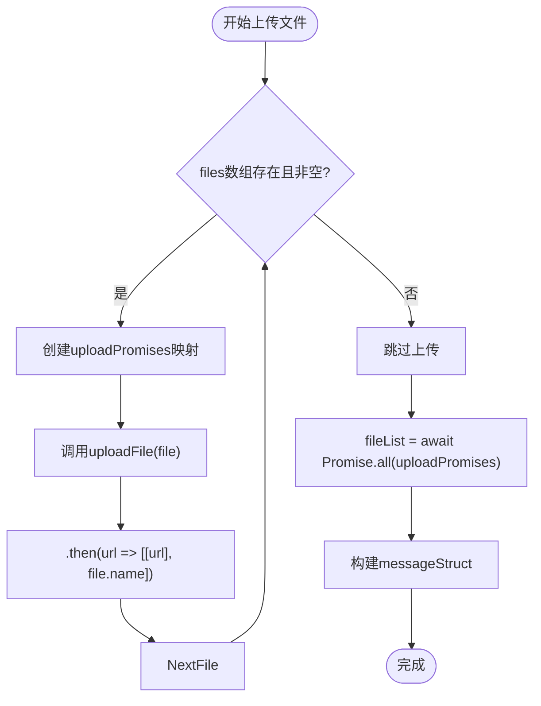
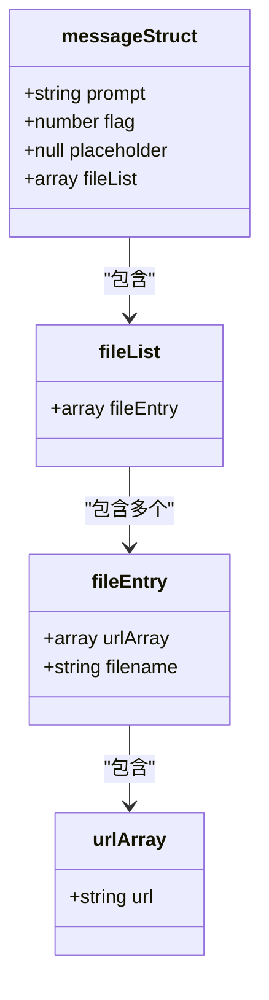
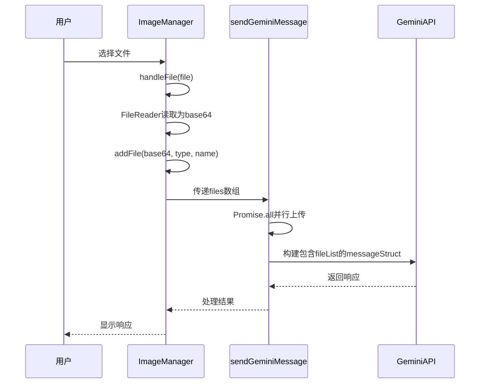

# fileList数据结构规范

<cite>
**本文档引用的文件**  
- [gemini_api.js](file://services/gemini_api.js#L41-L116)
- [upload.js](file://services/upload.js#L7-L39)
- [image_manager.js](file://sandbox/core/image_manager.js#L14-L212)
- [prompt_handler.js](file://background/handlers/session/prompt_handler.js#L27-L67)
</cite>

## 目录
1. [fileList嵌套数组结构概述](#filelist嵌套数组结构概述)
2. [文件上传与Promise.all处理](#文件上传与promiseall处理)
3. [messageStruct中的fileList作用](#messagestruct中的filelist作用)
4. [前端file对象准备与filename重要性](#前端file对象准备与filename重要性)

## fileList嵌套数组结构概述

fileList数据结构为`[[[url], filename]]`的嵌套数组格式，用于在调用Gemini后端API时传递多模态输入文件信息。该结构在`sendGeminiMessage`函数中生成，当检测到`files`数组存在时，通过并行上传处理将每个文件转换为`[[url], filename]`的子数组，最终组合成包含多个文件信息的二维数组。这种结构设计符合Gemini API v3.0的多模态输入要求，确保模型能够正确识别和处理上传的文件资源。

**Section sources**
- [gemini_api.js](file://services/gemini_api.js#L42-L43)

## 文件上传与Promise.all处理

在`sendGeminiMessage`函数中，当`files`数组存在且长度大于0时，系统会创建一个上传Promise数组。通过`files.map()`方法遍历文件列表，对每个文件调用`uploadFile`函数进行上传，并使用`.then()`方法将上传成功后的URL和原始文件名组合成`[[url], file.name]`的格式。随后使用`Promise.all(uploadPromises)`并行执行所有上传任务，确保高效处理多个文件上传。这种方法不仅提高了上传效率，还保证了fileList结构的正确生成。

**Diagram sources**
- [gemini_api.js](file://services/gemini_api.js#L44-L51)
- [upload.js](file://services/upload.js#L7-L39)

**Section sources**
- [gemini_api.js](file://services/gemini_api.js#L44-L51)

## messageStruct中的fileList作用

fileList作为第四项参数被包含在`messageStruct`中，对于满足Gemini后端API的多模态输入要求至关重要。当存在文件时，`messageStruct`的结构为`[prompt, 0, null, fileList]`，其中fileList占据了第四位置。这种结构设计直接对应Gemini API的参数规范，确保上传的文件能够被正确关联到用户提示(prompt)上。在构建`data`数组时，这个包含fileList的`messageStruct`作为第一个元素被传递，从而实现多模态内容的完整传输。

**Diagram sources**
- [gemini_api.js](file://services/gemini_api.js#L66-L72)

**Section sources**
- [gemini_api.js](file://services/gemini_api.js#L58-L72)

## 前端file对象准备与filename重要性

前端通过`ImageManager`类准备包含base64和name属性的file对象数组。当用户选择或拖拽文件时，`handleFile`方法使用`FileReader`读取文件内容并转换为base64格式，同时保留原始文件名。这些文件信息以`{base64, type, name}`的对象形式存储在`this.files`数组中。在调用`sendGeminiMessage`时，这些对象被直接传递。filename在模型理解上下文中具有重要作用，它不仅帮助用户识别上传的文件，还可能影响模型对文件内容的理解和引用，特别是在处理多个相似类型文件时，文件名提供了关键的区分信息。

**Diagram sources**
- [image_manager.js](file://sandbox/core/image_manager.js#L195-L212)
- [gemini_api.js](file://services/gemini_api.js#L44-L51)

**Section sources**
- [image_manager.js](file://sandbox/core/image_manager.js#L195-L212)
- [prompt_handler.js](file://background/handlers/session/prompt_handler.js#L27-L28)