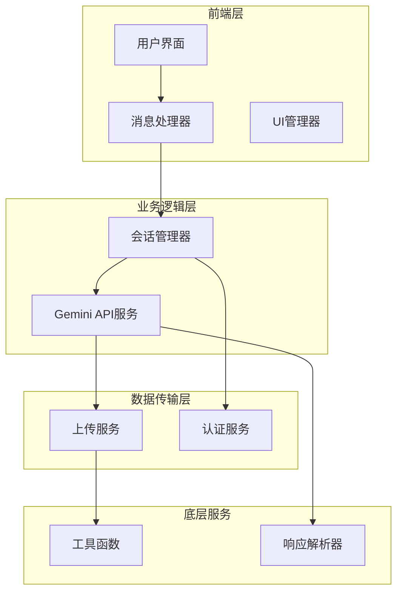
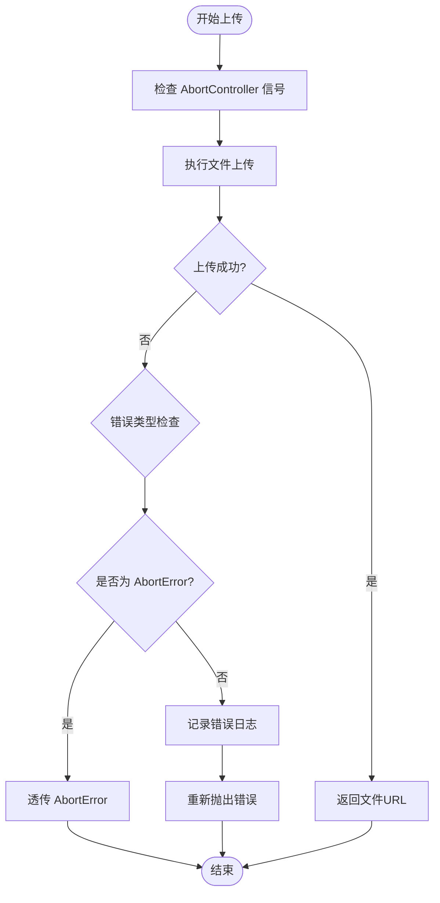
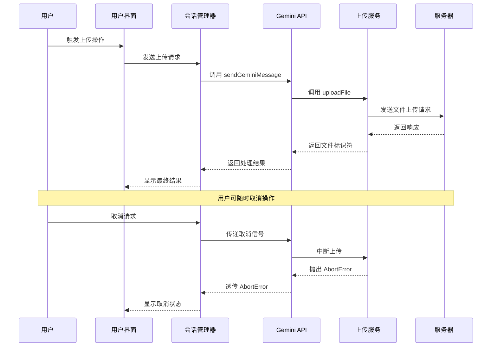
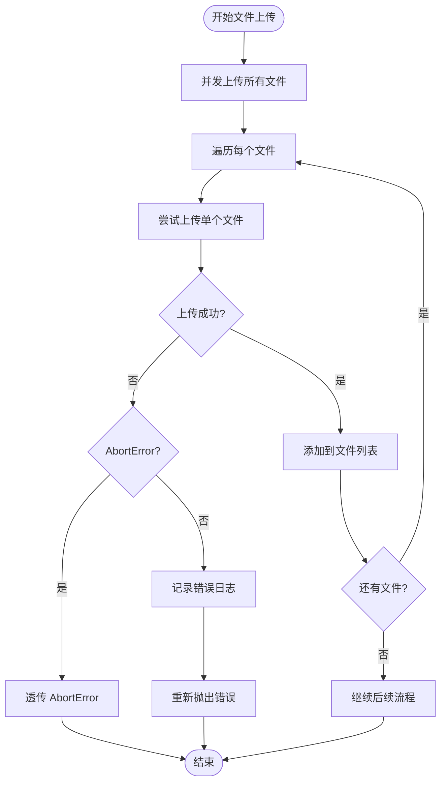
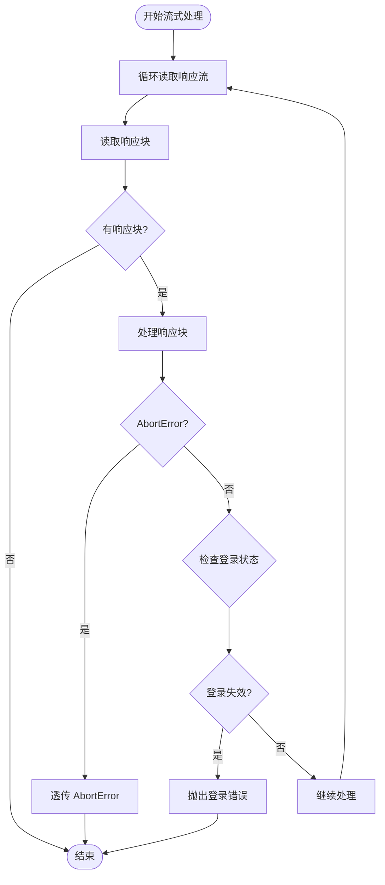
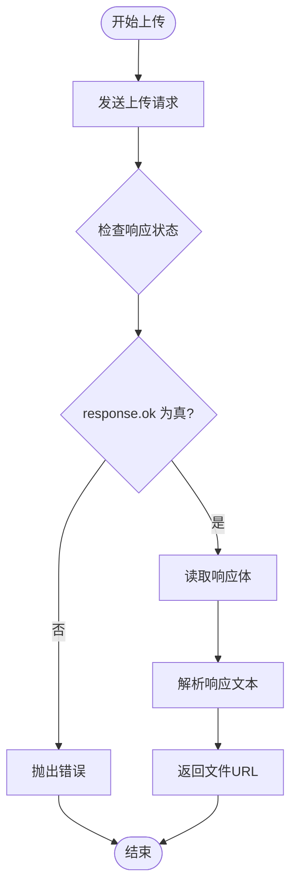
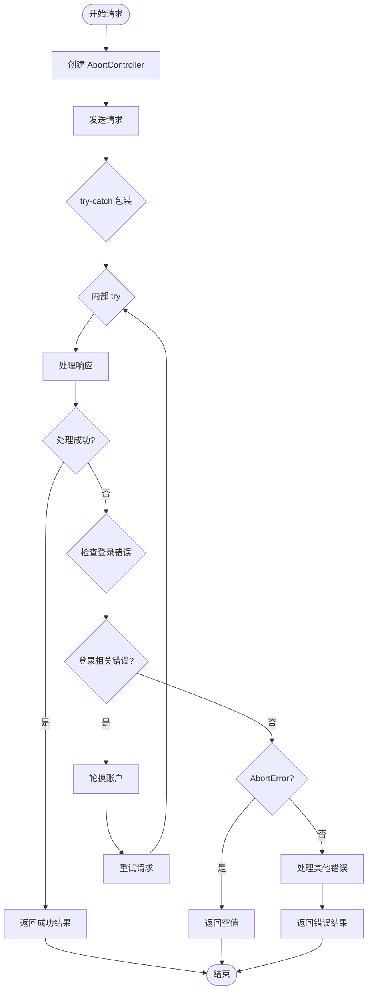
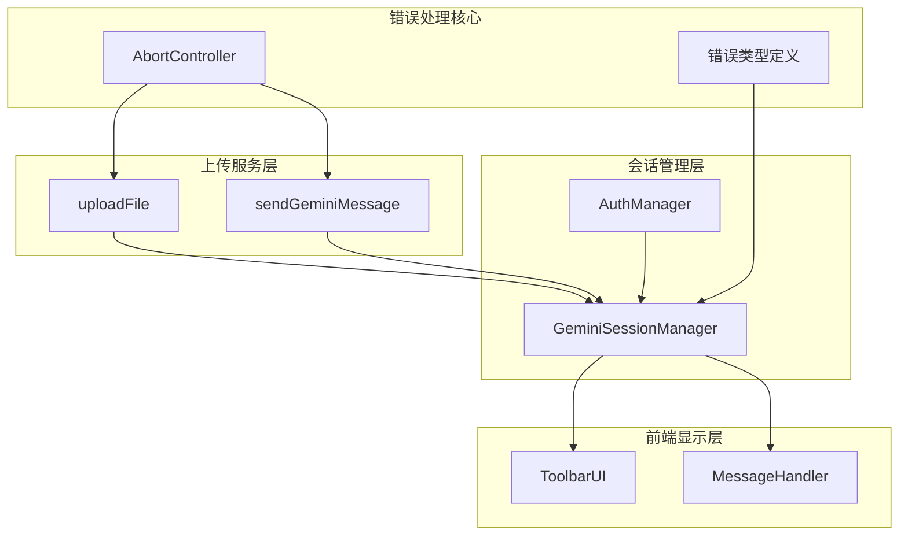
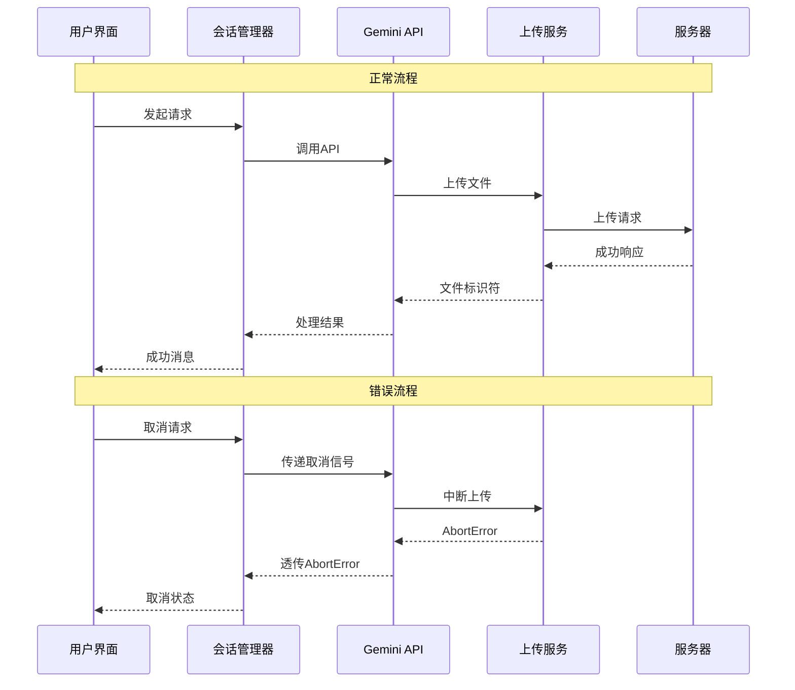
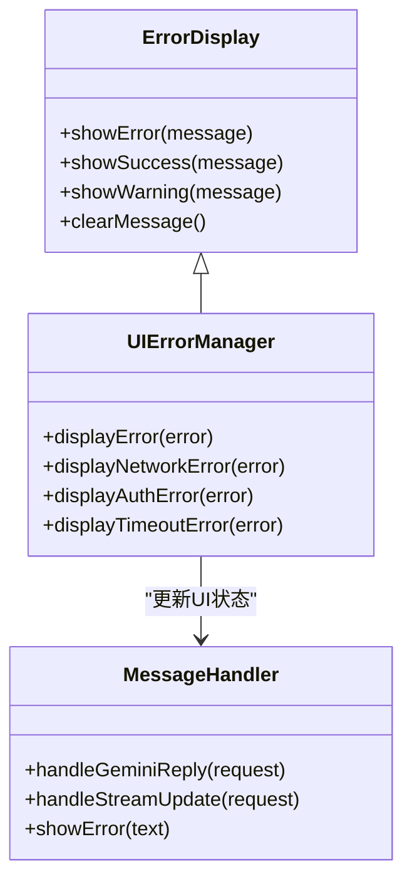

# 上传错误处理与异常传播

<cite>
**本文档引用的文件**
- [services/gemini_api.js](file://services/gemini_api.js)
- [services/upload.js](file://services/upload.js)
- [background/managers/session_manager.js](file://background/managers/session_manager.js)
- [background/controls/base.js](file://background/control/actions/base.js)
- [content/toolbar/ui/manager.js](file://content/toolbar/ui/manager.js)
- [sandbox/controllers/message_handler.js](file://sandbox/controllers/message_handler.js)
</cite>

## 目录
1. [简介](#简介)
2. [项目结构概览](#项目结构概览)
3. [核心组件分析](#核心组件分析)
4. [架构总览](#架构总览)
5. [详细组件分析](#详细组件分析)
6. [依赖关系分析](#依赖关系分析)
7. [性能考虑](#性能考虑)
8. [故障排除指南](#故障排除指南)
9. [结论](#结论)

## 简介

本文档深入分析了 Gemini Nexus 扩展程序中文件上传过程的错误处理机制，重点关注以下关键方面：

- `sendGeminiMessage` 函数中对 `AbortError` 的透传处理策略
- `uploadFile` 函数对 HTTP 响应状态码的检查逻辑
- 网络失败和服务器错误的处理方式
- 实际调试建议和前端错误展示最佳实践

该系统通过精心设计的错误传播机制，确保用户可以优雅地取消操作，同时为各种异常情况提供清晰的反馈。

## 项目结构概览

Gemini Nexus 采用模块化架构，文件上传功能分布在多个层次中：

**图表来源**
- [services/gemini_api.js](file://services/gemini_api.js#L26-L230)
- [services/upload.js](file://services/upload.js#L7-L39)
- [background/managers/session_manager.js](file://background/managers/session_manager.js#L1-L200)

**章节来源**
- [services/gemini_api.js](file://services/gemini_api.js#L1-L230)
- [services/upload.js](file://services/upload.js#L1-L40)
- [background/managers/session_manager.js](file://background/managers/session_manager.js#L1-L200)

## 核心组件分析

### 错误处理策略概述

系统采用了分层的错误处理策略，主要特点包括：

1. **用户取消操作的特殊处理**：通过 `AbortError` 透传实现优雅的用户取消
2. **分类错误处理**：不同类型的错误采用不同的处理策略
3. **国际化错误消息**：支持中英文双语错误提示
4. **自动重试机制**：针对认证问题的智能重试

### AbortError 透传机制

系统对 `AbortError` 的特殊处理是其用户体验的关键设计：

**图表来源**
- [services/gemini_api.js](file://services/gemini_api.js#L45-L56)
- [services/upload.js](file://services/upload.js#L30-L32)

**章节来源**
- [services/gemini_api.js](file://services/gemini_api.js#L45-L56)
- [services/upload.js](file://services/upload.js#L30-L32)

## 架构总览

系统采用分层架构设计，每层都有明确的职责分工：

**图表来源**
- [background/managers/session_manager.js](file://background/managers/session_manager.js#L21-L147)
- [services/gemini_api.js](file://services/gemini_api.js#L26-L230)
- [services/upload.js](file://services/upload.js#L7-L39)

## 详细组件分析

### sendGeminiMessage 函数的错误处理

#### 文件上传阶段的异常处理

`sendGeminiMessage` 函数在文件上传阶段实现了精细的错误处理机制：

**图表来源**
- [services/gemini_api.js](file://services/gemini_api.js#L44-L56)

#### 流式响应处理的异常捕获

在流式响应处理阶段，系统同样实现了对 `AbortError` 的透传：

**图表来源**
- [services/gemini_api.js](file://services/gemini_api.js#L165-L201)

**章节来源**
- [services/gemini_api.js](file://services/gemini_api.js#L44-L56)
- [services/gemini_api.js](file://services/gemini_api.js#L165-L201)

### uploadFile 函数的状态码检查逻辑

#### HTTP 响应验证机制

`uploadFile` 函数实现了严格的 HTTP 响应状态码检查：

**图表来源**
- [services/upload.js](file://services/upload.js#L21-L39)

#### 错误分类处理

系统根据错误类型采用不同的处理策略：

| 错误类型 | 处理方式 | 示例场景 |
|---------|---------|---------|
| AbortError | 透传给调用方 | 用户主动取消上传 |
| 网络错误 | 记录日志并重新抛出 | 网络连接中断 |
| 服务器错误 | 记录状态码并重新抛出 | 500, 503等服务器错误 |
| 解析错误 | 记录错误并重新抛出 | 响应格式不正确 |

**章节来源**
- [services/upload.js](file://services/upload.js#L30-L32)

### 会话管理器的综合错误处理

#### 多层错误处理策略

会话管理器实现了多层错误处理机制：

**图表来源**
- [background/managers/session_manager.js](file://background/managers/session_manager.js#L28-L147)

**章节来源**
- [background/managers/session_manager.js](file://background/managers/session_manager.js#L149-L201)

## 依赖关系分析

### 组件间依赖关系

**图表来源**
- [services/gemini_api.js](file://services/gemini_api.js#L26-L230)
- [services/upload.js](file://services/upload.js#L7-L39)
- [background/managers/session_manager.js](file://background/managers/session_manager.js#L1-L200)

### 错误传播路径

系统实现了清晰的错误传播路径：

**图表来源**
- [background/managers/session_manager.js](file://background/managers/session_manager.js#L204-L211)
- [services/gemini_api.js](file://services/gemini_api.js#L52-L54)

**章节来源**
- [background/managers/session_manager.js](file://background/managers/session_manager.js#L204-L211)
- [services/gemini_api.js](file://services/gemini_api.js#L52-L54)

## 性能考虑

### 并发上传优化

系统采用并发上传策略来提升性能：

- **并行处理**：多个文件同时上传，减少总等待时间
- **资源复用**：共享相同的 `AbortController` 信号
- **内存管理**：及时释放上传过程中的临时资源

### 错误处理性能影响

合理的错误处理策略对性能的影响：

| 处理策略 | 性能影响 | 适用场景 |
|---------|---------|---------|
| AbortError 透传 | 几乎无额外开销 | 用户取消操作 |
| 同步错误记录 | 轻微延迟 | 非关键错误 |
| 异步错误处理 | 可忽略延迟 | 严重错误 |
| 自动重试 | 显著延迟 | 认证相关错误 |

## 故障排除指南

### 常见问题诊断

#### 上传超时问题

**症状表现**：
- 上传进度停滞
- 控制台出现网络超时错误
- 用户界面显示加载状态

**诊断步骤**：
1. 检查网络连接稳定性
2. 查看服务器响应时间
3. 验证文件大小限制
4. 检查浏览器缓存设置

**解决方案**：
- 增加超时时间配置
- 实现断点续传功能
- 提供重试机制

#### 认证失效问题

**症状表现**：
- 响应包含登录页面内容
- 出现 "未登录" 或 "Session expired" 错误
- 自动重定向到登录页面

**诊断步骤**：
1. 验证认证令牌有效性
2. 检查会话状态
3. 确认账户权限
4. 验证多账户切换逻辑

**解决方案**：
- 实现自动认证刷新
- 提供手动登录入口
- 增加重试机制

#### 网络失败问题

**症状表现**：
- 连接被拒绝
- 请求超时
- DNS 解析失败

**诊断步骤**：
1. 检查防火墙设置
2. 验证代理配置
3. 确认服务器可用性
4. 检查浏览器扩展冲突

**解决方案**：
- 实现网络状态检测
- 提供离线模式
- 增加重连机制

### 前端错误展示最佳实践

#### 用户体验优化

**错误消息设计原则**：
- **清晰易懂**：使用简单明了的语言
- **提供解决方案**：指导用户如何解决问题
- **保持一致性**：统一的错误样式和布局
- **及时反馈**：快速显示错误状态

**错误展示组件**：

**图表来源**
- [content/toolbar/ui/manager.js](file://content/toolbar/ui/manager.js#L197-L200)
- [sandbox/controllers/message_handler.js](file://sandbox/controllers/message_handler.js#L231-L280)

#### 国际化错误处理

系统支持中英文双语错误消息：

**中文错误消息示例**：
- "🔑 账号 (Index: ${currentIndex}) 未登录或会话已过期。"
- "⏳ 请求过于频繁，Gemini 暂时限制了访问。"
- "🔌 服务器无响应。"

**英文错误消息示例**：
- "🔑 Account (Index: ${currentIndex}) not logged in."
- "⏳ Too many requests. Gemini has temporarily limited access."
- "🔌 No response from server."

**章节来源**
- [background/managers/session_manager.js](file://background/managers/session_manager.js#L159-L192)
- [content/toolbar/ui/manager.js](file://content/toolbar/ui/manager.js#L197-L200)

### 调试技巧和工具

#### 开发者工具使用

**浏览器开发者工具**：
- **网络面板**：监控上传请求和响应
- **控制台**：查看错误日志和警告
- **源码面板**：调试 JavaScript 代码
- **应用面板**：检查存储的数据

**日志记录策略**：
- 关键操作添加日志标记
- 错误发生时记录完整上下文
- 性能指标监控和记录
- 用户行为追踪

#### 性能监控

**关键性能指标**：
- 上传速度和成功率
- 响应时间分布
- 内存使用情况
- CPU 占用率

**监控工具推荐**：
- Chrome DevTools Performance 面板
- Lighthouse 性能审计
- WebPageTest 在线测试
- 自定义性能计数器

## 结论

Gemini Nexus 的文件上传错误处理机制展现了现代 Web 应用的优秀实践：

### 核心优势

1. **优雅的用户取消**：通过 `AbortError` 透传实现即时响应
2. **分层错误处理**：不同层级采用最适合的处理策略
3. **国际化支持**：提供多语言错误消息
4. **健壮的恢复机制**：针对认证问题的智能重试

### 设计亮点

- **信号驱动的取消机制**：确保用户操作的实时响应
- **状态码严格验证**：防止错误响应被误认为成功
- **错误分类处理**：为不同类型错误提供专门的处理逻辑
- **UI 状态同步**：确保前端界面与后台状态一致

### 改进建议

1. **增强错误分类**：区分网络超时和服务器错误
2. **实现断点续传**：支持大文件的中断恢复
3. **增加重试策略**：为临时性错误提供自动重试
4. **优化错误展示**：提供更丰富的错误信息和解决方案

该系统的错误处理机制为构建可靠的 Web 应用提供了优秀的参考模板，特别是在处理异步操作和用户交互方面展现了卓越的设计理念。