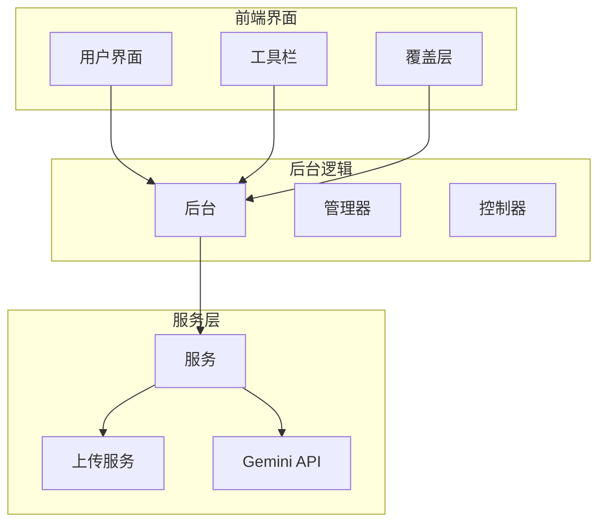
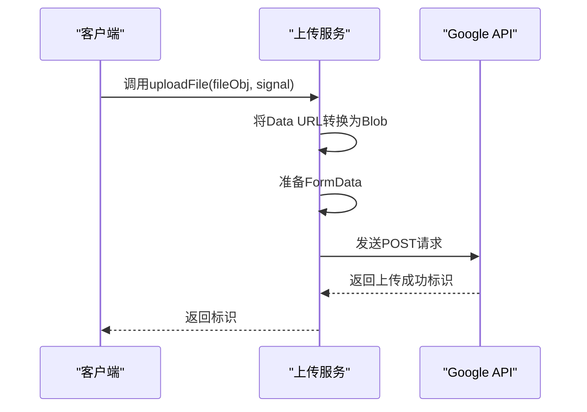
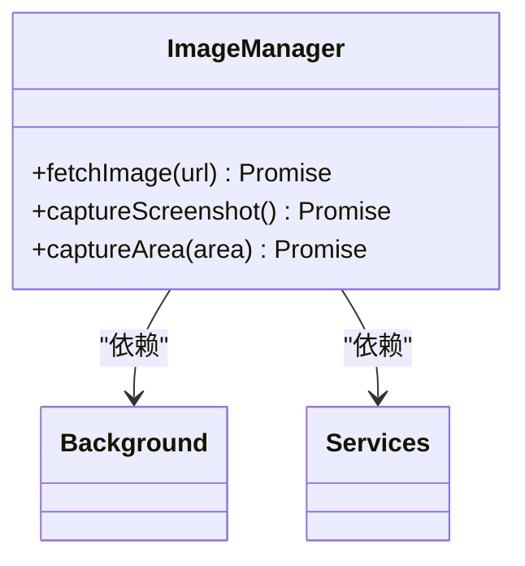
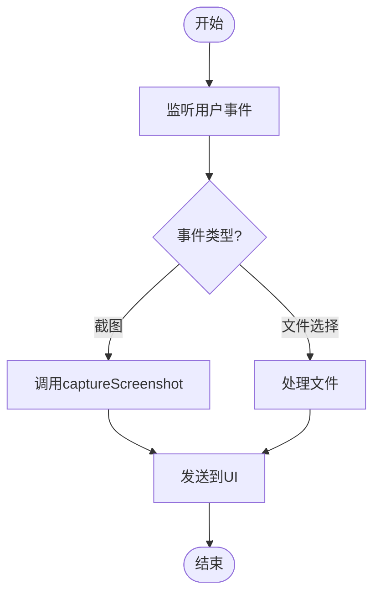
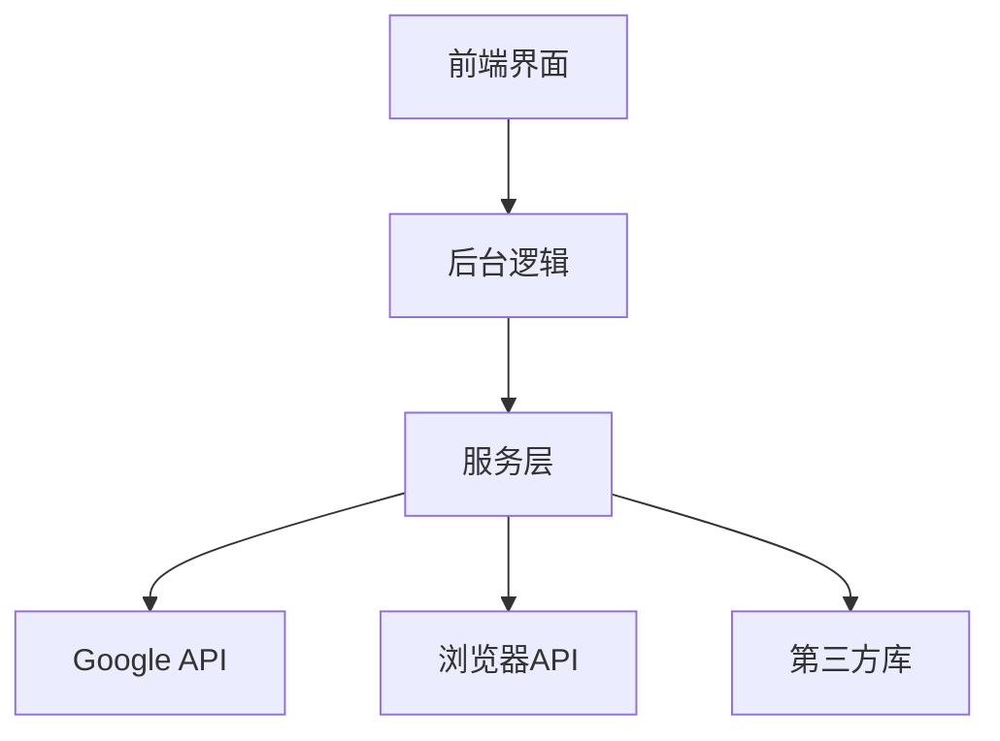

# 多模态文件使用场景与性能优化

<cite>
**本文档引用的文件**
- [upload.js](file://services/upload.js)
- [gemini_api.js](file://services/gemini_api.js)
- [image_manager.js](file://sandbox/core/image_manager.js)
- [image_manager.js](file://background/managers/image_manager.js)
- [overlay.js](file://content/overlay.js)
- [controller.js](file://content/toolbar/controller.js)
</cite>

## 目录
1. [简介](#简介)
2. [项目结构](#项目结构)
3. [核心组件](#核心组件)
4. [架构概述](#架构概述)
5. [详细组件分析](#详细组件分析)
6. [依赖分析](#依赖分析)
7. [性能考虑](#性能考虑)
8. [故障排除指南](#故障排除指南)
9. [结论](#结论)

## 简介
本文档详细说明了在实际应用场景中（如上传截图进行视觉分析、文档内容理解）files参数的使用方法。描述了前端如何从用户交互（如截图工具、文件选择器）获取文件并构造符合要求的File对象数组。重点指出了大文件上传可能引发的性能问题，包括上传耗时、内存占用和请求超时风险。提出了优化建议，如前端预压缩图片、限制文件大小、提供上传进度反馈等，以提升用户体验和系统稳定性。

## 项目结构
该项目是一个浏览器扩展，主要功能是通过截图和文件上传与Gemini AI服务进行交互。项目结构清晰，分为多个模块：

- **background**: 包含控制、处理程序、库和管理器，负责后台逻辑和与浏览器API的交互。
- **content**: 包含工具栏、索引、覆盖层和选择，负责内容脚本和用户界面。
- **css**: 包含样式表，定义了应用的外观。
- **lib**: 包含常量、工具函数和日志记录，提供通用功能。
- **sandbox**: 包含引导、控制器、核心、库、渲染和UI，负责沙箱环境中的核心逻辑。
- **services**: 包含认证、Gemini API、解析器和上传，负责与外部服务的通信。
- **sidepanel**: 包含侧边栏的HTML和JavaScript，提供侧边栏界面。

**Diagram sources**
- [content/toolbar/controller.js](file://content/toolbar/controller.js)
- [background/managers/image_manager.js](file://background/managers/image_manager.js)
- [services/upload.js](file://services/upload.js)

**Section sources**
- [content/toolbar/controller.js](file://content/toolbar/controller.js)
- [background/managers/image_manager.js](file://background/managers/image_manager.js)
- [services/upload.js](file://services/upload.js)

## 核心组件
核心组件包括文件上传服务、图像管理器和用户界面控制器。这些组件协同工作，确保用户能够顺利上传文件并与AI服务进行交互。

**Section sources**
- [services/upload.js](file://services/upload.js)
- [sandbox/core/image_manager.js](file://sandbox/core/image_manager.js)
- [background/managers/image_manager.js](file://background/managers/image_manager.js)

## 架构概述
系统架构分为三层：前端界面、后台逻辑和服务层。前端界面负责用户交互，后台逻辑处理业务逻辑，服务层与外部API通信。

**Diagram sources**
- [content/toolbar/controller.js](file://content/toolbar/controller.js)
- [background/managers/image_manager.js](file://background/managers/image_manager.js)
- [services/upload.js](file://services/upload.js)

## 详细组件分析
### 文件上传服务分析
文件上传服务负责将文件上传到Google的内容推送服务。它使用标准的multipart/form-data格式，确保与Gemini Web API的Python实现对齐。

#### 文件上传流程

**Diagram sources**
- [services/upload.js](file://services/upload.js)

#### 图像管理器分析
图像管理器负责处理图像的获取和管理。它可以从URL或Data URI获取图像，并支持截图功能。

**Diagram sources**
- [background/managers/image_manager.js](file://background/managers/image_manager.js)

### 用户界面控制器分析
用户界面控制器负责处理用户交互，如截图和文件选择。它通过事件监听器捕获用户操作，并调用相应的服务。

**Diagram sources**
- [content/toolbar/controller.js](file://content/toolbar/controller.js)

**Section sources**
- [content/toolbar/controller.js](file://content/toolbar/controller.js)
- [background/managers/image_manager.js](file://background/managers/image_manager.js)
- [services/upload.js](file://services/upload.js)

## 依赖分析
系统依赖于多个外部服务和库，包括Google API、浏览器API和第三方库。这些依赖关系确保了系统的功能完整性和性能。

**Diagram sources**
- [services/gemini_api.js](file://services/gemini_api.js)
- [background/managers/image_manager.js](file://background/managers/image_manager.js)

**Section sources**
- [services/gemini_api.js](file://services/gemini_api.js)
- [background/managers/image_manager.js](file://background/managers/image_manager.js)

## 性能考虑
大文件上传可能引发性能问题，包括上传耗时、内存占用和请求超时风险。为了优化性能，建议采取以下措施：

- **前端预压缩图片**：在上传前对图片进行压缩，减少文件大小。
- **限制文件大小**：设置文件大小上限，防止过大的文件上传。
- **提供上传进度反馈**：向用户显示上传进度，提升用户体验。

**Section sources**
- [services/upload.js](file://services/upload.js)
- [sandbox/core/image_manager.js](file://sandbox/core/image_manager.js)

## 故障排除指南
常见问题包括上传失败、截图不完整和文件格式不支持。解决这些问题的方法包括检查网络连接、确保文件格式正确和重新启动扩展。

**Section sources**
- [services/upload.js](file://services/upload.js)
- [background/managers/image_manager.js](file://background/managers/image_manager.js)

## 结论
本文档详细介绍了多模态文件使用场景与性能优化。通过合理的架构设计和优化措施，可以有效提升用户体验和系统稳定性。