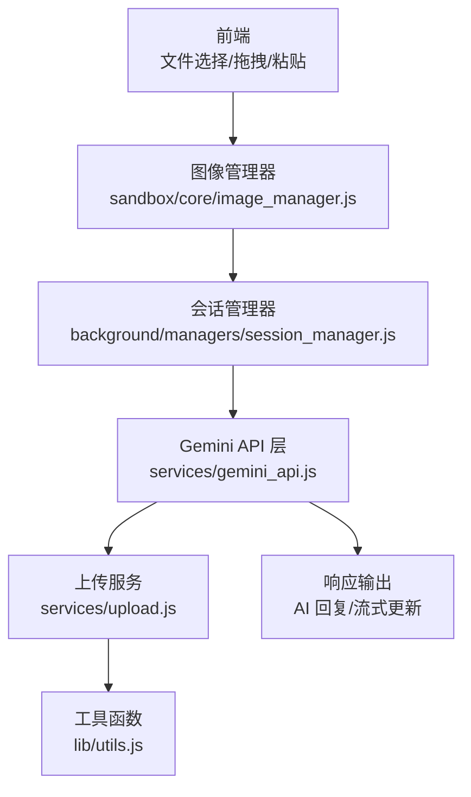
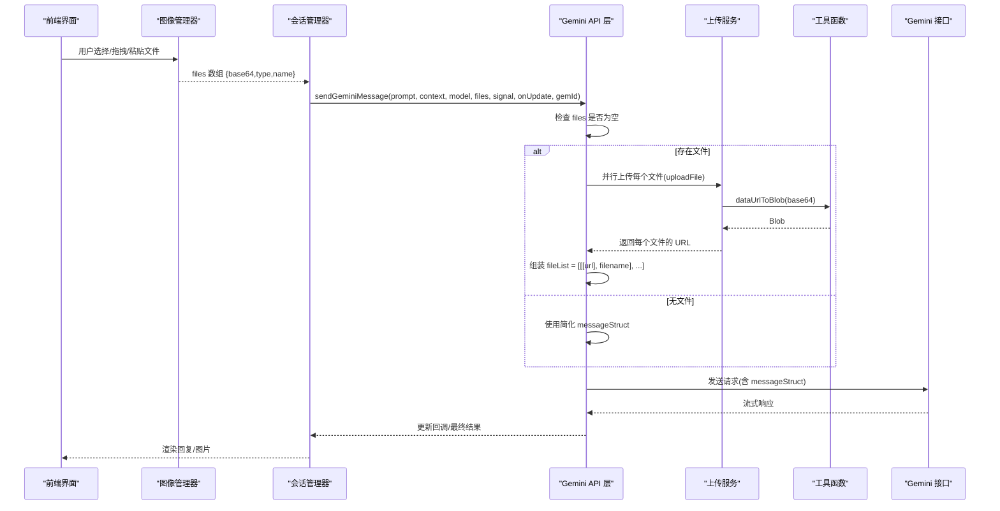
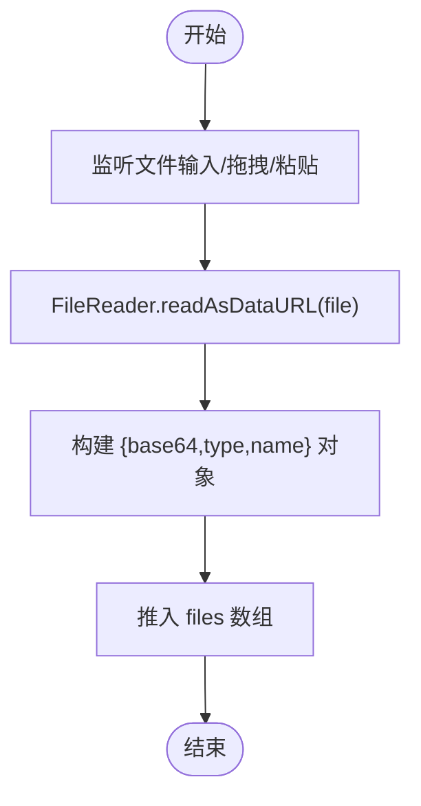
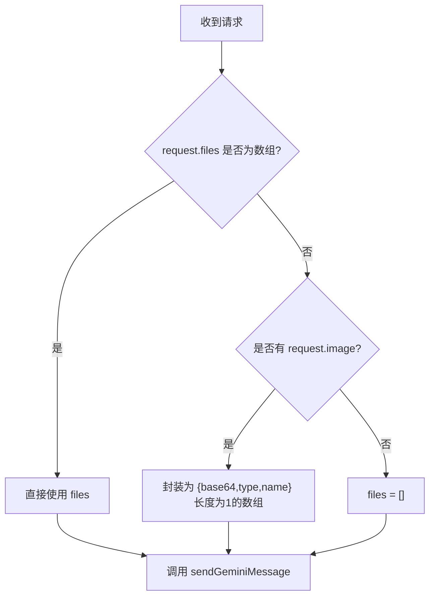
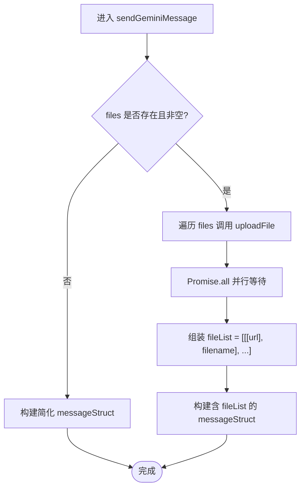
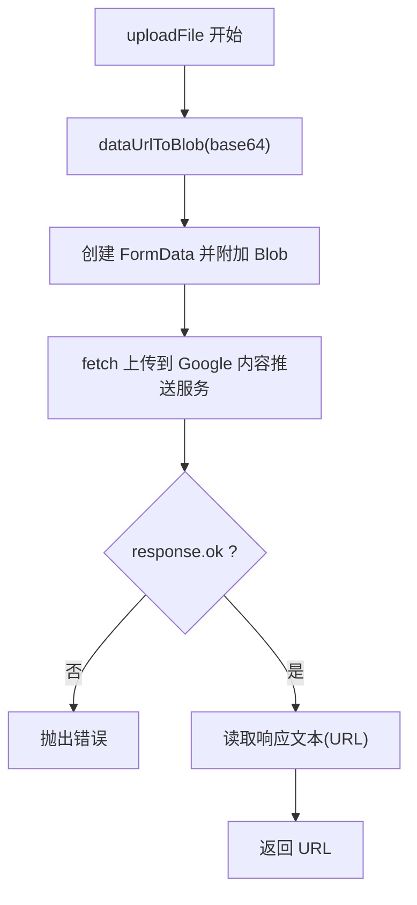
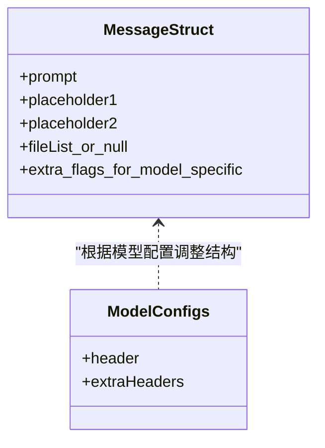

# 多模态文件列表 (files)

<cite>
**本文引用的文件**
- [services/gemini_api.js](file://services/gemini_api.js)
- [services/upload.js](file://services/upload.js)
- [lib/utils.js](file://lib/utils.js)
- [background/managers/session_manager.js](file://background/managers/session_manager.js)
- [sandbox/core/image_manager.js](file://sandbox/core/image_manager.js)
- [background/control/actions/input/file.js](file://background/control/actions/input/file.js)
</cite>

## 目录
1. [简介](#简介)
2. [项目结构与角色定位](#项目结构与角色定位)
3. [核心组件与职责](#核心组件与职责)
4. [架构总览](#架构总览)
5. [详细组件分析](#详细组件分析)
6. [依赖关系分析](#依赖关系分析)
7. [性能考量与超时问题](#性能考量与超时问题)
8. [故障排查指南](#故障排查指南)
9. [结论](#结论)

## 简介
本文件系统性地文档化了多模态消息中 files 参数的处理流程，重点覆盖以下内容：
- files 作为 File 对象数组的输入形式与前端准备方式
- 在 sendGeminiMessage 函数中，通过 uploadFile 并行上传并将结果转换为 fileList 结构 [[url], filename]
- fileList 的嵌套数组格式及其在构建 messageStruct 时的应用（当存在文件时，messageStruct 包含 fileList 作为第四项）
- 上传失败时的错误处理机制（AbortError 透传，其他错误捕获并抛出）
- 实际使用场景（如上传图片进行分析）与前端准备要点
- 大文件上传的性能考虑与可能的超时问题

## 项目结构与角色定位
- 前端负责收集用户选择的文件，将其转换为包含 base64、类型与名称的对象数组，供会话管理器传递给后端服务。
- 后端服务层负责将文件上传至 Google 的内容推送服务，并将返回的 URL 组装为 fileList，随后注入到消息结构体中发送给 Gemini 接口。
- 工具模块提供数据 URL 到 Blob 的转换能力，确保上传前的数据格式正确。

图表来源
- [sandbox/core/image_manager.js](file://sandbox/core/image_manager.js#L195-L281)
- [background/managers/session_manager.js](file://background/managers/session_manager.js#L31-L74)
- [services/gemini_api.js](file://services/gemini_api.js#L26-L112)
- [services/upload.js](file://services/upload.js#L7-L39)
- [lib/utils.js](file://lib/utils.js#L20-L34)

章节来源
- [sandbox/core/image_manager.js](file://sandbox/core/image_manager.js#L195-L281)
- [background/managers/session_manager.js](file://background/managers/session_manager.js#L31-L74)
- [services/gemini_api.js](file://services/gemini_api.js#L26-L112)
- [services/upload.js](file://services/upload.js#L7-L39)
- [lib/utils.js](file://lib/utils.js#L20-L34)

## 核心组件与职责
- 文件准备与预处理
  - 前端图像管理器负责监听文件选择、拖拽、粘贴等事件，读取 File 对象并通过 FileReader 转换为 base64 字符串，形成 {base64, type, name} 的数组。
- 会话管理器
  - 将前端传入的 files 或单张图片封装为统一的 files 数组，调用 sendGeminiMessage 发送请求。
- Gemini API 层
  - 负责认证上下文准备、并行上传文件、构造消息结构体（含 fileList）、发送请求并处理流式响应。
- 上传服务
  - 将 base64 转换为 Blob，使用标准 multipart/form-data 上传至 Google 内容推送服务，返回可引用的 URL。
- 工具函数
  - 提供 dataUrlToBlob，安全地从 data URL 中提取 MIME 类型与二进制数据，生成 Blob。

章节来源
- [sandbox/core/image_manager.js](file://sandbox/core/image_manager.js#L195-L281)
- [background/managers/session_manager.js](file://background/managers/session_manager.js#L31-L74)
- [services/gemini_api.js](file://services/gemini_api.js#L26-L112)
- [services/upload.js](file://services/upload.js#L7-L39)
- [lib/utils.js](file://lib/utils.js#L20-L34)

## 架构总览
下图展示了从文件选择到消息发送的完整链路，包括并行上传与 fileList 结构的组装。

图表来源
- [sandbox/core/image_manager.js](file://sandbox/core/image_manager.js#L195-L281)
- [background/managers/session_manager.js](file://background/managers/session_manager.js#L31-L74)
- [services/gemini_api.js](file://services/gemini_api.js#L26-L112)
- [services/upload.js](file://services/upload.js#L7-L39)
- [lib/utils.js](file://lib/utils.js#L20-L34)

## 详细组件分析

### 文件输入与前端准备
- 前端通过图像管理器监听文件输入、拖拽与粘贴事件，将 File 对象逐个读取为 base64，并保存为 {base64, type, name} 的数组。
- 该数组随后被会话管理器接收并传入 sendGeminiMessage。

图表来源
- [sandbox/core/image_manager.js](file://sandbox/core/image_manager.js#L195-L281)

章节来源
- [sandbox/core/image_manager.js](file://sandbox/core/image_manager.js#L195-L281)

### 会话管理器中的 files 统一
- 会话管理器支持两种输入：直接传入 files 数组，或传入单张图片（image/base64）。
- 若传入 image，则自动封装为长度为 1 的 files 数组，保证后续流程一致。

图表来源
- [background/managers/session_manager.js](file://background/managers/session_manager.js#L31-L41)

章节来源
- [background/managers/session_manager.js](file://background/managers/session_manager.js#L31-L41)

### sendGeminiMessage 中的文件上传与 fileList 组装
- 当 files 非空时，sendGeminiMessage 会并行调用 uploadFile，每个 Promise 成功后将返回的 URL 与原文件名组合为 [[url], filename]，最终汇总为 fileList。
- fileList 的嵌套数组格式为：[[[url], filename], [[url], filename], ...]。
- 构建 messageStruct 时，若存在 fileList，则第四项为 fileList；否则使用简化结构。

图表来源
- [services/gemini_api.js](file://services/gemini_api.js#L41-L90)

章节来源
- [services/gemini_api.js](file://services/gemini_api.js#L41-L90)

### uploadFile 的实现与错误处理
- uploadFile 将每个 {base64, type, name} 转换为 Blob，使用 FormData 以标准 multipart/form-data 形式上传至 Google 的内容推送服务。
- 成功时返回服务器分配的 URL；失败时抛出错误。
- sendGeminiMessage 对上传阶段的错误做了特殊处理：AbortError 透传，其他错误被捕获并重新抛出。

图表来源
- [services/upload.js](file://services/upload.js#L7-L39)
- [lib/utils.js](file://lib/utils.js#L20-L34)

章节来源
- [services/upload.js](file://services/upload.js#L7-L39)
- [lib/utils.js](file://lib/utils.js#L20-L34)

### messageStruct 的构建与模型差异
- 当存在 fileList 时，messageStruct 为 [prompt, 0, null, fileList]。
- 对于特定模型（如 gemini-3.0-pro），会采用更丰富的结构并在末尾附加标志位以允许富响应。
- 无文件时，使用简化结构 [prompt] 或针对特定模型的扩展结构。

图表来源
- [services/gemini_api.js](file://services/gemini_api.js#L58-L89)

章节来源
- [services/gemini_api.js](file://services/gemini_api.js#L58-L89)

### 后台文件操作（DOM 文件输入）
- 后台控制层还提供了 attachFile 方法，用于向指定元素注入本地路径数组，这与前端 files 的概念不同，属于后台自动化场景下的文件输入。

章节来源
- [background/control/actions/input/file.js](file://background/control/actions/input/file.js#L7-L29)

## 依赖关系分析
- sendGeminiMessage 依赖 uploadFile 完成文件上传，uploadFile 依赖 dataUrlToBlob 将 base64 转为 Blob。
- 会话管理器负责将前端 files 传递给 sendGeminiMessage，并处理中断信号（AbortController）。
- 前端图像管理器负责将 File 对象转换为 base64，形成 files 数组。

图表来源
- [sandbox/core/image_manager.js](file://sandbox/core/image_manager.js#L195-L281)
- [background/managers/session_manager.js](file://background/managers/session_manager.js#L31-L74)
- [services/gemini_api.js](file://services/gemini_api.js#L26-L112)
- [services/upload.js](file://services/upload.js#L7-L39)
- [lib/utils.js](file://lib/utils.js#L20-L34)

章节来源
- [sandbox/core/image_manager.js](file://sandbox/core/image_manager.js#L195-L281)
- [background/managers/session_manager.js](file://background/managers/session_manager.js#L31-L74)
- [services/gemini_api.js](file://services/gemini_api.js#L26-L112)
- [services/upload.js](file://services/upload.js#L7-L39)
- [lib/utils.js](file://lib/utils.js#L20-L34)

## 性能考量与超时问题
- 并行上传策略
  - sendGeminiMessage 对 files 进行 Promise.all 并行上传，可显著提升多文件场景下的整体吞吐，但也会增加网络与服务器压力。
- 大文件上传
  - 大文件上传会占用较多带宽与时间，建议：
    - 控制单次上传文件数量与大小，必要时分批发送。
    - 使用 AbortController 提前取消长时间无响应的请求。
    - 注意 Gemini 接口的速率限制与会话状态，避免触发“请求过于频繁”等错误。
- 超时与中断
  - 通过 AbortController 提供的 signal 可在 UI 层触发中断，sendGeminiMessage 会透传 AbortError，避免后续处理。
  - 上传阶段同样使用 signal，确保在用户取消时及时释放资源。

章节来源
- [services/gemini_api.js](file://services/gemini_api.js#L46-L56)
- [background/managers/session_manager.js](file://background/managers/session_manager.js#L204-L211)

## 故障排查指南
- 上传失败
  - 现象：上传阶段抛出错误。
  - 处理：sendGeminiMessage 对非 AbortError 的错误进行捕获并抛出，便于上层统一处理。
  - 建议：检查网络、Google 内容推送服务可达性、文件大小与类型是否受支持。
- 中断请求
  - 现象：用户点击取消按钮。
  - 处理：会话管理器调用 abortCurrentRequest，sendGeminiMessage 透传 AbortError，避免继续处理。
- 会话过期/未登录
  - 现象：首次读取流时检测到登录状态异常。
  - 处理：抛出明确错误，提示用户前往登录页面。
- 服务器无响应/解析失败
  - 现象：空响应或无法解析响应。
  - 处理：根据响应内容抛出相应错误，建议刷新 Gemini 页面后重试。

章节来源
- [services/gemini_api.js](file://services/gemini_api.js#L154-L220)
- [background/managers/session_manager.js](file://background/managers/session_manager.js#L149-L202)

## 结论
- files 参数在本项目中以 File 对象数组的形式由前端准备，经会话管理器统一封装后传入 sendGeminiMessage。
- sendGeminiMessage 通过 uploadFile 并行上传文件，将返回的 URL 与原文件名组合为 [[url], filename] 的嵌套数组，最终注入 messageStruct 的第四项，实现多模态消息的构建。
- 错误处理遵循“AbortError 透传、其他错误捕获并抛出”的策略，确保中断与异常的可控性。
- 前端在准备 files 时应关注文件大小与数量，合理使用并行上传与中断机制，以获得更好的性能与用户体验。