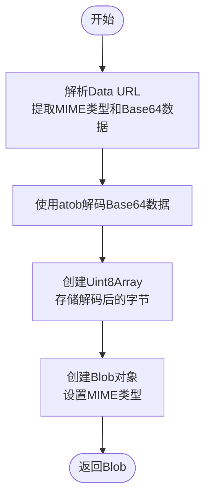
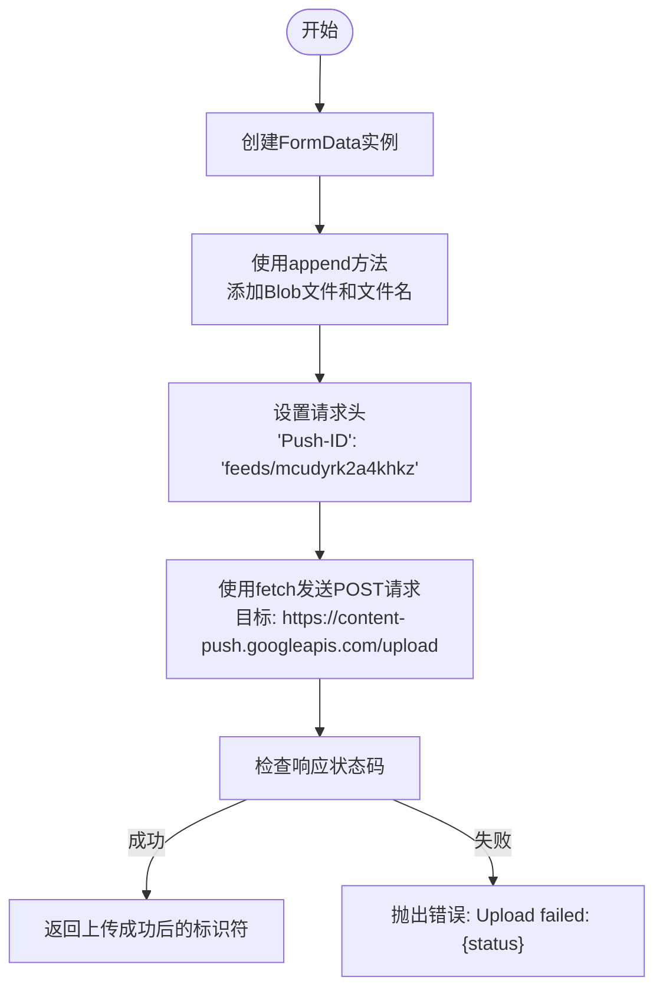
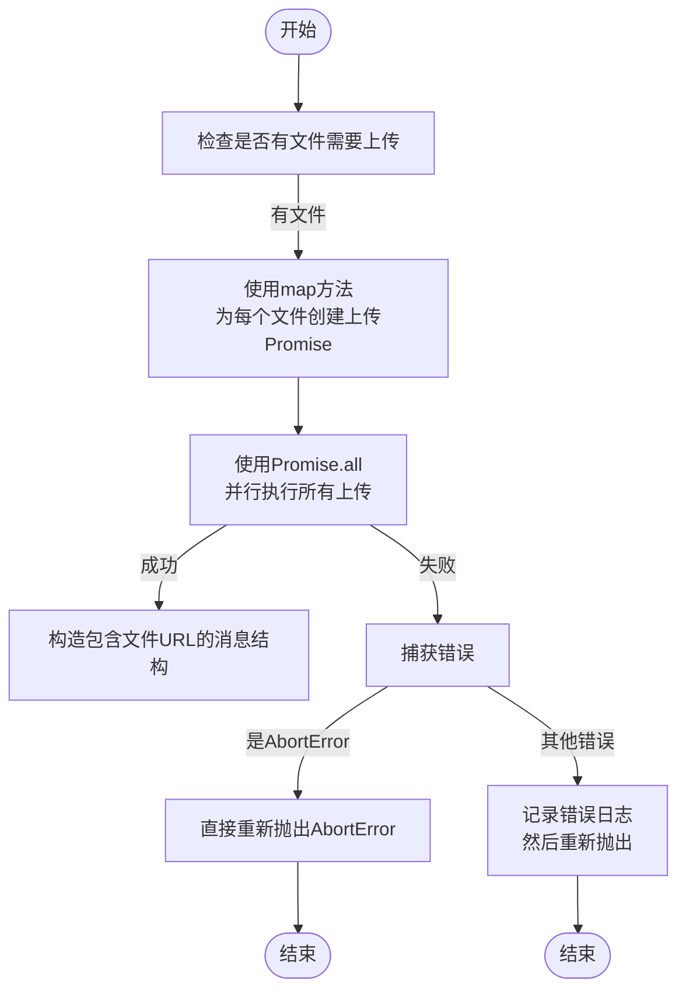

# 文件上传处理流程

<cite>
**本文档引用的文件**
- [upload.js](file://services/upload.js)
- [utils.js](file://lib/utils.js)
- [gemini_api.js](file://services/gemini_api.js)
- [image_manager.js](file://background/managers/image_manager.js)
- [tool_executor.js](file://background/handlers/session/prompt/tool_executor.js)
</cite>

## 目录
1. [核心上传函数实现](#核心上传函数实现)
2. [Base64到Blob的转换机制](#base64到blob的转换机制)
3. [上传请求的构造与发送](#上传请求的构造与发送)
4. [上传端点与请求头](#上传端点与请求头)
5. [上传成功响应处理](#上传成功响应处理)
6. [上传失败状态码处理](#上传失败状态码处理)
7. [并行上传与错误透传](#并行上传与错误透传)

## 核心上传函数实现

`uploadFile` 函数是文件上传的核心实现，负责将前端提供的文件数据转换为Blob对象，并通过FormData构造上传请求。该函数位于 `services/upload.js` 文件中，其主要职责是与Google的content-push服务进行交互，确保文件能够正确上传并返回唯一标识符。

**Section sources**
- [upload.js](file://services/upload.js#L7-L39)

## Base64到Blob的转换机制

在上传文件之前，需要将Base64格式的文件数据转换为Blob对象。这一过程由 `lib/utils.js` 文件中的 `dataUrlToBlob` 函数完成。该函数首先解析Base64字符串，提取MIME类型和实际数据部分，然后使用 `atob` 函数解码Base64数据，最后创建一个包含解码后字节的Uint8Array，并将其封装成Blob对象。

**Diagram sources**
- [utils.js](file://lib/utils.js#L20-L31)

**Section sources**
- [utils.js](file://lib/utils.js#L20-L33)
- [upload.js](file://services/upload.js#L11)

## 上传请求的构造与发送

上传请求的构造分为两个主要步骤：准备FormData和执行上传。首先，创建一个FormData实例，并使用 `append` 方法添加文件数据。文件数据以Blob形式附加，键名为 'file'，文件名则从原始文件对象中获取。随后，使用 `fetch` API向指定的上传端点发送POST请求，请求体为FormData实例，同时设置必要的请求头。

**Diagram sources**
- [upload.js](file://services/upload.js#L14-L28)

**Section sources**
- [upload.js](file://services/upload.js#L14-L28)

## 上传端点与请求头

文件上传的目标端点为 `https://content-push.googleapis.com/upload`，这是一个标准的multipart/form-data上传接口。为了确保请求被正确处理，必须在请求头中包含 `Push-ID` 字段，其值固定为 `feeds/mcudyrk2a4khkz`。这个特定的请求头是与Google的content-push服务通信所必需的，用于标识上传请求的来源和目的。

**Section sources**
- [upload.js](file://services/upload.js#L21-L26)

## 上传成功响应处理

当上传请求成功时，服务器会返回一个文本响应，该响应包含了上传文件的唯一标识符。此标识符通常以 `/contrib_service/ttl_1d/...` 的格式呈现，表示文件在服务器上的存储路径和有效期。`uploadFile` 函数通过调用 `response.text()` 方法获取这一标识符，并将其作为函数的返回值传递给调用者。

**Section sources**
- [upload.js](file://services/upload.js#L34-L38)

## 上传失败状态码处理

如果上传请求未能成功，`uploadFile` 函数会检查响应的 `ok` 属性。若该属性为 `false`，则说明请求失败，函数将抛出一个包含状态码的错误。这种错误处理机制确保了调用者能够及时获知上传失败的原因，并采取相应的措施。

**Section sources**
- [upload.js](file://services/upload.js#L30-L32)

## 并行上传与错误透传

在 `sendGeminiMessage` 函数中，当存在多个文件需要上传时，会使用 `Promise.all` 和 `map` 方法实现并行上传。每个文件的上传都被包装在一个Promise中，所有这些Promise被收集到一个数组中，然后通过 `Promise.all` 同时执行。对于上传过程中可能出现的错误，特别是 `AbortError`，函数采取了特殊的处理策略：直接将 `AbortError` 抛出，而不进行捕获，以确保中断信号能够正确传递。而对于其他类型的错误，则会在控制台记录错误信息后重新抛出，以便上层逻辑能够处理。

**Diagram sources**
- [gemini_api.js](file://services/gemini_api.js#L46-L55)

**Section sources**
- [gemini_api.js](file://services/gemini_api.js#L46-L55)
- [upload.js](file://services/upload.js#L7-L39)