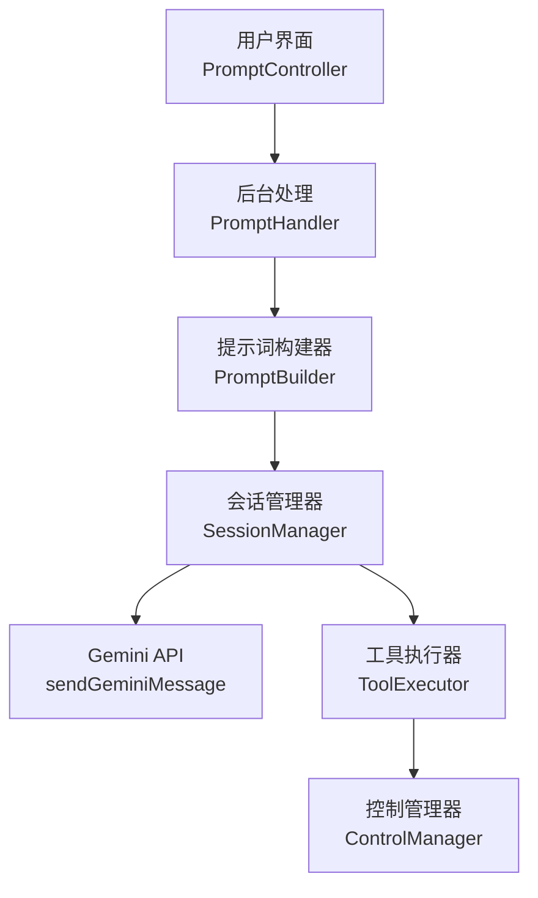
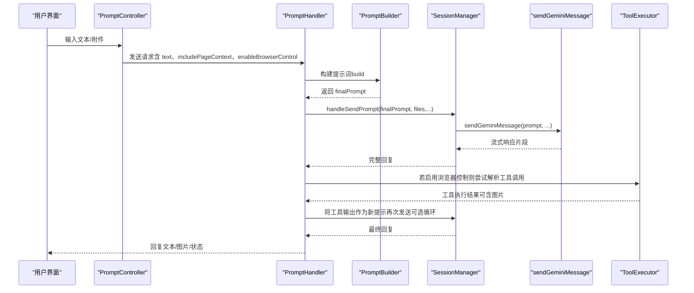
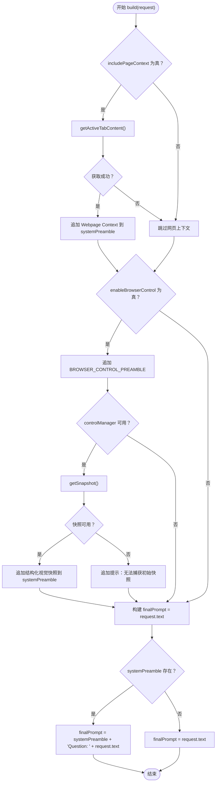
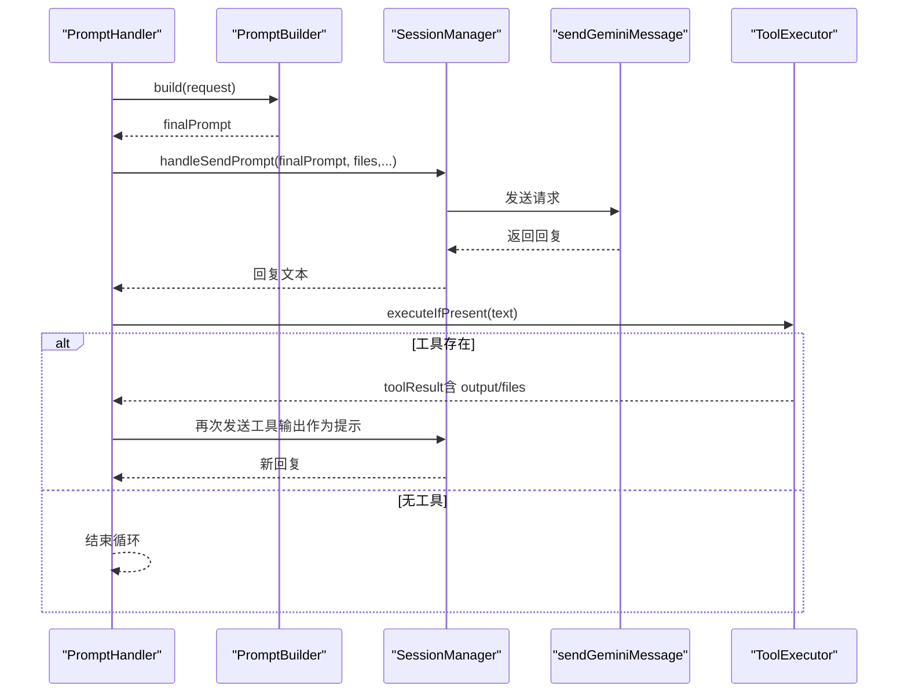
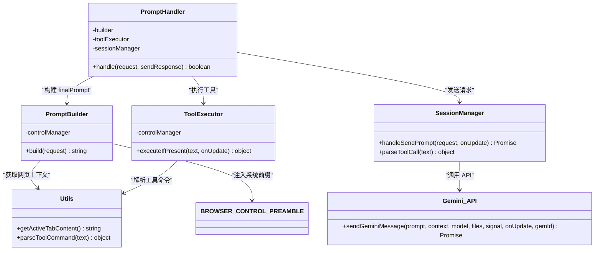

# 提示文本 (prompt)

<cite>
**本文引用的文件**
- [builder.js](file://background/handlers/session/prompt/builder.js)
- [preamble.js](file://background/handlers/session/prompt/preamble.js)
- [prompt_handler.js](file://background/handlers/session/prompt_handler.js)
- [utils.js](file://background/handlers/session/utils.js)
- [tool_executor.js](file://background/handlers/session/prompt/tool_executor.js)
- [session_manager.js](file://background/managers/session_manager.js)
- [gemini_api.js](file://services/gemini_api.js)
- [prompt.js](file://sandbox/controllers/prompt.js)
</cite>

## 目录
1. [简介](#简介)
2. [项目结构](#项目结构)
3. [核心组件](#核心组件)
4. [架构总览](#架构总览)
5. [详细组件分析](#详细组件分析)
6. [依赖关系分析](#依赖关系分析)
7. [性能考量](#性能考量)
8. [故障排查指南](#故障排查指南)
9. [结论](#结论)

## 简介
本节聚焦于 sendGeminiMessage 函数中的 prompt 参数，说明其作为用户查询或指令的核心输入作用，以及在系统中如何被构建、拼接与传递。我们将结合 PromptBuilder 类，解释系统前缀（system preamble）、网页上下文（Webpage Context）与浏览器控制指令前缀（BROWSER_CONTROL_PREAMBLE）的注入逻辑；并给出 finalPrompt 的构造流程图与常见问题及优化建议。

## 项目结构
围绕 prompt 的关键路径如下：
- 前端入口：用户在沙盒侧输入文本，经由 PromptController 组装请求载荷（包含 text、includePageContext、enableBrowserControl 等），发送至后台。
- 后台处理：PromptHandler 接收请求，委托 PromptBuilder 构建最终提示词（finalPrompt），随后通过 SessionManager 调用 sendGeminiMessage 发送至 Gemini API。
- 提示词构建：PromptBuilder 根据请求标志位决定是否注入网页上下文与浏览器控制前缀，并在启用浏览器控制时附加结构化视觉快照（Accessibility Tree）。
- 工具执行：若模型返回工具调用，ToolExecutor 解析并交由 ControlManager 执行，再将结果反馈给模型进行迭代。

图表来源
- [prompt.js](file://sandbox/controllers/prompt.js#L89-L103)
- [prompt_handler.js](file://background/handlers/session/prompt_handler.js#L13-L101)
- [builder.js](file://background/handlers/session/prompt/builder.js#L10-L43)
- [session_manager.js](file://background/managers/session_manager.js#L21-L202)
- [gemini_api.js](file://services/gemini_api.js#L26-L230)
- [tool_executor.js](file://background/handlers/session/prompt/tool_executor.js#L9-L47)

章节来源
- [prompt.js](file://sandbox/controllers/prompt.js#L15-L103)
- [prompt_handler.js](file://background/handlers/session/prompt_handler.js#L13-L101)

## 核心组件
- PromptBuilder：负责根据请求标志位拼接系统前缀、网页上下文与结构化视觉快照，最终形成 finalPrompt。
- BROWSER_CONTROL_PREAMBLE：浏览器控制模式下的系统前缀，定义可用工具与输出格式。
- PromptHandler：协调构建、发送、工具执行与循环反馈。
- SessionManager：封装 sendGeminiMessage 的调用细节，处理多账户轮换、MCP 注入与工具调用解析。
- ToolExecutor：从模型回复中提取工具调用并执行，支持图片输出回传。
- utils.getActiveTabContent：安全地获取当前活动页文本内容，用于网页上下文注入。

章节来源
- [builder.js](file://background/handlers/session/prompt/builder.js#L5-L43)
- [preamble.js](file://background/handlers/session/prompt/preamble.js#L4-L108)
- [prompt_handler.js](file://background/handlers/session/prompt_handler.js#L6-L101)
- [session_manager.js](file://background/managers/session_manager.js#L6-L202)
- [tool_executor.js](file://background/handlers/session/prompt/tool_executor.js#L4-L47)
- [utils.js](file://background/handlers/session/utils.js#L23-L63)

## 架构总览
下图展示了从用户输入到最终模型回复的完整链路，重点标注了 prompt 的构建与传递过程。

图表来源
- [prompt.js](file://sandbox/controllers/prompt.js#L35-L103)
- [prompt_handler.js](file://background/handlers/session/prompt_handler.js#L13-L101)
- [builder.js](file://background/handlers/session/prompt/builder.js#L10-L43)
- [session_manager.js](file://background/managers/session_manager.js#L21-L202)
- [gemini_api.js](file://services/gemini_api.js#L26-L230)
- [tool_executor.js](file://background/handlers/session/prompt/tool_executor.js#L9-L47)

## 详细组件分析

### PromptBuilder：系统前缀、网页上下文与结构化快照的拼接
- 系统前缀（system preamble）：当启用浏览器控制时，注入 BROWSER_CONTROL_PREAMBLE，明确工具集、输出格式与交互规则。
- 网页上下文（Webpage Context）：当 includePageContext 为真时，通过 getActiveTabContent 获取当前页面文本并注入到提示词中，避免受限页面（如扩展页、商店页）。
- 结构化视觉快照（Accessibility Tree）：当 enableBrowserControl 为真且存在 controlManager 时，尝试抓取快照并以“结构化视觉”形式附加到提示词末尾；若无法捕获则提示用户手动操作。
- finalPrompt 的构造：若存在系统前缀，则在用户原始文本前添加“Question: ”前缀，形成最终提示词。

图表来源
- [builder.js](file://background/handlers/session/prompt/builder.js#L10-L43)
- [preamble.js](file://background/handlers/session/prompt/preamble.js#L4-L108)
- [utils.js](file://background/handlers/session/utils.js#L23-L63)

章节来源
- [builder.js](file://background/handlers/session/prompt/builder.js#L10-L43)
- [preamble.js](file://background/handlers/session/prompt/preamble.js#L4-L108)
- [utils.js](file://background/handlers/session/utils.js#L23-L63)

### PromptHandler：循环反馈与工具执行
- 构建初始提示词后，调用 SessionManager.handleSendPrompt 发送请求。
- 若启用浏览器控制，解析模型回复中的工具调用，执行后将工具输出作为新的“User”消息注入历史，并以固定格式的文本作为下一轮提示词再次发送（最多循环 N 次）。
- 该机制确保模型在工具执行后能获得可观测的反馈，从而推进复杂任务的完成。

图表来源
- [prompt_handler.js](file://background/handlers/session/prompt_handler.js#L13-L101)
- [tool_executor.js](file://background/handlers/session/prompt/tool_executor.js#L9-L47)
- [session_manager.js](file://background/managers/session_manager.js#L21-L202)
- [gemini_api.js](file://services/gemini_api.js#L26-L230)

章节来源
- [prompt_handler.js](file://background/handlers/session/prompt_handler.js#L13-L101)
- [tool_executor.js](file://background/handlers/session/prompt/tool_executor.js#L9-L47)

### SessionManager：MCP 注入与工具调用解析
- 在启用 MCP 的场景下，将 MCP 系统提示与用户查询合并为最终文本，再调用 sendGeminiMessage。
- 对模型回复进行工具调用解析，若存在则通过 MCP 管理器执行工具，并将结果作为新提示再次发送，形成一次性的“简单 1 轮”闭环。

章节来源
- [session_manager.js](file://background/managers/session_manager.js#L54-L114)

### sendGeminiMessage：prompt 参数的承载与传输
- sendGeminiMessage 接收 prompt 作为首个参数，按不同模型配置构造消息体结构，随后通过流式接口接收并解析响应。
- 当存在文件附件时，会先上传并嵌入到消息体中；对于特定模型（如 3.0 Pro），消息体结构略有差异。
- 该函数直接消费由 PromptBuilder 与 SessionManager 组合后的 finalPrompt，不进行二次拼接。

章节来源
- [gemini_api.js](file://services/gemini_api.js#L26-L230)

## 依赖关系分析
- PromptBuilder 依赖：
  - utils.getActiveTabContent：用于网页上下文注入。
  - BROWSER_CONTROL_PREAMBLE：浏览器控制模式下的系统前缀。
  - controlManager：用于获取结构化视觉快照。
- PromptHandler 依赖：
  - PromptBuilder：构建 finalPrompt。
  - ToolExecutor：解析并执行工具调用。
  - SessionManager：统一发送与上下文管理。
- SessionManager 依赖：
  - sendGeminiMessage：底层 API 调用。
  - MCP 管理器：可选的外部系统提示注入与工具执行。
- ToolExecutor 依赖：
  - utils.parseToolCommand：从模型回复中提取工具调用。

图表来源
- [builder.js](file://background/handlers/session/prompt/builder.js#L5-L43)
- [preamble.js](file://background/handlers/session/prompt/preamble.js#L4-L108)
- [prompt_handler.js](file://background/handlers/session/prompt_handler.js#L6-L11)
- [tool_executor.js](file://background/handlers/session/prompt/tool_executor.js#L4-L7)
- [session_manager.js](file://background/managers/session_manager.js#L6-L11)
- [gemini_api.js](file://services/gemini_api.js#L26-L230)
- [utils.js](file://background/handlers/session/utils.js#L4-L21)

章节来源
- [builder.js](file://background/handlers/session/prompt/builder.js#L5-L43)
- [prompt_handler.js](file://background/handlers/session/prompt_handler.js#L6-L11)
- [tool_executor.js](file://background/handlers/session/prompt/tool_executor.js#L4-L7)
- [session_manager.js](file://background/managers/session_manager.js#L6-L11)
- [gemini_api.js](file://services/gemini_api.js#L26-L230)
- [utils.js](file://background/handlers/session/utils.js#L4-L21)

## 性能考量
- 网页上下文获取策略：优先通过内容脚本通信，失败时采用脚本注入回退，避免阻塞主线程。
- 快照捕获：在浏览器控制模式下自动注入结构化视觉快照，有助于减少重复描述与提升交互准确性，但需注意快照体积可能较大。
- 循环反馈：PromptHandler 中设置最大循环次数，防止无限循环导致资源耗尽。
- 文件上传：多模态场景下并发上传文件，缩短整体延迟。

章节来源
- [utils.js](file://background/handlers/session/utils.js#L41-L58)
- [prompt_handler.js](file://background/handlers/session/prompt_handler.js#L29-L30)

## 故障排查指南
- 提示词过长导致截断
  - 现象：模型返回“请求过于频繁”或“响应解析失败”，可能因提示词超长。
  - 建议：精简用户查询，移除冗余信息；必要时拆分任务或减少网页上下文长度。
- 特殊字符处理
  - 现象：模型回复中出现 JSON 不匹配或工具调用解析失败。
  - 建议：确保模型输出严格遵循系统前缀约定的 JSON 格式；必要时在前端对输入进行转义或清洗。
- 快照不可用
  - 现象：系统提示“无法捕获初始快照”，导致浏览器控制能力受限。
  - 建议：导航到目标页面后再发起请求，或手动触发快照采集；检查页面是否处于加载中。
- 权限与受限页面
  - 现象：网页上下文为空。
  - 建议：确认当前标签页非受限 URL（如扩展页、商店页）；必要时切换到目标页面。
- 工具执行失败
  - 现象：工具返回错误信息。
  - 建议：检查工具参数合法性与页面状态；查看日志与网络请求以定位问题。

章节来源
- [builder.js](file://background/handlers/session/prompt/builder.js#L23-L35)
- [utils.js](file://background/handlers/session/utils.js#L28-L39)
- [prompt_handler.js](file://background/handlers/session/prompt_handler.js#L64-L86)
- [tool_executor.js](file://background/handlers/session/prompt/tool_executor.js#L38-L40)

## 结论
sendGeminiMessage 的 prompt 参数承载了用户查询与系统前缀、网页上下文、结构化视觉快照等全部上下文信息。PromptBuilder 通过条件拼接与注入，确保模型在浏览器控制模式下具备足够的结构化信息与工具能力；PromptHandler 则通过循环反馈与工具执行，将“思考—行动—观测”的范式落地为可执行的自动化流程。合理规划提示词长度、规范工具调用格式与页面状态，是获得稳定、高效体验的关键。