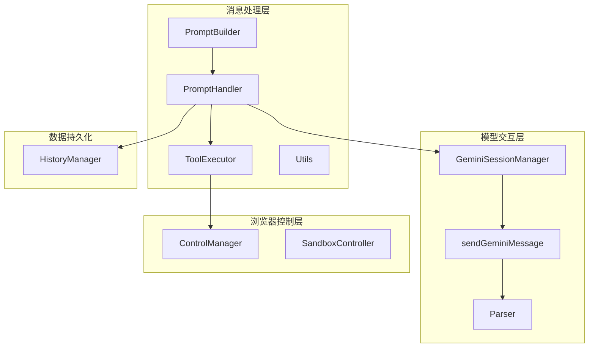
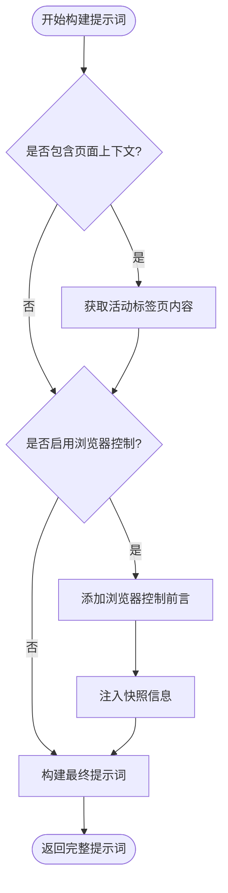
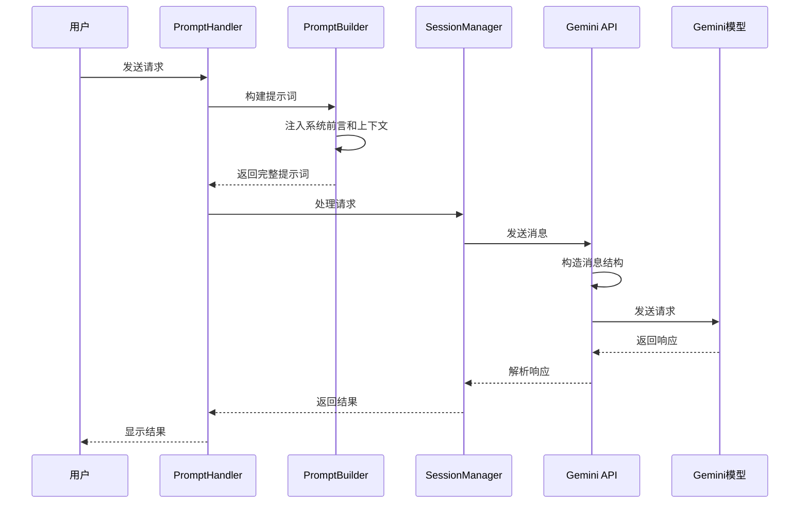
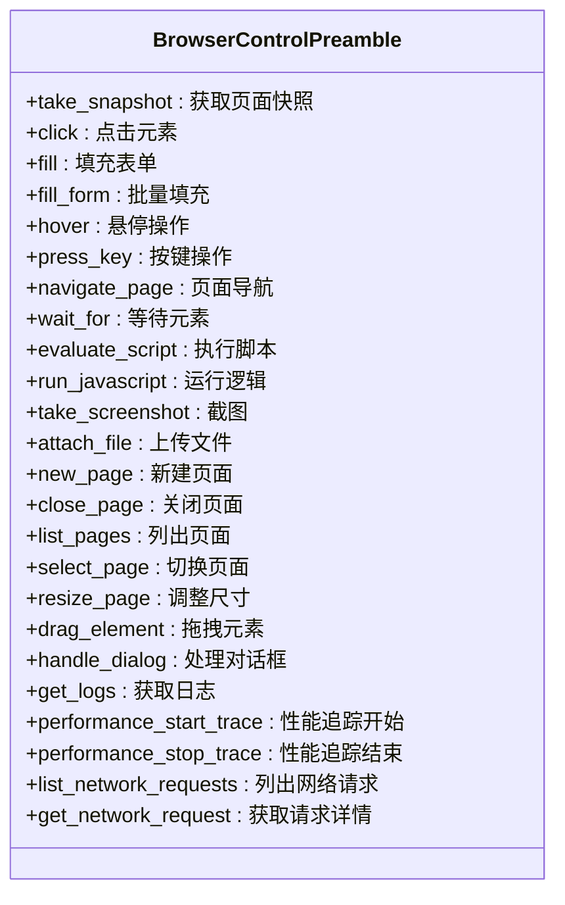
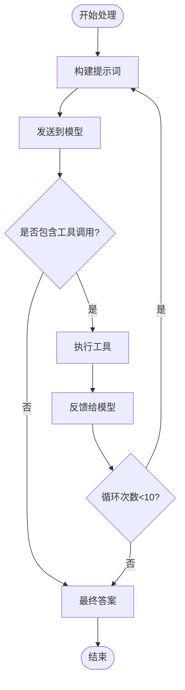
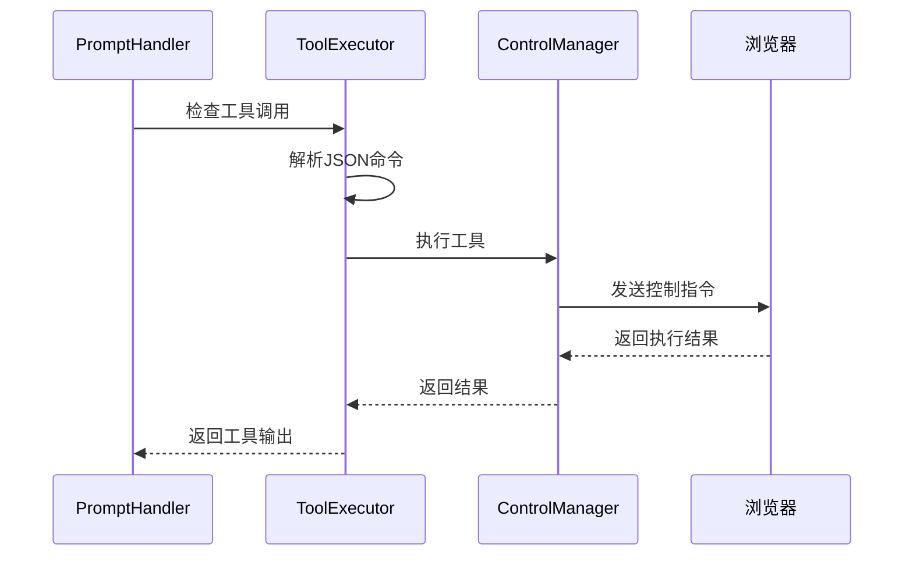
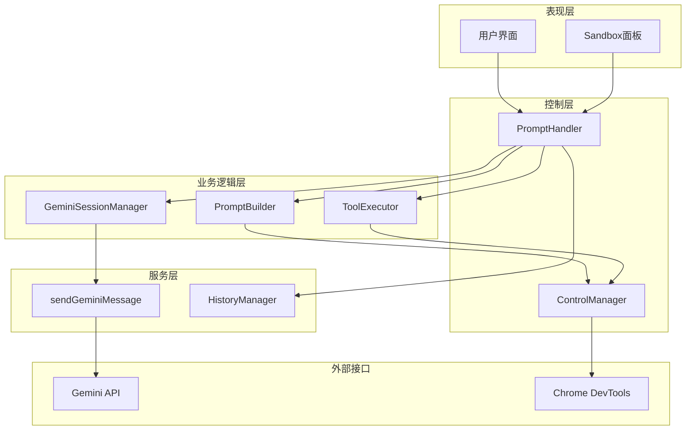

# 不同模型的消息结构差异

<cite>
**本文档引用的文件**
- [builder.js](file://background/handlers/session/prompt/builder.js)
- [preamble.js](file://background/handlers/session/prompt/preamble.js)
- [prompt_handler.js](file://background/handlers/session/prompt_handler.js)
- [gemini_api.js](file://services/gemini_api.js)
- [session_manager.js](file://background/managers/session_manager.js)
- [utils.js](file://background/handlers/session/utils.js)
- [tool_executor.js](file://background/handlers/session/prompt/tool_executor.js)
- [history_manager.js](file://background/managers/history_manager.js)
</cite>

## 目录
1. [引言](#引言)
2. [项目结构概览](#项目结构概览)
3. [核心组件分析](#核心组件分析)
4. [架构总览](#架构总览)
5. [详细组件分析](#详细组件分析)
6. [依赖关系分析](#依赖关系分析)
7. [性能考量](#性能考量)
8. [故障排除指南](#故障排除指南)
9. [结论](#结论)

## 引言
本文件深入分析了gemini-3.0-pro模型与其他模型在消息结构构造上的关键差异，重点解释了为什么使用gemini-3.0-pro时需要构建包含7个元素的复杂结构`[prompt, 0, null, null, null, null, 1]`，特别是末尾数字1在协议层面的意义（通常表示启用富媒体响应）。同时对比了标准模型使用简单`[prompt]`结构的场景，并结合PromptBuilder类中系统前言（systemPreamble）的注入逻辑，说明复杂消息结构如何支持上下文感知和浏览器控制指令的传递。

## 项目结构概览
该项目采用模块化架构，围绕消息处理、模型交互和浏览器控制三个核心维度组织代码：



**图表来源**
- [builder.js](file://background/handlers/session/prompt/builder.js#L5-L44)
- [prompt_handler.js](file://background/handlers/session/prompt_handler.js#L6-L101)
- [gemini_api.js](file://services/gemini_api.js#L26-L230)

**章节来源**
- [builder.js](file://background/handlers/session/prompt/builder.js#L1-L45)
- [prompt_handler.js](file://background/handlers/session/prompt_handler.js#L1-L103)

## 核心组件分析
本节详细分析消息结构差异的核心实现，包括PromptBuilder的系统前言注入、消息结构构造逻辑以及浏览器控制功能集成。

### PromptBuilder系统前言注入机制
PromptBuilder类负责构建包含系统前言的完整提示词，其核心逻辑如下：



**图表来源**
- [builder.js](file://background/handlers/session/prompt/builder.js#L10-L43)

该机制通过以下步骤实现：
1. **页面上下文检测**：当`request.includePageContext`为真时，自动获取当前活动标签页的内容
2. **浏览器控制前言注入**：当`request.enableBrowserControl`为真时，添加完整的浏览器控制指令集
3. **快照信息注入**：通过ControlManager获取页面可访问性树，提供结构化视觉信息
4. **最终提示词构建**：将系统前言与用户查询组合形成最终提示词

**章节来源**
- [builder.js](file://background/handlers/session/prompt/builder.js#L10-L43)
- [preamble.js](file://background/handlers/session/prompt/preamble.js#L4-L108)

### 消息结构构造差异
消息结构的差异主要体现在`sendGeminiMessage`函数中的条件判断逻辑：

```mermaid
flowchart TD
Start([开始消息结构构造]) --> HasFiles{"是否有文件?"}
HasFiles --> |是| StandardStruct[标准结构:<br/>[prompt, 0, null, fileList]]
HasFiles --> |否| IsGemini3Pro{"是否为gemini-3.0-pro?"}
IsGemini3Pro --> |是| RichStruct[富媒体结构:<br/>[prompt, 0, null, null, null, null, 1]]
IsGemini3Pro --> |否| SimpleStruct[简单结构:<br/>[prompt]]
StandardStruct --> End([完成])
RichStruct --> End
SimpleStruct --> End
```

**图表来源**
- [gemini_api.js](file://services/gemini_api.js#L63-L89)

**章节来源**
- [gemini_api.js](file://services/gemini_api.js#L63-L89)

## 架构总览
整个消息处理流程从用户输入到模型响应的完整链路：



**图表来源**
- [prompt_handler.js](file://background/handlers/session/prompt_handler.js#L13-L101)
- [gemini_api.js](file://services/gemini_api.js#L26-L230)

## 详细组件分析

### Gemini API消息结构构造
`sendGeminiMessage`函数实现了三种不同的消息结构：

#### 标准模型结构（简单模式）
对于非gemini-3.0-pro模型，使用最简化的消息结构：
- `[prompt]` - 基础提示词
- 适用于不需要富媒体响应的场景

#### 富媒体模型结构（gemini-3.0-pro专用）
对于gemini-3.0-pro模型，使用增强的消息结构：
- `[prompt, 0, null, null, null, null, 1]`
- 包含7个元素的复杂结构
- 最后一个元素`1`表示启用富媒体响应能力

#### 文件上传模型结构
当存在文件上传时，使用标准的多模态结构：
- `[prompt, 0, null, fileList]`
- 支持文本和图像的混合输入

**章节来源**
- [gemini_api.js](file://services/gemini_api.js#L63-L116)

### 浏览器控制指令集成
浏览器控制功能通过系统前言注入实现，完整的控制指令集包括24种工具：



**图表来源**
- [preamble.js](file://background/handlers/session/prompt/preamble.js#L21-L108)

**章节来源**
- [preamble.js](file://background/handlers/session/prompt/preamble.js#L4-L108)

### 自动化反馈循环机制
PromptHandler实现了智能的自动化反馈循环，支持工具执行和上下文维护：



**图表来源**
- [prompt_handler.js](file://background/handlers/session/prompt_handler.js#L33-L87)

**章节来源**
- [prompt_handler.js](file://background/handlers/session/prompt_handler.js#L13-L101)

### 工具执行器工作流程
ToolExecutor负责解析和执行模型返回的工具调用：



**图表来源**
- [tool_executor.js](file://background/handlers/session/prompt/tool_executor.js#L9-L47)

**章节来源**
- [tool_executor.js](file://background/handlers/session/prompt/tool_executor.js#L1-L49)

## 依赖关系分析
各组件之间的依赖关系体现了清晰的分层架构：



**图表来源**
- [prompt_handler.js](file://background/handlers/session/prompt_handler.js#L6-L11)
- [session_manager.js](file://background/managers/session_manager.js#L6-L11)

**章节来源**
- [prompt_handler.js](file://background/handlers/session/prompt_handler.js#L1-L103)
- [session_manager.js](file://background/managers/session_manager.js#L1-L285)

## 性能考量
消息结构差异对性能的影响主要体现在以下几个方面：

### 结构复杂度影响
- **简单结构**：仅包含基础提示词，序列化开销最小
- **富媒体结构**：包含7个元素，额外的null占位符增加序列化时间
- **文件上传结构**：需要处理文件列表，增加I/O开销

### 上下文感知成本
系统前言注入增加了提示词长度，但提供了更好的上下文理解能力：
- 页面上下文：约200-500字符
- 浏览器控制前言：约2000+字符
- 快照信息：动态变化，最大可达数KB

### 缓存策略
建议在以下场景使用缓存：
- 静态系统前言可以缓存
- 页面上下文可以定期更新
- 快照信息需要实时获取

## 故障排除指南
常见问题及解决方案：

### 模型选择错误
**问题**：使用错误的模型配置导致消息结构不匹配
**解决方案**：确保gemini-3.0-pro模型使用富媒体结构，其他模型使用简单结构

### 浏览器控制失败
**问题**：工具执行失败或页面无响应
**解决方案**：
1. 检查目标页面URL是否受限制
2. 确认Chrome DevTools连接正常
3. 验证元素UID的有效性

### 上下文丢失
**问题**：多次调用后上下文状态异常
**解决方案**：
1. 确保每次响应都更新contextIds
2. 检查历史记录保存机制
3. 验证会话管理器的状态同步

**章节来源**
- [gemini_api.js](file://services/gemini_api.js#L154-L219)
- [session_manager.js](file://background/managers/session_manager.js#L129-L147)

## 结论
gemini-3.0-pro模型与其他模型在消息结构上的关键差异主要体现在富媒体响应能力的支持上。通过7元素的复杂结构，特别是末尾的数字1，模型能够处理更丰富的响应格式，包括多模态内容和复杂的交互指令。这种设计使得系统能够在保持向后兼容性的同时，为高级用户提供更强大的功能。

PromptBuilder的系统前言注入机制进一步增强了系统的上下文感知能力，通过浏览器控制指令集实现了对网页的智能操作。自动化反馈循环机制确保了复杂任务的可靠执行，而历史管理机制则保证了用户体验的连续性。

这些设计决策体现了系统架构的前瞻性和实用性，既满足了当前的功能需求，又为未来的扩展奠定了坚实的基础。