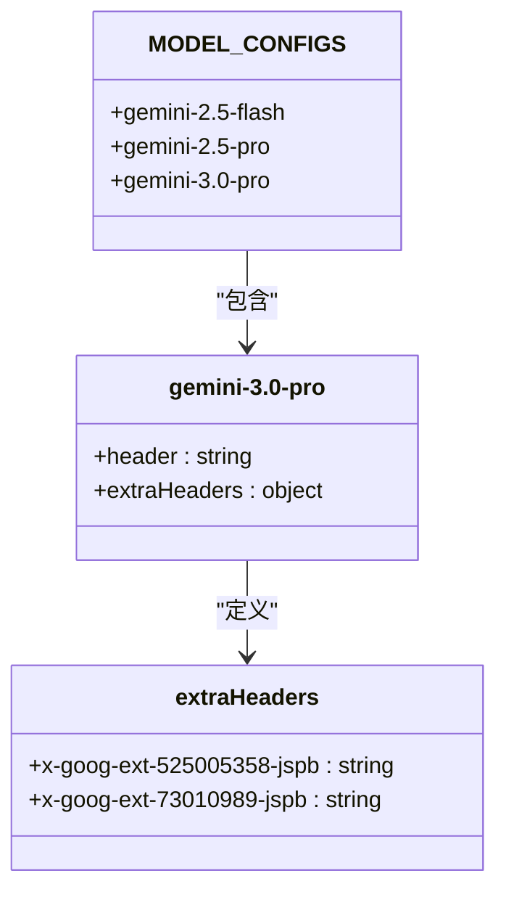
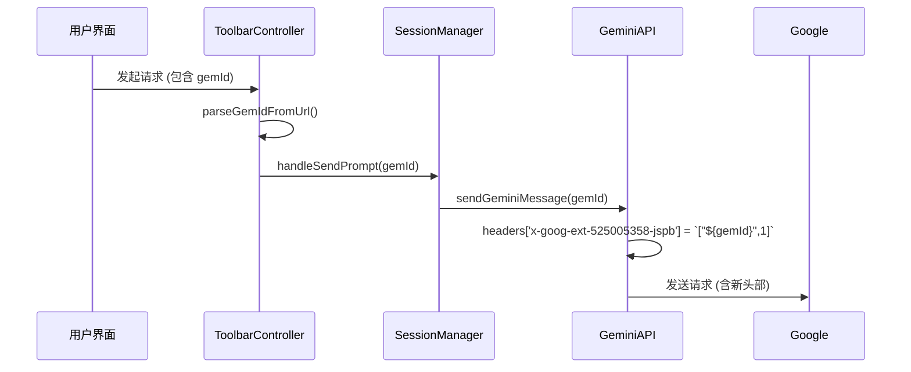
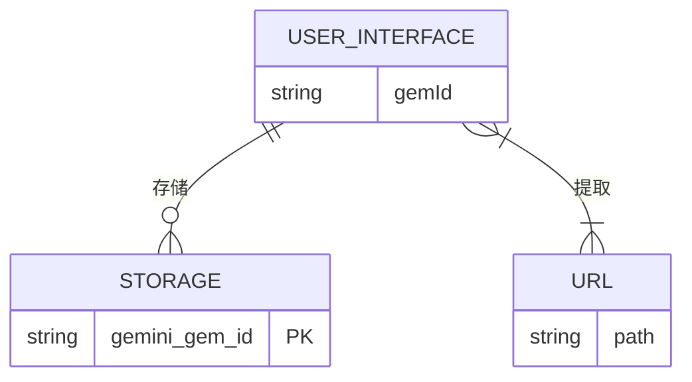

# 扩展头部与功能增强

<cite>
**本文档引用的文件**  
- [gemini_api.js](file://services/gemini_api.js)
- [session_manager.js](file://background/managers/session_manager.js)
- [auth_manager.js](file://background/managers/auth_manager.js)
- [messaging.js](file://lib/messaging.js)
- [prompt.js](file://sandbox/controllers/prompt.js)
- [controller.js](file://content/toolbar/controller.js)
</cite>

## 目录
1. [引言](#引言)  
2. [扩展头部配置分析](#扩展头部配置分析)  
3. [x-goog-ext-525005358-jspb 头部详解](#x-goog-ext-525005358-jspb-头部详解)  
4. [x-goog-ext-73010989-jspb 头部解析](#x-goog-ext-73010989-jspb-头部解析)  
5. [GemId 参数与功能注入机制](#gemid-参数与功能注入机制)  
6. [协同工作机制](#协同工作机制)  
7. [结论](#结论)

## 引言
本文件深入解析 `gemini-3.0-pro` 模型特有的 `extraHeaders` 配置机制，重点分析 `x-goog-ext-525005358-jspb` 和 `x-goog-ext-73010989-jspb` 两个扩展头部的作用。通过代码级分析，揭示这些头部如何与 `gemId` 参数协同工作，实现功能模块激活、个性化响应和功能注入。文档基于 `gemini-nexus` 项目的实际实现，确保技术细节的准确性和实用性。

## 扩展头部配置分析
在 `gemini-3.0-pro` 模型的配置中，`extraHeaders` 是一个关键属性，用于定义模型特有的请求头。这些头部并非标准 HTTP 头部，而是 Google 内部用于控制模型行为的扩展字段。



**图示来源**  
- [gemini_api.js](file://services/gemini_api.js#L7-L23)

**本节来源**  
- [gemini_api.js](file://services/gemini_api.js#L7-L23)

## x-goog-ext-525005358-jspb 头部详解
`x-goog-ext-525005358-jspb` 头部是 `gemini-3.0-pro` 模型功能激活的核心机制。其值为一个 JSON 数组，包含两个元素：一个 GUID 格式的 ID 和一个标志位。

### 静态配置
在 `gemini-3.0-pro` 的默认配置中，该头部被设置为：
```json
["FE27D76F-C4BB-4ACC-AF79-E6DE3BA30712",1]
```
其中，`FE27D76F-C4BB-4ACC-AF79-E6DE3BA30712` 是一个固定的 GUID，可能代表一个全局功能模块或服务的标识符，而 `1` 是一个激活标志位。

### 动态注入
该头部的真正威力在于其动态性。当用户通过 `gemId` 参数指定一个特定的 Gem 时，系统会动态覆盖此头部的值。



**图示来源**  
- [gemini_api.js](file://services/gemini_api.js#L135-L137)
- [controller.js](file://content/toolbar/controller.js#L224-L228)

**本节来源**  
- [gemini_api.js](file://services/gemini_api.js#L135-L137)
- [controller.js](file://content/toolbar/controller.js#L224-L228)

### 功能分析
1.  **功能模块激活**：标志位 `1` 明确指示服务器激活与该 ID 关联的功能模块。
2.  **个性化路由**：GUID 或 `gemId` 被用作一个路由键，将请求定向到特定的后端服务或处理逻辑，从而实现个性化的响应。
3.  **上下文注入**：通过将 `gemId` 注入此头部，实现了将用户意图（通过 Gem 表达）与模型推理过程的深度绑定。

## x-goog-ext-73010989-jspb 头部解析
`x-goog-ext-73010989-jspb` 头部的配置相对简单，其值固定为 `[0]`。

### 潜在含义
根据其命名和值，可以推断出以下几种可能性：
1.  **功能开关**：`[0]` 可能表示关闭某个特定的实验性功能或优化路径。`1` 可能代表开启。
2.  **版本标识**：它可能是一个版本号或协议版本标识，`0` 代表 `gemini-3.0-pro` 模型所使用的特定通信协议版本。
3.  **占位符或兼容性字段**：也可能是为了保持与其他模型头部结构兼容而存在的占位符。

### 代码实现
该头部在 `MODEL_CONFIGS` 中被静态定义，没有动态修改的逻辑，表明其作用是模型级别的固定配置。

```mermaid
flowchart TD
A[请求发起] --> B{模型为 gemini-3.0-pro?}
B --> |是| C[添加 x-goog-ext-73010989-jspb: [0]]
B --> |否| D[不添加此头部]
C --> E[发送请求]
D --> E
```

**图示来源**  
- [gemini_api.js](file://services/gemini_api.js#L20-L22)

**本节来源**  
- [gemini_api.js](file://services/gemini_api.js#L20-L22)

## GemId 参数与功能注入机制
`gemId` 参数是整个功能注入流程的用户入口。它允许用户通过 URL 或设置指定一个特定的 Gem，从而触发定制化的 AI 体验。

### 参数传递链
`gemId` 的传递贯穿了整个应用的多个层级：
1.  **用户界面层**：`ToolbarController` 通过 `parseGemIdFromUrl()` 从当前页面 URL 中提取 `gemId`。
2.  **业务逻辑层**：`SessionManager` 在 `handleSendPrompt` 方法中接收 `gemId` 并将其传递给 `sendGeminiMessage`。
3.  **服务层**：`sendGeminiMessage` 函数最终将 `gemId` 用于构建 `x-goog-ext-525005358-jspb` 头部。

### 存储与管理
`gemId` 不仅能从 URL 动态获取，还可以通过设置进行持久化存储。



**图示来源**  
- [messaging.js](file://lib/messaging.js#L90-L95)
- [controller.js](file://content/toolbar/controller.js#L68-L74)

**本节来源**  
- [messaging.js](file://lib/messaging.js#L90-L95)
- [controller.js](file://content/toolbar/controller.js#L68-L74)

## 协同工作机制
`extraHeaders`、`gemId` 和模型选择共同构成了一个强大的功能增强体系。

### 工作流程
1.  **模型选择**：用户选择 `gemini-3.0-pro` 模型，这决定了基础的 `header` 和 `extraHeaders`。
2.  **GemId 获取**：系统从当前页面 URL 或本地存储中获取 `gemId`。
3.  **头部动态构建**：`sendGeminiMessage` 函数根据是否存在 `gemId`，决定是使用默认的 GUID 还是用户的 `gemId` 来构建 `x-goog-ext-525005358-jspb` 头部。
4.  **请求发送**：包含特定扩展头部的请求被发送到 Google 服务器。
5.  **后端处理**：服务器根据这些头部信息，激活相应的功能模块，并生成个性化的响应。

### 关键代码点
-   **模型配置**：`services/gemini_api.js` 中的 `MODEL_CONFIGS` 定义了 `gemini-3.0-pro` 的基础头部。
-   **头部注入**：`services/gemini_api.js` 中的 `sendGeminiMessage` 函数负责将 `gemId` 注入到 `x-goog-ext-525005358-jspb` 头部。
-   **参数传递**：`background/managers/session_manager.js` 中的 `handleSendPrompt` 方法是 `gemId` 从 UI 传递到 API 的关键枢纽。

**本节来源**  
- [gemini_api.js](file://services/gemini_api.js#L18-L22)
- [gemini_api.js](file://services/gemini_api.js#L135-L137)
- [session_manager.js](file://background/managers/session_manager.js#L72-L74)

## 结论
通过对 `gemini-nexus` 项目的代码分析，可以确认 `x-goog-ext-525005358-jspb` 和 `x-goog-ext-73010989-jspb` 是 `gemini-3.0-pro` 模型实现高级功能的关键扩展头部。`x-goog-ext-525005358-jspb` 通过将 `gemId` 与激活标志位结合，实现了功能模块的动态激活和个性化响应。`x-goog-ext-73010989-jspb` 则可能作为功能开关或版本标识，为模型提供额外的配置信息。`gemId` 参数作为用户意图的载体，与这些扩展头部协同工作，构成了一个从用户界面到后端服务的完整功能注入链条。这种设计模式展示了如何通过非标准的 HTTP 头部来扩展和定制 AI 模型的行为。