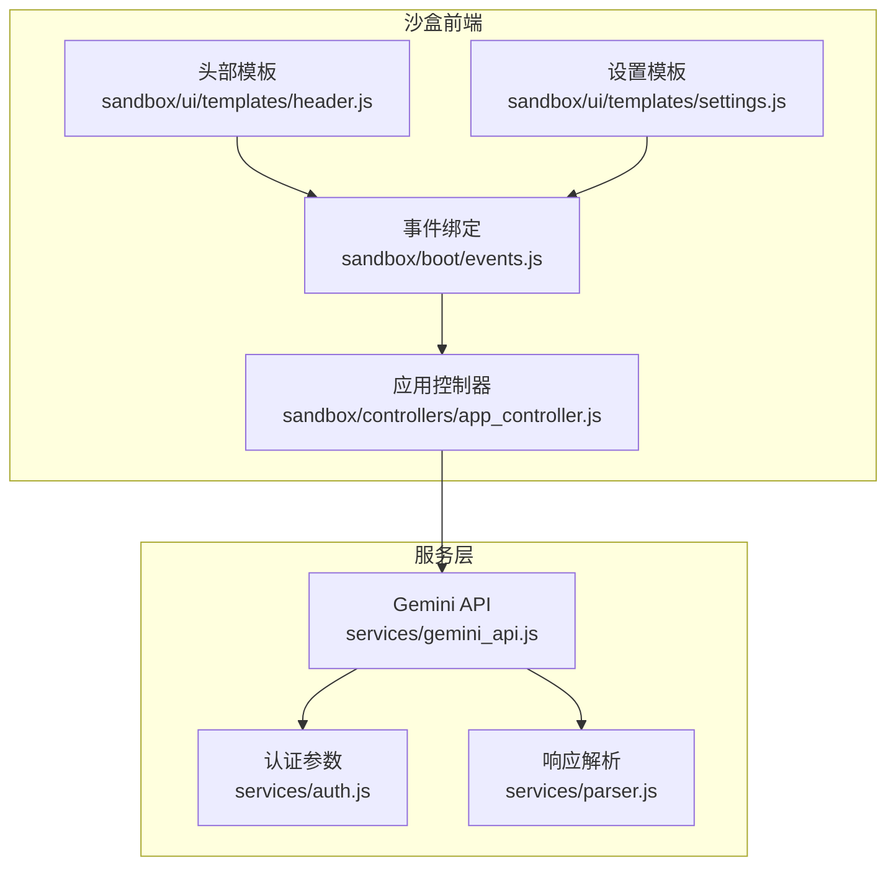
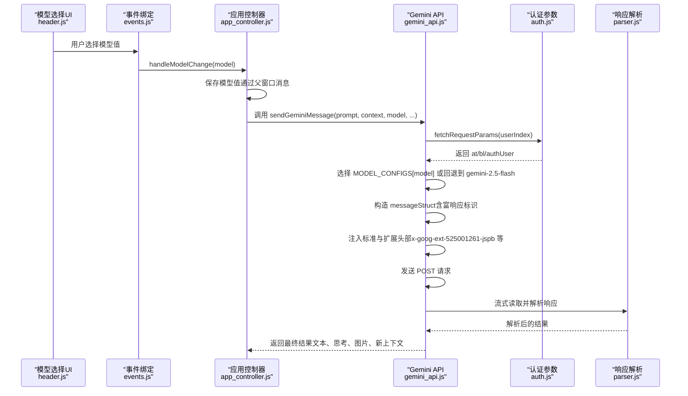
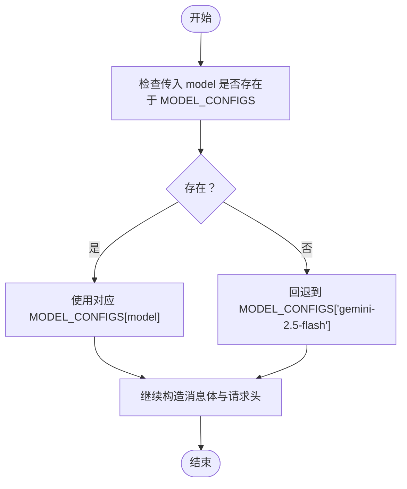
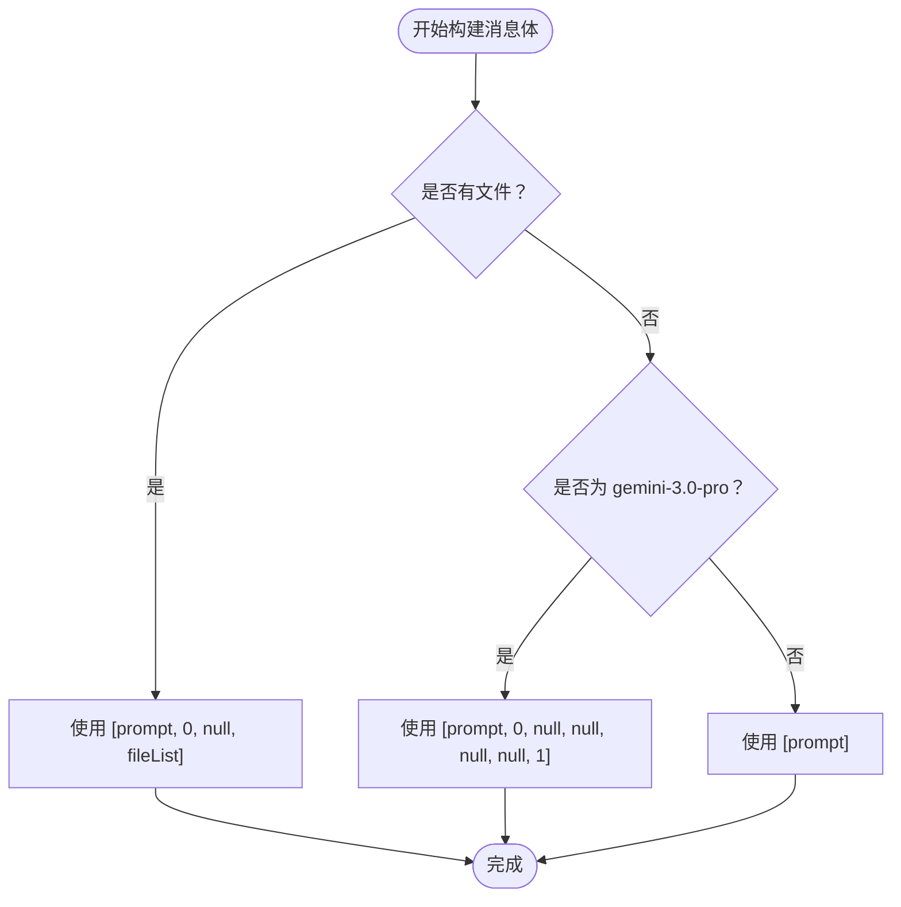
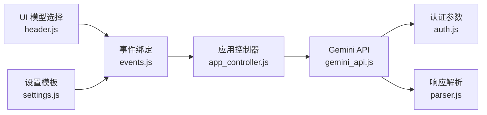

# 模型选择 (model)

<cite>
**本文引用的文件**
- [services/gemini_api.js](file://services/gemini_api.js)
- [services/auth.js](file://services/auth.js)
- [services/parser.js](file://services/parser.js)
- [sandbox/boot/events.js](file://sandbox/boot/events.js)
- [sandbox/controllers/app_controller.js](file://sandbox/controllers/app_controller.js)
- [sandbox/ui/templates/header.js](file://sandbox/ui/templates/header.js)
- [sandbox/ui/templates/settings.js](file://sandbox/ui/templates/settings.js)
</cite>

## 目录
1. [简介](#简介)
2. [项目结构](#项目结构)
3. [核心组件](#核心组件)
4. [架构总览](#架构总览)
5. [详细组件分析](#详细组件分析)
6. [依赖关系分析](#依赖关系分析)
7. [性能考量](#性能考量)
8. [故障排查指南](#故障排查指南)
9. [结论](#结论)

## 简介
本文围绕模型参数配置机制进行深入文档化，重点基于 services/gemini_api.js 中的 MODEL_CONFIGS 常量，系统说明不同模型（gemini-2.5-flash、gemini-2.5-pro、gemini-3.0-pro）在 HTTP 请求头中的 header 配置方式，以及这些配置如何通过请求头 'x-goog-ext-525001261-jspb' 应用于实际请求。同时解释当指定模型不存在时的默认回退行为（使用 gemini-2.5-flash），对比不同模型在 messageStruct 结构上的差异（特别是 gemini-3.0-pro 需要更丰富的消息结构并在末尾包含 1 标识），并说明 extraHeaders 在特定模型（如 gemini-3.0-pro）中的扩展头部注入逻辑，以及这些头部对功能启用（如 Gems）的影响。

## 项目结构
本项目采用分层组织，与模型选择相关的关键位置如下：
- 服务层：services/gemini_api.js 提供模型配置与请求发送逻辑；services/auth.js 提供认证参数获取；services/parser.js 提供响应解析。
- 沙盒前端：sandbox/boot/events.js 绑定 UI 事件（含模型选择）；sandbox/controllers/app_controller.js 负责应用级事件转发；sandbox/ui/templates/header.js 和 sandbox/ui/templates/settings.js 提供模型选择 UI 的模板与设置入口。

图表来源
- [services/gemini_api.js](file://services/gemini_api.js#L1-L230)
- [services/auth.js](file://services/auth.js#L1-L41)
- [services/parser.js](file://services/parser.js#L1-L14)
- [sandbox/boot/events.js](file://sandbox/boot/events.js#L1-L296)
- [sandbox/controllers/app_controller.js](file://sandbox/controllers/app_controller.js#L1-L207)
- [sandbox/ui/templates/header.js](file://sandbox/ui/templates/header.js#L1-L17)
- [sandbox/ui/templates/settings.js](file://sandbox/ui/templates/settings.js#L1-L174)

章节来源
- [services/gemini_api.js](file://services/gemini_api.js#L1-L230)
- [services/auth.js](file://services/auth.js#L1-L41)
- [services/parser.js](file://services/parser.js#L1-L14)
- [sandbox/boot/events.js](file://sandbox/boot/events.js#L1-L296)
- [sandbox/controllers/app_controller.js](file://sandbox/controllers/app_controller.js#L1-L207)
- [sandbox/ui/templates/header.js](file://sandbox/ui/templates/header.js#L1-L17)
- [sandbox/ui/templates/settings.js](file://sandbox/ui/templates/settings.js#L1-L174)

## 核心组件
- MODEL_CONFIGS：集中定义各模型的 header 与可选的 extraHeaders。其中：
  - gemini-2.5-flash：基础 header，用于快速模型。
  - gemini-2.5-pro：思考类模型 header。
  - gemini-3.0-pro：除基础 header 外，还提供额外头部以启用特定功能（如 Gems）。
- sendGeminiMessage：统一的发送流程，负责：
  - 获取认证参数（若缺失则回退到默认账户索引）。
  - 选择模型配置（不存在时回退到 gemini-2.5-flash）。
  - 构造消息体 messageStruct（含文件上传与富响应标识）。
  - 注入标准与扩展头部（包括 x-goog-ext-525001261-jspb 与 gemId 相关头部）。
  - 发送请求并流式解析响应。

章节来源
- [services/gemini_api.js](file://services/gemini_api.js#L7-L24)
- [services/gemini_api.js](file://services/gemini_api.js#L26-L230)

## 架构总览
下图展示了从 UI 选择模型到服务端请求的完整链路，以及关键头部与消息结构的传递路径。

图表来源
- [sandbox/ui/templates/header.js](file://sandbox/ui/templates/header.js#L10-L16)
- [sandbox/boot/events.js](file://sandbox/boot/events.js#L142-L172)
- [sandbox/controllers/app_controller.js](file://sandbox/controllers/app_controller.js#L96-L98)
- [services/gemini_api.js](file://services/gemini_api.js#L26-L230)
- [services/auth.js](file://services/auth.js#L7-L40)
- [services/parser.js](file://services/parser.js#L4-L14)

## 详细组件分析

### 模型配置与回退机制
- MODEL_CONFIGS 定义了三种模型的 header 与可选 extraHeaders：
  - gemini-2.5-flash：基础 header，适用于快速模型。
  - gemini-2.5-pro：思考类模型 header。
  - gemini-3.0-pro：在基础 header 上增加额外头部，用于启用特定功能（如 Gems）。
- 回退策略：当传入的 model 不在 MODEL_CONFIGS 中时，自动回退到 gemini-2.5-flash，确保请求可用性。

图表来源
- [services/gemini_api.js](file://services/gemini_api.js#L39-L39)

章节来源
- [services/gemini_api.js](file://services/gemini_api.js#L7-L24)
- [services/gemini_api.js](file://services/gemini_api.js#L39-L39)

### 请求头 'x-goog-ext-525001261-jspb' 的应用
- 该头部用于在服务端区分模型类型与版本，从而影响后续处理逻辑。
- sendGeminiMessage 中通过将 modelConfig.header 注入到 headers['x-goog-ext-525001261-jspb'] 实现。
- 不同模型的 header 值不同，确保服务端正确路由与处理。

章节来源
- [services/gemini_api.js](file://services/gemini_api.js#L125-L132)
- [services/gemini_api.js](file://services/gemini_api.js#L130-L130)

### gemini-3.0-pro 的 extraHeaders 与功能启用
- gemini-3.0-pro 在 MODEL_CONFIGS 中提供了 extraHeaders，包含：
  - 'x-goog-ext-525005358-jspb'：用于启用 Gems 功能。
  - 'x-goog-ext-73010989-jspb'：用于启用特定能力。
- sendGeminiMessage 中通过将 modelConfig.extraHeaders 合并到 headers 中实现注入。
- 当用户在设置中提供 gemId 时，还会额外注入 'x-goog-ext-525005358-jspb'，用于定向使用指定 Gems。

章节来源
- [services/gemini_api.js](file://services/gemini_api.js#L17-L23)
- [services/gemini_api.js](file://services/gemini_api.js#L125-L137)
- [services/gemini_api.js](file://services/gemini_api.js#L135-L137)
- [sandbox/ui/templates/settings.js](file://sandbox/ui/templates/settings.js#L65-L73)

### messageStruct 结构差异与富响应标识
- 文件上传场景：统一使用 [prompt, 0, null, fileList]。
- 无文件上传场景：
  - gemini-3.0-pro：使用更丰富的结构 [prompt, 0, null, null, null, null, 1]，其中末尾的 1 表示允许富响应。
  - 其他模型：使用 [prompt]。
- 这种差异确保服务端在不同模型下返回合适的消息结构。

图表来源
- [services/gemini_api.js](file://services/gemini_api.js#L66-L89)

章节来源
- [services/gemini_api.js](file://services/gemini_api.js#L63-L89)

### UI 与事件链路（模型选择）
- UI 层提供模型选择下拉框，选项包括 gemini-2.5-flash、gemini-2.5-pro、gemini-3.0-pro。
- 事件绑定监听 change 事件，调用 app.handleModelChange(model)。
- app_controller.js 通过向父窗口发送 SAVE_MODEL 消息保存模型选择。
- 该模型值随后在发送请求时被传入 sendGeminiMessage，驱动 MODEL_CONFIGS 的选择。

章节来源
- [sandbox/ui/templates/header.js](file://sandbox/ui/templates/header.js#L10-L16)
- [sandbox/boot/events.js](file://sandbox/boot/events.js#L142-L172)
- [sandbox/controllers/app_controller.js](file://sandbox/controllers/app_controller.js#L92-L98)

## 依赖关系分析
- sendGeminiMessage 依赖：
  - services/auth.js：获取认证参数（at、bl、authUser）。
  - services/upload.js：文件上传（在文件上传场景中使用）。
  - services/parser.js：解析服务端返回的流式响应。
- MODEL_CONFIGS 与 UI 设置：
  - UI 提供模型选择下拉框与快捷键（Tab 切换）。
  - 设置页提供 Gems ID 输入，用于注入特定头部。

图表来源
- [sandbox/ui/templates/header.js](file://sandbox/ui/templates/header.js#L10-L16)
- [sandbox/boot/events.js](file://sandbox/boot/events.js#L142-L172)
- [sandbox/controllers/app_controller.js](file://sandbox/controllers/app_controller.js#L92-L98)
- [services/gemini_api.js](file://services/gemini_api.js#L26-L230)
- [services/auth.js](file://services/auth.js#L7-L40)
- [services/parser.js](file://services/parser.js#L4-L14)
- [sandbox/ui/templates/settings.js](file://sandbox/ui/templates/settings.js#L65-L73)

章节来源
- [services/gemini_api.js](file://services/gemini_api.js#L3-L5)
- [services/auth.js](file://services/auth.js#L7-L40)
- [services/parser.js](file://services/parser.js#L4-L14)
- [sandbox/boot/events.js](file://sandbox/boot/events.js#L142-L172)
- [sandbox/controllers/app_controller.js](file://sandbox/controllers/app_controller.js#L92-L98)
- [sandbox/ui/templates/header.js](file://sandbox/ui/templates/header.js#L10-L16)
- [sandbox/ui/templates/settings.js](file://sandbox/ui/templates/settings.js#L65-L73)

## 性能考量
- 并行上传：文件上传阶段使用 Promise.all 并行处理多个文件，提升整体吞吐。
- 流式解析：响应采用流式读取与解析，避免一次性缓冲大块数据，降低内存占用。
- 回退策略：当模型配置缺失时自动回退到 gemini-2.5-flash，减少异常分支处理成本。
- 头部注入：仅在需要时注入额外头部，避免不必要的请求头开销。

章节来源
- [services/gemini_api.js](file://services/gemini_api.js#L46-L56)
- [services/gemini_api.js](file://services/gemini_api.js#L158-L201)
- [services/gemini_api.js](file://services/gemini_api.js#L39-L39)

## 故障排查指南
- 未登录或会话过期：
  - 首次响应块包含 HTML 标记时抛出错误，提示未登录或会话过期。
- 请求过于频繁：
  - 响应包含限流相关关键词时，抛出速率限制错误。
- 空响应或解析失败：
  - 若缓冲区为空或无法解析，抛出相应错误，提示检查网络或刷新页面。
- 模型选择无效：
  - 当传入的 model 名称不在 MODEL_CONFIGS 中时，将回退到 gemini-2.5-flash；确认 UI 选择是否正确，或检查传参是否拼写错误。

章节来源
- [services/gemini_api.js](file://services/gemini_api.js#L173-L219)

## 结论
本机制通过 MODEL_CONFIGS 将模型与请求头配置解耦，借助 'x-goog-ext-525001261-jspb' 实现服务端模型识别与差异化处理。gemini-3.0-pro 通过 extraHeaders 启用高级功能（如 Gems），并通过 messageStruct 的富响应标识优化输出结构。UI 与控制器层提供直观的模型选择与快捷切换，配合回退策略与流式解析，确保在多种环境下稳定运行。