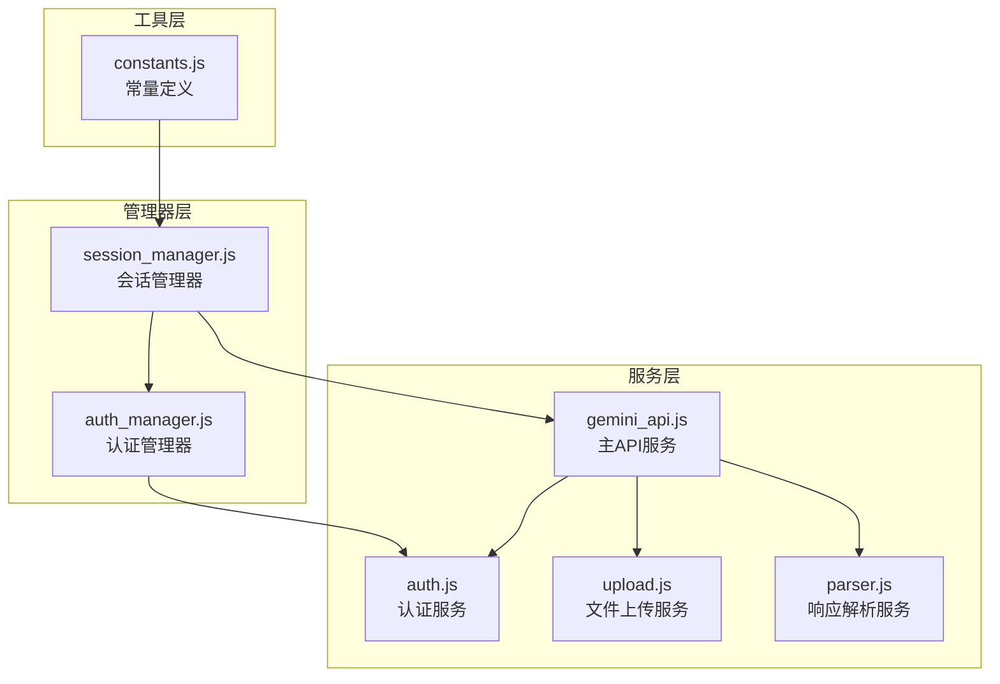
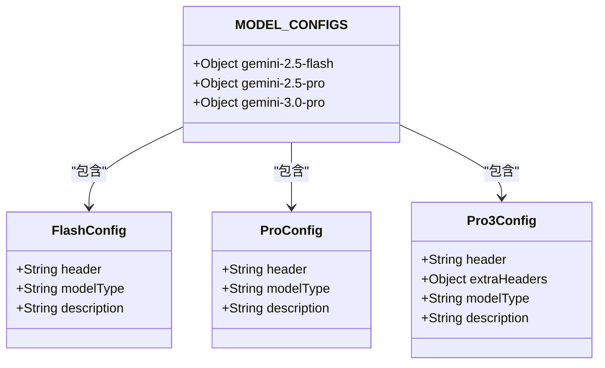
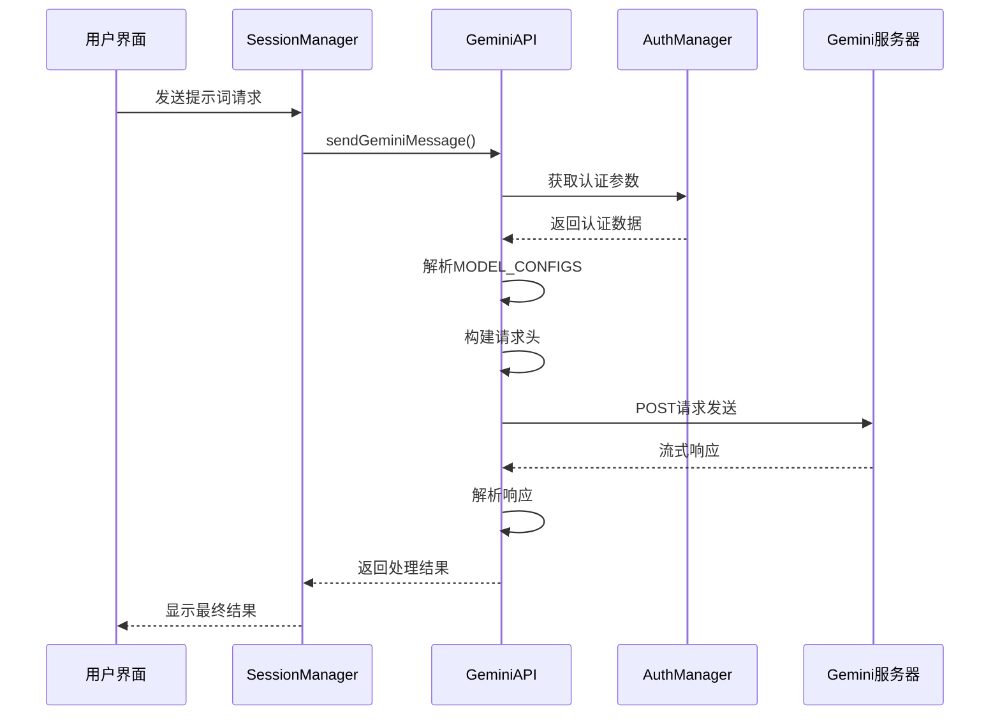
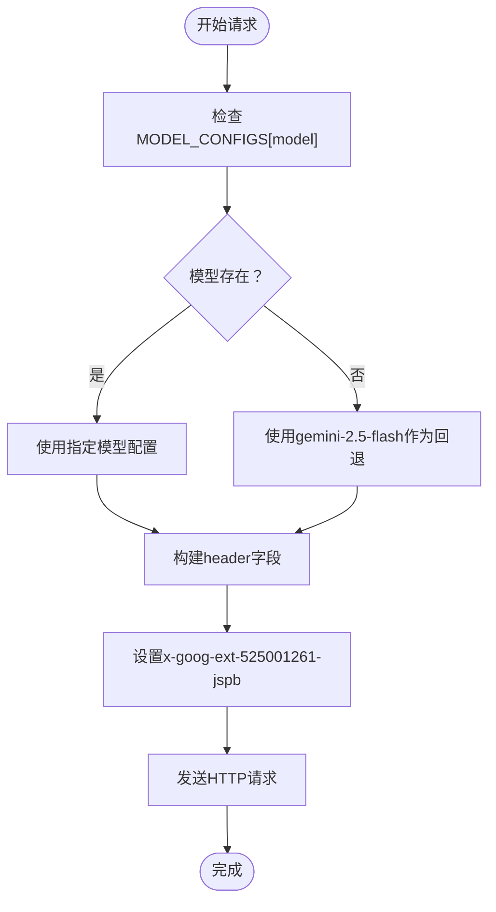
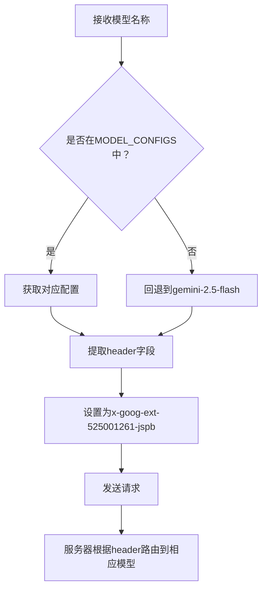
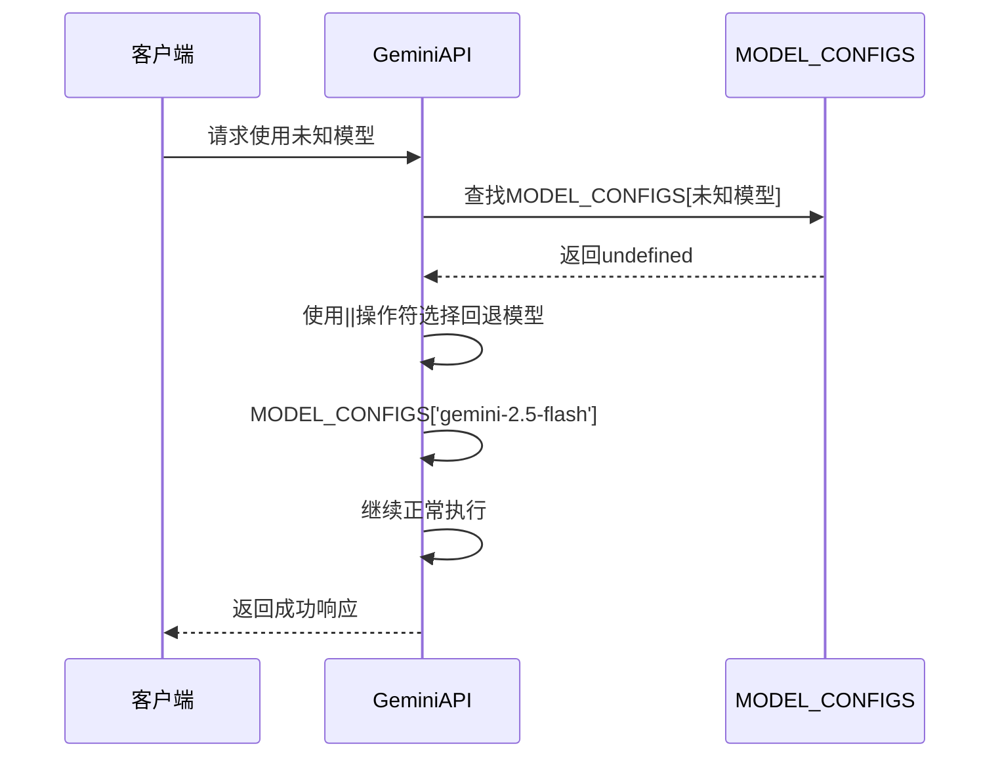
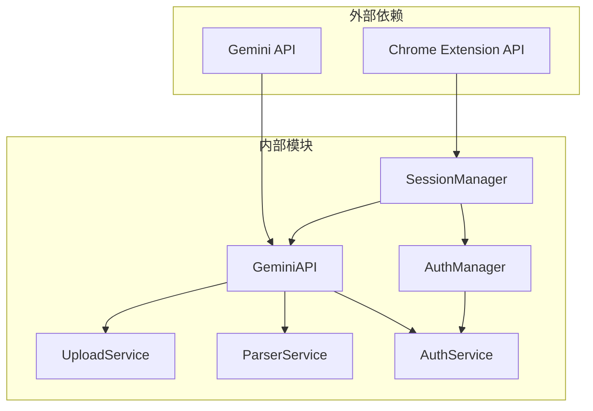
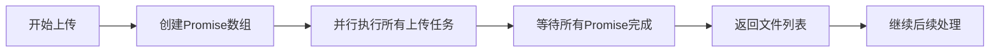

# 模型配置与请求头映射

<cite>
**本文档引用的文件**
- [services/gemini_api.js](file://services/gemini_api.js)
- [services/auth.js](file://services/auth.js)
- [services/parser.js](file://services/parser.js)
- [services/upload.js](file://services/upload.js)
- [background/managers/session_manager.js](file://background/managers/session_manager.js)
- [background/managers/auth_manager.js](file://background/managers/auth_manager.js)
- [lib/constants.js](file://lib/constants.js)
</cite>

## 目录
1. [简介](#简介)
2. [项目结构概览](#项目结构概览)
3. [核心组件分析](#核心组件分析)
4. [架构总览](#架构总览)
5. [详细组件分析](#详细组件分析)
6. [依赖关系分析](#依赖关系分析)
7. [性能考虑](#性能考虑)
8. [故障排除指南](#故障排除指南)
9. [结论](#结论)

## 简介

本文档深入分析了Gemini Nexus扩展程序中的模型配置系统，重点阐述MODEL_CONFIGS常量的设计结构，详细说明gemini-2.5-flash、gemini-2.5-pro和gemini-3.0-pro三个模型对应的HTTP请求头配置，以及header字符串作为x-goog-ext-525001261-jspb请求头载荷如何实现模型路由。文档还解释了当用户指定未知模型时的默认回退机制，确保API调用的稳定性。

## 项目结构概览

该代码库采用模块化架构，主要分为以下几个核心模块：

**图表来源**
- [services/gemini_api.js](file://services/gemini_api.js#L1-L230)
- [background/managers/session_manager.js](file://background/managers/session_manager.js#L1-L285)
- [background/managers/auth_manager.js](file://background/managers/auth_manager.js#L1-L130)

**章节来源**
- [services/gemini_api.js](file://services/gemini_api.js#L1-L230)
- [background/managers/session_manager.js](file://background/managers/session_manager.js#L1-L285)

## 核心组件分析

### MODEL_CONFIGS常量结构设计

MODEL_CONFIGS常量是整个模型路由系统的核心，定义了三种Gemini模型的配置参数：

**图表来源**
- [services/gemini_api.js](file://services/gemini_api.js#L7-L24)

每个模型配置都包含以下关键要素：

1. **header字段**：作为x-goog-ext-525001261-jspb请求头的载荷
2. **extraHeaders**（仅gemini-3.0-pro）：额外的头部配置
3. **模型标识符**：唯一的十六进制字符串标识符

**章节来源**
- [services/gemini_api.js](file://services/gemini_api.js#L7-L24)

## 架构总览

整个Gemini API调用流程遵循严格的分层架构：

**图表来源**
- [background/managers/session_manager.js](file://background/managers/session_manager.js#L21-L127)
- [services/gemini_api.js](file://services/gemini_api.js#L26-L230)

## 详细组件分析

### 模型配置详解

#### gemini-2.5-flash（快速模型）

gemini-2.5-flash配置具有以下特征：
- **header值**：`[1,null,null,null,"9ec249fc9ad08861",null,null,0,[4]]`
- **模型类型**：快速响应模型
- **唯一标识符**：`9ec249fc9ad08861`
- **路由机制**：通过header中的第4个元素进行模型选择

#### gemini-2.5-pro（思考模型）

gemini-2.5-pro配置具有以下特征：
- **header值**：`[1,null,null,null,"4af6c7f5da75d65d",null,null,0,[4]]`
- **模型类型**：思考/推理模型
- **唯一标识符**：`4af6c7f5da75d65d`
- **路由机制**：与flash模型相同的header结构，但使用不同的标识符

#### gemini-3.0-pro（专业模型）

gemini-3.0-pro配置具有以下特征：
- **header值**：`[1,null,null,null,"e6fa609c3fa255c0",null,null,null,[4],null,null,2]`
- **模型类型**：专业/高级模型
- **唯一标识符**：`e6fa609c3fa255c0`
- **额外头部**：包含特殊的extraHeaders配置
- **路由机制**：具有更复杂的header结构

**章节来源**
- [services/gemini_api.js](file://services/gemini_api.js#L7-L24)

### HTTP请求头映射机制

#### x-goog-ext-525001261-jspb头部的作用

该头部是模型路由的核心机制：

**图表来源**
- [services/gemini_api.js](file://services/gemini_api.js#L39-L132)

#### 头部字符串的结构分析

每个header字符串都是一个JSON数组，包含以下关键位置的信息：

| 位置 | 内容 | 用途 |
|------|------|------|
| 0 | 1 | 模型版本标识 |
| 3 | null | 占位符 |
| 4 | 唯一标识符 | 模型选择的关键标识 |
| 7 | 0 或 null | 模型特定参数 |
| 8 | [4] 或 null | 模型功能标志 |

**章节来源**
- [services/gemini_api.js](file://services/gemini_api.js#L9-L23)

### 模型路由算法

模型路由通过以下算法实现：

**图表来源**
- [services/gemini_api.js](file://services/gemini_api.js#L39-L132)

**章节来源**
- [services/gemini_api.js](file://services/gemini_api.js#L39-L132)

### 容错机制实现

当用户指定未知模型时，系统通过以下方式实现容错：

**图表来源**
- [services/gemini_api.js](file://services/gemini_api.js#L39)

这种设计确保了系统的健壮性，即使用户输入了错误的模型名称，系统也能自动回退到稳定的默认模型。

**章节来源**
- [services/gemini_api.js](file://services/gemini_api.js#L39)

### 额外头部配置

gemini-3.0-pro模型具有额外的头部配置：

| 头部名称 | 值 | 用途 |
|----------|-----|------|
| x-goog-ext-525005358-jspb | ["FE27D76F-C4BB-4ACC-AF79-E6DE3BA30712",1] | 特殊功能标识 |
| x-goog-ext-73010989-jspb | [0] | 功能开关 |

这些额外头部为专业模型提供了特殊的功能支持。

**章节来源**
- [services/gemini_api.js](file://services/gemini_api.js#L18-L23)

## 依赖关系分析

### 组件间依赖关系

**图表来源**
- [background/managers/session_manager.js](file://background/managers/session_manager.js#L1-L285)
- [services/gemini_api.js](file://services/gemini_api.js#L1-L230)

### 关键依赖链

1. **SessionManager** → **GeminiAPI**：会话管理器负责协调API调用
2. **GeminiAPI** → **AuthService**：API需要认证服务获取必要的令牌
3. **GeminiAPI** → **UploadService**：多模态功能需要文件上传支持
4. **GeminiAPI** → **ParserService**：需要解析流式响应

**章节来源**
- [background/managers/session_manager.js](file://background/managers/session_manager.js#L1-L285)
- [services/gemini_api.js](file://services/gemini_api.js#L1-L230)

## 性能考虑

### 并行文件上传优化

系统实现了并行文件上传机制，显著提升了多文件场景下的性能：

**图表来源**
- [services/gemini_api.js](file://services/gemini_api.js#L46-L56)

### 缓存和状态管理

系统通过以下机制优化性能：
- **认证缓存**：避免重复获取认证参数
- **模型切换检测**：当模型改变时自动刷新上下文
- **账户轮换**：在多账户场景下分散负载

**章节来源**
- [background/managers/auth_manager.js](file://background/managers/auth_manager.js#L98-L103)

## 故障排除指南

### 常见问题及解决方案

#### 认证相关错误

| 错误类型 | 症状 | 解决方案 |
|----------|------|----------|
| 未登录 | "未登录 (Session expired)" | 手动登录Gemini或重新启动扩展 |
| 401/403错误 | 权限不足 | 切换到正确的用户账户或重新授权 |
| 会话过期 | 响应包含<html>标签 | 刷新页面或重新登录 |

#### 模型选择错误

| 问题 | 现象 | 处理方式 |
|------|------|----------|
| 未知模型名称 | 自动回退到gemini-2.5-flash | 检查模型名称拼写或使用支持的模型 |
| 模型不匹配 | 响应格式异常 | 确认使用的模型与功能兼容 |

#### 网络和超时问题

| 问题 | 症状 | 解决方案 |
|------|------|----------|
| 请求过于频繁 | "请求过于频繁，请稍后再试" | 等待一段时间后重试 |
| 服务器无响应 | "服务器无响应" | 刷新Gemini页面或检查网络连接 |
| 响应解析失败 | "响应解析失败" | 刷新页面后重试或检查浏览器控制台 |

**章节来源**
- [services/gemini_api.js](file://services/gemini_api.js#L172-L219)
- [background/managers/session_manager.js](file://background/managers/session_manager.js#L149-L198)

## 结论

Gemini Nexus扩展程序的模型配置系统展现了精巧的设计理念：

1. **明确的路由机制**：通过x-goog-ext-525001261-jspb头部实现精确的模型路由
2. **稳健的容错设计**：自动回退机制确保系统稳定性
3. **模块化的架构**：清晰的职责分离便于维护和扩展
4. **性能优化**：并行处理和缓存策略提升用户体验

该系统为开发者提供了一个可靠的参考模型，展示了如何在浏览器扩展环境中实现复杂的AI服务集成。通过深入理解MODEL_CONFIGS常量的设计和实现，开发者可以更好地理解和扩展这一系统。