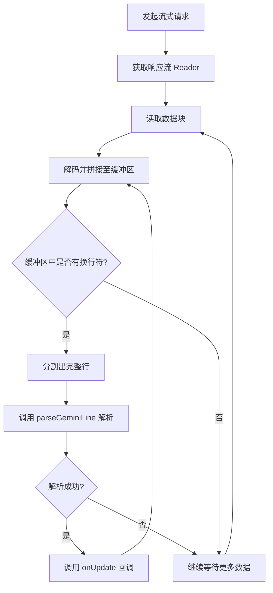
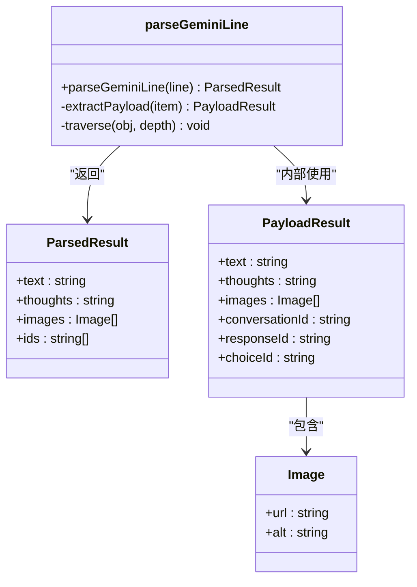
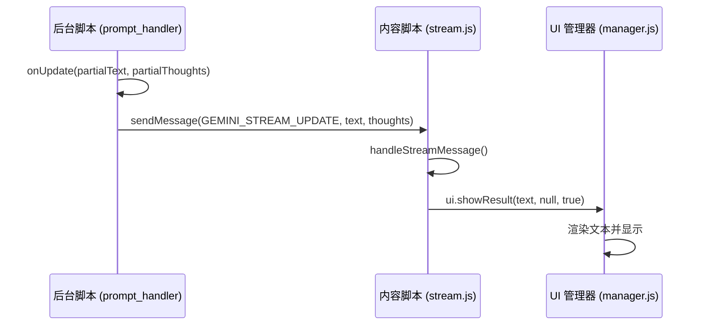

# 流更新回调 (onUpdate)

<cite>
**本文档引用的文件**  
- [gemini_api.js](file://services/gemini_api.js)
- [parser.js](file://services/parser.js)
- [session_manager.js](file://background/managers/session_manager.js)
- [prompt_handler.js](file://background/handlers/session/prompt_handler.js)
- [quick_ask_handler.js](file://background/handlers/session/quick_ask_handler.js)
- [tool_executor.js](file://background/handlers/session/prompt/tool_executor.js)
- [stream.js](file://content/toolbar/stream.js)
- [manager.js](file://content/toolbar/ui/manager.js)
- [renderer.js](file://content/toolbar/ui/renderer.js)
</cite>

## 目录
1. [onUpdate 回调函数概述](#onupdate-回调函数概述)
2. [调用时机与流式响应处理](#调用时机与流式响应处理)
3. [参数解析：parsed.text 与 parsed.thoughts](#参数解析parsedtext-与-parsedthoughts)
4. [UI 实时更新机制](#ui-实时更新机制)
5. [使用示例：打字机效果与思考过程展示](#使用示例打字机效果与思考过程展示)
6. [性能优化建议](#性能优化建议)

## onUpdate 回调函数概述

`onUpdate` 回调函数是本项目中实现流式响应（streaming response）实时更新的核心机制。它在每次从 Gemini 服务器接收到新的文本片段时被调用，使得用户界面能够渐进式地显示 AI 的响应内容，从而显著提升用户体验。

该回调函数主要在 `sendGeminiMessage` 函数中被触发，作为处理流式数据的关键入口。其设计允许上层组件（如会话处理器和 UI 控制器）订阅响应的中间状态，实现内容的动态更新。

**Section sources**
- [gemini_api.js](file://services/gemini_api.js#L21-L230)
- [session_manager.js](file://background/managers/session_manager.js#L21-L285)

## 调用时机与流式响应处理

`onUpdate` 回调的调用时机紧密关联于流式响应的处理流程。整个过程始于 `sendGeminiMessage` 函数，该函数通过 `fetch` 发起一个流式请求，并使用 `response.body.getReader()` 获取一个 `reader` 对象来逐块读取服务器响应。

处理逻辑如下：
1.  **建立流连接**：通过 `fetch` 请求 Gemini 的 `StreamGenerate` 端点，获取一个可读流。
2.  **逐块读取**：使用 `reader.read()` 方法异步读取数据块（chunk），并使用 `TextDecoder` 将二进制数据解码为 UTF-8 字符串。
3.  **按行解析**：将接收到的数据块拼接到一个缓冲区（buffer）中，并以换行符 `\n` 为分隔符，将缓冲区内容分割成独立的行（line）。
4.  **触发回调**：对每一行数据调用 `parseGeminiLine` 函数进行解析。如果解析成功并得到有效内容，则立即调用 `onUpdate` 回调函数。

**Diagram sources**
- [gemini_api.js](file://services/gemini_api.js#L159-L194)

**Section sources**
- [gemini_api.js](file://services/gemini_api.js#L159-L194)

## 参数解析：parsed.text 与 parsed.thoughts

`onUpdate` 回调函数接收两个核心参数：`parsed.text` 和 `parsed.thoughts`。这两个参数来源于对服务器返回的每一行 JSON 数据的解析。

*   **`parsed.text`**：这是 AI 生成的主要响应文本。`parseGeminiLine` 函数会从复杂的嵌套 JSON 结构中提取出位于 `firstCandidate[1][0]` 的字符串，作为当前已生成的文本片段。这个片段是累积的，意味着每次调用 `onUpdate` 时，`parsed.text` 都包含了之前所有片段的总和，从而实现内容的连续追加。

*   **`parsed.thoughts`**：这代表了 AI 的“思考过程”或内部推理。该信息通常位于 JSON 结构的 `firstCandidate[37][0][0]`。`onUpdate` 可以利用此参数来向用户展示 AI 是如何得出结论的，增加交互的透明度和可信度。

**Diagram sources**
- [parser.js](file://services/parser.js#L4-L157)

**Section sources**
- [parser.js](file://services/parser.js#L4-L157)
- [gemini_api.js](file://services/gemini_api.js#L188-L193)

## UI 实时更新机制

`onUpdate` 回调的最终目的是驱动用户界面的实时更新。这一过程通过 Chrome 扩展的消息传递机制（`chrome.runtime.sendMessage`）实现，将解析出的文本和思考过程从后台脚本（background script）发送到内容脚本（content script）。

具体流程如下：
1.  **后台触发**：在 `prompt_handler.js` 或 `quick_ask_handler.js` 中，定义 `onUpdate` 函数，当它被调用时，会向内容脚本发送一个包含 `GEMINI_STREAM_UPDATE` 动作的消息。
2.  **内容脚本监听**：在 `content/toolbar/stream.js` 中，`GeminiStreamHandler` 类监听来自后台的消息。
3.  **UI 更新**：当收到 `GEMINI_STREAM_UPDATE` 消息时，`GeminiStreamHandler` 会调用 `uiController.showResult` 方法，并传入 `isStreaming = true` 标志。
4.  **渲染显示**：UI 管理器（`manager.js`）和渲染器（`renderer.js`）接收到更新请求后，会将新的文本内容渲染到界面上，实现“打字机”般的逐字显示效果。

**Diagram sources**
- [prompt_handler.js](file://background/handlers/session/prompt_handler.js#L14-L22)
- [quick_ask_handler.js](file://background/handlers/session/quick_ask_handler.js#L20-L27)
- [stream.js](file://content/toolbar/stream.js#L17-L22)
- [manager.js](file://content/toolbar/ui/manager.js#L173-L182)

**Section sources**
- [prompt_handler.js](file://background/handlers/session/prompt_handler.js#L14-L22)
- [quick_ask_handler.js](file://background/handlers/session/quick_ask_handler.js#L20-L27)
- [stream.js](file://content/toolbar/stream.js#L17-L22)
- [manager.js](file://content/toolbar/ui/manager.js#L173-L182)

## 使用示例：打字机效果与思考过程展示

`onUpdate` 回调为实现丰富的用户体验提供了基础。以下是两个典型的应用场景：

### 1. 实现打字机动画效果
通过在 `onUpdate` 中逐步更新 DOM 元素的文本内容，可以轻松实现打字机效果。UI 组件在接收到 `isStreaming = true` 时，可以应用特定的 CSS 动画，使新字符逐个出现。

### 2. 实时显示思考过程
`onUpdate` 接收的 `parsed.thoughts` 参数可以用于在 UI 中开辟一个专门的“思考过程”区域。每当 AI 进行内部推理时，该区域的内容也会随之更新，让用户清晰地看到 AI 的决策路径。例如，在 `tool_executor.js` 中，当执行一个工具时，会通过 `onUpdate` 发送类似 `"Executing tool: take_screenshot..."` 的消息，实时告知用户当前的操作。

**Section sources**
- [tool_executor.js](file://background/handlers/session/prompt/tool_executor.js#L15-L16)
- [manager.js](file://content/toolbar/ui/manager.js#L173-L182)
- [renderer.js](file://content/toolbar/ui/renderer.js#L18-L44)

## 性能优化建议

由于流式响应可能产生高频的 `onUpdate` 调用（尤其是在网络状况良好时），直接将每次调用都映射到 UI 更新可能会导致性能问题，如界面卡顿或资源浪费。

因此，**强烈建议在 UI 更新层面对 `onUpdate` 事件进行防抖（Debounce）或节流（Throttle）处理**。

*   **防抖 (Debounce)**：确保在用户停止输入或数据流短暂暂停后，再进行一次最终的 UI 更新。这适用于不希望在快速连续更新时频繁重绘的场景。
*   **节流 (Throttle)**：限制 `onUpdate` 触发 UI 更新的频率，例如，即使数据流每 10ms 更新一次，也只允许 UI 每 100ms 更新一次。这能保证更新的平滑性，同时避免过度消耗资源。

通过这种优化，可以在保证用户体验流畅性的同时，维持系统的高性能。

**Section sources**
- [manager.js](file://content/toolbar/ui/manager.js#L173-L182)
- [renderer.js](file://content/toolbar/ui/renderer.js#L18-L44)