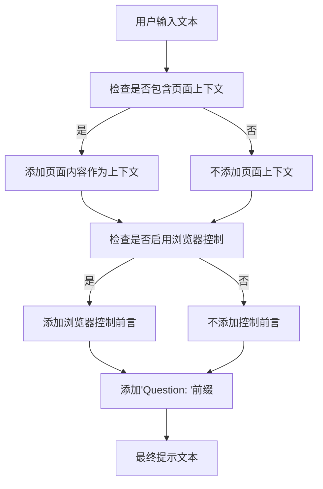
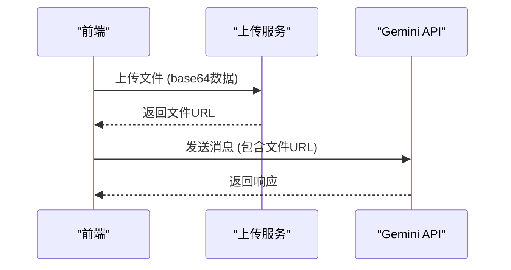
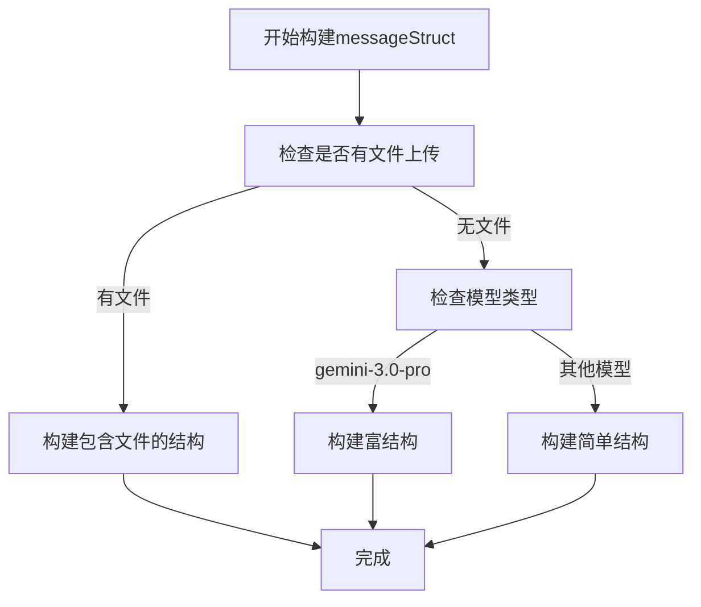
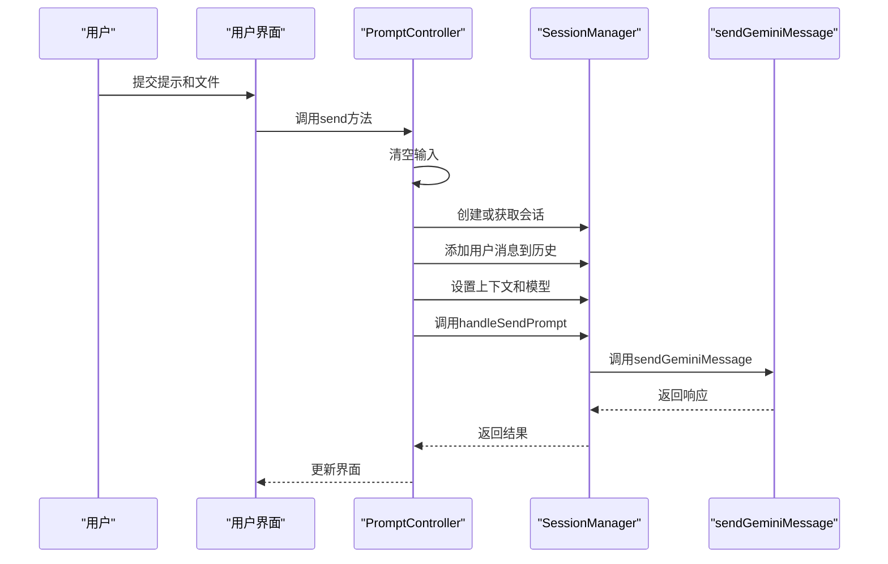

# 请求参数详解

<cite>
**本文档引用的文件**
- [builder.js](file://background/handlers/session/prompt/builder.js)
- [gemini_api.js](file://services/gemini_api.js)
- [session_manager.js](file://background/managers/session_manager.js)
- [prompt_handler.js](file://background/handlers/session/prompt_handler.js)
- [upload.js](file://services/upload.js)
- [parser.js](file://services/parser.js)
- [preamble.js](file://background/handlers/session/prompt/preamble.js)
- [prompt.js](file://sandbox/controllers/prompt.js)
</cite>

## 目录
1. [核心参数概述](#核心参数概述)
2. [参数详细说明](#参数详细说明)
3. [messageStruct数据结构](#messagestruct数据结构)
4. [fileList多文件上传格式](#filelist多文件上传格式)
5. [contextIds会话上下文](#contextids会话上下文)
6. [前端参数准备流程](#前端参数准备流程)

## 核心参数概述

`sendGeminiMessage`函数是与Gemini API通信的核心函数，负责处理所有输入参数并构建API请求。该函数接收七个主要参数：`prompt`（提示文本）、`context`（会话上下文）、`model`（模型选择）、`files`（多模态文件列表）、`signal`（中止信号）、`onUpdate`（流更新回调）和`gemId`（Gem标识）。这些参数共同决定了API请求的内容、上下文和行为。

**Section sources**
- [gemini_api.js](file://services/gemini_api.js#L26-L230)

## 参数详细说明

### prompt（提示文本）

`prompt`参数是发送给Gemini模型的主要文本内容。在前端，该参数通过`PromptBuilder`类进行预处理，根据用户设置添加系统前言（preamble）。如果启用了页面上下文，会将当前标签页的内容作为上下文注入；如果启用了浏览器控制，会添加相应的控制前言和页面可访问性树。



**Diagram sources**
- [builder.js](file://background/handlers/session/prompt/builder.js#L10-L43)
- [preamble.js](file://background/handlers/session/prompt/preamble.js#L4-L108)

**Section sources**
- [builder.js](file://background/handlers/session/prompt/builder.js#L10-L43)

### context（会话上下文）

`context`参数包含与Gemini服务通信所需的身份验证和会话信息。它是一个对象，包含`atValue`（身份验证令牌）、`blValue`（会话令牌）、`authUser`（用户索引）和`contextIds`（会话ID数组）。如果未提供有效的上下文，函数会尝试通过`fetchRequestParams`获取默认上下文。

**Section sources**
- [gemini_api.js](file://services/gemini_api.js#L28-L36)
- [auth.js](file://services/auth.js#L7-L40)

### model（模型选择）

`model`参数指定要使用的Gemini模型。系统支持多种模型配置，包括`gemini-2.5-flash`、`gemini-2.5-pro`和`gemini-3.0-pro`。每种模型都有对应的配置头（header）和额外的HTTP头信息。模型选择通过`x-goog-ext-525001261-jspb`头信息传递给API。

**Section sources**
- [gemini_api.js](file://services/gemini_api.js#L7-L23)

### files（多模态文件列表）

`files`参数是一个包含文件对象的数组，每个文件对象包含`base64`编码的数据、`type`（MIME类型）和`name`（文件名）。在发送请求之前，这些文件会通过`uploadFile`函数上传到Google的内容推送服务，并转换为服务器端的URL标识符。



**Diagram sources**
- [upload.js](file://services/upload.js#L7-L39)
- [gemini_api.js](file://services/gemini_api.js#L42-L55)

**Section sources**
- [upload.js](file://services/upload.js#L7-L39)
- [gemini_api.js](file://services/gemini_api.js#L42-L55)

### signal（中止信号）

`signal`参数是一个`AbortController`的信号对象，用于在需要时中止API请求。当用户取消请求时，前端会触发`AbortController`的`abort`方法，导致所有挂起的fetch请求被中止。这在`sendGeminiMessage`和`uploadFile`函数中都被使用，确保了请求可以被及时取消。

**Section sources**
- [gemini_api.js](file://services/gemini_api.js#L145-L152)
- [upload.js](file://services/upload.js#L23-L28)

### onUpdate（流更新回调）

`onUpdate`参数是一个回调函数，用于处理从Gemini API流式传输的中间结果。当API开始返回部分响应时，这个回调会被调用，允许前端实时更新用户界面。在`PromptHandler`中，这个回调通过`chrome.runtime.sendMessage`将部分文本和思考过程发送到UI层。

**Section sources**
- [prompt_handler.js](file://background/handlers/session/prompt_handler.js#L15-L22)
- [gemini_api.js](file://services/gemini_api.js#L191-L193)

### gemId（Gem标识）

`gemId`参数用于指定Gemini中的特定Gem（预设提示模板）。如果提供了`gemId`，它会被注入到`x-goog-ext-525005358-jspb`HTTP头中，从而在API请求中激活相应的Gem。这个参数是可选的，默认值为`null`。

**Section sources**
- [gemini_api.js](file://services/gemini_api.js#L135-L137)
- [prompt.js](file://sandbox/controllers/prompt.js#L31-L32)

## messageStruct数据结构

`messageStruct`是构建API请求体的核心数据结构，其格式根据模型和文件上传情况而变化。对于不同的模型，`messageStruct`的结构有所不同，以满足API的特定要求。



**Diagram sources**
- [gemini_api.js](file://services/gemini_api.js#L63-L88)

**Section sources**
- [gemini_api.js](file://services/gemini_api.js#L63-L88)

### 不同模型的差异化要求

- **gemini-2.5-flash** 和 **gemini-2.5-pro**: 当没有文件上传时，`messageStruct`仅包含提示文本`[prompt]`；当有文件上传时，结构为`[prompt, 0, null, fileList]`。
- **gemini-3.0-pro**: 即使没有文件上传，也需要更丰富的结构`[prompt, 0, null, null, null, null, 1]`，其中末尾的`1`表示允许富响应。

这种差异化的设计确保了与不同Gemini模型的兼容性，同时优化了请求的有效载荷。

## fileList多文件上传格式

`fileList`参数采用嵌套数组格式`[[[url], filename]]`，这种格式设计用于支持多文件上传场景。每个文件被表示为一个包含URL数组和文件名的子数组。这种结构允许API处理多个文件，并保持文件名信息的完整性。

当上传多个文件时，系统会并行处理所有上传请求，提高效率：

```javascript
const uploadPromises = files.map(file => uploadFile(file, signal)
    .then(url => [[url], file.name])
);
fileList = await Promise.all(uploadPromises);
```

这种并行处理机制确保了即使在上传多个大文件时，也能保持良好的性能。

**Section sources**
- [gemini_api.js](file://services/gemini_api.js#L46-L51)

## contextIds会话上下文

`contextIds`是维护对话连续性的关键参数，它是一个包含三个ID的数组：`[conversationId, responseId, choiceId]`。这些ID在每次API调用后都会更新，确保后续请求能够正确地延续之前的对话。

在`sendGeminiMessage`函数中，`contextIds`被放置在请求数据的索引2位置：

```javascript
const data = [
    messageStruct,
    ['en'],
    context.contextIds,
    // ... 其他null值
    gemId
];
```

当API返回响应时，新的`contextIds`会被提取并更新到上下文中，为下一次请求做好准备：

```javascript
context.contextIds = finalResult.ids;
```

这种机制确保了多轮对话的连贯性，使Gemini能够理解对话的历史上下文。

**Section sources**
- [gemini_api.js](file://services/gemini_api.js#L94-L95)
- [parser.js](file://services/parser.js#L129-L131)
- [gemini_api.js](file://services/gemini_api.js#L222)

## 前端参数准备流程

前端通过`PromptController`类准备并传递所有参数到`sendGeminiMessage`函数。整个流程从用户提交提示开始，经过一系列处理步骤，最终调用API。



**Diagram sources**
- [prompt.js](file://sandbox/controllers/prompt.js#L15-L104)
- [session_manager.js](file://background/managers/session_manager.js#L21-L74)

**Section sources**
- [prompt.js](file://sandbox/controllers/prompt.js#L15-L104)
- [session_manager.js](file://background/managers/session_manager.js#L21-L74)

### 参数传递流程

1. 用户在UI中输入提示并选择文件
2. `PromptController.send()`方法被调用
3. 输入被清空，文件管理器被重置
4. 会话被创建或获取
5. 用户消息被添加到历史记录
6. 上下文和模型被设置
7. `sendGeminiMessage`被调用，传递所有参数
8. 响应被处理并更新UI

这个流程确保了所有必要的参数都被正确收集和传递，同时提供了良好的用户体验。