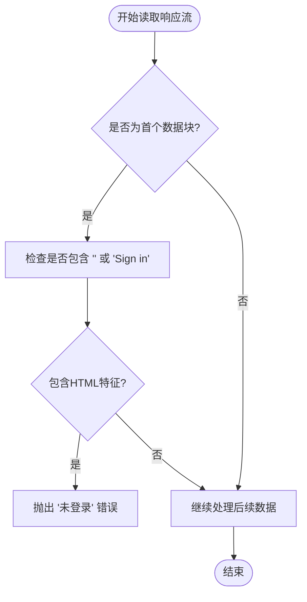
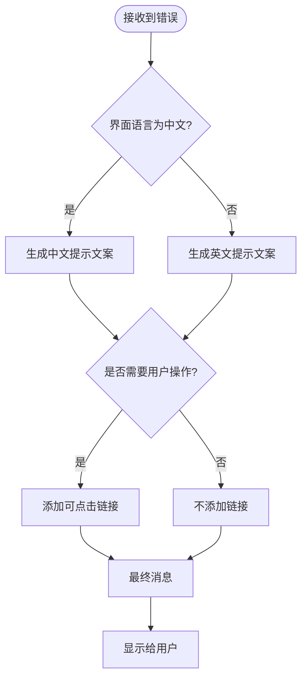
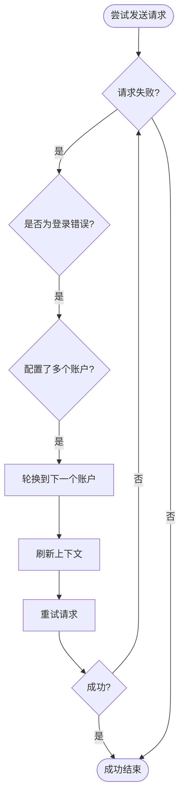

# 错误码与异常处理

<cite>
**本文档引用的文件**   
- [gemini_api.js](file://services/gemini_api.js)
- [session_manager.js](file://background/managers/session_manager.js)
- [auth_manager.js](file://background/managers/auth_manager.js)
- [auth.js](file://services/auth.js)
- [keep_alive.js](file://background/managers/keep_alive.js)
- [parser.js](file://services/parser.js)
- [ui.js](file://background/handlers/ui.js)
- [messages.js](file://background/messages.js)
- [actions_delegate.js](file://content/toolbar/ui/actions_delegate.js)
</cite>

## 目录
1. [引言](#引言)
2. [核心错误类型及触发条件](#核心错误类型及触发条件)
3. [错误检测与语义化异常抛出](#错误检测与语义化异常抛出)
4. [前端错误处理与用户提示](#前端错误处理与用户提示)
5. [重试机制与会话恢复策略](#重试机制与会话恢复策略)
6. [最佳实践建议](#最佳实践建议)
7. [结论](#结论)

## 引言
本文档详细说明了在与Gemini API交互过程中可能出现的各种错误类型及其处理策略。涵盖了网络错误、中止错误、会话过期、速率限制、空响应和无效响应等常见问题。通过分析代码库中的实现逻辑，阐述了如何通过缓冲区内容检测特定错误模式（如HTML登录页、资源耗尽标识）并抛出语义化异常。同时提供了前端应对此类错误的最佳实践建议，包括重试机制、用户引导和日志记录。

## 核心错误类型及触发条件

### 网络错误（HTTP状态码非200）
当API请求返回非200的HTTP状态码时，系统会抛出网络错误。这类错误通常由服务器端问题或网络连接中断引起。

**错误消息内容**：`Network Error: ${response.status}`

**用户提示文案**：根据错误状态码的不同，提供相应的中文提示信息。

**Section sources**
- [gemini_api.js](file://services/gemini_api.js#L154-L156)

### 中止错误（AbortError）
当用户主动取消请求或请求被程序中断时，会触发AbortError。这种错误不会向用户显示具体的错误信息，而是直接终止当前操作。

**错误消息内容**：`AbortError`

**用户提示文案**：无具体提示，仅停止当前请求流程。

**Section sources**
- [session_manager.js](file://background/managers/session_manager.js#L150-L152)

### 会话过期（未登录）
当用户的登录会话失效或未登录时，API返回的内容中包含HTML登录页面的特征字符串，如`<!DOCTYPE html>`、`<html`或`Sign in`。此时系统判定为会话过期。

**错误消息内容**：`未登录 (Session expired)`

**用户提示文案**：`🔑 账号 (Index: ${currentIndex}) 未登录或会话已过期。 <a href="#" class="gemini-link" data-url="${loginUrl}">👉 点击前往 Gemini 登录</a>`

**Section sources**
- [gemini_api.js](file://services/gemini_api.js#L174-L176)
- [session_manager.js](file://background/managers/session_manager.js#L159-L171)

### 速率限制（429/RESOURCE_EXHAUSTED）
当请求过于频繁时，服务器会返回429状态码或包含`RESOURCE_EXHAUSTED`的响应内容，表示已达到速率限制。

**错误消息内容**：`请求过于频繁，请稍后再试 (Rate limited)`

**用户提示文案**：`⏳ 请求过于频繁，Gemini 暂时限制了访问。请等待几分钟后再试。`

**Section sources**
- [gemini_api.js](file://services/gemini_api.js#L212-L213)
- [session_manager.js](file://background/managers/session_manager.js#L172-L177)

### 空响应
当服务器无响应或返回空内容时，系统检测到缓冲区长度为0，并抛出空响应错误。

**错误消息内容**：`服务器无响应，请检查网络连接 (Empty response)`

**用户提示文案**：`🔌 服务器无响应。 <a href="#" class="gemini-link" data-url="${refreshUrl}">👉 点击前往 Gemini 刷新</a>`

**Section sources**
- [gemini_api.js](file://services/gemini_api.js#L215-L216)
- [session_manager.js](file://background/managers/session_manager.js#L178-L184)

### 无效响应
当响应内容无法解析或不符合预期格式时，系统抛出无效响应错误。这可能由于服务器返回的数据结构异常或网络传输问题导致。

**错误消息内容**：`响应解析失败，请刷新 Gemini 页面后重试 (Invalid response)`

**用户提示文案**：`⚠️ 响应解析失败。 <a href="#" class="gemini-link" data-url="${refreshUrl}">👉 点击前往 Gemini 刷新后重试</a>`

**Section sources**
- [gemini_api.js](file://services/gemini_api.js#L217-L218)
- [session_manager.js](file://background/managers/session_manager.js#L185-L191)

## 错误检测与语义化异常抛出

### 缓冲区内容检测
系统通过读取API响应流的第一个数据块来检测特定错误模式。如果数据块中包含HTML登录页的特征字符串，则立即抛出会话过期错误。

**Diagram sources **
- [gemini_api.js](file://services/gemini_api.js#L172-L176)

### 语义化异常抛出
在`sendGeminiMessage`函数中，通过对响应流的逐步解析，识别出不同类型的错误并抛出具有明确语义的异常。这些异常随后被上层调用者捕获并转换为用户友好的提示信息。

**Section sources**
- [gemini_api.js](file://services/gemini_api.js#L208-L218)

## 前端错误处理与用户提示

### 用户提示文案生成
根据错误类型和用户界面语言设置（通过`chrome.i18n.getUILanguage()`获取），生成相应的中文或英文提示文案。对于需要用户操作的情况，提供可点击的链接引导用户完成相应操作。

**Diagram sources **
- [session_manager.js](file://background/managers/session_manager.js#L157-L192)

### 前端交互处理
前端通过`actions_delegate.js`中的事件处理器监听用户操作，如取消、重试等，并将这些操作通过消息系统传递给后台进行处理。

**Section sources**
- [actions_delegate.js](file://content/toolbar/ui/actions_delegate.js#L20-L32)

## 重试机制与会话恢复策略

### 多账户轮换重试
当检测到会话过期错误且配置了多个账户时，系统会自动轮换到下一个账户并重试请求。此机制通过`AuthManager`的`rotateAccount`方法实现。

**Diagram sources **
- [session_manager.js](file://background/managers/session_manager.js#L138-L143)

### 会话保持与自动刷新
`KeepAliveManager`定期调用Google的Cookie刷新接口以维持会话有效性。若刷新失败且返回401或403状态码，则清除本地上下文，促使下次请求时重新获取认证信息。

**Section sources**
- [keep_alive.js](file://background/managers/keep_alive.js#L82-L93)

## 最佳实践建议

### 重试机制
- 实现指数退避算法避免频繁重试。
- 设置最大重试次数防止无限循环。
- 在重试前检查网络连接状态。

### 用户引导
- 提供清晰的操作指引，如点击链接跳转至登录页面。
- 使用醒目的图标和颜色区分不同类型的错误。
- 允许用户手动触发重试或刷新操作。

### 日志记录
- 记录所有错误详情以便后续分析。
- 包含时间戳、错误类型、请求参数等关键信息。
- 提供日志导出功能便于技术支持人员排查问题。

**Section sources**
- [messages.js](file://background/messages.js#L25-L32)

## 结论
通过对Gemini API交互过程中可能出现的各种错误类型进行全面分析，本文档详细说明了每种错误的触发条件、错误消息内容及对应的用户提示文案。同时介绍了代码中如何通过缓冲区内容检测特定错误模式并抛出语义化异常，以及前端应对此类错误的最佳实践建议。这些策略共同确保了系统的稳定性和用户体验的流畅性。