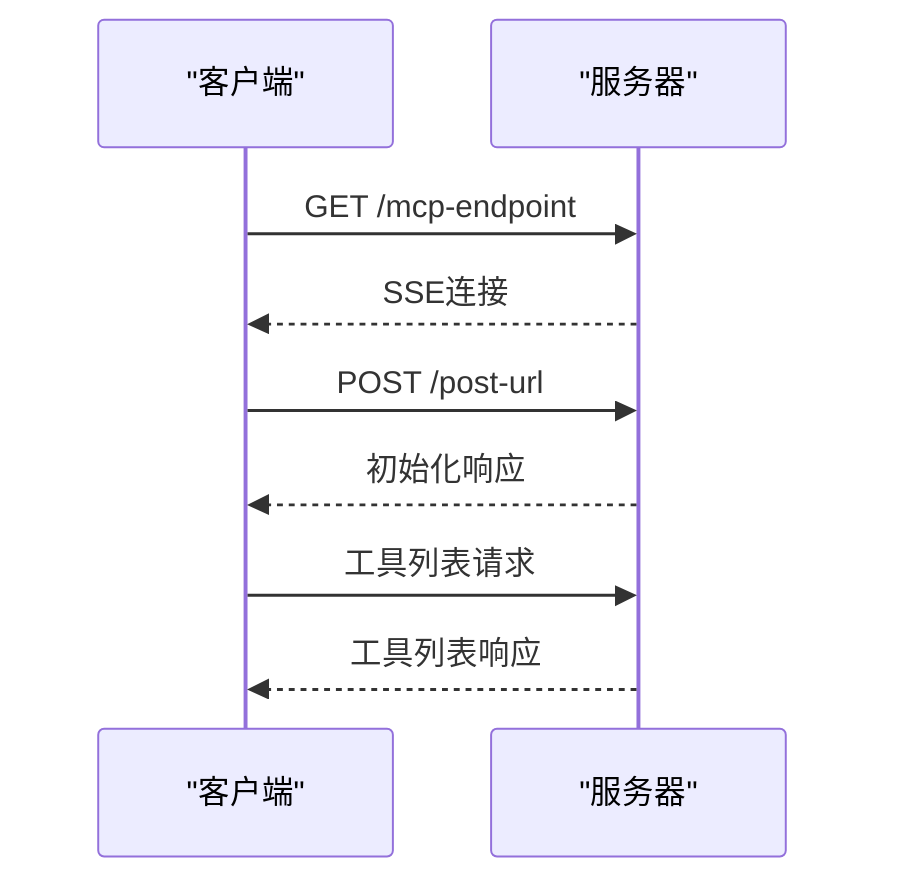
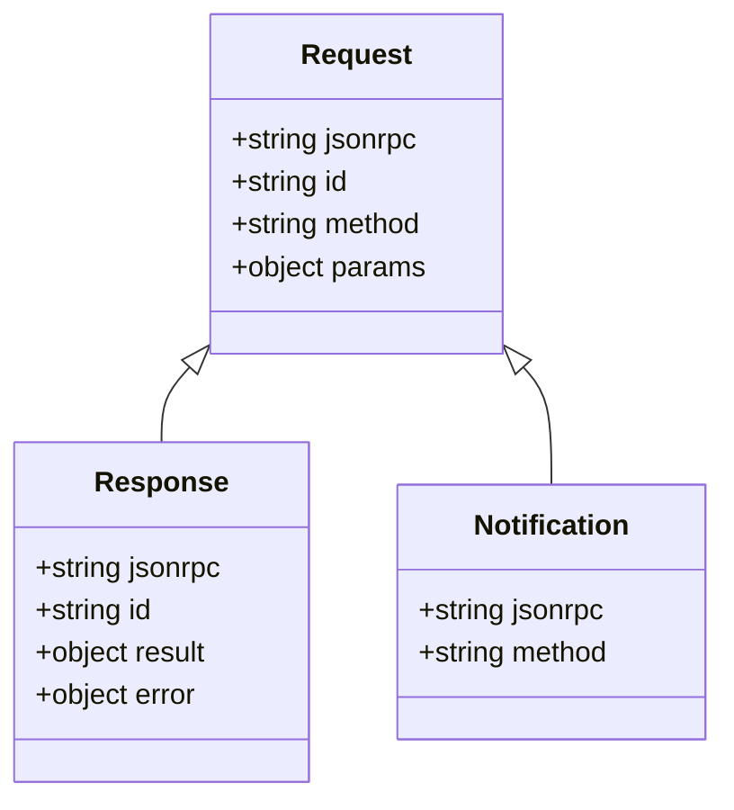
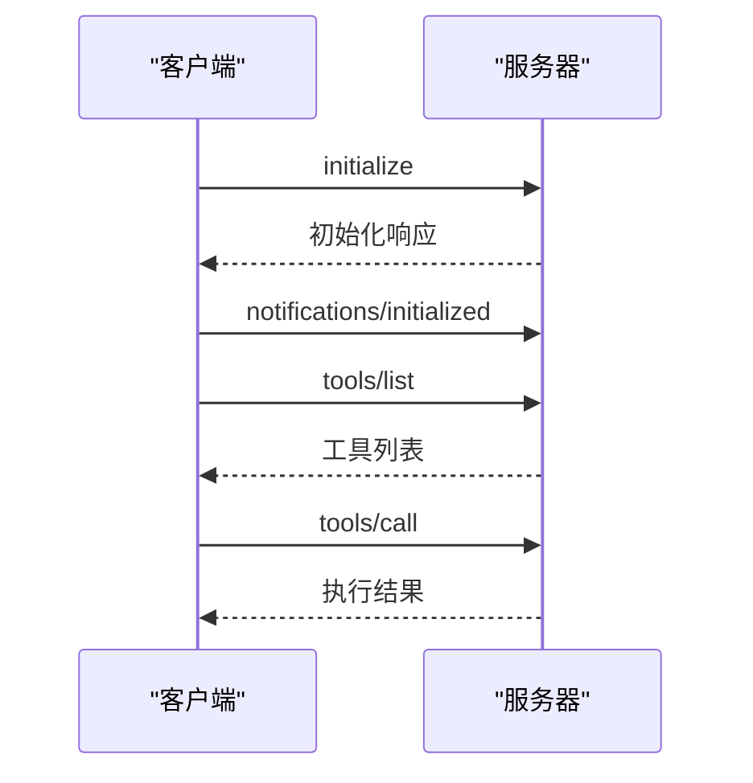
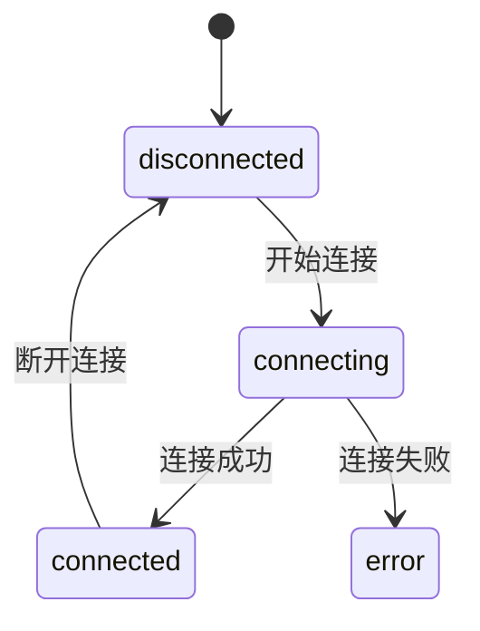

# MCP协议规范

<cite>
**本文档引用的文件**
- [mcp_manager.js](file://background/managers/mcp_manager.js)
- [mcp_controller.js](file://sandbox/controllers/mcp_controller.js)
- [manifest.json](file://manifest.json)
</cite>

## 目录
1. [简介](#简介)
2. [连接建立](#连接建立)
3. [消息格式](#消息格式)
4. [通信流程](#通信流程)
5. [JSON-RPC 2.0协议应用](#json-rpc-20协议应用)
6. [连接状态管理](#连接状态管理)
7. [错误处理机制](#错误处理机制)
8. [超时策略](#超时策略)
9. [协议版本兼容性](#协议版本兼容性)
10. [心跳机制与连接恢复](#心跳机制与连接恢复)

## 简介
MCP（Model Control Protocol）协议是一种用于客户端与服务器之间通信的协议，支持SSE（Server-Sent Events）和HTTP两种传输模式。该协议基于JSON-RPC 2.0标准，定义了服务端探测、端点发现、初始化握手和工具列表获取的完整生命周期。通过MCPManager类实现，确保客户端能够高效地与多个MCP服务器进行交互。

**Section sources**
- [mcp_manager.js](file://background/managers/mcp_manager.js#L1-L529)

## 连接建立
MCP协议支持两种传输模式：SSE和HTTP。连接建立过程包括服务端探测、端点发现和初始化握手。

### 服务端探测
客户端首先通过`fetch`请求探测服务器的响应类型。如果服务器返回JSON格式，则切换到HTTP模式；否则，继续使用SSE模式。

### 端点发现
在SSE模式下，客户端通过`EventSource`连接到服务器，并监听`endpoint`事件以获取POST URL。一旦收到POST URL，客户端即认为连接已建立。

### 初始化握手
连接建立后，客户端发送`initialize`请求，包含协议版本、客户端信息和能力声明。随后，客户端发送`notifications/initialized`通知，完成初始化握手。

**Diagram sources**
- [mcp_manager.js](file://background/managers/mcp_manager.js#L101-L145)

**Section sources**
- [mcp_manager.js](file://background/managers/mcp_manager.js#L71-L145)

## 消息格式
MCP协议的消息格式基于JSON-RPC 2.0标准，包括请求、响应和通知三种类型。

### 请求消息
请求消息包含`jsonrpc`、`id`、`method`和`params`字段。`jsonrpc`字段固定为"2.0"，`id`为唯一标识符，`method`为方法名，`params`为参数对象。

### 响应消息
响应消息包含`jsonrpc`、`id`和`result`或`error`字段。`result`字段为成功响应的结果，`error`字段为错误信息。

### 通知消息
通知消息不包含`id`字段，仅包含`jsonrpc`和`method`字段，用于单向通信。

**Diagram sources**
- [mcp_manager.js](file://background/managers/mcp_manager.js#L313-L317)

**Section sources**
- [mcp_manager.js](file://background/managers/mcp_manager.js#L308-L351)

## 通信流程
MCP协议的通信流程包括初始化、工具列表获取和工具调用三个阶段。

### 初始化
客户端发送`initialize`请求，服务器返回初始化响应。客户端随后发送`notifications/initialized`通知。

### 工具列表获取
客户端发送`tools/list`请求，服务器返回工具列表。客户端解析工具列表并存储。

### 工具调用
客户端根据用户请求调用相应的工具，发送`tools/call`请求，服务器返回执行结果。

**Diagram sources**
- [mcp_manager.js](file://background/managers/mcp_manager.js#L264-L284)

**Section sources**
- [mcp_manager.js](file://background/managers/mcp_manager.js#L262-L285)

## JSON-RPC 2.0协议应用
MCP协议基于JSON-RPC 2.0标准，定义了请求、响应和通知的结构。每个请求都有唯一的`id`，用于匹配响应。`method`字段指定要调用的方法，`params`字段包含方法参数。

### 请求/响应/通知消息结构
- **请求消息**：`{ "jsonrpc": "2.0", "id": "unique-id", "method": "method-name", "params": { ... } }`
- **响应消息**：`{ "jsonrpc": "2.0", "id": "unique-id", "result": { ... } }` 或 `{ "jsonrpc": "2.0", "id": "unique-id", "error": { ... } }`
- **通知消息**：`{ "jsonrpc": "2.0", "method": "method-name", "params": { ... } }`

**Section sources**
- [mcp_manager.js](file://background/managers/mcp_manager.js#L313-L317)

## 连接状态管理
MCPManager类维护每个服务器的连接状态，包括`disconnected`、`connecting`、`connected`和`error`四种状态。状态变化通过日志记录，便于调试。

### 状态转换
- `disconnected` -> `connecting`：开始连接
- `connecting` -> `connected`：连接成功
- `connecting` -> `error`：连接失败
- `connected` -> `disconnected`：断开连接

**Diagram sources**
- [mcp_manager.js](file://background/managers/mcp_manager.js#L35-L36)

**Section sources**
- [mcp_manager.js](file://background/managers/mcp_manager.js#L35-L36)

## 错误处理机制
MCP协议通过`error`字段传递错误信息。客户端在接收到错误响应时，会记录错误日志并采取相应措施，如重试或断开连接。

### 错误处理流程
1. 客户端发送请求
2. 服务器返回错误响应
3. 客户端记录错误日志
4. 根据错误类型决定是否重试或断开连接

**Section sources**
- [mcp_manager.js](file://background/managers/mcp_manager.js#L174-L178)

## 超时策略
MCP协议设置了10秒的超时时间。如果在超时时间内未收到响应，客户端将取消请求并记录超时错误。

### 超时处理
- 设置超时定时器
- 超时后取消请求
- 记录超时错误

**Section sources**
- [mcp_manager.js](file://background/managers/mcp_manager.js#L326-L329)

## 协议版本兼容性
MCP协议通过`protocolVersion`字段确保版本兼容性。客户端在初始化请求中指定协议版本，服务器根据版本号决定是否支持。

### 版本检查
- 客户端发送`initialize`请求，包含`protocolVersion`
- 服务器检查版本号
- 如果不支持，返回错误响应

**Section sources**
- [mcp_manager.js](file://background/managers/mcp_manager.js#L267)

## 心跳机制与连接恢复
MCP协议通过定期发送心跳消息保持连接活跃。如果连接中断，客户端会尝试重新连接。

### 心跳机制
- 定期发送心跳消息
- 服务器响应心跳消息
- 如果长时间未收到响应，断开连接

### 连接恢复
- 检测到连接中断
- 尝试重新连接
- 重新初始化握手

**Section sources**
- [mcp_manager.js](file://background/managers/mcp_manager.js#L118-L120)