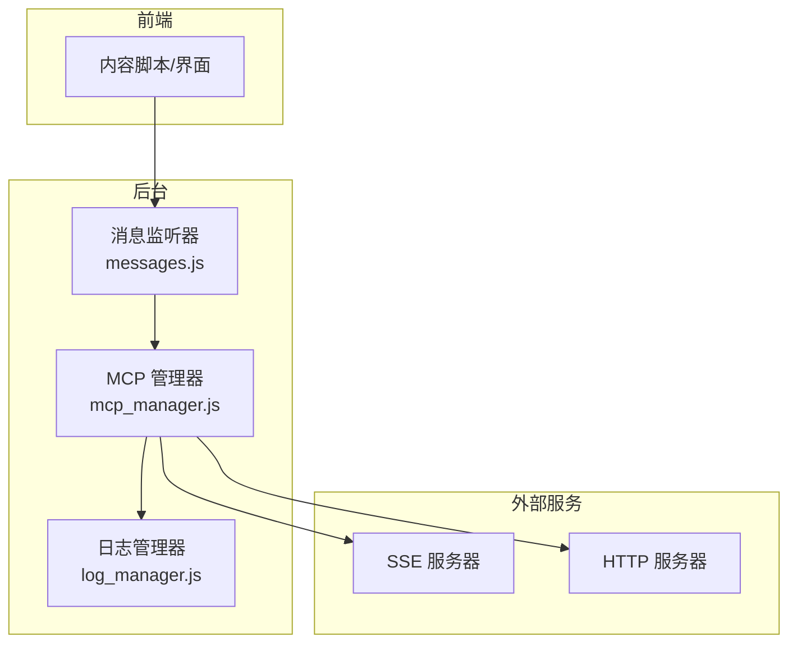
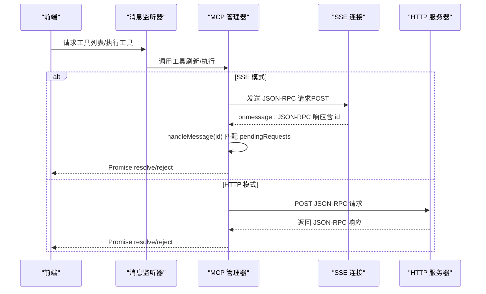
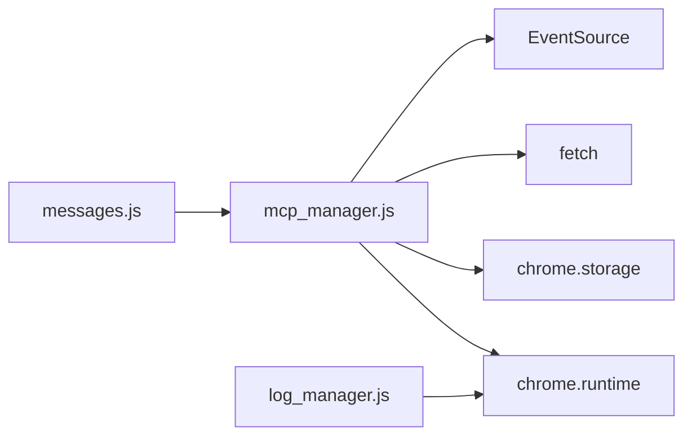

# 响应消息

<cite>
**本文引用的文件**
- [mcp_manager.js](file://background/managers/mcp_manager.js)
- [messages.js](file://background/messages.js)
- [logger.js](file://lib/logger.js)
- [log_manager.js](file://background/managers/log_manager.js)
</cite>

## 目录
1. [简介](#简介)
2. [项目结构](#项目结构)
3. [核心组件](#核心组件)
4. [架构总览](#架构总览)
5. [详细组件分析](#详细组件分析)
6. [依赖关系分析](#依赖关系分析)
7. [性能考量](#性能考量)
8. [故障排查指南](#故障排查指南)
9. [结论](#结论)
10. [附录：响应数据包示例与解析](#附录响应数据包示例与解析)

## 简介
本文件聚焦于 MCP 协议在本项目中的响应消息实现，围绕基于 JSON-RPC 2.0 的响应结构展开，详细说明：
- 响应体字段：jsonrpc 版本、与请求匹配的 id、result 结果数据、error 错误对象
- 响应通过 SSE 事件流传递的机制
- 如何通过 id 关联 pendingRequests 中的待处理 Promise
- 正常响应（resolve）与错误响应（reject）的处理流程
- 错误码、错误消息的封装规范
- 实际响应数据包示例，如 tools/list 返回的工具数组结构
- 多层嵌套响应（result.tools、result.result）的兼容性解析逻辑
- 响应验证、异常捕获与调试日志的最佳实践

## 项目结构
与响应消息直接相关的核心位置如下：
- 后台管理器负责连接、发送请求、接收 SSE 消息、解析响应并回调对应 Promise
- 消息通道用于前端与后台交互，触发工具列表刷新等操作
- 日志系统用于集中记录调试信息

图表来源
- [mcp_manager.js](file://background/managers/mcp_manager.js#L101-L145)
- [messages.js](file://background/messages.js#L14-L81)
- [log_manager.js](file://background/managers/log_manager.js#L1-L62)

章节来源
- [mcp_manager.js](file://background/managers/mcp_manager.js#L1-L530)
- [messages.js](file://background/messages.js#L1-L82)

## 核心组件
- MCP 管理器：负责连接服务器（SSE 或 HTTP）、发送请求、接收响应、解析 JSON-RPC 响应并通过 id 匹配 pendingRequests 完成 Promise 的 resolve/reject
- 消息监听器：为前端提供 MCP 配置、工具列表、状态查询等接口
- 日志系统：统一收集 INFO/WARN/ERROR 级别日志，便于调试

章节来源
- [mcp_manager.js](file://background/managers/mcp_manager.js#L2-L69)
- [messages.js](file://background/messages.js#L14-L81)
- [logger.js](file://lib/logger.js#L4-L52)
- [log_manager.js](file://background/managers/log_manager.js#L4-L61)

## 架构总览
下图展示了从发送请求到接收响应的关键流程，包括 SSE 事件流与 HTTP 直连两种模式下的响应路径。

图表来源
- [mcp_manager.js](file://background/managers/mcp_manager.js#L101-L145)
- [mcp_manager.js](file://background/managers/mcp_manager.js#L308-L351)
- [mcp_manager.js](file://background/managers/mcp_manager.js#L370-L385)

## 详细组件分析

### JSON-RPC 响应结构与字段定义
- jsonrpc：字符串，固定值为 "2.0"
- id：字符串或数字，必须与请求中的 id 完全一致，用于关联请求与响应
- result：当请求成功时返回；若请求为通知（无 id），则不返回 result
- error：当请求失败时返回；若请求成功，则不返回 error

上述字段遵循 JSON-RPC 2.0 规范。在本项目中，SSE 模式下响应由服务器通过 SSE 事件流推送，HTTP 模式下响应由服务器直接返回。

章节来源
- [mcp_manager.js](file://background/managers/mcp_manager.js#L312-L317)
- [mcp_manager.js](file://background/managers/mcp_manager.js#L357-L361)
- [mcp_manager.js](file://background/managers/mcp_manager.js#L370-L385)

### SSE 事件流传递机制
- 连接建立：使用 EventSource 订阅服务器端 SSE 地址
- 事件类型：
  - endpoint：首次连接时由服务器推送，携带 POST URL，后续所有请求均发往该地址
  - onmessage：常规 JSON-RPC 响应消息，包含 id、result 或 error
- 错误处理：SSE onerror 会记录错误并标记服务器状态为 error

章节来源
- [mcp_manager.js](file://background/managers/mcp_manager.js#L116-L144)

### 通过 id 关联 pendingRequests 的 Promise
- 发送请求时生成随机 id，并将 { resolve, reject, timeout } 存入 pendingRequests 映射
- 接收响应时，根据 message.id 在 pendingRequests 中查找对应项
- 若存在匹配项：
  - 若 message.error 存在：reject(error)
  - 否则：resolve(message.result)
- 清理：清除 pendingRequests 并取消超时

章节来源
- [mcp_manager.js](file://background/managers/mcp_manager.js#L324-L351)
- [mcp_manager.js](file://background/managers/mcp_manager.js#L370-L385)
- [mcp_manager.js](file://background/managers/mcp_manager.js#L528-L529)

### 正常响应与错误响应处理流程
- 正常响应（resolve）：message 中不含 error 字段，直接以 message.result 解析 Promise
- 错误响应（reject）：message 中包含 error 对象，reject(error)，错误对象通常包含 message 字段
- 超时：若超过 10 秒未收到响应，主动 reject("Timeout")

章节来源
- [mcp_manager.js](file://background/managers/mcp_manager.js#L324-L351)
- [mcp_manager.js](file://background/managers/mcp_manager.js#L376-L379)

### 错误码与错误消息封装规范
- 错误对象结构：包含 message 字段（字符串），部分服务器可能包含其他字段
- 封装方式：当服务器返回 result.error 时，统一抛出错误，错误消息优先使用 result.error.message，否则序列化整个 error 对象
- HTTP 模式下：若 HTTP 响应非 2xx，也会抛出错误

章节来源
- [mcp_manager.js](file://background/managers/mcp_manager.js#L174-L178)
- [mcp_manager.js](file://background/managers/mcp_manager.js#L255-L257)
- [mcp_manager.js](file://background/managers/mcp_manager.js#L340-L342)

### tools/list 响应的数据结构与兼容解析
- 标准 JSON-RPC：{ result: { tools: [...] } }
- 兼容格式：
  - { tools: [...] }
  - { result: [...] }
  - [...]
- 解析逻辑：按顺序尝试多种格式，找到 tools 数组后赋给服务器工具列表

章节来源
- [mcp_manager.js](file://background/managers/mcp_manager.js#L184-L200)

### 多层嵌套响应的兼容性解析
- 支持 result.result.tools、result.tools、result、数组等多层结构
- 通过逐级判断字段是否存在并为数组，确保不同服务器实现的差异都能被正确识别

章节来源
- [mcp_manager.js](file://background/managers/mcp_manager.js#L181-L200)

### 响应验证与异常捕获
- SSE 消息解析：对每条 onmessage 的 event.data 进行 JSON.parse，失败时记录错误
- HTTP 模式：对响应进行 res.ok 判断，非 2xx 抛错
- 工具列表刷新：对服务器返回的错误进行处理，避免污染工具列表

章节来源
- [mcp_manager.js](file://background/managers/mcp_manager.js#L135-L142)
- [mcp_manager.js](file://background/managers/mcp_manager.js#L248-L250)
- [mcp_manager.js](file://background/managers/mcp_manager.js#L173-L179)

### 调试日志最佳实践
- 统一使用 Logger 类输出 INFO/WARN/ERROR 级别日志
- 日志通过 chrome.runtime.sendMessage 或父窗口 postMessage 转发至后台
- 后台 LogManager 将日志持久化存储，支持获取与清理

章节来源
- [logger.js](file://lib/logger.js#L4-L52)
- [log_manager.js](file://background/managers/log_manager.js#L4-L61)

## 依赖关系分析
- MCP 管理器依赖：
  - 浏览器 EventSource（SSE）
  - fetch API（HTTP/POST）
  - chrome.storage（配置持久化）
  - chrome.runtime（消息转发）
- 消息监听器依赖 MCP 管理器提供工具列表与状态查询能力

图表来源
- [mcp_manager.js](file://background/managers/mcp_manager.js#L101-L145)
- [messages.js](file://background/messages.js#L14-L81)
- [log_manager.js](file://background/managers/log_manager.js#L12-L45)

章节来源
- [mcp_manager.js](file://background/managers/mcp_manager.js#L1-L530)
- [messages.js](file://background/messages.js#L1-L82)

## 性能考量
- 超时控制：Promise 设置 10 秒超时，避免长时间占用内存
- 事件流解析：对每条 SSE 消息进行 JSON 解析，建议在服务器端保证消息格式稳定
- 工具列表解析：对多种响应格式进行兼容解析，避免因服务器差异导致失败
- 日志开销：日志统一转发与持久化，注意在高频场景下的存储压力

## 故障排查指南
- SSE 连接失败
  - 检查服务器是否返回 application/json；若是，将自动切换到 HTTP 模式
  - 查看 onerror 回调与状态标记
- 响应未到达或超时
  - 确认服务器是否通过 SSE 推送响应（SSE 模式）
  - 确认 endpoint 事件是否已收到并更新 postUrl
  - 检查 pendingRequests 是否存在对应 id
- 错误响应
  - 查看 message.error 的 message 字段
  - 若为 HTTP 模式，检查 HTTP 状态码
- 工具列表为空
  - 检查 tools/list 的响应格式是否符合兼容解析规则
  - 查看日志中“Could not parse tools from response”提示

章节来源
- [mcp_manager.js](file://background/managers/mcp_manager.js#L106-L113)
- [mcp_manager.js](file://background/managers/mcp_manager.js#L122-L125)
- [mcp_manager.js](file://background/managers/mcp_manager.js#L326-L329)
- [mcp_manager.js](file://background/managers/mcp_manager.js#L181-L200)
- [mcp_manager.js](file://background/managers/mcp_manager.js#L173-L179)

## 结论
本项目严格遵循 JSON-RPC 2.0 的响应结构，结合 SSE 事件流与 HTTP 直连两种传输模式，实现了对 MCP 协议响应的可靠解析与 Promise 关联。通过多格式兼容解析与完善的错误处理，系统能够适配不同服务器的实现差异，并提供清晰的日志与调试信息，便于问题定位与优化。

## 附录：响应数据包示例与解析
以下为常见响应场景与解析要点（以路径代替具体代码片段）：
- tools/list 响应（SSE/HTTP）
  - 标准格式：result.result.tools 为工具数组
  - 兼容格式：result.tools、result、数组
  - 解析路径参考：[tools/list 解析逻辑](file://background/managers/mcp_manager.js#L181-L200)
- 执行工具响应（SSE/HTTP）
  - 成功：message.result 通常包含 content 等字段
  - 失败：message.error 包含 message 等字段
  - Promise 关联：[handleMessage 匹配与 resolve/reject](file://background/managers/mcp_manager.js#L370-L385)
- HTTP 模式下的直接响应
  - 请求：sendRequestHttp 构造 JSON-RPC 请求
  - 响应：若 result.error 存在则抛错，否则返回 result.result
  - 参考路径：[sendRequestHttp](file://background/managers/mcp_manager.js#L229-L260)