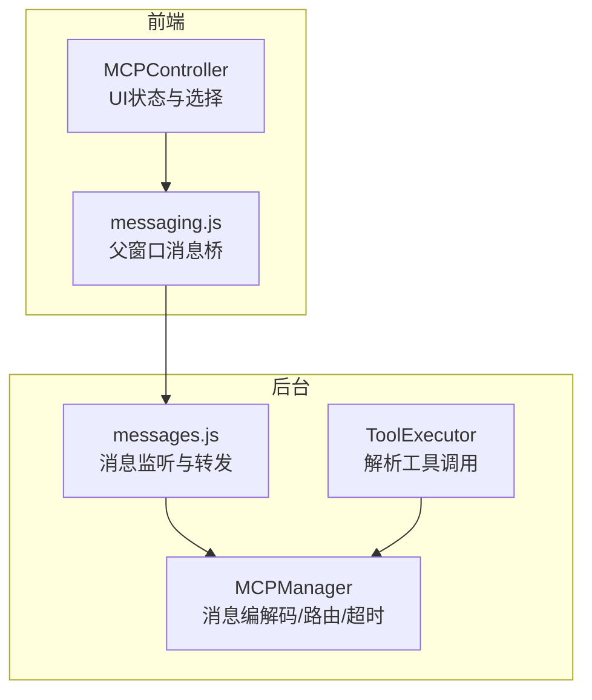
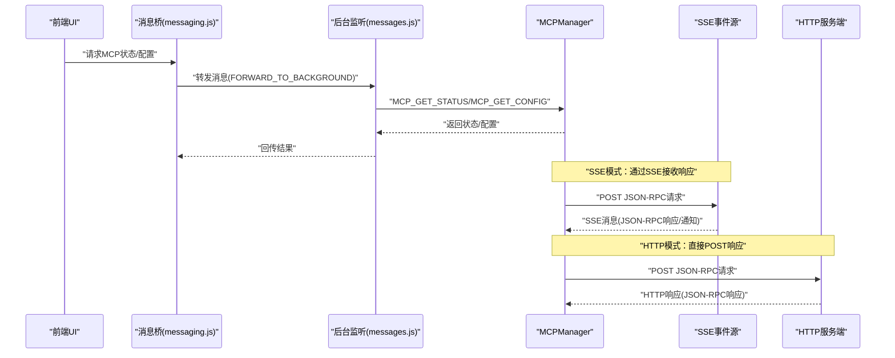
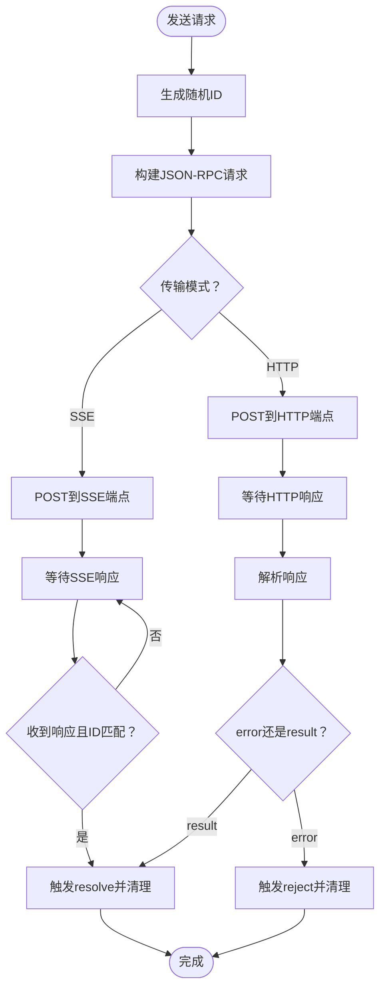
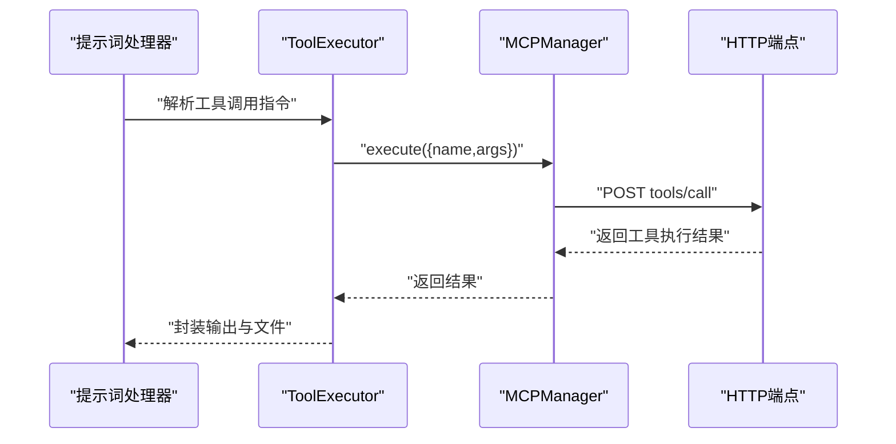
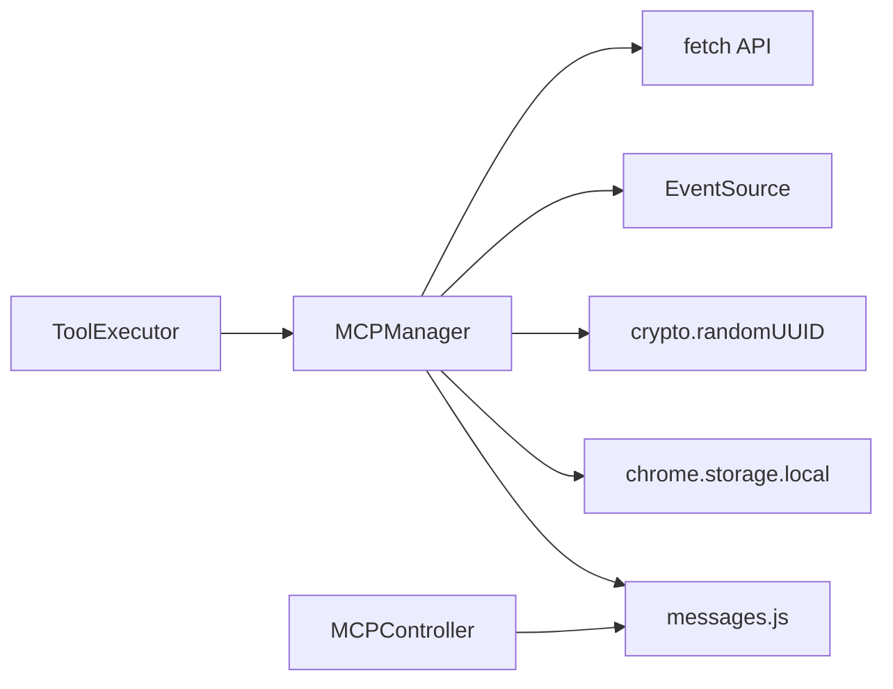

# 消息格式

<cite>
**本文档引用的文件**
- [mcp_manager.js](file://background/managers/mcp_manager.js)
- [messages.js](file://background/messages.js)
- [messaging.js](file://lib/messaging.js)
- [tool_executor.js](file://background/handlers/session/prompt/tool_executor.js)
- [utils.js](file://background/handlers/session/utils.js)
- [mcp_controller.js](file://sandbox/controllers/mcp_controller.js)
</cite>

## 目录
1. [简介](#简介)
2. [项目结构与角色定位](#项目结构与角色定位)
3. [核心组件与职责](#核心组件与职责)
4. [架构总览](#架构总览)
5. [消息类型详解](#消息类型详解)
6. [依赖关系分析](#依赖关系分析)
7. [性能与可靠性特性](#性能与可靠性特性)
8. [故障排查指南](#故障排查指南)
9. [结论](#结论)
10. [附录：最佳实践与扩展建议](#附录最佳实践与扩展建议)

## 简介
本文件面向实现与集成人员，系统化阐述本项目中基于 JSON-RPC 2.0 的 MCP 协议消息格式与交互流程。重点覆盖：
- 请求、响应与通知三类消息的结构与语义
- 方法命名规范与参数序列化规则
- 工具调用（tools/call）、工具列表（tools/list）与会话初始化（initialize/notifications/initialized）等核心方法的请求/响应模式
- 消息验证、超时处理与异常消息处理机制
- 消息序列化/反序列化实现细节
- 消息压缩、二进制数据处理与扩展性考虑

## 项目结构与角色定位
- 背景管理器负责与 MCP 服务器建立连接、发送请求/通知、解析响应与工具列表，并维护会话状态。
- 前端控制器负责在 UI 中展示 MCP 服务器状态、工具数量等信息。
- 消息桥接模块负责前后台消息转发与存储读写。
- 工具执行器负责从模型输出中解析工具调用指令并委派给 MCP 管理器执行。

图表来源
- [mcp_manager.js](file://background/managers/mcp_manager.js#L1-L530)
- [messages.js](file://background/messages.js#L1-L82)
- [messaging.js](file://lib/messaging.js#L1-L96)
- [tool_executor.js](file://background/handlers/session/prompt/tool_executor.js#L1-L49)
- [mcp_controller.js](file://sandbox/controllers/mcp_controller.js#L1-L221)

章节来源
- [mcp_manager.js](file://background/managers/mcp_manager.js#L1-L530)
- [messages.js](file://background/messages.js#L1-L82)
- [messaging.js](file://lib/messaging.js#L1-L96)
- [tool_executor.js](file://background/handlers/session/prompt/tool_executor.js#L1-L49)
- [mcp_controller.js](file://sandbox/controllers/mcp_controller.js#L1-L221)

## 核心组件与职责
- MCPManager：负责连接管理、SSE/HTTP 模式探测、请求/通知发送、响应等待与超时、工具列表刷新、会话初始化与通知。
- messages.js：注册后台消息监听，对接 MCP 配置、工具查询与状态获取。
- messaging.js：提供与父窗口通信的统一消息桥接口。
- ToolExecutor：从模型输出中解析工具调用指令并委派执行。
- MCPController：前端 MCP 服务器选择与状态展示。

章节来源
- [mcp_manager.js](file://background/managers/mcp_manager.js#L1-L530)
- [messages.js](file://background/messages.js#L1-L82)
- [messaging.js](file://lib/messaging.js#L1-L96)
- [tool_executor.js](file://background/handlers/session/prompt/tool_executor.js#L1-L49)
- [mcp_controller.js](file://sandbox/controllers/mcp_controller.js#L1-L221)

## 架构总览
下图展示了 MCP 消息在不同传输模式下的流转路径与关键处理点。

图表来源
- [mcp_manager.js](file://background/managers/mcp_manager.js#L71-L150)
- [mcp_manager.js](file://background/managers/mcp_manager.js#L308-L351)
- [messaging.js](file://lib/messaging.js#L4-L9)
- [messages.js](file://background/messages.js#L14-L81)

## 消息类型详解

### 通用消息结构（JSON-RPC 2.0）
所有 MCP 消息遵循 JSON-RPC 2.0 规范，字段如下：
- jsonrpc: 字符串，固定为 "2.0"
- id: 字符串或数字，请求消息必须包含唯一标识；通知消息不包含 id
- method: 字符串，方法名
- params: 对象或数组，方法参数
- result: 响应结果对象（仅出现在响应消息）
- error: 错误对象（仅出现在响应消息）

字段约束与行为：
- 请求消息必须包含 id，用于响应匹配与超时处理
- 通知消息不包含 id，服务器不会产生对应响应
- 响应消息必须包含 result 或 error，二者互斥
- 参数 params 支持对象或数组，具体取决于方法定义

章节来源
- [mcp_manager.js](file://background/managers/mcp_manager.js#L312-L317)
- [mcp_manager.js](file://background/managers/mcp_manager.js#L357-L361)
- [mcp_manager.js](file://background/managers/mcp_manager.js#L370-L385)

### 请求消息（Request）
- 发送时机：客户端向服务器发起请求，等待响应
- 关键点：
  - 使用随机唯一 id（UUID）作为消息标识
  - 超时时间为 10 秒，超时后抛出错误并清理挂起请求
  - 通过 pendingRequests 映射进行响应匹配与回调触发
  - 传输模式：
    - SSE：请求通过 HTTP POST 发送，响应通过 SSE 推送
    - HTTP：请求通过 HTTP POST 发送，响应直接返回

图表来源
- [mcp_manager.js](file://background/managers/mcp_manager.js#L308-L351)
- [mcp_manager.js](file://background/managers/mcp_manager.js#L370-L385)

章节来源
- [mcp_manager.js](file://background/managers/mcp_manager.js#L308-L351)
- [mcp_manager.js](file://background/managers/mcp_manager.js#L370-L385)

### 响应消息（Response）
- 成功响应：包含 result 字段
- 失败响应：包含 error 字段
- 匹配机制：根据 id 在 pendingRequests 中查找对应回调
- 超时处理：10 秒未收到响应则 reject 并清理映射

章节来源
- [mcp_manager.js](file://background/managers/mcp_manager.js#L370-L385)

### 通知消息（Notification）
- 不包含 id
- 服务器向客户端推送，客户端无需响应
- 示例：notifications/initialized

章节来源
- [mcp_manager.js](file://background/managers/mcp_manager.js#L353-L368)
- [mcp_manager.js](file://background/managers/mcp_manager.js#L279-L281)

### 方法命名规范
- initialize：会话初始化请求
- notifications/initialized：会话初始化完成通知
- tools/list：获取工具列表
- tools/call：调用指定工具

章节来源
- [mcp_manager.js](file://background/managers/mcp_manager.js#L264-L284)
- [mcp_manager.js](file://background/managers/mcp_manager.js#L295-L297)
- [mcp_manager.js](file://background/managers/mcp_manager.js#L510-L516)

### 参数序列化与反序列化
- 序列化：请求体通过 JSON.stringify 进行序列化
- 反序列化：响应体通过 JSON.parse 进行反序列化
- 参数结构：
  - tools/list：无参数
  - tools/call：包含 name 与 arguments
  - initialize：包含 protocolVersion、capabilities、clientInfo

章节来源
- [mcp_manager.js](file://background/managers/mcp_manager.js#L159-L171)
- [mcp_manager.js](file://background/managers/mcp_manager.js#L233-L238)
- [mcp_manager.js](file://background/managers/mcp_manager.js#L264-L276)
- [mcp_manager.js](file://background/managers/mcp_manager.js#L510-L516)

### 工具调用（tools/call）请求/响应模式
- 请求：method 为 tools/call，params 包含 name 与 arguments
- 响应：通常包含 content（数组，元素类型为 text 等）与 isError 标记
- 执行路径：ToolExecutor 解析模型输出中的工具调用指令，MCPManager 执行工具调用并返回结果

图表来源
- [tool_executor.js](file://background/handlers/session/prompt/tool_executor.js#L9-L47)
- [mcp_manager.js](file://background/managers/mcp_manager.js#L479-L525)

章节来源
- [tool_executor.js](file://background/handlers/session/prompt/tool_executor.js#L1-L49)
- [mcp_manager.js](file://background/managers/mcp_manager.js#L479-L525)

### 工具列表（tools/list）请求/响应模式
- 请求：method 为 tools/list，无 params
- 响应：支持多种格式兼容解析，最终填充到服务器工具列表
- 兼容格式：
  - { result: { tools: [...] } }
  - { tools: [...] }
  - { result: [...] }
  - [...]
- 失败：若服务器返回 error 字段，状态标记为 error 并清空工具列表

章节来源
- [mcp_manager.js](file://background/managers/mcp_manager.js#L159-L213)
- [mcp_manager.js](file://background/managers/mcp_manager.js#L174-L179)

### 会话初始化（initialize/notifications/initialized）
- initialize：客户端向服务器发送初始化请求，包含 protocolVersion、capabilities、clientInfo
- notifications/initialized：客户端在初始化完成后发送通知，表示会话已就绪
- 初始化流程：先发送 initialize，再发送 notifications/initialized，最后拉取工具列表

章节来源
- [mcp_manager.js](file://background/managers/mcp_manager.js#L262-L284)

### 消息验证与错误处理
- 消息解析：SSE 消息通过 JSON.parse 解析，失败则记录错误
- HTTP 模式探测：若服务器返回 application/json，则切换至 HTTP 模式
- 错误响应：若响应包含 error 字段，抛出错误或 reject Promise
- 工具刷新：兼容多种响应格式，解析失败则清空工具列表并记录警告

章节来源
- [mcp_manager.js](file://background/managers/mcp_manager.js#L135-L142)
- [mcp_manager.js](file://background/managers/mcp_manager.js#L106-L113)
- [mcp_manager.js](file://background/managers/mcp_manager.js#L174-L179)
- [mcp_manager.js](file://background/managers/mcp_manager.js#L255-L257)

### 超时处理机制
- 请求发送后启动 10 秒定时器
- 若在超时前收到匹配 id 的响应，则清除定时器并 resolve/reject
- 若超时未收到响应，则清理 pendingRequests 并 reject

章节来源
- [mcp_manager.js](file://background/managers/mcp_manager.js#L324-L329)
- [mcp_manager.js](file://background/managers/mcp_manager.js#L345-L349)

### 异常消息处理
- SSE 消息解析失败：记录错误并忽略该条消息
- HTTP 错误：抛出包含状态码的错误
- 工具列表解析失败：记录警告并清空工具列表
- 未准备好的服务器：直接抛出“Server not ready”错误

章节来源
- [mcp_manager.js](file://background/managers/mcp_manager.js#L139-L141)
- [mcp_manager.js](file://background/managers/mcp_manager.js#L340-L342)
- [mcp_manager.js](file://background/managers/mcp_manager.js#L210-L212)
- [mcp_manager.js](file://background/managers/mcp_manager.js#L310)

### 实际数据包示例（路径引用）
以下为常见消息的示例路径（不直接展示具体内容）：
- initialize 请求示例：[initialize 请求](file://background/managers/mcp_manager.js#L264-L276)
- notifications/initialized 通知示例：[initialized 通知](file://background/managers/mcp_manager.js#L279-L281)
- tools/list 请求示例：[tools/list 请求](file://background/managers/mcp_manager.js#L295-L297)
- tools/call 请求示例：[tools/call 请求](file://background/managers/mcp_manager.js#L510-L516)
- HTTP 模式 tools/list 响应示例：[HTTP tools/list 响应](file://background/managers/mcp_manager.js#L159-L171)
- 工具调用响应示例：[工具调用响应](file://background/managers/mcp_manager.js#L523-L525)

章节来源
- [mcp_manager.js](file://background/managers/mcp_manager.js#L264-L284)
- [mcp_manager.js](file://background/managers/mcp_manager.js#L295-L297)
- [mcp_manager.js](file://background/managers/mcp_manager.js#L510-L525)
- [mcp_manager.js](file://background/managers/mcp_manager.js#L159-L171)

### 消息序列化与反序列化实现细节
- 序列化：使用 JSON.stringify 将请求体转换为字符串
- 反序列化：使用 JSON.parse 将响应体转换为对象
- 参数校验：对工具列表响应尝试多种格式解析，确保兼容性

章节来源
- [mcp_manager.js](file://background/managers/mcp_manager.js#L159-L171)
- [mcp_manager.js](file://background/managers/mcp_manager.js#L242-L246)
- [mcp_manager.js](file://background/managers/mcp_manager.js#L334-L338)

## 依赖关系分析
- MCPManager 依赖：
  - 浏览器 fetch API 进行 HTTP 传输
  - EventSource 进行 SSE 连接与消息监听
  - crypto.randomUUID 生成请求 id
  - 存储与消息桥接模块进行配置与状态交互
- ToolExecutor 依赖 MCPManager 执行工具调用
- 前端 MCPController 依赖 messaging.js 与 messages.js 获取与展示状态

图表来源
- [mcp_manager.js](file://background/managers/mcp_manager.js#L1-L530)
- [messages.js](file://background/messages.js#L1-L82)
- [messaging.js](file://lib/messaging.js#L1-L96)
- [tool_executor.js](file://background/handlers/session/prompt/tool_executor.js#L1-L49)
- [mcp_controller.js](file://sandbox/controllers/mcp_controller.js#L1-L221)

章节来源
- [mcp_manager.js](file://background/managers/mcp_manager.js#L1-L530)
- [messages.js](file://background/messages.js#L1-L82)
- [messaging.js](file://lib/messaging.js#L1-L96)
- [tool_executor.js](file://background/handlers/session/prompt/tool_executor.js#L1-L49)
- [mcp_controller.js](file://sandbox/controllers/mcp_controller.js#L1-L221)

## 性能与可靠性特性
- 传输模式自适应：优先尝试 SSE，若服务器返回 JSON 则切换至 HTTP，提升兼容性
- 超时控制：统一 10 秒超时，避免长时间阻塞
- 响应匹配：通过 id 映射实现请求与响应的可靠关联
- 工具列表兼容解析：支持多种响应格式，增强鲁棒性
- UI 状态反馈：前端 MCPController 展示服务器状态与工具数量，便于用户感知

章节来源
- [mcp_manager.js](file://background/managers/mcp_manager.js#L106-L113)
- [mcp_manager.js](file://background/managers/mcp_manager.js#L324-L329)
- [mcp_manager.js](file://background/managers/mcp_manager.js#L181-L200)
- [mcp_controller.js](file://sandbox/controllers/mcp_controller.js#L96-L136)

## 故障排查指南
- SSE 连接失败：检查服务器 URL 与网络连通性，查看错误日志
- HTTP 模式切换：若服务器返回 JSON，确认是否为标准 MCP HTTP 端点
- 工具列表为空：检查服务器是否正确返回 tools 列表，确认响应格式兼容
- 请求超时：检查服务器处理能力与网络延迟，必要时增加超时时间
- 通知未生效：确认 notifications/initialized 是否正确发送
- 工具调用失败：检查工具名称与参数，确认服务器存在该工具

章节来源
- [mcp_manager.js](file://background/managers/mcp_manager.js#L118-L125)
- [mcp_manager.js](file://background/managers/mcp_manager.js#L106-L113)
- [mcp_manager.js](file://background/managers/mcp_manager.js#L181-L200)
- [mcp_manager.js](file://background/managers/mcp_manager.js#L324-L329)
- [mcp_manager.js](file://background/managers/mcp_manager.js#L279-L281)
- [mcp_manager.js](file://background/managers/mcp_manager.js#L501-L506)

## 结论
本项目基于 JSON-RPC 2.0 实现了 MCP 协议的消息编解码与传输适配，通过 SSE/HTTP 自适应与严格的请求/响应匹配机制，提供了稳定可靠的工具调用与会话初始化能力。同时，对多种响应格式的兼容解析与超时控制进一步增强了系统的健壮性与可用性。

## 附录：最佳实践与扩展建议
- 消息压缩与二进制数据处理
  - 建议在传输层启用 gzip/deflate 压缩，减少带宽占用
  - 对于大体积二进制数据（如图像），优先采用流式传输或外部链接引用，避免在 JSON 中嵌入大块 Base64 数据
- 扩展性考虑
  - 新增方法时，保持 method 命名清晰且与现有命名规范一致
  - 对于复杂参数，建议在 params 中使用结构化对象，并在客户端与服务器之间约定版本兼容策略
  - 对于高并发场景，建议引入请求队列与重试机制，结合指数退避策略提升稳定性
- 安全与验证
  - 对所有输入参数进行严格校验，防止注入与越界访问
  - 对敏感参数（如凭据）避免在日志中打印明文
- 可观测性
  - 记录关键事件（连接、请求、响应、错误）的时间戳与上下文，便于问题定位
  - 提供统一的日志接口，支持按级别与上下文过滤