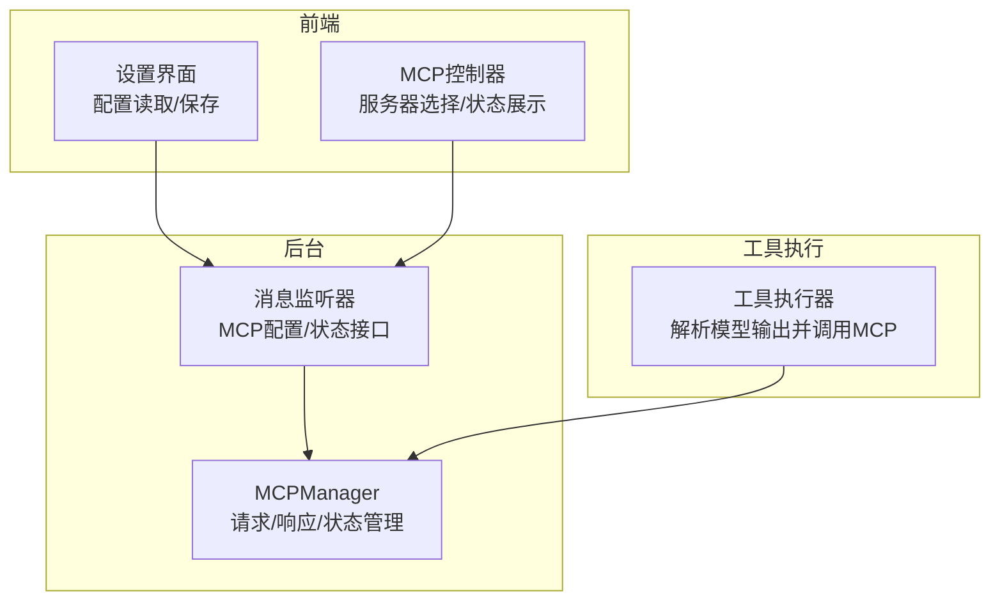
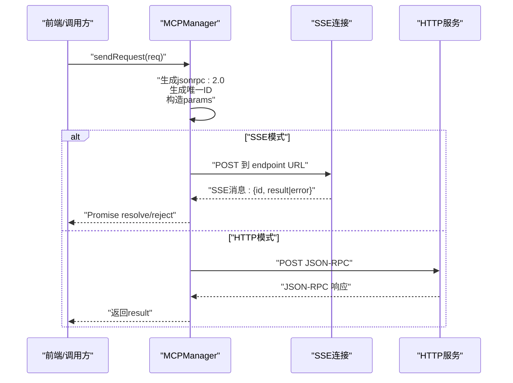
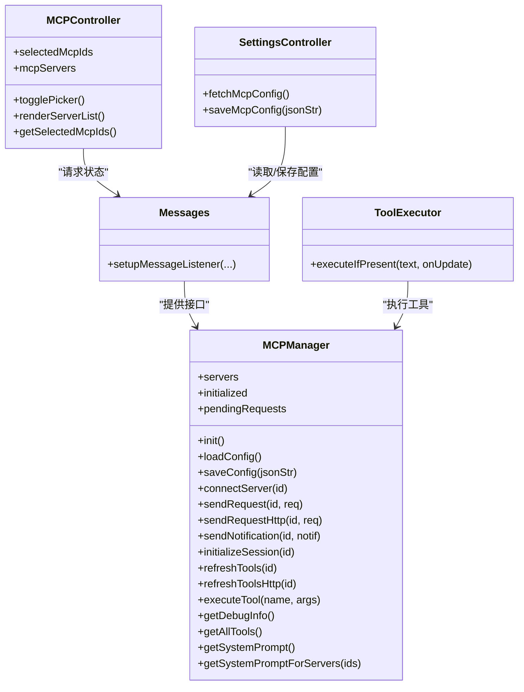

# 请求消息

<cite>
**本文引用的文件**
- [mcp_manager.js](file://background/managers/mcp_manager.js)
- [messages.js](file://background/messages.js)
- [mcp_controller.js](file://sandbox/controllers/mcp_controller.js)
- [settings.js](file://sandbox/ui/settings.js)
- [tool_executor.js](file://background/handlers/session/prompt/tool_executor.js)
</cite>

## 目录
1. [简介](#简介)
2. [项目结构](#项目结构)
3. [核心组件](#核心组件)
4. [架构总览](#架构总览)
5. [详细组件分析](#详细组件分析)
6. [依赖关系分析](#依赖关系分析)
7. [性能考虑](#性能考虑)
8. [故障排查指南](#故障排查指南)
9. [结论](#结论)
10. [附录](#附录)

## 简介
本文件聚焦于MCP（Model Context Protocol）协议的请求消息实现，围绕基于JSON-RPC 2.0标准的请求结构展开，详细说明：
- 请求体字段：jsonrpc版本标识、唯一ID生成机制（使用crypto.randomUUID()）、method方法命名规范（如tools/call、initialize）以及params参数序列化格式要求
- 传输模式差异：SSE与HTTP两种模式下请求的发送方式与行为差异
- 典型请求场景：initialize会话初始化请求与tools/list工具列表请求的数据结构
- 实际HTTP POST载荷示例路径与说明
- 超时处理机制（10秒）与请求状态管理（pendingRequests映射）
- 错误处理策略、性能优化建议及与响应消息的关联机制

## 项目结构
与MCP请求消息直接相关的核心位置如下：
- 后台管理器：负责连接、请求发送、响应处理与状态管理
- 消息路由：后台消息监听器，提供MCP配置与状态查询接口
- 前端控制器：用于选择MCP服务器并在UI中展示状态
- 设置界面：提供MCP配置的读取、保存与校验
- 工具执行器：将模型输出解析为工具调用并触发MCP请求

图表来源
- [mcp_manager.js](file://background/managers/mcp_manager.js#L1-L530)
- [messages.js](file://background/messages.js#L1-L82)
- [mcp_controller.js](file://sandbox/controllers/mcp_controller.js#L1-L221)
- [settings.js](file://sandbox/ui/settings.js#L1-L249)
- [tool_executor.js](file://background/handlers/session/prompt/tool_executor.js#L1-L49)

章节来源
- [mcp_manager.js](file://background/managers/mcp_manager.js#L1-L530)
- [messages.js](file://background/messages.js#L1-L82)
- [mcp_controller.js](file://sandbox/controllers/mcp_controller.js#L1-L221)
- [settings.js](file://sandbox/ui/settings.js#L1-L249)
- [tool_executor.js](file://background/handlers/session/prompt/tool_executor.js#L1-L49)

## 核心组件
- MCPManager：负责MCP服务器连接、请求发送（SSE/HTTP双模式）、响应处理与请求状态管理（pendingRequests）
- 消息监听器：提供MCP配置读取、保存、工具列表获取、状态查询等接口
- MCP控制器：前端侧服务器选择与状态展示
- 设置界面：MCP配置的可视化编辑与保存
- 工具执行器：从模型输出中提取工具调用并调用MCP执行

章节来源
- [mcp_manager.js](file://background/managers/mcp_manager.js#L1-L530)
- [messages.js](file://background/messages.js#L1-L82)
- [mcp_controller.js](file://sandbox/controllers/mcp_controller.js#L1-L221)
- [settings.js](file://sandbox/ui/settings.js#L1-L249)
- [tool_executor.js](file://background/handlers/session/prompt/tool_executor.js#L1-L49)

## 架构总览
MCP请求在两种传输模式下的发送流程如下：
- SSE模式：通过EventSource建立SSE连接，接收endpoint事件以获得POST URL；随后通过fetch向该URL发送JSON-RPC请求；响应通过SSE消息事件返回，由MCPManager根据请求ID匹配并resolve/reject对应的Promise
- HTTP模式：直接使用HTTP POST到指定URL，等待服务器返回JSON-RPC响应；适用于streamable_http或http类型

图表来源
- [mcp_manager.js](file://background/managers/mcp_manager.js#L308-L351)
- [mcp_manager.js](file://background/managers/mcp_manager.js#L229-L260)

## 详细组件分析

### JSON-RPC请求结构与字段规范
- jsonrpc：固定为"2.0"
- id：使用crypto.randomUUID()生成的唯一字符串，用于请求与响应的关联
- method：字符串，遵循MCP方法命名约定，如"initialize"、"tools/list"、"tools/call"
- params：对象或空对象{}，包含方法所需的参数
- 响应格式：标准JSON-RPC 2.0响应，包含result或error字段；SSE模式下响应通过SSE消息传递，HTTP模式下直接返回

章节来源
- [mcp_manager.js](file://background/managers/mcp_manager.js#L312-L317)
- [mcp_manager.js](file://background/managers/mcp_manager.js#L233-L238)
- [mcp_manager.js](file://background/managers/mcp_manager.js#L162-L167)

### 唯一ID生成机制
- 使用crypto.randomUUID()生成请求ID，确保全局唯一性，避免并发请求之间的混淆
- 在pendingRequests映射中以id为键存储Promise的resolve/reject函数与超时句柄，用于响应到达时进行匹配与清理

章节来源
- [mcp_manager.js](file://background/managers/mcp_manager.js#L314-L314)
- [mcp_manager.js](file://background/managers/mcp_manager.js#L235-L235)
- [mcp_manager.js](file://background/managers/mcp_manager.js#L324-L331)
- [mcp_manager.js](file://background/managers/mcp_manager.js#L528-L529)

### 方法命名规范
- initialize：会话初始化请求，包含protocolVersion、capabilities与clientInfo
- notifications/initialized：通知服务器客户端已就绪
- tools/list：获取可用工具列表
- tools/call：调用具体工具，params包含name与arguments

章节来源
- [mcp_manager.js](file://background/managers/mcp_manager.js#L264-L276)
- [mcp_manager.js](file://background/managers/mcp_manager.js#L279-L281)
- [mcp_manager.js](file://background/managers/mcp_manager.js#L295-L297)
- [mcp_manager.js](file://background/managers/mcp_manager.js#L510-L516)

### params参数序列化格式要求
- params必须为对象或空对象{}，不支持原始值
- tools/call的arguments应为对象，包含工具所需的参数键值对
- tools/list的params为空对象

章节来源
- [mcp_manager.js](file://background/managers/mcp_manager.js#L316-L316)
- [mcp_manager.js](file://background/managers/mcp_manager.js#L237-L237)
- [mcp_manager.js](file://background/managers/mcp_manager.js#L512-L515)
- [mcp_manager.js](file://background/managers/mcp_manager.js#L165-L165)

### SSE与HTTP两种传输模式的发送差异
- SSE模式
  - 通过EventSource连接SSE端点，监听endpoint事件以获取POST URL
  - 初始化后发送initialize与notifications/initialized，再请求tools/list
  - 请求通过fetch发送至endpoint URL，响应通过SSE消息事件返回
- HTTP模式
  - 直接使用HTTP POST到配置的URL，无需SSE
  - 支持streamable_http与http两种类型
  - tools/list与tools/call均通过HTTP POST直接获取响应

章节来源
- [mcp_manager.js](file://background/managers/mcp_manager.js#L71-L150)
- [mcp_manager.js](file://background/managers/mcp_manager.js#L218-L223)
- [mcp_manager.js](file://background/managers/mcp_manager.js#L229-L260)
- [mcp_manager.js](file://background/managers/mcp_manager.js#L262-L285)
- [mcp_manager.js](file://background/managers/mcp_manager.js#L287-L306)

### initialize会话初始化请求
- method：initialize
- params：
  - protocolVersion：字符串，如"2024-11-05"
  - capabilities：对象，声明客户端能力，如roots.listChanged
  - clientInfo：对象，包含name与version
- 发送时机：SSE模式下收到endpoint事件后立即发送

章节来源
- [mcp_manager.js](file://background/managers/mcp_manager.js#L264-L276)
- [mcp_manager.js](file://background/managers/mcp_manager.js#L132-L132)

### tools/list工具列表请求
- method：tools/list
- params：空对象{}
- 发送时机：
  - SSE模式：在initialize完成后发送
  - HTTP模式：直接POST到postUrl，兼容多种响应格式（result.tools、tools、result数组、数组）

章节来源
- [mcp_manager.js](file://background/managers/mcp_manager.js#L295-L297)
- [mcp_manager.js](file://background/managers/mcp_manager.js#L162-L167)
- [mcp_manager.js](file://background/managers/mcp_manager.js#L287-L306)
- [mcp_manager.js](file://background/managers/mcp_manager.js#L153-L213)

### tools/call工具调用请求
- method：tools/call
- params：
  - name：工具名称
  - arguments：工具参数对象
- 发送方式：根据服务器类型自动选择SSE或HTTP模式
- 返回结果：通常包含内容数组与可能的isError标记

章节来源
- [mcp_manager.js](file://background/managers/mcp_manager.js#L510-L516)
- [mcp_manager.js](file://background/managers/mcp_manager.js#L518-L525)

### 请求状态管理与超时处理
- pendingRequests映射：以请求ID为键，存储resolve、reject与timeout句柄
- 超时：默认10秒，超时后删除映射项并reject
- 响应处理：当SSE消息包含id且存在于pendingRequests中时，清除timeout并resolve/reject对应Promise

章节来源
- [mcp_manager.js](file://background/managers/mcp_manager.js#L324-L331)
- [mcp_manager.js](file://background/managers/mcp_manager.js#L345-L350)
- [mcp_manager.js](file://background/managers/mcp_manager.js#L370-L385)
- [mcp_manager.js](file://background/managers/mcp_manager.js#L528-L529)

### 错误处理策略
- HTTP错误：当fetch返回非ok状态时抛出错误
- JSON解析错误：SSE消息解析失败时记录错误
- 服务器错误：当响应包含error字段时抛出错误
- 工具未找到：executeTool中若找不到目标工具则抛出错误并列出可用工具
- 配置错误：saveConfig中缺失mcpServers键时返回错误

章节来源
- [mcp_manager.js](file://background/managers/mcp_manager.js#L248-L250)
- [mcp_manager.js](file://background/managers/mcp_manager.js#L139-L141)
- [mcp_manager.js](file://background/managers/mcp_manager.js#L501-L506)
- [mcp_manager.js](file://background/managers/mcp_manager.js#L42-L43)

### 实际HTTP POST载荷示例（路径）
以下为典型请求的HTTP POST载荷示例路径（不包含具体代码内容）：
- initialize请求载荷示例路径：[initialize请求载荷示例](file://background/managers/mcp_manager.js#L264-L276)
- tools/list请求载荷示例路径：[tools/list请求载荷示例](file://background/managers/mcp_manager.js#L162-L167)
- tools/call请求载荷示例路径：[tools/call请求载荷示例](file://background/managers/mcp_manager.js#L510-L516)

章节来源
- [mcp_manager.js](file://background/managers/mcp_manager.js#L264-L276)
- [mcp_manager.js](file://background/managers/mcp_manager.js#L162-L167)
- [mcp_manager.js](file://background/managers/mcp_manager.js#L510-L516)

### 与响应消息的关联机制
- SSE模式：请求通过fetch发送，响应通过SSE消息事件返回；MCPManager根据消息中的id字段在pendingRequests中查找并处理
- HTTP模式：请求直接返回JSON-RPC响应，无需等待SSE消息
- 响应格式兼容：tools/list支持多种响应结构（result.tools、tools、result数组、数组），MCPManager会尝试解析多种格式

章节来源
- [mcp_manager.js](file://background/managers/mcp_manager.js#L343-L344)
- [mcp_manager.js](file://background/managers/mcp_manager.js#L181-L210)
- [mcp_manager.js](file://background/managers/mcp_manager.js#L370-L385)

## 依赖关系分析
- MCPManager依赖：
  - 浏览器API：crypto.randomUUID()、fetch、EventSource
  - 存储：chrome.storage.local（配置持久化）
  - 前端交互：UI状态展示与工具选择
- 消息监听器：
  - 提供MCP配置读取/保存、工具列表获取、状态查询接口
- 工具执行器：
  - 解析模型输出中的工具调用，委托MCPManager执行

图表来源
- [mcp_manager.js](file://background/managers/mcp_manager.js#L1-L530)
- [messages.js](file://background/messages.js#L1-L82)
- [mcp_controller.js](file://sandbox/controllers/mcp_controller.js#L1-L221)
- [settings.js](file://sandbox/ui/settings.js#L1-L249)
- [tool_executor.js](file://background/handlers/session/prompt/tool_executor.js#L1-L49)

## 性能考虑
- 并发请求管理：pendingRequests映射确保每个请求ID唯一对应一个Promise，避免竞态条件
- 超时控制：统一10秒超时，防止长时间阻塞；超时后清理映射项
- HTTP模式优势：对于streamable_http或http类型服务器，避免SSE开销，直接HTTP POST更高效
- 工具列表缓存：成功获取工具列表后缓存在内存中，减少重复请求
- 响应格式兼容：多格式解析减少因服务器实现差异导致的失败重试

[本节为通用性能建议，不直接分析特定文件]

## 故障排查指南
- 连接失败
  - 检查服务器URL与类型配置
  - SSE模式下确认endpoint事件是否触发并正确设置postUrl
- 请求无响应
  - 确认pendingRequests中是否存在对应ID
  - 检查SSE消息是否可被解析
- HTTP错误
  - 检查HTTP状态码与响应体
  - 确认服务器是否返回标准JSON-RPC响应
- 工具未找到
  - 查看getAllTools输出，确认工具名称与服务器映射
  - 确认tools/list是否成功加载

章节来源
- [mcp_manager.js](file://background/managers/mcp_manager.js#L79-L83)
- [mcp_manager.js](file://background/managers/mcp_manager.js#L106-L113)
- [mcp_manager.js](file://background/managers/mcp_manager.js#L326-L329)
- [mcp_manager.js](file://background/managers/mcp_manager.js#L501-L506)

## 结论
本文系统梳理了MCP协议在本项目中的请求消息实现，明确了基于JSON-RPC 2.0的请求结构、SSE与HTTP两种传输模式的差异、典型请求的数据结构与发送流程，并提供了超时与错误处理策略。通过pendingRequests映射与10秒超时机制，实现了可靠的请求-响应关联与状态管理。结合工具列表的多格式兼容解析与HTTP模式的直接响应，整体方案兼顾了灵活性与性能。

[本节为总结性内容，不直接分析特定文件]

## 附录
- 配置与状态接口
  - MCP_GET_CONFIG：获取当前MCP配置（字符串化JSON）
  - MCP_SAVE_CONFIG：保存MCP配置（字符串化JSON）
  - MCP_GET_STATUS：获取各服务器状态与工具数量
  - MCP_GET_TOOLS：获取所有可用工具列表

章节来源
- [messages.js](file://background/messages.js#L49-L67)