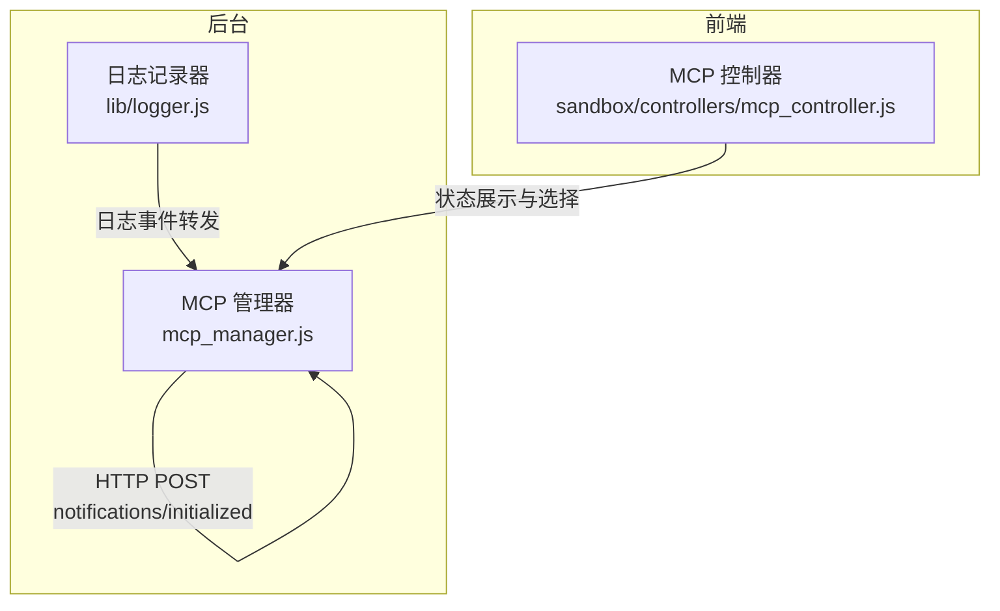
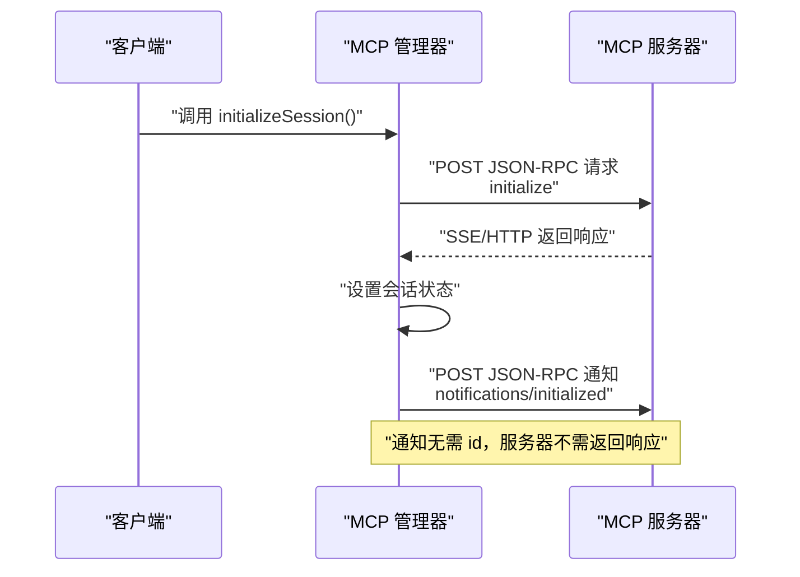
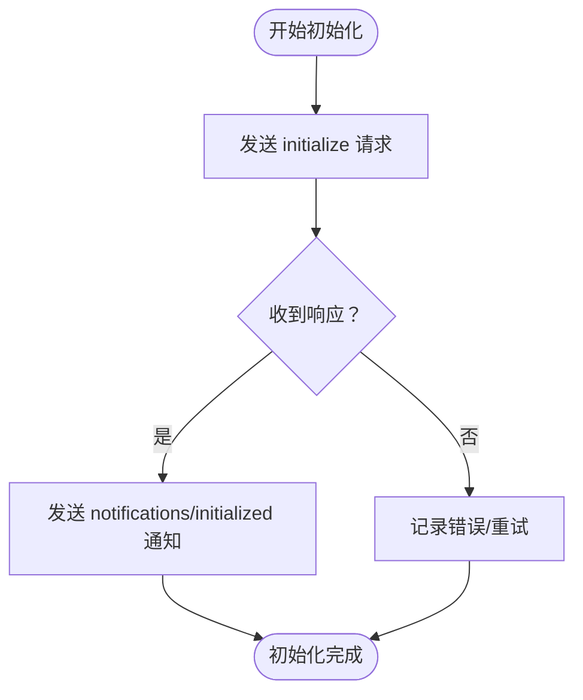
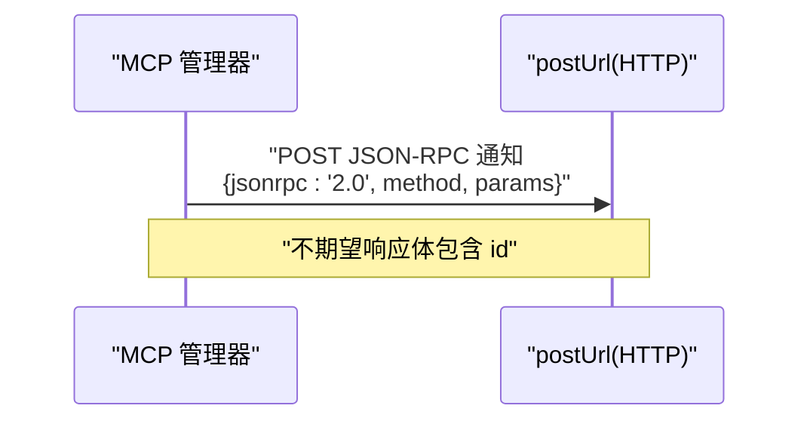
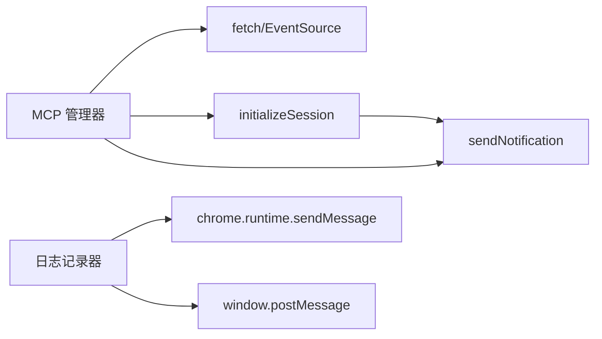

# 通知消息

<cite>
**本文引用的文件**
- [mcp_manager.js](file://background/managers/mcp_manager.js)
- [logger.js](file://lib/logger.js)
- [mcp_controller.js](file://sandbox/controllers/mcp_controller.js)
</cite>

## 目录
1. [简介](#简介)
2. [项目结构](#项目结构)
3. [核心组件](#核心组件)
4. [架构总览](#架构总览)
5. [详细组件分析](#详细组件分析)
6. [依赖关系分析](#依赖关系分析)
7. [性能考量](#性能考量)
8. [故障排查指南](#故障排查指南)
9. [结论](#结论)
10. [附录](#附录)

## 简介
本文件聚焦于 MCP（Model Context Protocol）协议中的“通知消息”（notification），特别是无响应要求的单向消息传递机制。基于仓库中 mcp_manager.js 的实现，我们将系统性地说明：
- 通知消息的 JSON-RPC 2.0 格式与方法命名规范（如 notifications/initialized）
- 通知消息无需 id 字段的特性及其在会话生命周期管理中的作用（如客户端初始化完成通知）
- 通知通过 HTTP POST 发送至 postUrl 的传输过程
- 服务端可能发送的通知类型（如日志、状态更新）的处理逻辑
- 实际通知消息示例与请求/响应模式的本质区别及使用场景

## 项目结构
与通知消息直接相关的核心位置如下：
- 后台管理器：负责连接 MCP 服务器、会话初始化、工具列表刷新、请求/通知发送等
- 日志记录：统一的日志入口，便于将前端或后台日志事件转化为通知或记录
- 前端控制器：用于展示 MCP 服务器状态，间接反映通知对用户体验的影响

图表来源
- [mcp_manager.js](file://background/managers/mcp_manager.js#L262-L285)
- [logger.js](file://lib/logger.js#L1-L53)
- [mcp_controller.js](file://sandbox/controllers/mcp_controller.js#L1-L221)

章节来源
- [mcp_manager.js](file://background/managers/mcp_manager.js#L1-L530)
- [logger.js](file://lib/logger.js#L1-L53)
- [mcp_controller.js](file://sandbox/controllers/mcp_controller.js#L1-L221)

## 核心组件
- MCP 管理器（MCPManager）
  - 负责连接 MCP 服务器、探测传输模式（SSE 或 HTTP）、初始化会话、发送请求与通知、解析响应与通知
  - 关键实现点：initializeSession 中发送 notifications/initialized；sendNotification 构造并发送通知；handleMessage 对消息进行分流（请求响应 vs 通知）

- 日志记录器（Logger）
  - 统一记录 INFO/WARN/ERROR 级别日志，支持跨上下文（后台、沙箱 iframe）的消息转发，为通知提供数据来源

- MCP 控制器（MCPController）
  - 前端展示 MCP 服务器状态、工具数量、错误状态等，帮助用户感知通知带来的状态变化

章节来源
- [mcp_manager.js](file://background/managers/mcp_manager.js#L262-L285)
- [mcp_manager.js](file://background/managers/mcp_manager.js#L353-L368)
- [mcp_manager.js](file://background/managers/mcp_manager.js#L370-L385)
- [logger.js](file://lib/logger.js#L1-L53)
- [mcp_controller.js](file://sandbox/controllers/mcp_controller.js#L88-L99)

## 架构总览
通知消息在 MCP 协议中的角色是“单向、无响应”的事件广播。在本项目中，通知通过 HTTP POST 发送到服务器的 postUrl，不期望返回 JSON-RPC 响应体中的 id 字段。典型流程包括：
- 客户端完成初始化后，发送 notifications/initialized 通知
- 服务器可向客户端推送日志、状态更新等通知（当前代码对这类通知有预留处理位点）

图表来源
- [mcp_manager.js](file://background/managers/mcp_manager.js#L262-L285)

章节来源
- [mcp_manager.js](file://background/managers/mcp_manager.js#L262-L285)

## 详细组件分析

### 通知消息的 JSON-RPC 2.0 格式与方法命名规范
- 格式要点
  - 必备字段：jsonrpc（固定为 "2.0"）、method（字符串，通知方法名）、params（对象，可选）
  - 无 id 字段：通知是单向消息，不期望响应
- 方法命名规范
  - 以 notifications/ 前缀开头的方法名用于通知，例如 notifications/initialized
  - 其他通知类型可参考 LSP/VSCode JSON-RPC 扩展中的通知类型（如 window/logMessage、$/setTrace、telemetry/event、textDocument/publishDiagnostics 等），但本项目当前仅显式使用 notifications/initialized

章节来源
- [mcp_manager.js](file://background/managers/mcp_manager.js#L353-L368)
- [mcp_manager.js](file://background/managers/mcp_manager.js#L278-L281)

### 通知消息无需 id 字段的特性
- 设计动机
  - 通知是“单向广播”，不需要请求-响应配对
  - 服务器端无需维护请求映射，简化实现
- 在本项目中的体现
  - sendNotification 构造 JSON-RPC 时省略 id 字段
  - handleMessage 对无 id 的消息默认视为通知或服务器发起的请求，不做响应等待

章节来源
- [mcp_manager.js](file://background/managers/mcp_manager.js#L353-L368)
- [mcp_manager.js](file://background/managers/mcp_manager.js#L370-L385)

### 会话生命周期管理中的通知：客户端初始化完成
- 流程
  - initializeSession 先发送 initialize 请求，随后立即发送 notifications/initialized 通知
  - 该通知标志着客户端已准备好接收后续通知（如日志、状态更新）
- 作用
  - 促使服务器进入“已初始化”状态，开始主动推送通知
  - 作为会话建立的里程碑事件，便于前端控制器展示“已连接”状态

图表来源
- [mcp_manager.js](file://background/managers/mcp_manager.js#L262-L285)

章节来源
- [mcp_manager.js](file://background/managers/mcp_manager.js#L262-L285)

### 通知通过 HTTP POST 发送至 postUrl 的传输过程
- 连接模式
  - SSE 模式：通过 EventSource 接收消息，但通知仍通过 HTTP POST 发送
  - HTTP 模式：直接使用 fetch POST 到 postUrl
- 发送实现
  - sendNotification 将 JSON-RPC 通知序列化后通过 fetch POST 发送
  - initializeSession 中的 notifications/initialized 亦遵循相同路径

图表来源
- [mcp_manager.js](file://background/managers/mcp_manager.js#L353-L368)

章节来源
- [mcp_manager.js](file://background/managers/mcp_manager.js#L87-L96)
- [mcp_manager.js](file://background/managers/mcp_manager.js#L353-L368)

### 服务端可能发送的通知类型与处理逻辑
- 可能的通知类型（概念性说明）
  - 日志通知：window/logMessage（服务端向客户端推送日志）
  - 跟踪设置：$/setTrace（服务端配置跟踪级别）
  - 遥测事件：telemetry/event（服务端上报遥测）
  - 文档诊断：textDocument/publishDiagnostics（服务端推送诊断）
  - 自定义通知：如进度、状态变更等
- 处理逻辑（当前代码现状）
  - 当前代码对服务器推送的通知保留了处理位点（handleMessage 中对非请求响应的消息分支），但未实现具体通知分发逻辑
  - 建议：为常见通知类型增加路由与 UI 展示，结合日志记录器统一收集与呈现

章节来源
- [mcp_manager.js](file://background/managers/mcp_manager.js#L370-L385)

### 实际通知消息示例与使用场景
- 示例：notifications/initialized
  - 方法：notifications/initialized
  - 参数：空对象或按协议扩展的初始化参数
  - 使用场景：客户端完成初始化后，告知服务器“已就绪”，以便服务器开始推送日志、状态等通知
- 其他建议通知（概念性）
  - window/logMessage：服务端推送日志到客户端
  - $/setTrace：服务端设置跟踪级别
  - telemetry/event：服务端上报遥测事件
  - textDocument/publishDiagnostics：服务端推送文档诊断
- 与请求/响应的区别
  - 请求/响应：必须包含 id，服务器需返回对应响应
  - 通知：无 id，服务器无需返回响应，客户端也不应期待响应

章节来源
- [mcp_manager.js](file://background/managers/mcp_manager.js#L278-L281)
- [mcp_manager.js](file://background/managers/mcp_manager.js#L353-L368)

## 依赖关系分析
- MCP 管理器依赖
  - 传输层：fetch（HTTP 模式）、EventSource（SSE 模式）
  - 工具列表：refreshTools/refreshToolsHttp（HTTP 模式下直接获取工具）
  - 会话管理：initializeSession（先请求 initialize，再发送通知）
- 日志记录器依赖
  - 跨上下文消息通道：chrome.runtime.sendMessage（后台）、postMessage（沙箱 iframe）
  - 与通知的关系：日志事件可作为通知的数据来源，供前端展示或进一步上报

图表来源
- [mcp_manager.js](file://background/managers/mcp_manager.js#L87-L96)
- [mcp_manager.js](file://background/managers/mcp_manager.js#L262-L285)
- [mcp_manager.js](file://background/managers/mcp_manager.js#L353-L368)
- [logger.js](file://lib/logger.js#L28-L50)

章节来源
- [mcp_manager.js](file://background/managers/mcp_manager.js#L87-L96)
- [mcp_manager.js](file://background/managers/mcp_manager.js#L262-L285)
- [mcp_manager.js](file://background/managers/mcp_manager.js#L353-L368)
- [logger.js](file://lib/logger.js#L28-L50)

## 性能考量
- 通知的单向特性避免了请求-响应配对的开销，适合高频状态/日志推送
- HTTP 模式下，通知发送为同步一次性的 POST，避免 SSE 连接的额外资源占用
- 建议
  - 对高频通知进行节流或合并，减少网络与渲染压力
  - 为通知添加本地缓存与去重策略，避免重复 UI 更新
  - 将通知内容限制在必要范围内，避免过大的 params 导致带宽浪费

## 故障排查指南
- 通知未送达
  - 检查服务器 postUrl 是否正确（SSE endpoint 事件或 HTTP 模式下的 POST 地址）
  - 确认网络连通性与 CORS 设置
- 通知被忽略
  - 确认消息是否包含 id（若包含 id，会被当作请求处理）
  - 确认 method 是否符合通知命名规范（notifications/ 前缀）
- 服务器未开始推送通知
  - 确认客户端已发送 notifications/initialized 通知
  - 检查服务器端是否实现了通知推送逻辑
- 日志与状态展示异常
  - 使用 MCP 控制器查看服务器状态与工具数量
  - 结合日志记录器定位问题来源

章节来源
- [mcp_manager.js](file://background/managers/mcp_manager.js#L87-L96)
- [mcp_manager.js](file://background/managers/mcp_manager.js#L262-L285)
- [mcp_manager.js](file://background/managers/mcp_manager.js#L353-L368)
- [mcp_controller.js](file://sandbox/controllers/mcp_controller.js#L88-L99)
- [logger.js](file://lib/logger.js#L1-L53)

## 结论
本项目对 MCP 通知的支持以“notifications/initialized”为核心，采用 JSON-RPC 2.0 的通知格式并通过 HTTP POST 发送至 postUrl。通知的单向特性使其非常适合用于会话初始化完成后的状态广播与日志推送。当前代码对服务器推送的通知保留了处理位点，建议后续补充具体通知类型的路由与 UI 展示，以完善通知生态。

## 附录
- JSON-RPC 2.0 通知字段说明
  - jsonrpc：固定为 "2.0"
  - method：通知方法名（如 notifications/initialized）
  - params：通知参数对象（可选）
  - 无 id 字段
- 常见通知类型（概念性）
  - window/logMessage：服务端推送日志
  - $/setTrace：服务端设置跟踪级别
  - telemetry/event：服务端上报遥测
  - textDocument/publishDiagnostics：服务端推送文档诊断