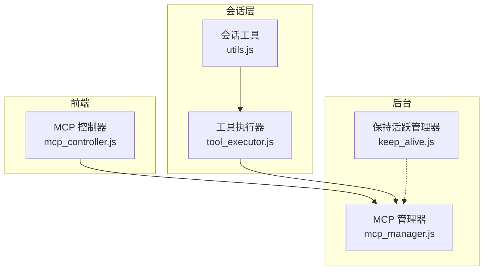
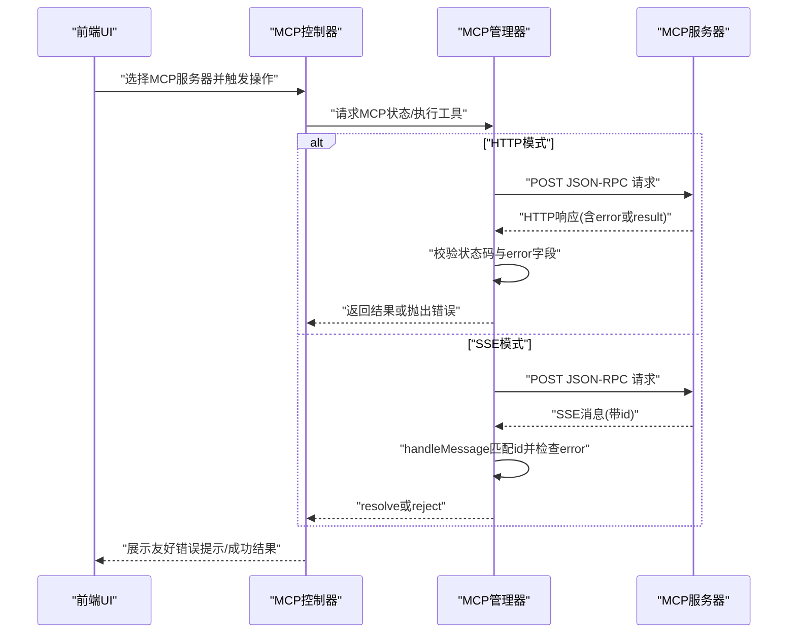
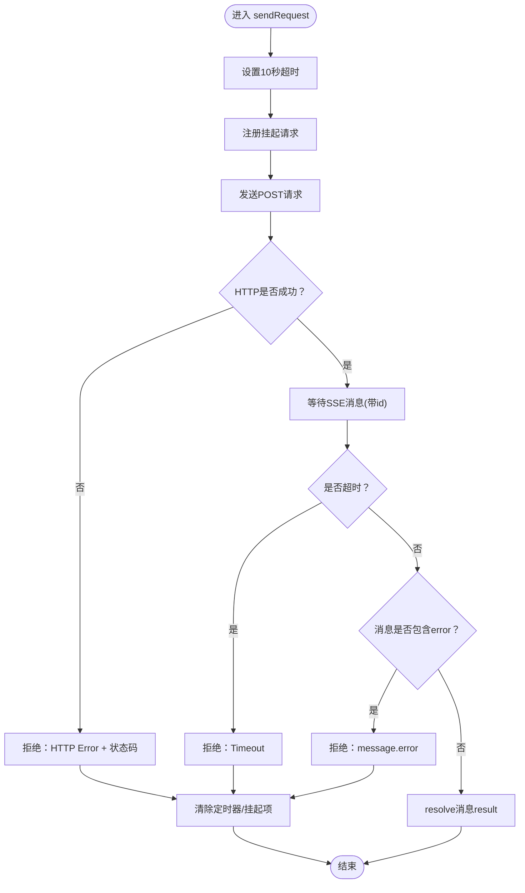
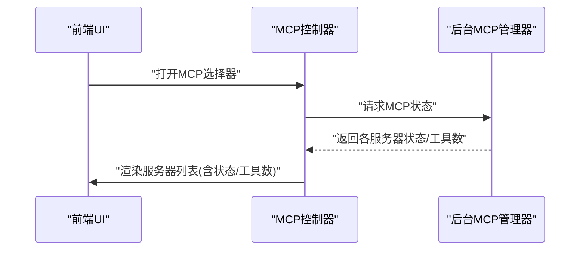
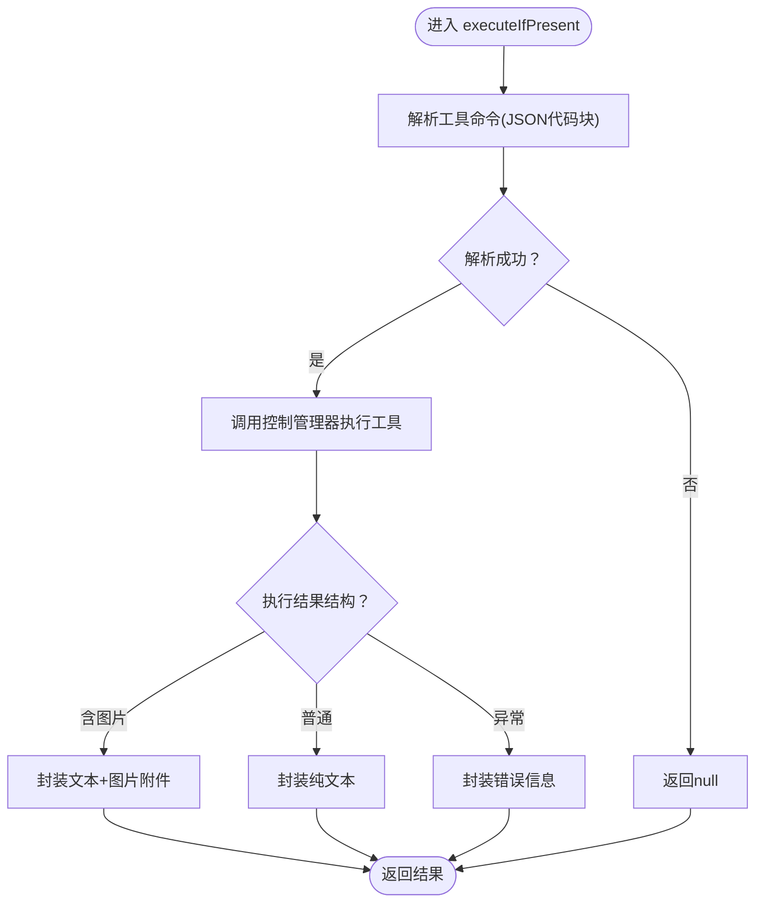
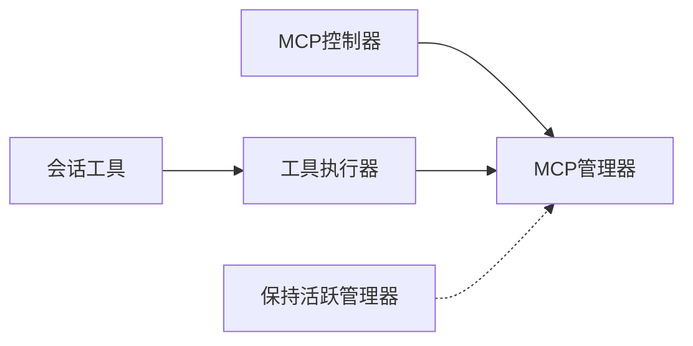

# 错误处理

<cite>
**本文引用的文件**
- [mcp_manager.js](file://background/managers/mcp_manager.js)
- [mcp_controller.js](file://sandbox/controllers/mcp_controller.js)
- [tool_executor.js](file://background/handlers/session/prompt/tool_executor.js)
- [utils.js](file://background/handlers/session/utils.js)
- [keep_alive.js](file://background/managers/keep_alive.js)
</cite>

## 目录
1. [简介](#简介)
2. [项目结构](#项目结构)
3. [核心组件](#核心组件)
4. [架构总览](#架构总览)
5. [详细组件分析](#详细组件分析)
6. [依赖关系分析](#依赖关系分析)
7. [性能考量](#性能考量)
8. [故障排查指南](#故障排查指南)
9. [结论](#结论)

## 简介
本文件聚焦于MCP协议在请求-响应过程中的错误处理机制，系统梳理客户端错误（如超时、HTTP 4xx/5xx、网络异常）与服务端错误（message.error）的分类与响应策略。基于 mcp_manager.js 中的 sendRequest 超时机制（10秒）、fetch 失败捕获、handleMessage 中对 error 字段的处理，以及 sendRequestHttp 中对 HTTP 状态码的判断，本文详细说明错误对象的结构（code、message、data），覆盖连接失败、解析错误、工具未找到等典型场景，并提供错误堆栈示例与调试建议，包括如何使用 getDebugInfo 获取服务器状态，以及前端友好的错误提示与重试机制设计指导。

## 项目结构
与MCP错误处理直接相关的模块分布如下：
- 后台管理器：负责MCP服务器连接、请求发送、消息处理与调试信息输出
- 前端控制器：负责展示MCP服务器状态与工具数量，辅助用户定位问题
- 工具执行器：负责解析并执行工具命令，捕获执行期错误并向UI反馈
- 会话工具：包含通用的错误日志与页面内容获取逻辑

图表来源
- [mcp_manager.js](file://background/managers/mcp_manager.js#L1-L530)
- [mcp_controller.js](file://sandbox/controllers/mcp_controller.js#L1-L221)
- [tool_executor.js](file://background/handlers/session/prompt/tool_executor.js#L1-L49)
- [utils.js](file://background/handlers/session/utils.js#L1-L64)
- [keep_alive.js](file://background/managers/keep_alive.js#L1-L97)

章节来源
- [mcp_manager.js](file://background/managers/mcp_manager.js#L1-L530)
- [mcp_controller.js](file://sandbox/controllers/mcp_controller.js#L1-L221)

## 核心组件
- MCP 管理器：负责服务器配置加载、连接建立、请求发送、消息处理、工具列表刷新、调试信息导出等。关键错误处理点包括：
  - sendRequest 的超时控制（10秒）
  - sendRequestHttp 对 HTTP 状态码与服务端错误的判断
  - handleMessage 对 message.error 的处理
  - executeTool 对“工具未找到”的处理
- MCP 控制器：负责向后台请求MCP状态并在UI中展示服务器状态与工具数量，便于用户快速定位问题
- 工具执行器：负责解析工具命令并调用控制管理器执行，捕获执行期错误并向UI反馈
- 会话工具：提供页面内容获取与JSON解析错误处理等通用能力

章节来源
- [mcp_manager.js](file://background/managers/mcp_manager.js#L1-L530)
- [mcp_controller.js](file://sandbox/controllers/mcp_controller.js#L1-L221)
- [tool_executor.js](file://background/handlers/session/prompt/tool_executor.js#L1-L49)
- [utils.js](file://background/handlers/session/utils.js#L1-L64)

## 架构总览
下图展示了MCP请求-响应与错误处理的关键路径，包括SSE与HTTP两种传输模式下的错误传播与处理。

图表来源
- [mcp_manager.js](file://background/managers/mcp_manager.js#L229-L260)
- [mcp_manager.js](file://background/managers/mcp_manager.js#L308-L351)
- [mcp_manager.js](file://background/managers/mcp_manager.js#L370-L385)

## 详细组件分析

### MCP 管理器：错误处理与响应策略
- 超时机制（sendRequest）
  - 在发起请求后启动10秒定时器；若在时限内未收到对应id的消息，清理挂起请求并拒绝为“超时”错误
  - 若网络或HTTP错误发生，先清除定时器，再拒绝相应错误
- HTTP状态码判断（sendRequestHttp）
  - 使用 fetch 发送请求，若 res.ok 为false，直接抛出“HTTP Error + 状态码”的错误
  - 解析响应体后，若 result.error 存在，则抛出该错误对象
- 消息处理（handleMessage）
  - 若消息包含 id 且存在于 pendingRequests 中：清除定时器并删除挂起项
  - 若 message.error 存在则 reject(error)，否则 resolve(result)
- 工具未找到（executeTool）
  - 当目标工具不在已加载工具列表中时，构造包含可用工具名列表的错误并抛出
- 调试信息（getDebugInfo）
  - 输出每个服务器的状态、类型、URL、POST地址、工具数量与名称列表，便于快速诊断

图表来源
- [mcp_manager.js](file://background/managers/mcp_manager.js#L308-L351)
- [mcp_manager.js](file://background/managers/mcp_manager.js#L370-L385)

章节来源
- [mcp_manager.js](file://background/managers/mcp_manager.js#L229-L260)
- [mcp_manager.js](file://background/managers/mcp_manager.js#L308-L351)
- [mcp_manager.js](file://background/managers/mcp_manager.js#L370-L385)
- [mcp_manager.js](file://background/managers/mcp_manager.js#L479-L525)

### MCP 控制器：前端状态展示与交互
- 通过 postMessage 向后台请求MCP状态，渲染服务器列表与工具数量
- 根据服务器状态（connected/error）在UI中高亮显示，帮助用户直观识别问题
- 提供标签化选择，支持多服务器组合使用

图表来源
- [mcp_controller.js](file://sandbox/controllers/mcp_controller.js#L88-L99)
- [mcp_controller.js](file://sandbox/controllers/mcp_controller.js#L101-L147)

章节来源
- [mcp_controller.js](file://sandbox/controllers/mcp_controller.js#L1-L221)

### 工具执行器：命令解析与错误捕获
- 从文本中解析工具命令（JSON代码块），若解析失败记录错误并返回空
- 执行工具时捕获异常，统一包装为“执行工具失败：错误信息”的字符串，便于UI展示
- 对特定结构（如截图结果）进行特殊处理，分离文本与文件附件

图表来源
- [tool_executor.js](file://background/handlers/session/prompt/tool_executor.js#L9-L47)
- [utils.js](file://background/handlers/session/utils.js#L4-L21)

章节来源
- [tool_executor.js](file://background/handlers/session/prompt/tool_executor.js#L1-L49)
- [utils.js](file://background/handlers/session/utils.js#L1-L64)

## 依赖关系分析
- MCP 管理器依赖浏览器 fetch API 进行HTTP请求，依赖 EventSource 进行SSE连接
- MCP 控制器通过 postMessage 与后台通信，依赖 getDebugInfo 输出的结构化状态
- 工具执行器依赖会话工具提供的命令解析与页面内容获取能力
- 保持活跃管理器与MCP错误处理无直接耦合，但其对网络错误的处理可作为通用错误策略参考

图表来源
- [mcp_manager.js](file://background/managers/mcp_manager.js#L1-L530)
- [mcp_controller.js](file://sandbox/controllers/mcp_controller.js#L1-L221)
- [tool_executor.js](file://background/handlers/session/prompt/tool_executor.js#L1-L49)
- [utils.js](file://background/handlers/session/utils.js#L1-L64)
- [keep_alive.js](file://background/managers/keep_alive.js#L1-L97)

章节来源
- [mcp_manager.js](file://background/managers/mcp_manager.js#L1-L530)
- [mcp_controller.js](file://sandbox/controllers/mcp_controller.js#L1-L221)
- [tool_executor.js](file://background/handlers/session/prompt/tool_executor.js#L1-L49)
- [utils.js](file://background/handlers/session/utils.js#L1-L64)
- [keep_alive.js](file://background/managers/keep_alive.js#L1-L97)

## 性能考量
- 超时时间（10秒）用于避免长时间阻塞，建议根据实际网络环境与服务器响应特性进行评估与动态调整
- SSE模式下，handleMessage 仅在匹配到对应id时才处理，避免不必要的处理开销
- HTTP模式下，sendRequestHttp 直接返回服务端错误，减少中间环节
- 工具未找到时，executeTool 会遍历所有服务器工具以生成可用工具列表，建议在UI侧缓存工具列表，降低重复查询成本

## 故障排查指南
- 使用 getDebugInfo 快速获取服务器状态
  - 输出字段：status、type、url、postUrl、toolCount、tools
  - 通过UI中的MCP选择器查看服务器状态与工具数量，定位连接与工具加载问题
- 典型错误场景与处理
  - 超时（Timeout）
    - 触发条件：sendRequest在10秒内未收到对应id的消息
    - 建议：检查服务器SSE连接、网络延迟、服务器负载
  - HTTP错误（HTTP Error 4xx/5xx）
    - 触发条件：sendRequestHttp 或 refreshToolsHttp 返回非2xx状态码
    - 建议：检查服务器端点可达性、鉴权、限流策略
  - 服务端错误（message.error）
    - 触发条件：handleMessage 收到带 error 字段的消息
    - 建议：查看服务器日志，确认方法参数与权限
  - 工具未找到（Tool not found）
    - 触发条件：executeTool 无法在已加载工具列表中找到目标工具
    - 建议：重新刷新工具列表、检查服务器配置、确认工具名称拼写
  - JSON解析错误
    - 触发条件：工具命令JSON解析失败或页面内容获取失败
    - 建议：检查响应格式、编码与跨域限制
- 调试建议
  - 在后台控制台查看 getDebugInfo 输出，结合UI状态核对服务器配置与连接状态
  - 对于SSE模式，关注EventSource的onerror事件与SSE消息解析日志
  - 对于HTTP模式，关注fetch返回的状态码与响应体结构
- 前端友好提示与重试机制设计
  - 错误提示：优先展示明确的错误类型与简要原因（如“HTTP 401 未授权”、“超时”、“工具未找到”）
  - 重试策略：区分瞬时错误（网络抖动、临时限流）与永久错误（认证失败、工具不存在）
    - 瞬时错误：指数退避重试（最多3次），每次间隔1~5秒
    - 永久错误：停止重试并引导用户修正配置或联系管理员
  - 用户操作：提供“刷新工具列表”“重新连接”等快捷按钮，便于快速恢复

章节来源
- [mcp_manager.js](file://background/managers/mcp_manager.js#L389-L403)
- [mcp_controller.js](file://sandbox/controllers/mcp_controller.js#L101-L147)
- [tool_executor.js](file://background/handlers/session/prompt/tool_executor.js#L38-L40)
- [utils.js](file://background/handlers/session/utils.js#L16-L18)

## 结论
MCP协议的错误处理在后台管理器中实现了完善的客户端与服务端错误分类与响应策略：通过10秒超时保护、HTTP状态码与服务端错误字段的双重校验、SSE消息的id匹配与错误分发，以及工具未找到的兜底提示，形成了从底层传输到上层UI的全链路错误处理闭环。配合 getDebugInfo 与前端控制器的可视化状态展示，开发者与用户可以快速定位问题并采取针对性修复或重试措施。建议在生产环境中结合业务特性对超时阈值与重试策略进行动态优化，并持续完善错误日志与告警机制。