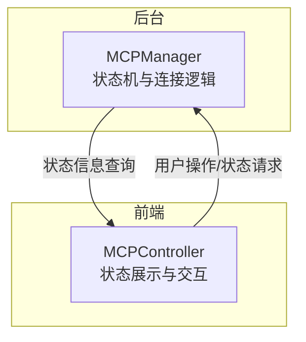
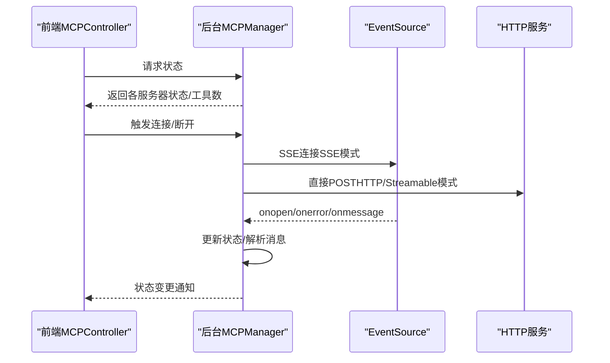
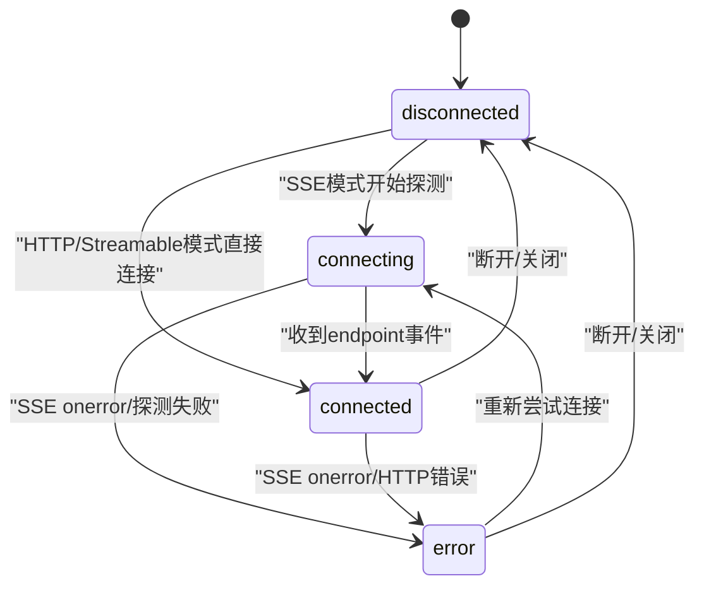
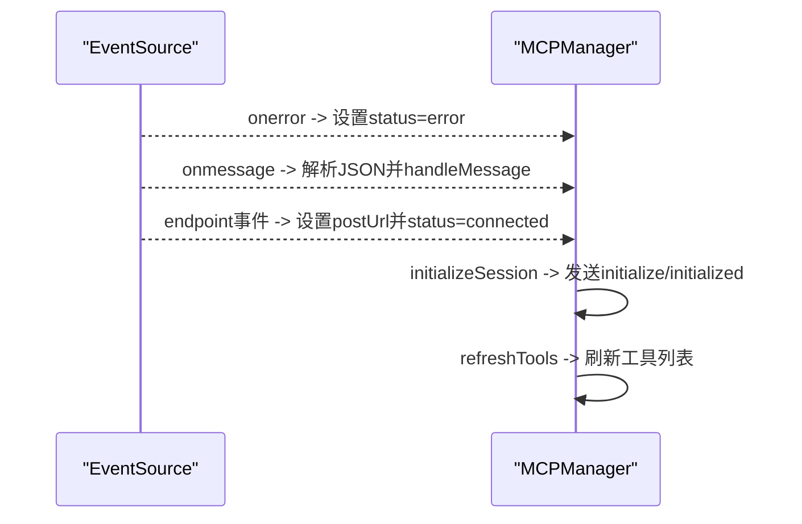
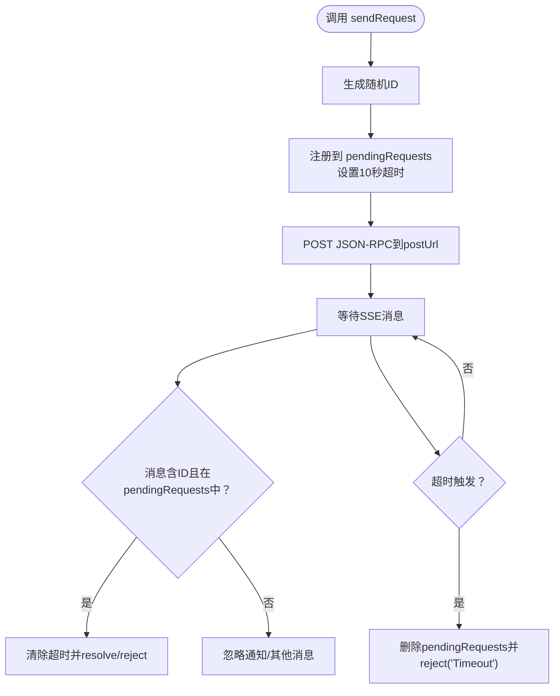
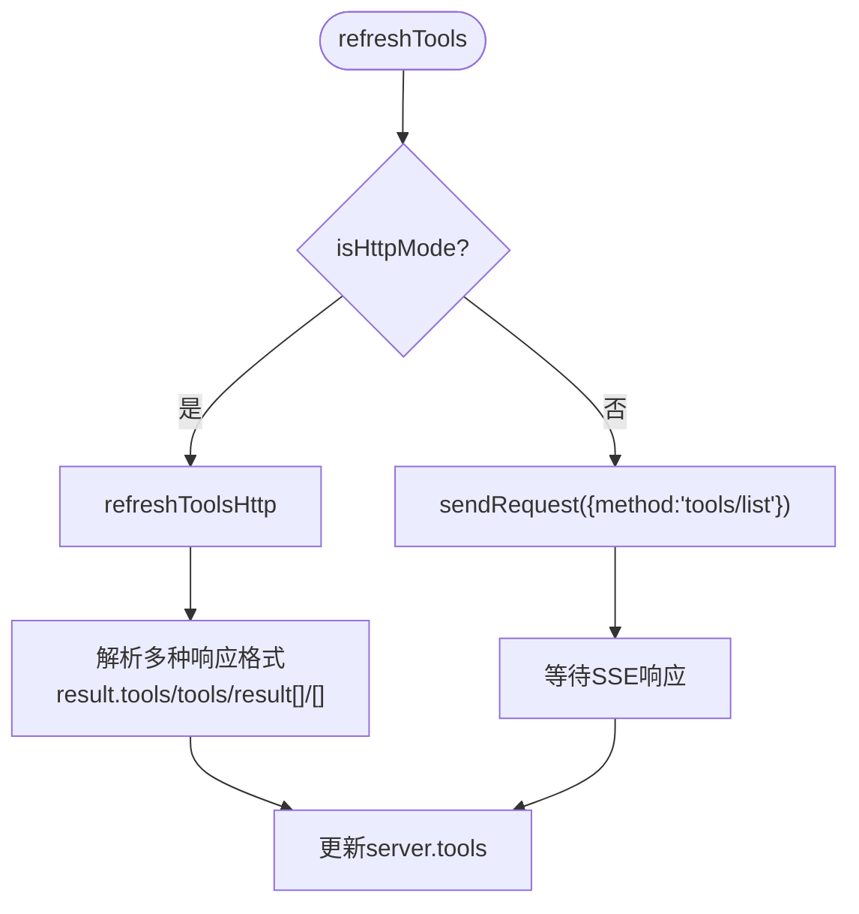
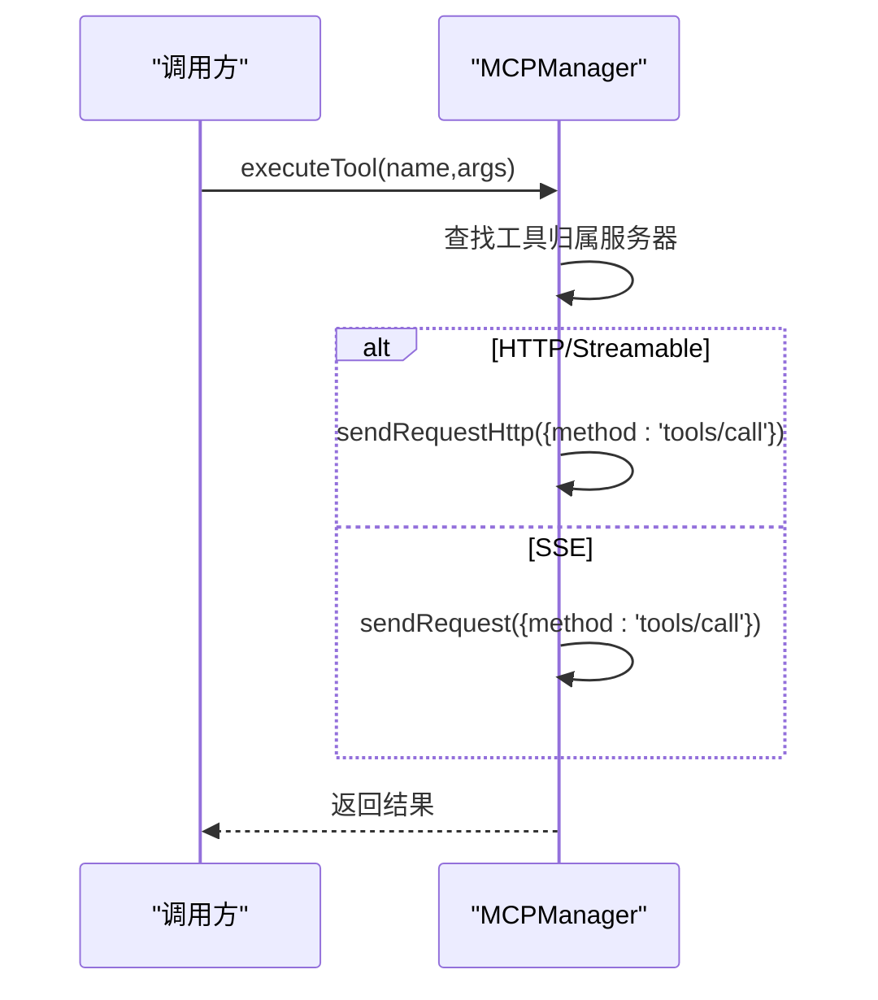
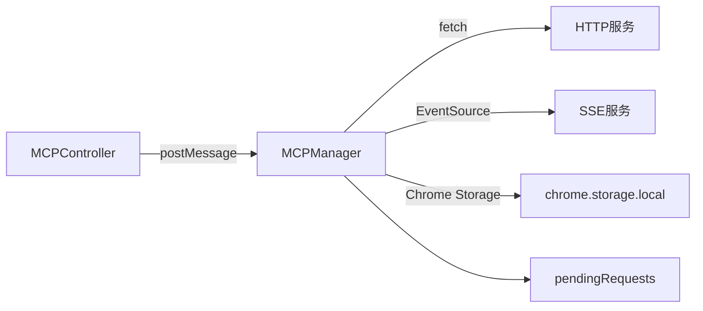

# 状态管理

<cite>
**本文引用的文件**
- [mcp_manager.js](file://background/managers/mcp_manager.js)
- [mcp_controller.js](file://sandbox/controllers/mcp_controller.js)
</cite>

## 目录
1. [简介](#简介)
2. [项目结构](#项目结构)
3. [核心组件](#核心组件)
4. [架构总览](#架构总览)
5. [详细组件分析](#详细组件分析)
6. [依赖关系分析](#依赖关系分析)
7. [性能考量](#性能考量)
8. [故障排查指南](#故障排查指南)
9. [结论](#结论)

## 简介
本技术文档聚焦于MCP连接状态管理，围绕 background/managers/mcp_manager.js 中的状态机实现进行深入解析。重点覆盖以下主题：
- 连接状态机：connecting、connected、error、disconnected 四种状态的转换条件与触发动作
- 消息处理：handleMessage 如何通过ID映射 pendingRequests 关联JSON-RPC响应与请求，并实现超时机制
- EventSource 事件：onopen/onerror/onmessage 与内部状态的同步机制
- 工具列表刷新：refreshTools 在不同模式（HTTP/SSE）下的执行路径
- 工具调用：executeTool 根据服务器模式选择 sendRequestHttp 或 sendRequest
- 状态转换图与错误恢复策略

## 项目结构
MCP状态管理位于后台管理器模块，前端通过沙盒控制器展示状态并进行交互。关键文件如下：
- 后台状态管理器：background/managers/mcp_manager.js
- 前端状态展示与交互：sandbox/controllers/mcp_controller.js

图表来源
- [mcp_manager.js](file://background/managers/mcp_manager.js#L1-L60)
- [mcp_controller.js](file://sandbox/controllers/mcp_controller.js#L88-L99)

章节来源
- [mcp_manager.js](file://background/managers/mcp_manager.js#L1-L60)
- [mcp_controller.js](file://sandbox/controllers/mcp_controller.js#L1-L221)

## 核心组件
- MCPManager：负责加载配置、建立连接、维护状态、发送请求、处理消息、刷新工具列表等
- MCPController：负责从后台获取状态并在UI中展示，支持多选MCP服务器

章节来源
- [mcp_manager.js](file://background/managers/mcp_manager.js#L2-L6)
- [mcp_controller.js](file://sandbox/controllers/mcp_controller.js#L5-L13)

## 架构总览
MCPManager 作为状态机核心，依据服务器类型（SSE/HTTP/streamable_http）采用不同的连接与通信策略；同时通过 pendingRequests 实现JSON-RPC请求与响应的ID关联与超时控制。前端MCPController通过postMessage向后台请求状态并渲染。

图表来源
- [mcp_manager.js](file://background/managers/mcp_manager.js#L71-L150)
- [mcp_manager.js](file://background/managers/mcp_manager.js#L116-L145)
- [mcp_manager.js](file://background/managers/mcp_manager.js#L229-L260)
- [mcp_controller.js](file://sandbox/controllers/mcp_controller.js#L88-L99)

## 详细组件分析

### 状态机与状态转换
MCPManager 维护每个服务器的连接状态，初始为 disconnected。状态转换遵循以下规则：

- disconnected
  - 条件：初始化或未配置URL
  - 转换：若配置有效且为HTTP/Streamable模式，直接进入 connected；否则进入 connecting
- connecting
  - 条件：SSE模式探测后尚未收到 endpoint
  - 转换：收到 endpoint 事件后进入 connected；SSE onerror 或探测失败则进入 error
- connected
  - 条件：已建立POST URL并完成会话初始化
  - 转换：SSE onerror 或HTTP错误导致的异常会进入 error；手动断开或关闭EventSource进入 disconnected
- error
  - 条件：SSE连接错误、HTTP请求失败、工具列表获取失败
  - 转换：修复配置/网络后重新连接可回到 connecting 或 connected

图表来源
- [mcp_manager.js](file://background/managers/mcp_manager.js#L79-L83)
- [mcp_manager.js](file://background/managers/mcp_manager.js#L99-L125)
- [mcp_manager.js](file://background/managers/mcp_manager.js#L127-L133)
- [mcp_manager.js](file://background/managers/mcp_manager.js#L122-L125)
- [mcp_manager.js](file://background/managers/mcp_manager.js#L146-L149)

章节来源
- [mcp_manager.js](file://background/managers/mcp_manager.js#L71-L150)

### EventSource事件与内部状态同步
- onopen：记录SSE连接成功日志（不改变状态）
- onerror：将服务器状态置为 error
- onmessage：解析JSON消息并交由 handleMessage 处理
- endpoint 事件：解析POST URL，设置 postUrl 并置为 connected，随后初始化会话并刷新工具

图表来源
- [mcp_manager.js](file://background/managers/mcp_manager.js#L118-L145)
- [mcp_manager.js](file://background/managers/mcp_manager.js#L127-L133)
- [mcp_manager.js](file://background/managers/mcp_manager.js#L262-L285)

章节来源
- [mcp_manager.js](file://background/managers/mcp_manager.js#L116-L145)

### JSON-RPC请求与响应关联（ID映射与超时）
- sendRequest：生成随机ID，注册到 pendingRequests，发起HTTP POST；等待SSE消息中同ID的响应；10秒超时自动清理并拒绝
- handleMessage：当收到带ID的消息时，从 pendingRequests 取出对应Promise并resolve/reject；清除超时
- sendRequestHttp：HTTP模式下直接POST并等待返回，不依赖SSE

图表来源
- [mcp_manager.js](file://background/managers/mcp_manager.js#L308-L351)
- [mcp_manager.js](file://background/managers/mcp_manager.js#L370-L385)
- [mcp_manager.js](file://background/managers/mcp_manager.js#L229-L260)

章节来源
- [mcp_manager.js](file://background/managers/mcp_manager.js#L308-L385)

### 工具列表刷新（refreshTools）的不同模式
- isHttpMode：判断服务器类型是否为 HTTP 或 Streamable
- refreshTools：
  - 若为HTTP/Streamable：调用 refreshToolsHttp，直接POST tools/list并解析多种可能的响应格式
  - 否则：通过 sendRequest 发送 tools/list，等待SSE响应并更新工具列表
- refreshToolsHttp：统一处理HTTP模式下的工具列表获取，兼容多种响应结构

图表来源
- [mcp_manager.js](file://background/managers/mcp_manager.js#L287-L306)
- [mcp_manager.js](file://background/managers/mcp_manager.js#L153-L213)

章节来源
- [mcp_manager.js](file://background/managers/mcp_manager.js#L287-L306)
- [mcp_manager.js](file://background/managers/mcp_manager.js#L153-L213)

### 工具调用（executeTool）与模式选择
- executeTool：根据工具名在所有服务器工具中查找归属；若找到，构造 tools/call 请求
- 模式选择：若目标服务器为HTTP/Streamable，使用 sendRequestHttp；否则使用 sendRequest
- 结果：返回服务器返回的结果（通常包含内容数组与错误标记）

图表来源
- [mcp_manager.js](file://background/managers/mcp_manager.js#L479-L525)

章节来源
- [mcp_manager.js](file://background/managers/mcp_manager.js#L479-L525)

### 配置加载与保存
- loadConfig：从Chrome存储读取 mcpConfig，初始化各服务器状态为 disconnected
- saveConfig：写入新配置，断开旧连接，重新加载并按配置自动连接

章节来源
- [mcp_manager.js](file://background/managers/mcp_manager.js#L21-L61)

## 依赖关系分析
- MCPManager 依赖：
  - 浏览器内置 EventSource（SSE模式）
  - fetch API（HTTP/JSON-RPC）
  - Chrome 存储（mcpConfig）
  - pendingRequests 映射（Promise管理）
- MCPController 依赖：
  - postMessage 与后台通信
  - DOM元素用于渲染服务器状态与工具数量

图表来源
- [mcp_controller.js](file://sandbox/controllers/mcp_controller.js#L88-L99)
- [mcp_manager.js](file://background/managers/mcp_manager.js#L71-L150)
- [mcp_manager.js](file://background/managers/mcp_manager.js#L21-L61)

章节来源
- [mcp_controller.js](file://sandbox/controllers/mcp_controller.js#L88-L99)
- [mcp_manager.js](file://background/managers/mcp_manager.js#L71-L150)
- [mcp_manager.js](file://background/managers/mcp_manager.js#L21-L61)

## 性能考量
- 超时控制：sendRequest 的10秒超时避免长时间挂起，建议在高延迟网络下可考虑指数退避重试策略
- 工具列表解析：refreshToolsHttp 支持多种响应格式，减少对特定服务器实现的耦合
- SSE vs HTTP：HTTP模式下无需EventSource，减少资源占用；SSE模式便于实时推送但需保持连接
- 并发请求：pendingRequests 使用ID映射，避免并发请求互相干扰

## 故障排查指南
- 症状：状态长期停留在 connecting
  - 排查：确认SSE端点是否返回 endpoint 事件；检查网络连通性与CORS
- 症状：状态频繁切换至 error
  - 排查：查看SSE onerror日志；检查HTTP返回码与JSON-RPC错误字段
- 症状：工具列表为空
  - 排查：确认 refreshToolsHttp 是否命中预期响应格式；检查服务器是否支持 tools/list
- 症状：executeTool 报错“找不到工具”
  - 排查：确认工具名是否正确；检查各服务器工具列表是否已刷新
- 症状：请求超时
  - 排查：检查服务器响应速度；必要时增加超时时间或启用重试

章节来源
- [mcp_manager.js](file://background/managers/mcp_manager.js#L122-L125)
- [mcp_manager.js](file://background/managers/mcp_manager.js#L174-L179)
- [mcp_manager.js](file://background/managers/mcp_manager.js#L326-L329)
- [mcp_manager.js](file://background/managers/mcp_manager.js#L501-L506)

## 结论
MCPManager 的状态机设计清晰地将SSE与HTTP两种传输模式解耦，通过 EventSource 与 fetch 的组合实现灵活的连接与通信。pendingRequests 的ID映射与超时机制确保了请求-响应的可靠关联。结合前端MCPController的状态展示，系统实现了从配置到连接、从工具发现到工具调用的完整闭环。建议后续增强：
- 错误恢复策略：在 error 状态下自动重连与指数退避
- 工具缓存：避免重复刷新工具列表
- 日志与监控：增加更细粒度的错误统计与上报