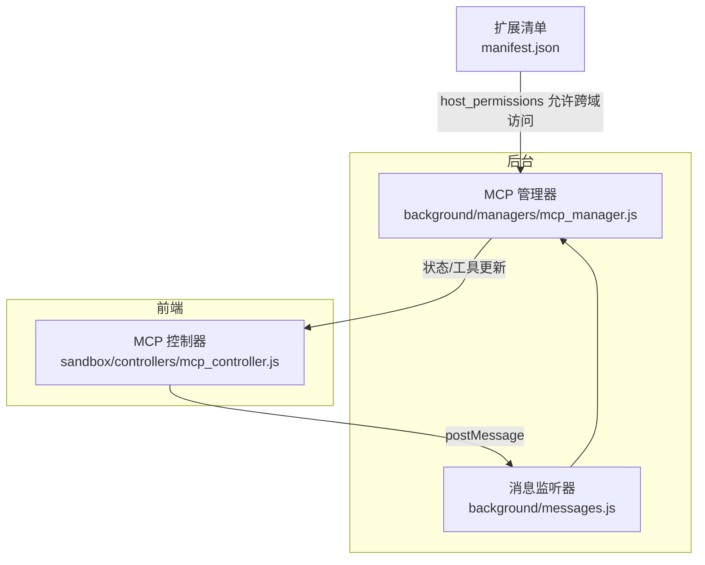
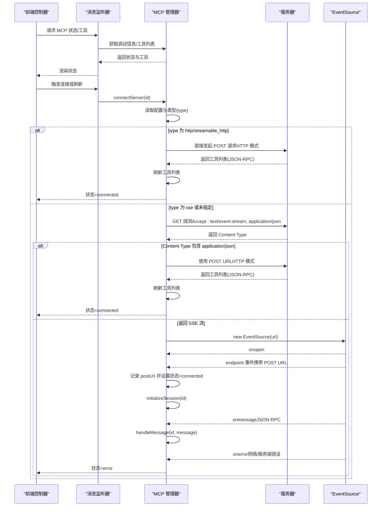
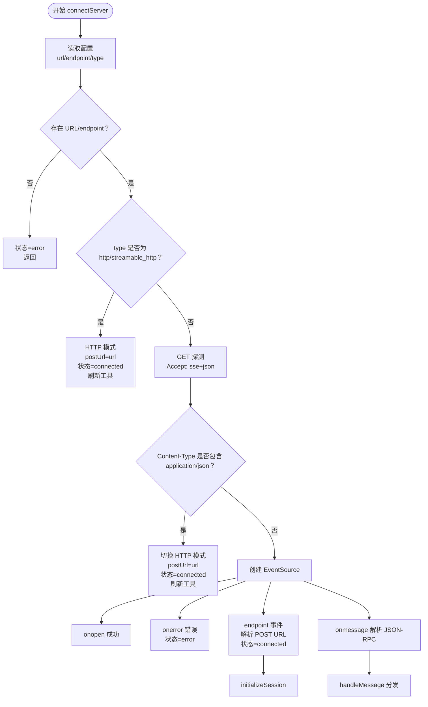
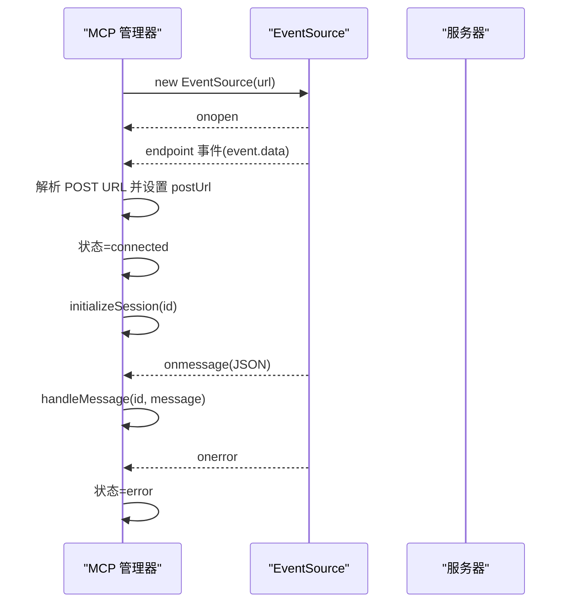
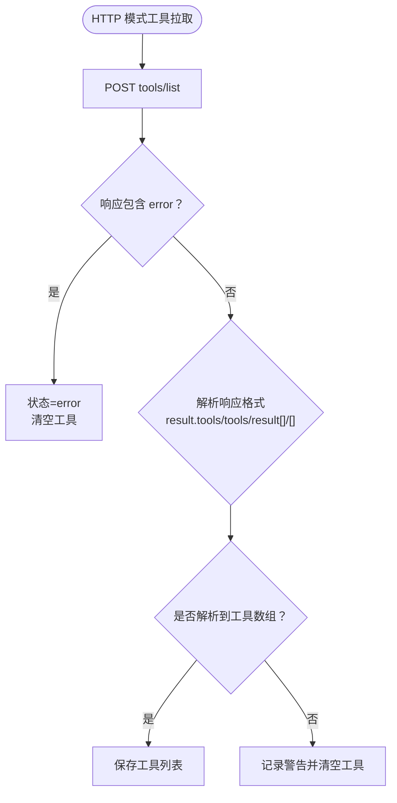
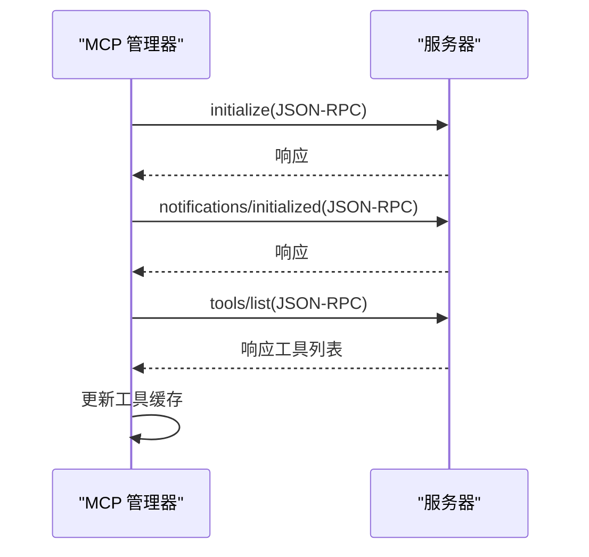
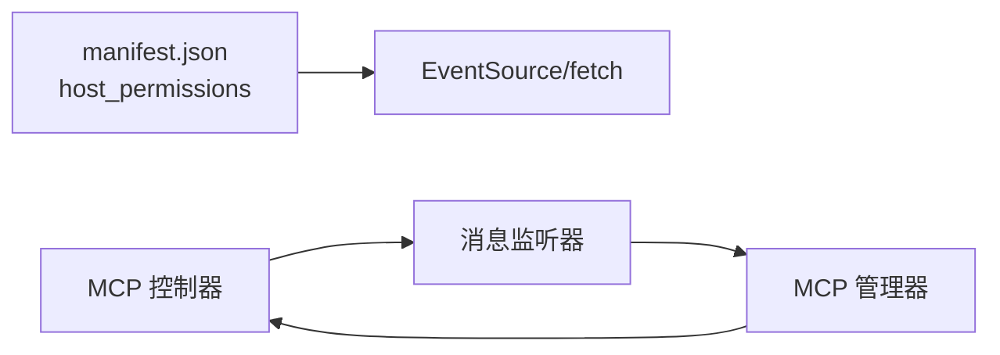

# 连接建立

<cite>
**本文引用的文件列表**
- [mcp_manager.js](file://background/managers/mcp_manager.js)
- [messages.js](file://background/messages.js)
- [mcp_controller.js](file://sandbox/controllers/mcp_controller.js)
- [manifest.json](file://manifest.json)
</cite>

## 目录
1. [简介](#简介)
2. [项目结构](#项目结构)
3. [核心组件](#核心组件)
4. [架构总览](#架构总览)
5. [详细组件分析](#详细组件分析)
6. [依赖关系分析](#依赖关系分析)
7. [性能考量](#性能考量)
8. [故障排查指南](#故障排查指南)
9. [结论](#结论)

## 简介
本技术文档围绕 Model Context Protocol（MCP）连接建立过程展开，重点解析后台管理器中 connectServer 方法的实现，覆盖以下关键点：
- SSE 与 HTTP 两种模式的连接建立流程
- URL 探测与 Content-Type 协商
- 自动模式切换（当服务器返回 JSON 响应时降级为 HTTP 模式）
- SSE 连接中的 endpoint 事件处理、POST URL 提取与 initializeSession 调用的完整序列
- 连接超时、网络错误与服务器不可达的异常处理策略
- 提供 SSE 与 HTTP 模式的决策流程图与实际交互时序图，说明 EventSource 初始化、onopen/onerror 事件处理等底层细节

## 项目结构
与连接建立直接相关的模块分布如下：
- 后台管理器：负责加载配置、连接服务器、处理 SSE 事件、维护状态与工具列表
- 消息通道：在扩展运行时通过消息监听器分发 MCP 相关操作
- 前端控制器：用于展示 MCP 服务器状态与工具列表

图表来源
- [mcp_manager.js](file://background/managers/mcp_manager.js#L1-L530)
- [messages.js](file://background/messages.js#L1-L82)
- [mcp_controller.js](file://sandbox/controllers/mcp_controller.js#L1-L220)
- [manifest.json](file://manifest.json#L1-L93)

章节来源
- [mcp_manager.js](file://background/managers/mcp_manager.js#L1-L530)
- [messages.js](file://background/messages.js#L1-L82)
- [mcp_controller.js](file://sandbox/controllers/mcp_controller.js#L1-L220)
- [manifest.json](file://manifest.json#L1-L93)

## 核心组件
- MCP 管理器（MCPManager）
  - 负责加载/保存 MCP 配置、自动连接已启用的服务器、维护每个服务器的状态与连接对象
  - 实现 connectServer 方法，支持 SSE 与 HTTP 两种模式，并在运行时进行模式切换
  - 提供 initializeSession、refreshTools、sendRequest、sendNotification 等会话与请求处理能力
- 消息监听器（setupMessageListener）
  - 注入 MCP 管理器到会话管理器，统一处理来自前端的消息请求，如保存配置、获取工具、获取状态等
- MCP 控制器（MCPController）
  - 在前端侧展示 MCP 服务器状态、工具数量与选择状态，驱动用户交互

章节来源
- [mcp_manager.js](file://background/managers/mcp_manager.js#L1-L530)
- [messages.js](file://background/messages.js#L1-L82)
- [mcp_controller.js](file://sandbox/controllers/mcp_controller.js#L1-L220)

## 架构总览
下图展示了从配置加载到连接建立、事件处理与会话初始化的整体流程，以及 SSE 与 HTTP 两种模式的决策路径。

图表来源
- [mcp_manager.js](file://background/managers/mcp_manager.js#L71-L150)
- [mcp_manager.js](file://background/managers/mcp_manager.js#L116-L144)
- [mcp_manager.js](file://background/managers/mcp_manager.js#L262-L285)

## 详细组件分析

### 连接建立与模式选择（connectServer）
- 输入参数与配置读取
  - 从服务器配置中读取 URL 或 endpoint 字段；若未提供则标记为错误状态并返回
  - 读取 type 字段，默认为 sse
- HTTP 模式直连
  - 当 type 为 http 或 streamable_http 时，直接将 postUrl 设为该 URL，状态置为 connected，并立即尝试通过 HTTP 模式拉取工具列表
- SSE 模式探测与协商
  - 发起一次 GET 请求，Accept 头同时包含 text/event-stream 与 application/json
  - 读取响应头 Content-Type，若包含 application/json，则判定服务器不支持 SSE，切换至 HTTP 模式并记录 postUrl
  - 若返回 SSE 流，则继续后续 SSE 事件处理
- SSE 事件处理
  - onopen：记录连接成功
  - onerror：记录错误并设置状态为 error
  - endpoint 事件：从事件数据中解析出相对或绝对的 POST URL，拼接为绝对地址后写入 postUrl，状态置为 connected，并调用 initializeSession
  - onmessage：解析事件数据为 JSON，交由 handleMessage 分发处理
- 异常处理
  - 探测阶段的 fetch 抛错会被捕获并标记为 error 状态

图表来源
- [mcp_manager.js](file://background/managers/mcp_manager.js#L71-L150)
- [mcp_manager.js](file://background/managers/mcp_manager.js#L116-L144)

章节来源
- [mcp_manager.js](file://background/managers/mcp_manager.js#L71-L150)

### SSE 连接与 endpoint 事件处理
- EventSource 初始化
  - 使用传入的 URL 创建 EventSource 实例
- 事件绑定
  - onopen：记录连接成功日志
  - onerror：记录错误并设置状态为 error
  - endpoint 事件：从事件数据中提取 POST URL，使用 URL 构造函数将其解析为绝对地址，写入 postUrl，状态置为 connected，并立即调用 initializeSession
  - onmessage：尝试将事件数据解析为 JSON，再交由 handleMessage 处理
- 底层细节
  - 服务器返回的 endpoint 事件数据通常为相对路径或绝对 URL，需要结合原始连接 URL 进行解析
  - initializeSession 内部会发送 initialize 与 notifications/initialized 两个 JSON-RPC 请求，并随后拉取工具列表

图表来源
- [mcp_manager.js](file://background/managers/mcp_manager.js#L116-L144)
- [mcp_manager.js](file://background/managers/mcp_manager.js#L262-L285)

章节来源
- [mcp_manager.js](file://background/managers/mcp_manager.js#L116-L144)
- [mcp_manager.js](file://background/managers/mcp_manager.js#L262-L285)

### HTTP 模式工具拉取与请求发送
- 工具拉取（refreshToolsHttp）
  - 通过 POST 请求向 postUrl 发送 JSON-RPC 的 tools/list 请求
  - 支持多种响应格式：result.tools、tools、result（数组）、直接数组
  - 若响应包含 error 字段，记录错误并清空工具列表
- 请求发送（sendRequest）
  - 生成带唯一 id 的 JSON-RPC 请求
  - 将请求体通过 POST 发送到 postUrl
  - 通过 pendingRequests 映射与 SSE onmessage 中收到的响应进行关联
  - 设置 10 秒超时，超时后清理映射并拒绝
- HTTP 模式请求（sendRequestHttp）
  - 仅用于工具调用场景，直接等待并返回 HTTP 响应结果，不依赖 SSE

图表来源
- [mcp_manager.js](file://background/managers/mcp_manager.js#L153-L213)
- [mcp_manager.js](file://background/managers/mcp_manager.js#L308-L351)
- [mcp_manager.js](file://background/managers/mcp_manager.js#L229-L260)

章节来源
- [mcp_manager.js](file://background/managers/mcp_manager.js#L153-L213)
- [mcp_manager.js](file://background/managers/mcp_manager.js#L308-L351)
- [mcp_manager.js](file://background/managers/mcp_manager.js#L229-L260)

### 会话初始化与工具刷新
- initializeSession
  - 发送 initialize 请求，声明协议版本与客户端能力
  - 发送 notifications/initialized 通知
  - 调用 refreshTools 列出可用工具
- refreshTools
  - 若处于 HTTP 模式，直接使用 HTTP 拉取工具
  - 否则通过 SSE 发送 tools/list 请求并等待响应

图表来源
- [mcp_manager.js](file://background/managers/mcp_manager.js#L262-L285)
- [mcp_manager.js](file://background/managers/mcp_manager.js#L287-L306)

章节来源
- [mcp_manager.js](file://background/managers/mcp_manager.js#L262-L285)
- [mcp_manager.js](file://background/managers/mcp_manager.js#L287-L306)

### 异常处理策略
- 连接超时
  - sendRequest 中设置 10 秒超时，超时后清理 pendingRequests 并拒绝
- 网络错误
  - SSE onerror 事件中记录错误并设置状态为 error
  - HTTP 模式中 fetch 抛错被捕获，记录错误并返回
- 服务器不可达
  - 探测阶段的 fetch 抛错被统一捕获，状态置为 error
- JSON 解析失败
  - SSE onmessage 中对事件数据进行 JSON 解析，失败时记录错误并忽略该条消息

章节来源
- [mcp_manager.js](file://background/managers/mcp_manager.js#L324-L351)
- [mcp_manager.js](file://background/managers/mcp_manager.js#L122-L125)
- [mcp_manager.js](file://background/managers/mcp_manager.js#L135-L142)
- [mcp_manager.js](file://background/managers/mcp_manager.js#L146-L149)

## 依赖关系分析
- 扩展权限与跨域访问
  - manifest.json 中声明了 host_permissions，允许访问 <all_urls>，为 EventSource 与 fetch 提供必要的跨域能力
- 消息通道
  - 前端通过 postMessage 将 MCP 请求转发给后台消息监听器，后台根据 action 分发到 MCP 管理器
- 状态与工具展示
  - MCP 管理器提供 getDebugInfo 与 getAllTools，前端控制器据此渲染 MCP 服务器状态与工具列表

图表来源
- [manifest.json](file://manifest.json#L7-L10)
- [messages.js](file://background/messages.js#L42-L67)
- [mcp_controller.js](file://sandbox/controllers/mcp_controller.js#L88-L99)

章节来源
- [manifest.json](file://manifest.json#L7-L10)
- [messages.js](file://background/messages.js#L42-L67)
- [mcp_controller.js](file://sandbox/controllers/mcp_controller.js#L88-L99)

## 性能考量
- SSE vs HTTP 模式选择
  - 通过一次探测请求快速判断服务器是否支持 SSE，避免不必要的连接开销
- 工具列表缓存
  - 成功获取工具后缓存于内存，减少重复请求
- 超时控制
  - sendRequest 设置 10 秒超时，防止长时间挂起
- 事件处理
  - SSE onmessage 中对每条消息进行 JSON 解析，建议确保服务器消息格式稳定，避免频繁解析失败

## 故障排查指南
- 无法建立连接
  - 检查配置中是否存在有效的 url/endpoint
  - 查看探测阶段的日志，确认 Content-Type 是否符合预期
- SSE 连接失败
  - 关注 onerror 日志，定位网络或服务器问题
  - 确认服务器正确返回 SSE 流与 endpoint 事件
- HTTP 模式工具拉取失败
  - 检查 POST URL 是否正确，确认服务器支持 JSON-RPC
  - 关注 tools/list 响应格式，确保符合支持的几种格式之一
- 超时问题
  - 检查网络状况与服务器负载，必要时调整超时阈值

章节来源
- [mcp_manager.js](file://background/managers/mcp_manager.js#L79-L83)
- [mcp_manager.js](file://background/managers/mcp_manager.js#L101-L149)
- [mcp_manager.js](file://background/managers/mcp_manager.js#L153-L213)
- [mcp_manager.js](file://background/managers/mcp_manager.js#L324-L351)

## 结论
MCP 连接建立流程在保证兼容性的前提下，优先采用 SSE 模式以获得更好的实时性与流式传输体验；当服务器不支持 SSE 或返回非流式响应时，系统会自动降级为 HTTP 模式，确保工具列表与后续交互的可用性。通过清晰的事件处理与异常策略，系统能够在不同网络环境下保持稳健的连接与良好的用户体验。