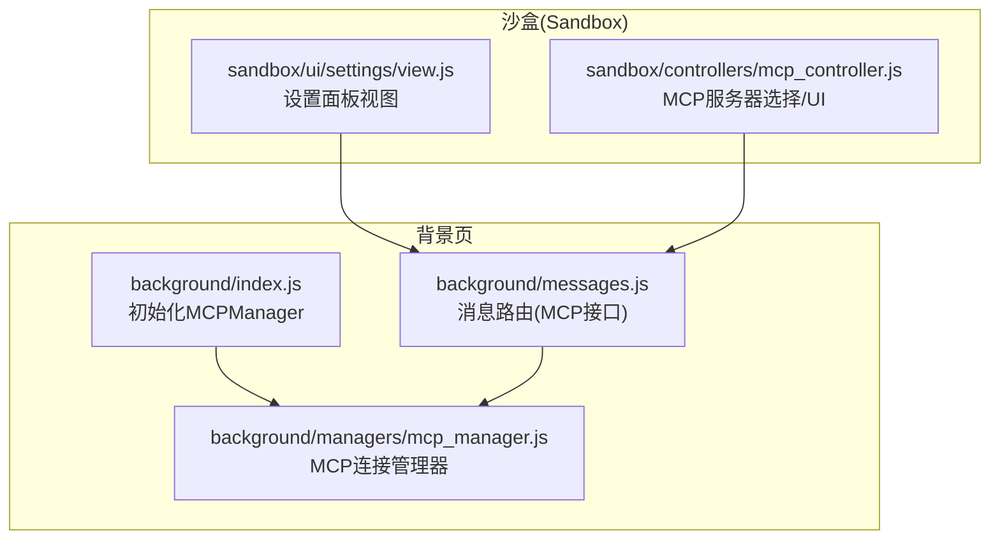
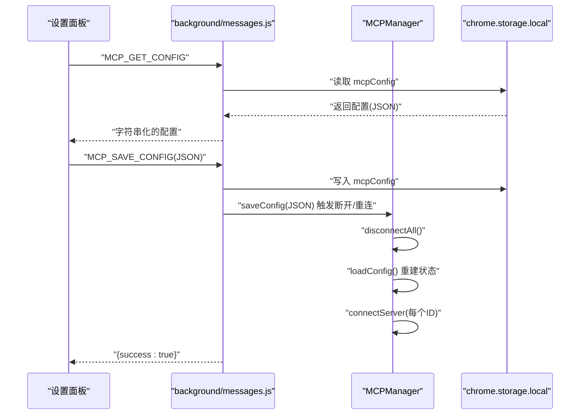
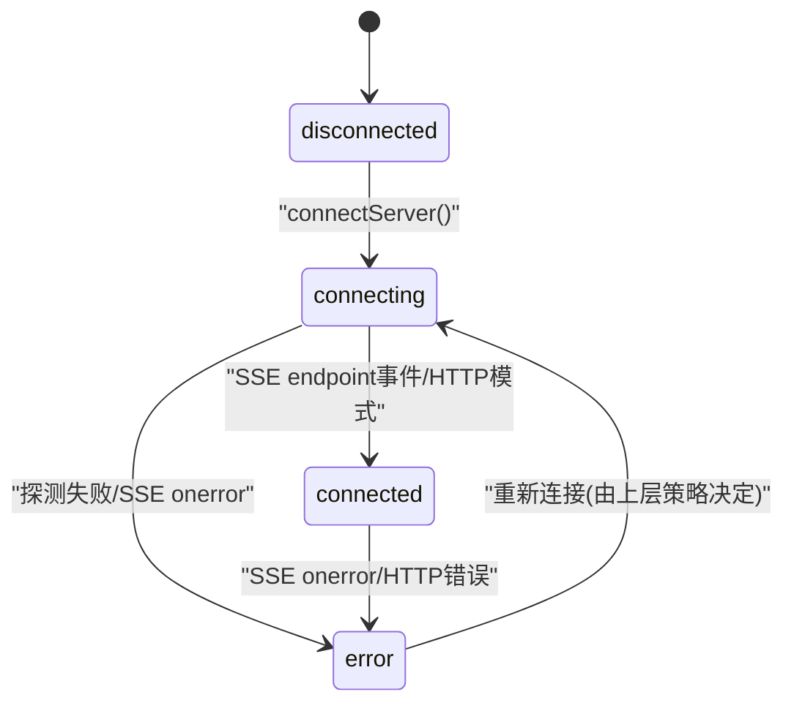
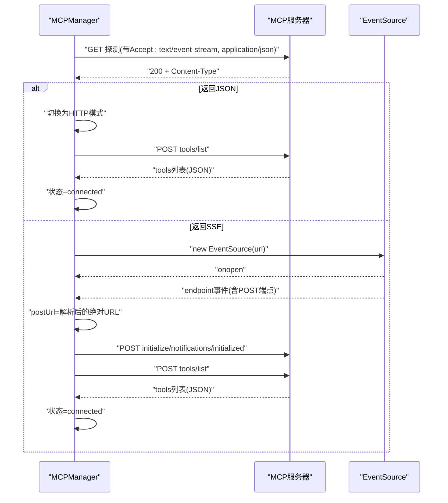
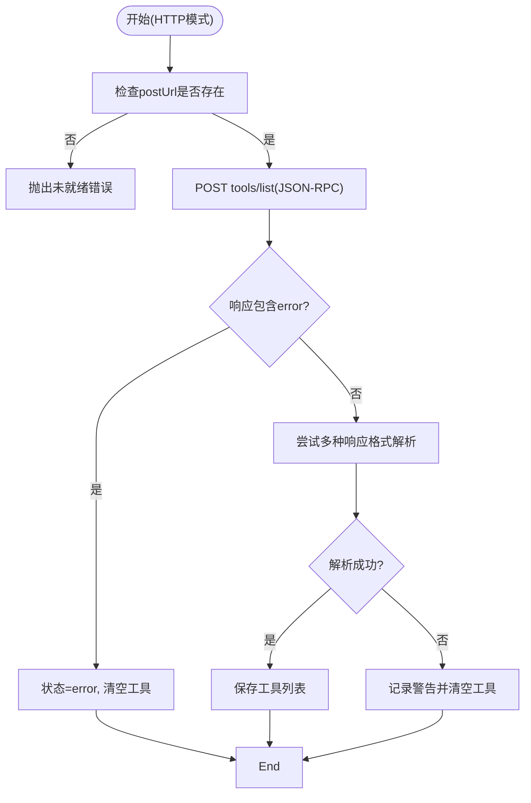
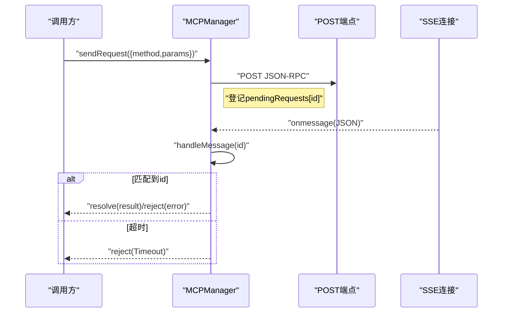
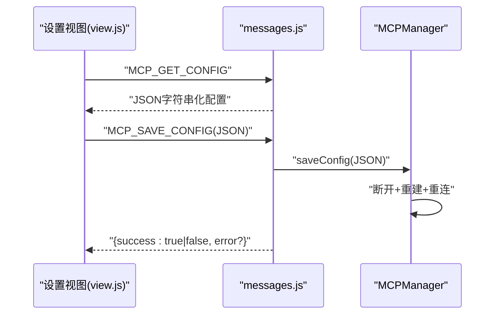
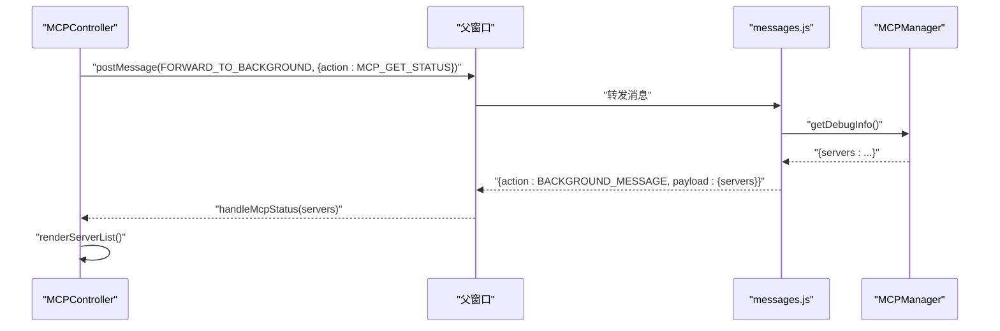
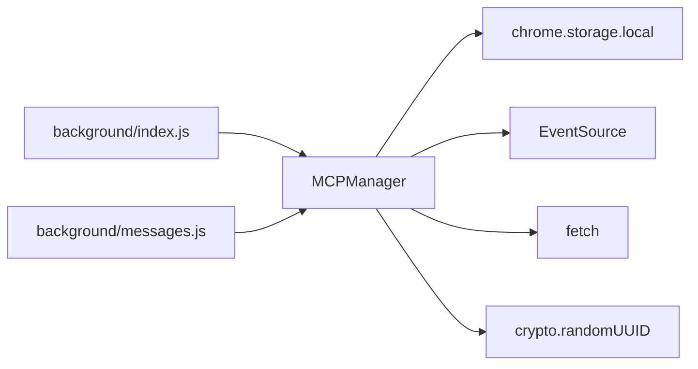

# 连接管理

<cite>
**本文引用的文件列表**
- [mcp_manager.js](file://background/managers/mcp_manager.js)
- [messages.js](file://background/messages.js)
- [index.js](file://background/index.js)
- [mcp_controller.js](file://sandbox/controllers/mcp_controller.js)
- [view.js](file://sandbox/ui/settings/view.js)
- [connection.js](file://background/control/connection.js)
</cite>

## 目录
1. [简介](#简介)
2. [项目结构](#项目结构)
3. [核心组件](#核心组件)
4. [架构总览](#架构总览)
5. [详细组件分析](#详细组件分析)
6. [依赖关系分析](#依赖关系分析)
7. [性能与并发](#性能与并发)
8. [故障排查指南](#故障排查指南)
9. [结论](#结论)
10. [附录：配置数据结构](#附录配置数据结构)

## 简介
本文件聚焦于MCP（Model Context Protocol）连接管理的技术文档，围绕背景页中的MCPManager实现，系统阐述SSE与HTTP两种传输模式的连接建立、状态管理、断开机制与生命周期。文档覆盖服务端探测、端点发现、自动重连、配置加载、连接状态机（connecting、connected、error）、超时与错误处理、调试信息输出、连接池与并发限制、安全性最佳实践等主题，并提供关键流程的时序图与配置数据结构说明。

## 项目结构
与MCP连接管理直接相关的模块分布如下：
- 背景页管理器：MCPManager负责连接生命周期、状态机、消息处理与工具列表刷新
- 消息路由：messages.js将前端设置面板与后台MCPManager对接
- 启动入口：index.js初始化MCPManager并启动连接
- 前端控制器：mcp_controller.js负责UI侧MCP服务器选择与状态展示
- 设置视图：view.js提供MCP配置输入与保存
- 其他控制通道：connection.js用于浏览器调试连接（与MCP无直接耦合）

图表来源
- [index.js](file://background/index.js#L16-L26)
- [messages.js](file://background/messages.js#L14-L81)
- [mcp_manager.js](file://background/managers/mcp_manager.js#L2-L19)

章节来源
- [index.js](file://background/index.js#L16-L26)
- [messages.js](file://background/messages.js#L14-L81)

## 核心组件
- MCPManager：连接生命周期、SSE/HTTP模式切换、端点发现、工具列表刷新、请求发送与响应处理、状态机与调试信息导出
- 消息路由：接收来自设置面板与UI的消息，转发到MCPManager并返回结果
- UI控制器：展示MCP服务器状态、工具数量、错误标记；支持多选服务器
- 设置视图：提供MCP配置JSON输入与保存按钮

章节来源
- [mcp_manager.js](file://background/managers/mcp_manager.js#L2-L529)
- [messages.js](file://background/messages.js#L41-L67)
- [mcp_controller.js](file://sandbox/controllers/mcp_controller.js#L5-L99)
- [view.js](file://sandbox/ui/settings/view.js#L36-L70)

## 架构总览
MCPManager通过Chrome扩展消息通道与设置面板交互，使用chrome.storage.local持久化配置。初始化时读取配置并自动连接所有已配置服务器；根据服务器类型选择SSE或HTTP模式；SSE模式下通过EventSource建立长连接并监听endpoint事件以发现POST端点；HTTP模式下直接使用POST端点进行JSON-RPC调用。

图表来源
- [messages.js](file://background/messages.js#L41-L67)
- [mcp_manager.js](file://background/managers/mcp_manager.js#L40-L61)

## 详细组件分析

### 连接生命周期与状态机
- 初始化：MCPManager.init()读取配置并自动连接所有服务器
- 配置加载：loadConfig()从chrome.storage.local读取mcpConfig，构建内部servers映射，初始状态为disconnected
- 连接建立：
  - SSE模式：connectServer()先探测URL，若返回JSON则切换为HTTP模式；否则建立EventSource，监听endpoint事件获取POST端点，进入connected并初始化会话
  - HTTP模式：connectServer()直接将postUrl设为url，状态置为connected，立即刷新工具列表
- 断开：disconnectAll()关闭所有EventSource
- 状态机：disconnected → connecting → connected 或 error；SSE onerror触发error；HTTP模式无SSE，错误通过HTTP请求与工具刷新失败体现

图表来源
- [mcp_manager.js](file://background/managers/mcp_manager.js#L71-L149)

章节来源
- [mcp_manager.js](file://background/managers/mcp_manager.js#L8-L19)
- [mcp_manager.js](file://background/managers/mcp_manager.js#L21-L38)
- [mcp_manager.js](file://background/managers/mcp_manager.js#L71-L149)

### SSE模式连接与端点发现
- 探测：向URL发起GET请求，检查Content-Type是否为application/json，若是则切换至HTTP模式
- 建立SSE：若非JSON，创建EventSource；监听onopen/onerror
- 端点发现：监听endpoint事件，解析相对URL并拼接绝对URL作为postUrl，状态置为connected
- 初始化会话：收到endpoint后立即发送initialize与notifications/initialized，并刷新工具列表

图表来源
- [mcp_manager.js](file://background/managers/mcp_manager.js#L101-L144)

章节来源
- [mcp_manager.js](file://background/managers/mcp_manager.js#L101-L144)

### HTTP模式连接与工具刷新
- 模式识别：当服务器类型为streamable_http或http时，直接使用HTTP模式
- 工具刷新：refreshToolsHttp()向postUrl发送JSON-RPC请求tools/list，兼容多种响应格式（result.tools、tools、result数组、直接数组）
- 错误处理：若响应包含error字段，记录错误并清空工具列表；解析失败时记录警告并清空工具列表

图表来源
- [mcp_manager.js](file://background/managers/mcp_manager.js#L153-L213)

章节来源
- [mcp_manager.js](file://background/managers/mcp_manager.js#L218-L223)
- [mcp_manager.js](file://background/managers/mcp_manager.js#L153-L213)

### 请求发送与响应处理
- SSE模式：sendRequest()通过fetch发送JSON-RPC请求，同时在pendingRequests中登记Promise并在SSE消息中按id匹配响应；设置10秒超时
- HTTP模式：sendRequestHttp()直接POST并等待HTTP响应，不依赖SSE
- 消息处理：handleMessage()根据消息id解析对应Promise，成功resolve，失败reject

图表来源
- [mcp_manager.js](file://background/managers/mcp_manager.js#L308-L351)
- [mcp_manager.js](file://background/managers/mcp_manager.js#L370-L385)

章节来源
- [mcp_manager.js](file://background/managers/mcp_manager.js#L308-L351)
- [mcp_manager.js](file://background/managers/mcp_manager.js#L370-L385)

### 配置加载与保存
- 加载：loadConfig()从chrome.storage.local读取mcpConfig，若不存在则默认为空配置；遍历mcpServers构建servers映射
- 保存：saveConfig()解析传入JSON，校验包含mcpServers键，写入storage，断开所有连接，重建状态并重新连接
- UI交互：设置面板通过消息通道请求MCP_GET_CONFIG/MCP_SAVE_CONFIG，后台返回字符串化配置或保存结果

图表来源
- [messages.js](file://background/messages.js#L49-L67)
- [mcp_manager.js](file://background/managers/mcp_manager.js#L40-L61)
- [view.js](file://sandbox/ui/settings/view.js#L207-L209)

章节来源
- [mcp_manager.js](file://background/managers/mcp_manager.js#L21-L38)
- [mcp_manager.js](file://background/managers/mcp_manager.js#L40-L61)
- [messages.js](file://background/messages.js#L49-L67)
- [view.js](file://sandbox/ui/settings/view.js#L207-L209)

### UI状态展示与选择
- MCPController负责打开/关闭MCP选择器，向后台请求MCP状态，渲染服务器列表与标签
- 列表项显示状态点（connected/error）、工具数量；支持点击选择/取消选择
- 通过postMessage将“获取状态”动作转发给后台，后台返回servers映射

图表来源
- [mcp_controller.js](file://sandbox/controllers/mcp_controller.js#L88-L99)
- [messages.js](file://background/messages.js#L63-L67)
- [mcp_manager.js](file://background/managers/mcp_manager.js#L389-L403)

章节来源
- [mcp_controller.js](file://sandbox/controllers/mcp_controller.js#L5-L99)

## 依赖关系分析
- MCPManager依赖：
  - chrome.storage.local：持久化mcpConfig
  - EventSource：SSE模式下的长连接
  - fetch：HTTP模式与SSE模式下的请求
  - crypto.randomUUID：生成JSON-RPC id
- 消息路由：
  - messages.js注册runtime.onMessage监听，分发MCP相关动作（保存/获取配置、获取工具、获取状态）
- 启动顺序：
  - background/index.js在初始化阶段调用mcpManager.init()，随后setupMessageListener

图表来源
- [index.js](file://background/index.js#L16-L26)
- [messages.js](file://background/messages.js#L14-L81)
- [mcp_manager.js](file://background/managers/mcp_manager.js#L2-L529)

章节来源
- [index.js](file://background/index.js#L16-L26)
- [messages.js](file://background/messages.js#L14-L81)
- [mcp_manager.js](file://background/managers/mcp_manager.js#L2-L529)

## 性能与并发
- 并发连接：当前实现对每个服务器维护独立连接（SSE或HTTP），未见显式的全局并发上限控制
- 连接池：未实现连接池复用；SSE模式下每个服务器一个EventSource实例
- 超时与重试：
  - sendRequest()设置10秒超时，超时后清理pendingRequests并reject
  - 自动重连：未在MCPManager内实现定时重连；可在上层策略中触发重连
- 工具刷新：HTTP模式下refreshToolsHttp()在连接成功后立即执行一次；SSE模式下在endpoint事件后执行
- 建议：
  - 引入可配置的并发上限与指数退避重连策略
  - 对频繁调用的工具请求增加本地缓存与去抖
  - 在SSE模式下增加心跳检测与断线重连

[本节为通用建议，无需特定文件来源]

## 故障排查指南
- 无法连接：
  - 检查配置中url/endpoint是否存在；connectServer()在缺失时直接置为error
  - 查看SSE探测日志与Content-Type判断；若服务器返回JSON则自动切换HTTP模式
- SSE错误：
  - EventSource.onerror触发，状态置为error；检查服务器端SSE实现与跨域设置
- HTTP错误：
  - refreshToolsHttp()与sendRequestHttp()在响应error或HTTP错误时记录错误并清空工具
- 超时：
  - sendRequest()在10秒内未收到响应则reject("Timeout")；检查网络延迟与服务器响应能力
- 调试信息：
  - getDebugInfo()输出每个服务器的状态、类型、URL、POST端点、工具数量与名称列表
  - UI通过MCP_GET_STATUS获取状态并在列表中标注connected/error

章节来源
- [mcp_manager.js](file://background/managers/mcp_manager.js#L79-L83)
- [mcp_manager.js](file://background/managers/mcp_manager.js#L101-L149)
- [mcp_manager.js](file://background/managers/mcp_manager.js#L153-L213)
- [mcp_manager.js](file://background/managers/mcp_manager.js#L308-L351)
- [mcp_manager.js](file://background/managers/mcp_manager.js#L389-L403)
- [mcp_controller.js](file://sandbox/controllers/mcp_controller.js#L96-L99)

## 结论
MCPManager实现了完整的SSE与HTTP双模式连接管理，具备服务端探测、端点发现、工具列表刷新与请求响应处理能力。状态机清晰，错误路径明确，调试信息丰富。建议后续引入并发控制、重连策略与缓存优化，以提升稳定性与性能。

[本节为总结性内容，无需特定文件来源]

## 附录：配置数据结构
- 存储位置：chrome.storage.local 中的 mcpConfig
- 数据结构要点：
  - mcpServers：键为服务器ID（通常与名称一致），值为服务器配置对象
  - 服务器配置字段：
    - url 或 endpoint：服务器地址
    - type：传输类型，可选值包括sse（默认）、streamable_http、http
  - 运行时状态：
    - servers[id].config：原始配置
    - servers[id].postUrl：SSE模式下endpoint事件解析得到的POST端点
    - servers[id].tools：工具列表
    - servers[id].status：连接状态（disconnected/connecting/connected/error）

章节来源
- [mcp_manager.js](file://background/managers/mcp_manager.js#L21-L38)
- [mcp_manager.js](file://background/managers/mcp_manager.js#L75-L77)
- [mcp_manager.js](file://background/managers/mcp_manager.js#L127-L133)