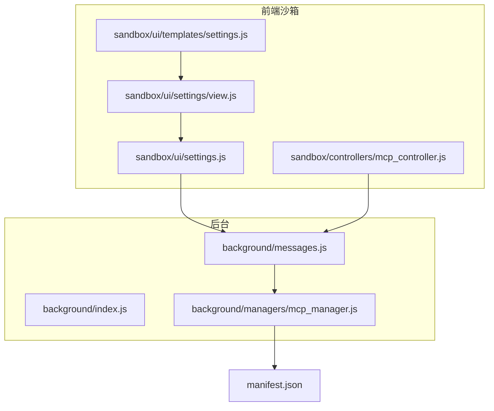
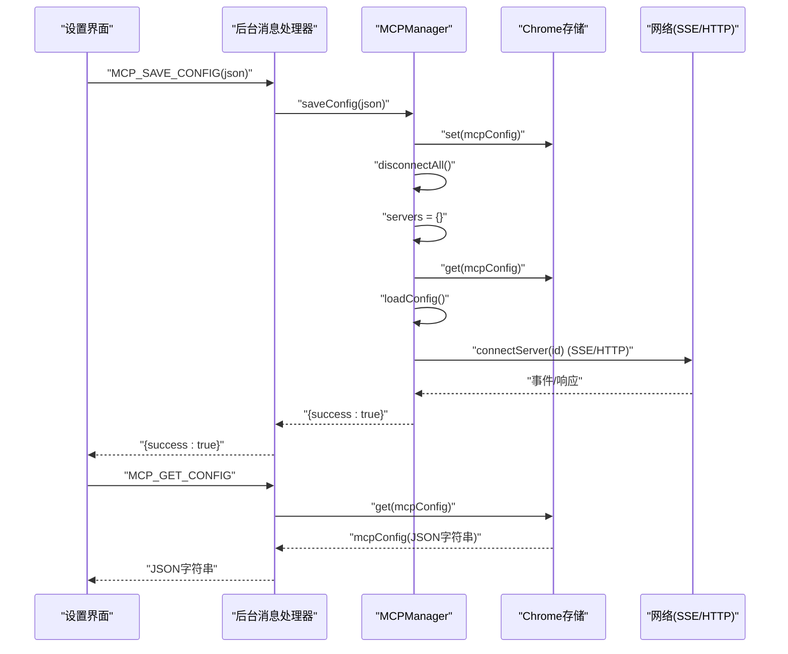
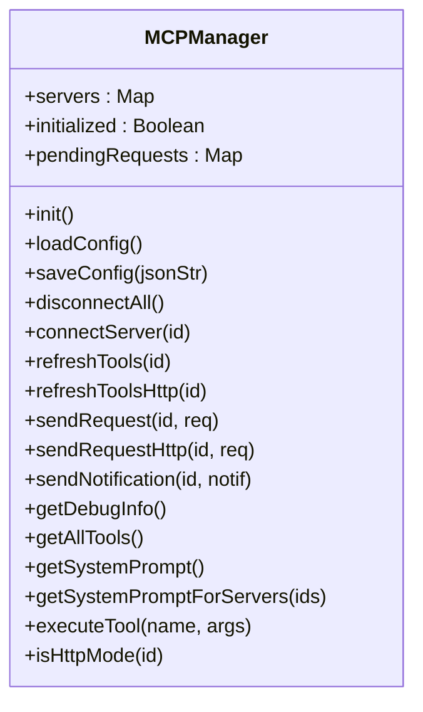
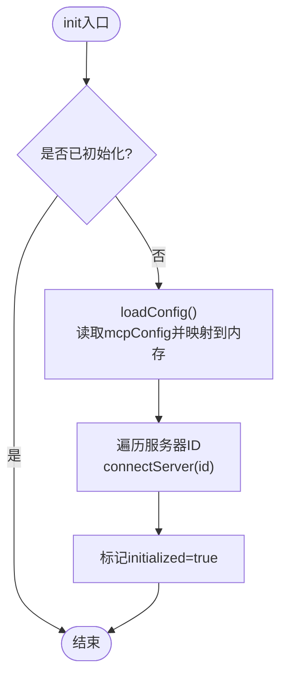
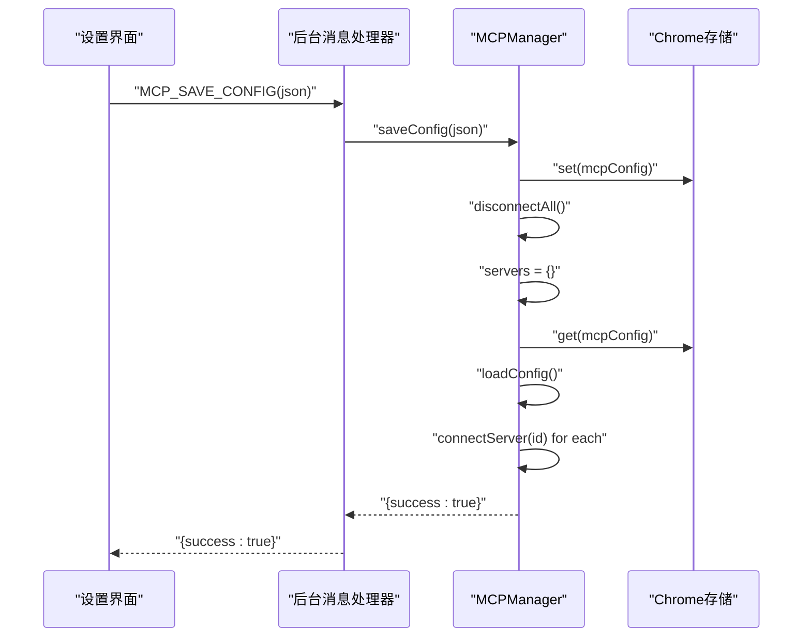
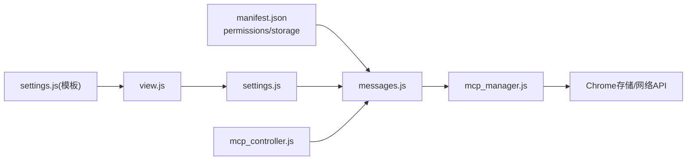

# 配置管理

<cite>
**本文引用的文件**
- [mcp_manager.js](file://background/managers/mcp_manager.js)
- [messages.js](file://background/messages.js)
- [manifest.json](file://manifest.json)
- [settings.js](file://sandbox/ui/settings.js)
- [view.js](file://sandbox/ui/settings/view.js)
- [settings.js](file://sandbox/ui/templates/settings.js)
- [mcp_controller.js](file://sandbox/controllers/mcp_controller.js)
</cite>

## 目录
1. [简介](#简介)
2. [项目结构](#项目结构)
3. [核心组件](#核心组件)
4. [架构总览](#架构总览)
5. [详细组件分析](#详细组件分析)
6. [依赖关系分析](#依赖关系分析)
7. [性能考量](#性能考量)
8. [故障排查指南](#故障排查指南)
9. [结论](#结论)
10. [附录](#附录)

## 简介
本文件聚焦于MCP连接配置管理的技术文档，围绕后台管理器MCPManager在mcp_manager.js中的配置加载与保存机制展开，详细说明：
- loadConfig与saveConfig方法的实现细节与控制流
- mcpConfig在chrome.storage.local中的存储结构与字段定义
- 配置加载时的初始化流程
- 配置更新时的热重载机制（断开所有连接 → 重新加载 → 重新连接）
- 配置验证规则、错误处理策略与默认值设置（如type默认为sse）
- 配置JSON示例与最佳实践（含安全存储建议与多服务器配置模式）

## 项目结构
本项目采用模块化分层组织，MCP配置管理位于后台管理器层，通过消息通道与前端设置界面交互，最终持久化到Chrome扩展的本地存储。

图表来源
- [messages.js](file://background/messages.js#L14-L81)
- [mcp_manager.js](file://background/managers/mcp_manager.js#L2-L19)
- [settings.js](file://sandbox/ui/settings.js#L27-L88)
- [view.js](file://sandbox/ui/settings/view.js#L1-L241)
- [settings.js](file://sandbox/ui/templates/settings.js#L75-L87)
- [mcp_controller.js](file://sandbox/controllers/mcp_controller.js#L1-L185)
- [manifest.json](file://manifest.json#L6-L14)

章节来源
- [messages.js](file://background/messages.js#L14-L81)
- [mcp_manager.js](file://background/managers/mcp_manager.js#L2-L19)
- [settings.js](file://sandbox/ui/settings.js#L27-L88)
- [view.js](file://sandbox/ui/settings/view.js#L1-L241)
- [settings.js](file://sandbox/ui/templates/settings.js#L75-L87)
- [mcp_controller.js](file://sandbox/controllers/mcp_controller.js#L1-L185)
- [manifest.json](file://manifest.json#L6-L14)

## 核心组件
- MCPManager：负责MCP服务器配置的加载、保存、连接、工具列表刷新与请求发送。关键方法包括init、loadConfig、saveConfig、disconnectAll、connectServer、refreshTools、sendRequest等。
- 消息通道：通过chrome.runtime.onMessage监听前台发来的MCP操作请求，调用MCPManager执行相应动作，并返回结果。
- 设置界面：提供MCP配置输入框与保存按钮，将用户输入的JSON字符串提交至后台进行校验与持久化。
- 控制器：负责前端MCP选择器的状态展示与交互，向后台请求状态并渲染。

章节来源
- [mcp_manager.js](file://background/managers/mcp_manager.js#L2-L19)
- [messages.js](file://background/messages.js#L41-L67)
- [settings.js](file://sandbox/ui/settings.js#L27-L88)
- [mcp_controller.js](file://sandbox/controllers/mcp_controller.js#L1-L185)

## 架构总览
下图展示了从设置界面到后台管理器再到Chrome存储的完整数据流与控制流。

图表来源
- [messages.js](file://background/messages.js#L42-L55)
- [mcp_manager.js](file://background/managers/mcp_manager.js#L40-L61)
- [mcp_manager.js](file://background/managers/mcp_manager.js#L21-L38)
- [mcp_manager.js](file://background/managers/mcp_manager.js#L71-L150)

## 详细组件分析

### MCPManager类与配置生命周期
- 初始化与自动连接
  - init方法在首次调用时加载配置并自动连接已配置的服务器。
- 配置加载(loadConfig)
  - 从chrome.storage.local读取mcpConfig键；若不存在则使用默认空对象。
  - 将每个服务器条目映射为内部状态，包含config、eventSource、postUrl、tools、status等字段。
- 配置保存(saveConfig)
  - 解析传入的JSON字符串，校验必须包含mcpServers键。
  - 写入chrome.storage.local后触发热重载：断开所有连接、清空内存状态、重新加载配置、再逐一连接。
  - 返回统一的结果对象(success或包含error)。
- 连接与模式探测(connectServer)
  - 优先使用config.url，若无则回退到endpoint。
  - 默认type为"sse"；当type为"http"或"streamable_http"时走HTTP直连模式，否则尝试SSE。
  - 若SSE探测返回JSON而非SSE，则自动切换为HTTP模式并立即刷新工具列表。
- 工具列表刷新
  - refreshTools：根据当前模式选择refreshToolsHttp或通过SSE发送tools/list请求。
  - refreshToolsHttp：以POST方式调用tools/list，兼容多种响应格式（result.tools、tools、result数组、直接数组）。
- 请求与通知
  - sendRequest：基于SSE模式发送JSON-RPC请求，使用pendingRequests进行响应关联与超时处理。
  - sendRequestHttp：基于HTTP模式发送JSON-RPC请求并等待直接响应。
  - sendNotification：发送JSON-RPC通知。
- 调试与工具检索
  - getDebugInfo：输出各服务器状态、类型、URL、POST URL、工具数量与名称。
  - getAllTools/getSystemPrompt：聚合工具并生成系统提示，便于与模型集成。

图表来源
- [mcp_manager.js](file://background/managers/mcp_manager.js#L2-L529)

章节来源
- [mcp_manager.js](file://background/managers/mcp_manager.js#L8-L19)
- [mcp_manager.js](file://background/managers/mcp_manager.js#L21-L38)
- [mcp_manager.js](file://background/managers/mcp_manager.js#L40-L61)
- [mcp_manager.js](file://background/managers/mcp_manager.js#L71-L150)
- [mcp_manager.js](file://background/managers/mcp_manager.js#L152-L213)
- [mcp_manager.js](file://background/managers/mcp_manager.js#L287-L306)
- [mcp_manager.js](file://background/managers/mcp_manager.js#L308-L351)
- [mcp_manager.js](file://background/managers/mcp_manager.js#L353-L368)
- [mcp_manager.js](file://background/managers/mcp_manager.js#L389-L403)
- [mcp_manager.js](file://background/managers/mcp_manager.js#L407-L477)
- [mcp_manager.js](file://background/managers/mcp_manager.js#L479-L525)

### 配置存储结构与字段定义
- 存储键：mcpConfig
- 结构概览：
  - mcpServers: 对象，键为服务器ID（字符串），值为服务器配置对象。
- 服务器配置对象字段：
  - id：由mcpServers的键决定（作为服务器标识）
  - url：服务器SSE端点或HTTP端点（优先使用）
  - endpoint：备用端点（当url缺失时回退）
  - type：传输类型，支持"sse"、"http"、"streamable_http"。未指定时默认"sse"。
- 注意事项：
  - 服务器ID即mcpServers的键名，用于区分多个服务器实例。
  - 当type为"http"或"streamable_http"时，不使用EventSource，而是直接使用POST请求。

章节来源
- [mcp_manager.js](file://background/managers/mcp_manager.js#L21-L38)
- [mcp_manager.js](file://background/managers/mcp_manager.js#L75-L77)

### 配置加载初始化流程
- 调用顺序：
  1) init → 2) loadConfig → 3) 遍历服务器ID并connectServer → 4) 标记initialized=true
- 行为特征：
  - loadConfig会将存储中的mcpServers逐项映射到内存状态，初始status为"disconnected"。
  - connectServer根据type选择SSE或HTTP模式，并尝试建立连接与工具列表获取。

图表来源
- [mcp_manager.js](file://background/managers/mcp_manager.js#L8-L19)
- [mcp_manager.js](file://background/managers/mcp_manager.js#L21-L38)
- [mcp_manager.js](file://background/managers/mcp_manager.js#L71-L150)

章节来源
- [mcp_manager.js](file://background/managers/mcp_manager.js#L8-L19)
- [mcp_manager.js](file://background/managers/mcp_manager.js#L21-L38)

### 配置更新与热重载机制
- 触发路径：
  - 前台设置界面点击“保存MCP配置”，将JSON字符串通过消息通道发送至后台。
  - 后台消息处理器调用MCPManager.saveConfig，随后返回结果给前台。
- 热重载步骤：
  1) 断开所有现有连接（disconnectAll）
  2) 清空内存状态（servers = {}）
  3) 从存储重新读取配置（loadConfig）
  4) 重新连接所有服务器（connectServer）
- 优点：
  - 无需重启扩展即可应用新配置。
  - 自动处理SSE/HTTP模式切换与工具列表刷新。

图表来源
- [messages.js](file://background/messages.js#L42-L47)
- [mcp_manager.js](file://background/managers/mcp_manager.js#L40-L61)
- [mcp_manager.js](file://background/managers/mcp_manager.js#L21-L38)
- [mcp_manager.js](file://background/managers/mcp_manager.js#L71-L150)

章节来源
- [messages.js](file://background/messages.js#L42-L47)
- [mcp_manager.js](file://background/managers/mcp_manager.js#L40-L61)

### 配置验证规则与错误处理
- 验证规则：
  - saveConfig要求传入的JSON必须包含mcpServers键，否则抛出错误并返回失败结果。
- 错误处理策略：
  - saveConfig捕获解析异常与缺少键异常，返回{success:false, error: message}。
  - connectServer在缺少URL时记录错误并标记status为"error"。
  - refreshTools/refreshToolsHttp对不同响应格式进行兼容解析，无法解析时清空tools并记录警告。
  - sendRequest对超时与HTTP错误进行处理，pendingRequests中注册的请求在超时后被清理。
- 默认值：
  - type默认为"sse"。
  - URL优先使用url，其次回退到endpoint。

章节来源
- [mcp_manager.js](file://background/managers/mcp_manager.js#L40-L61)
- [mcp_manager.js](file://background/managers/mcp_manager.js#L75-L83)
- [mcp_manager.js](file://background/managers/mcp_manager.js#L152-L213)
- [mcp_manager.js](file://background/managers/mcp_manager.js#L308-L351)

### 配置JSON示例与最佳实践
- 示例结构要点：
  - mcpServers为顶层对象，键为服务器ID（例如"default_sse_server`）。
  - 每个服务器配置包含url或endpoint，以及可选的type（默认"sse"）。
- 多服务器配置模式：
  - 可在同一mcpServers下添加多个服务器条目，键名即服务器ID。
  - 不同服务器可混合使用SSE与HTTP模式，便于对接不同类型的MCP服务。
- 安全存储建议：
  - 使用chrome.storage.local存储配置，确保仅扩展内可见。
  - 如需敏感信息（如认证令牌），应避免将其硬编码在配置中，可通过其他安全通道注入或在运行时动态获取。
- 最佳实践：
  - 在保存前先在设置界面预览JSON格式，确保包含mcpServers键。
  - 对于HTTP模式服务器，确认其支持POST直连与tools/list接口。
  - 使用默认"sse"模式时，确保服务器正确返回SSE流并在endpoint事件中提供POST URL。

章节来源
- [mcp_manager.js](file://background/managers/mcp_manager.js#L21-L38)
- [mcp_manager.js](file://background/managers/mcp_manager.js#L75-L77)
- [settings.js](file://sandbox/ui/templates/settings.js#L75-L87)

## 依赖关系分析
- 权限与宿主权限
  - manifest.json声明了storage权限，允许后台脚本访问chrome.storage.local。
  - host_permissions包含"<all_urls>"，满足跨域HTTP/SSE请求需求。
- 组件耦合
  - MCPManager与消息处理器通过chrome.runtime.onMessage解耦，前台通过消息通道触发后台动作。
  - 设置界面与控制器通过postMessage与后台通信，实现状态查询与配置保存。
- 外部依赖
  - EventSource用于SSE连接。
  - fetch用于HTTP请求与JSON-RPC调用。

图表来源
- [manifest.json](file://manifest.json#L6-L14)
- [messages.js](file://background/messages.js#L14-L81)
- [mcp_manager.js](file://background/managers/mcp_manager.js#L2-L529)
- [settings.js](file://sandbox/ui/settings.js#L27-L88)
- [view.js](file://sandbox/ui/settings/view.js#L1-L241)
- [settings.js](file://sandbox/ui/templates/settings.js#L75-L87)
- [mcp_controller.js](file://sandbox/controllers/mcp_controller.js#L1-L185)

章节来源
- [manifest.json](file://manifest.json#L6-L14)
- [messages.js](file://background/messages.js#L14-L81)
- [mcp_manager.js](file://background/managers/mcp_manager.js#L2-L529)
- [settings.js](file://sandbox/ui/settings.js#L27-L88)
- [view.js](file://sandbox/ui/settings/view.js#L1-L241)
- [settings.js](file://sandbox/ui/templates/settings.js#L75-L87)
- [mcp_controller.js](file://sandbox/controllers/mcp_controller.js#L1-L185)

## 性能考量
- 连接建立与探测
  - SSE模式下先发起GET探测以判断内容类型，必要时切换为HTTP模式，减少不必要的EventSource资源占用。
- 请求关联与超时
  - pendingRequests用于请求-响应关联与超时清理，避免内存泄漏。
- 工具列表刷新
  - refreshToolsHttp兼容多种响应格式，减少因服务端差异导致的失败重试。
- 存储访问
  - 通过一次set与两次get完成热重载，尽量减少频繁读写带来的性能损耗。

## 故障排查指南
- 常见问题与定位
  - 保存失败：检查JSON是否包含mcpServers键；查看返回的error信息。
  - 服务器无URL：检查config.url或endpoint是否填写；connectServer会记录错误并标记为"error"。
  - SSE连接失败：确认服务器支持SSE且端点正确；若返回JSON则会自动切换为HTTP模式。
  - 工具列表为空：检查tools/list接口响应格式；refreshToolsHttp对多种格式进行兼容解析。
- 调试手段
  - 使用getDebugInfo输出各服务器状态、类型、URL、POST URL与工具数量。
  - 查看控制台日志，关注"[MCP]"前缀的调试信息。
- 重置与恢复
  - 通过热重载机制自动断开并重建连接，若仍失败，可删除mcpConfig键后重新配置。

章节来源
- [mcp_manager.js](file://background/managers/mcp_manager.js#L40-L61)
- [mcp_manager.js](file://background/managers/mcp_manager.js#L75-L83)
- [mcp_manager.js](file://background/managers/mcp_manager.js#L152-L213)
- [mcp_manager.js](file://background/managers/mcp_manager.js#L389-L403)

## 结论
本文档系统梳理了MCP连接配置管理在本项目中的实现与使用方式，重点覆盖了MCPManager的loadConfig与saveConfig方法、mcpConfig在chrome.storage.local中的存储结构、初始化流程与热重载机制，并提供了验证规则、错误处理策略、默认值设置、配置示例与最佳实践。通过消息通道与设置界面的配合，实现了从配置输入到持久化与热重载的完整闭环。

## 附录
- 关键流程图与序列图请参见前述章节的图表来源标注。
- 如需进一步了解消息路由与工具执行链路，可参考相关文件的上下文。