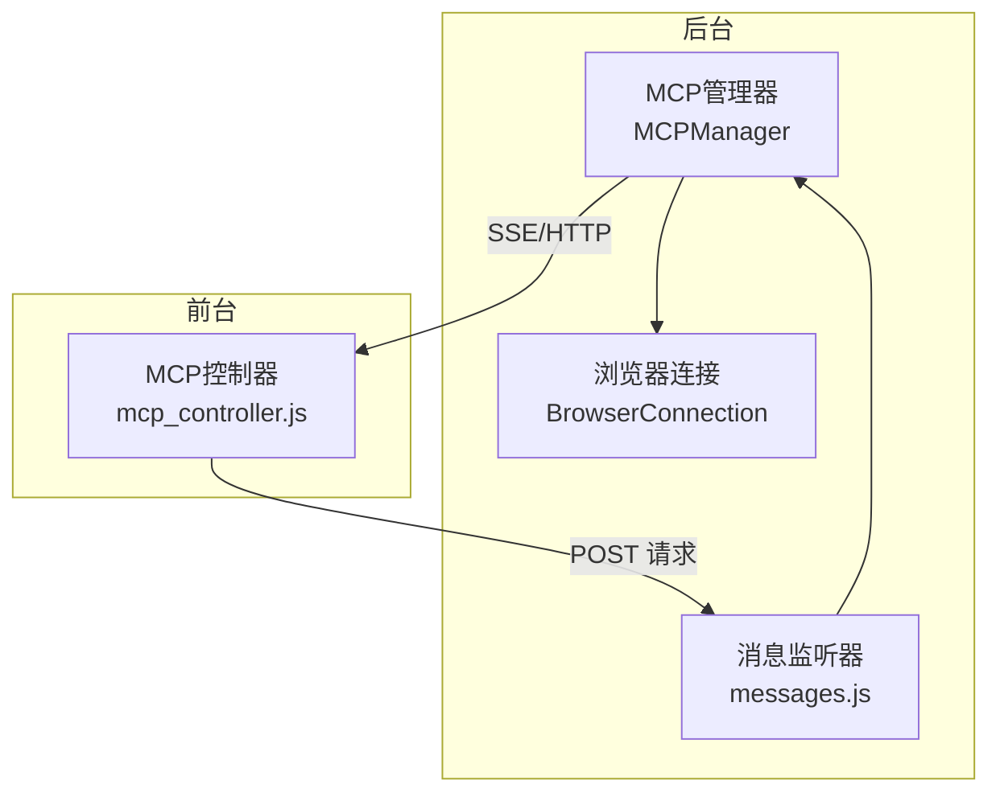
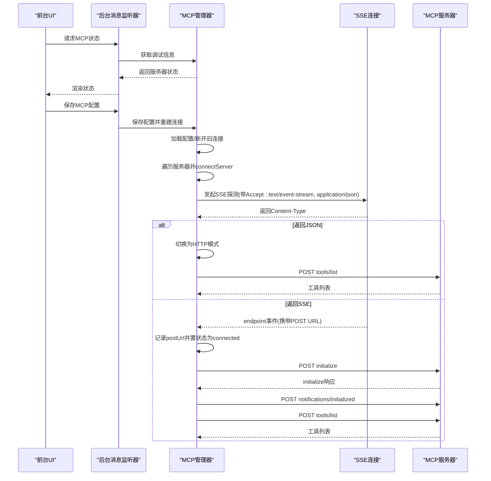
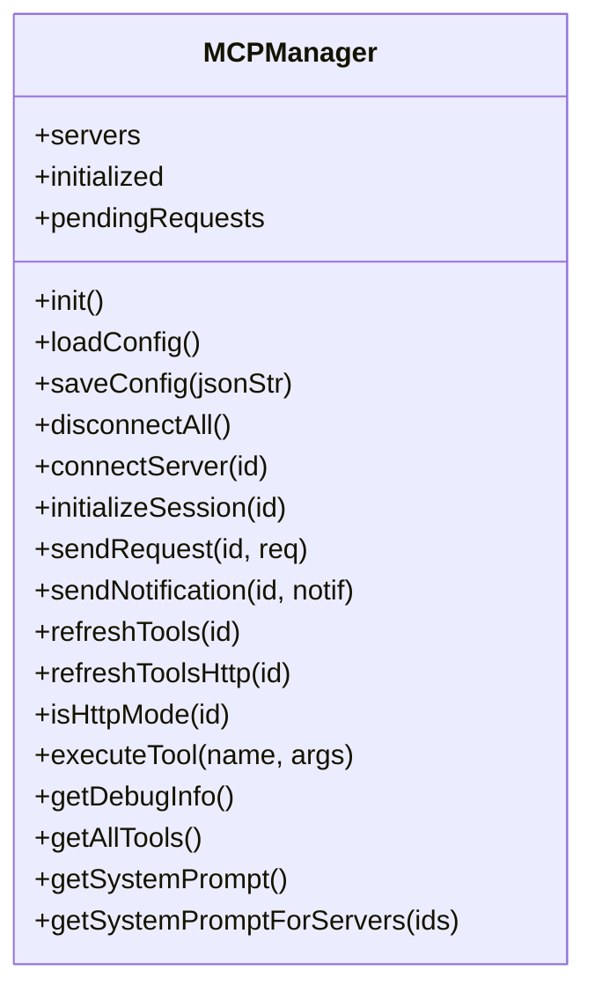
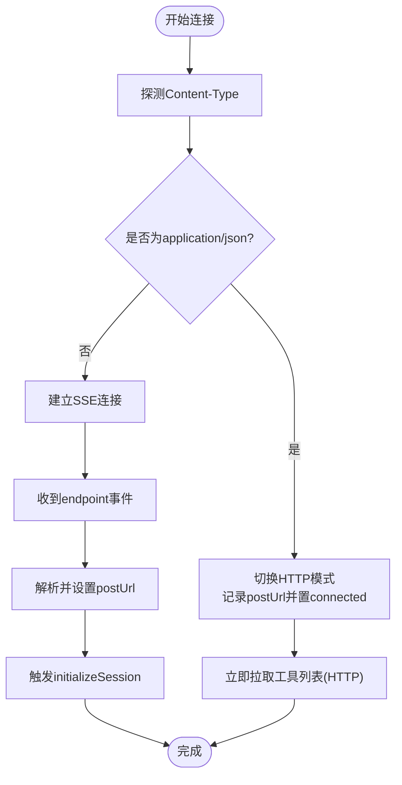
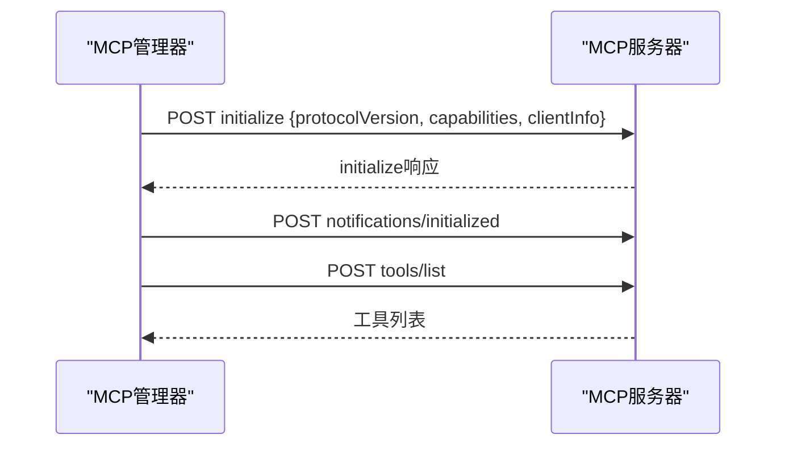
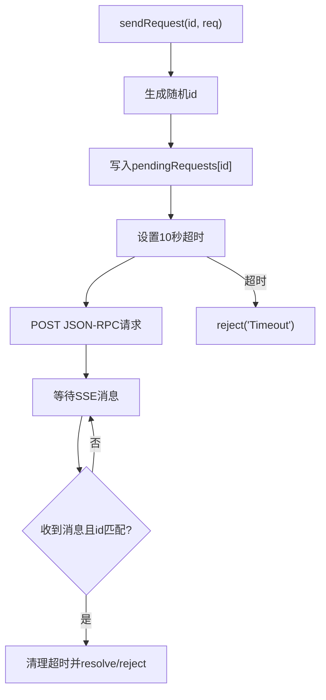
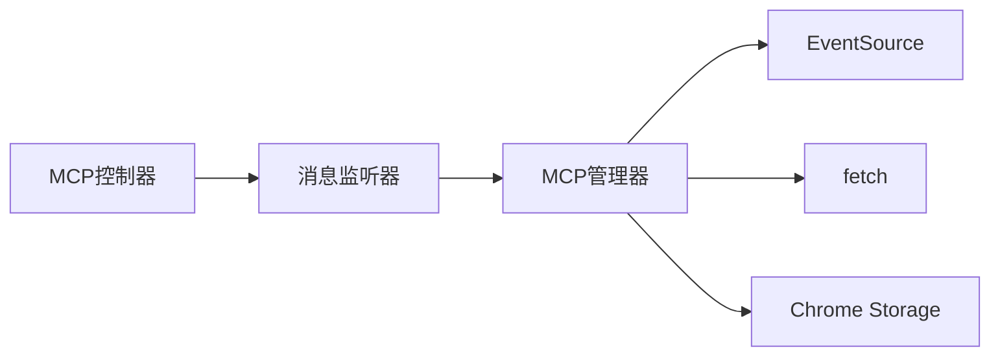

# 会话初始化

<cite>
**本文引用的文件列表**
- [mcp_manager.js](file://background/managers/mcp_manager.js)
- [messages.js](file://background/messages.js)
- [mcp_controller.js](file://sandbox/controllers/mcp_controller.js)
- [connection.js](file://background/control/connection.js)
- [constants.js](file://lib/constants.js)
</cite>

## 目录
1. [简介](#简介)
2. [项目结构](#项目结构)
3. [核心组件](#核心组件)
4. [架构总览](#架构总览)
5. [详细组件分析](#详细组件分析)
6. [依赖关系分析](#依赖关系分析)
7. [性能考量](#性能考量)
8. [故障排查指南](#故障排查指南)
9. [结论](#结论)
10. [附录](#附录)

## 简介
本技术文档聚焦于MCP（Model Context Protocol）会话初始化流程，围绕从连接建立到initialize与notifications/initialized握手的完整过程进行深入解析。文档基于后台管理器MCPManager的connectServer、initializeSession、sendRequest与sendNotification等方法实现，系统阐述：
- SSE连接建立与endpoint事件处理
- JSON-RPC initialize请求发送与响应等待机制
- notifications/initialized通知发送
- 协议版本协商、客户端能力声明与服务器响应处理
- HTTP模式与SSE模式的初始化差异
- 连接失败时的状态管理与错误处理
- 异步初始化过程中的超时与请求关联机制

## 项目结构
MCP相关逻辑主要位于后台管理器与消息桥接层，前端通过控制器与后台交互获取状态并展示。关键模块如下：
- 后台管理器：负责加载配置、建立连接、发送请求与通知、工具列表刷新、状态维护
- 消息桥接：统一接收前台消息，转发至对应处理器或MCP管理器
- 前端控制器：向后台查询MCP状态并在UI中呈现

图表来源
- [mcp_manager.js](file://background/managers/mcp_manager.js#L1-L530)
- [messages.js](file://background/messages.js#L1-L82)
- [mcp_controller.js](file://sandbox/controllers/mcp_controller.js#L1-L150)
- [connection.js](file://background/control/connection.js#L1-L147)

章节来源
- [mcp_manager.js](file://background/managers/mcp_manager.js#L1-L530)
- [messages.js](file://background/messages.js#L1-L82)
- [mcp_controller.js](file://sandbox/controllers/mcp_controller.js#L1-L150)

## 核心组件
- MCPManager：负责MCP服务器配置加载、连接建立、会话初始化、请求/通知发送、工具列表拉取与状态管理
- 消息监听器：集中处理来自前台的消息请求，包括MCP配置保存、获取、工具列表与状态查询
- MCP控制器：在前台侧请求后台MCP状态并在UI中渲染

章节来源
- [mcp_manager.js](file://background/managers/mcp_manager.js#L1-L530)
- [messages.js](file://background/messages.js#L1-L82)
- [mcp_controller.js](file://sandbox/controllers/mcp_controller.js#L1-L150)

## 架构总览
MCP初始化涉及两条路径：
- SSE模式：通过SSE连接接收endpoint事件，获得POST URL后进入initialize/notifications/initialized握手，随后拉取工具列表
- HTTP模式：直接以POST方式与服务器交互，无需SSE；在连接成功后立即拉取工具列表

图表来源
- [mcp_manager.js](file://background/managers/mcp_manager.js#L71-L150)
- [mcp_manager.js](file://background/managers/mcp_manager.js#L262-L285)
- [mcp_manager.js](file://background/managers/mcp_manager.js#L287-L306)
- [messages.js](file://background/messages.js#L41-L67)

## 详细组件分析

### 组件A：MCPManager（会话初始化与消息处理）
- 负责：
  - 初始化与配置加载：从本地存储读取mcpConfig，构建服务器映射
  - 连接建立：根据类型选择SSE或HTTP模式；SSE模式下探测Content-Type，必要时降级为HTTP
  - 会话初始化：发送initialize请求并声明客户端能力，随后发送notifications/initialized通知
  - 请求/通知发送：封装JSON-RPC请求与通知，支持SSE模式下的请求-响应关联与超时处理
  - 工具列表刷新：按模式分别调用HTTP或SSE方式拉取工具
  - 状态管理：维护每个服务器的连接状态、POST URL、工具列表

图表来源
- [mcp_manager.js](file://background/managers/mcp_manager.js#L2-L530)

章节来源
- [mcp_manager.js](file://background/managers/mcp_manager.js#L1-L530)

### 组件B：SSE连接建立与endpoint事件处理
- 探测阶段：发起GET请求并设置Accept头，检查Content-Type
  - 若返回application/json，则切换为HTTP模式，记录postUrl并置状态为connected，立即拉取工具
  - 若返回SSE流，则创建EventSource实例，注册onopen/onerror/onmessage
- endpoint事件：当收到endpoint事件时，解析相对URL并拼接绝对URL作为postUrl，更新状态为connected，触发initializeSession
- onmessage：解析JSON消息并交由handleMessage处理，用于匹配请求-响应

图表来源
- [mcp_manager.js](file://background/managers/mcp_manager.js#L101-L145)
- [mcp_manager.js](file://background/managers/mcp_manager.js#L127-L133)

章节来源
- [mcp_manager.js](file://background/managers/mcp_manager.js#L71-L150)

### 组件C：initialize与notifications/initialized握手
- initialize请求：包含protocolVersion与capabilities声明，clientInfo提供客户端元信息
- notifications/initialized通知：在initialize完成后立即发送，表示客户端已就绪
- 工具列表刷新：握手完成后调用refreshTools，按模式选择HTTP或SSE方式拉取

图表来源
- [mcp_manager.js](file://background/managers/mcp_manager.js#L262-L285)
- [mcp_manager.js](file://background/managers/mcp_manager.js#L287-L306)

章节来源
- [mcp_manager.js](file://background/managers/mcp_manager.js#L262-L306)

### 组件D：请求-响应关联与超时处理（SSE模式）
- sendRequest：为每次请求生成唯一id，存入pendingRequests映射，设置10秒超时
- handleMessage：当收到消息且存在对应id时，清理超时并resolve/reject
- 注意：标准MCP HTTP传输中，请求通过POST发送，响应通过SSE推送；该实现采用fetch发送请求，响应通过SSE事件到达，依赖id关联

图表来源
- [mcp_manager.js](file://background/managers/mcp_manager.js#L308-L351)
- [mcp_manager.js](file://background/managers/mcp_manager.js#L370-L385)

章节来源
- [mcp_manager.js](file://background/managers/mcp_manager.js#L308-L385)

### 组件E：HTTP模式与SSE模式差异
- SSE模式
  - 通过SSE探测Content-Type决定是否降级
  - endpoint事件提供postUrl，随后进行initialize/initialized握手
  - 工具列表通过SSE或SSE+请求两种方式获取
- HTTP模式
  - 直接使用POST URL，无需SSE
  - 连接成功后立即通过POST tools/list获取工具列表
  - 执行工具调用时使用sendRequestHttp，直接等待HTTP响应

章节来源
- [mcp_manager.js](file://background/managers/mcp_manager.js#L87-L113)
- [mcp_manager.js](file://background/managers/mcp_manager.js#L152-L213)
- [mcp_manager.js](file://background/managers/mcp_manager.js#L215-L223)
- [mcp_manager.js](file://background/managers/mcp_manager.js#L229-L260)

### 组件F：状态管理与错误处理
- 状态字段：disconnected/connecting/connected/error
- 错误处理：
  - SSE连接错误：onerror回调中将状态置为error
  - HTTP模式：对工具列表请求的错误进行捕获与状态置位
  - 请求超时：pendingRequests中未匹配到响应时触发超时错误
- 断开连接：disconnectAll关闭所有EventSource

章节来源
- [mcp_manager.js](file://background/managers/mcp_manager.js#L3-L6)
- [mcp_manager.js](file://background/managers/mcp_manager.js#L122-L125)
- [mcp_manager.js](file://background/managers/mcp_manager.js#L210-L212)
- [mcp_manager.js](file://background/managers/mcp_manager.js#L326-L329)
- [mcp_manager.js](file://background/managers/mcp_manager.js#L63-L69)

### 组件G：消息桥接与UI交互
- 消息监听器：处理MCP配置保存、获取、工具列表与状态查询
- MCP控制器：向后台请求MCP状态并在UI中渲染，包含选中服务器、错误状态与工具数量展示

章节来源
- [messages.js](file://background/messages.js#L41-L67)
- [mcp_controller.js](file://sandbox/controllers/mcp_controller.js#L88-L149)

## 依赖关系分析
- MCPManager依赖：
  - 浏览器存储：读取/保存mcpConfig
  - EventSource：SSE连接与事件处理
  - fetch：HTTP请求（SSE模式下用于发送JSON-RPC，HTTP模式下直接获取工具）
  - pendingRequests：SSE模式下请求-响应关联
- 与UI交互：
  - 通过消息通道与前台控制器通信，提供状态查询与配置管理
- 与其他模块：
  - 与BrowserConnection无直接耦合，但同属后台控制模块

图表来源
- [mcp_manager.js](file://background/managers/mcp_manager.js#L21-L23)
- [mcp_manager.js](file://background/managers/mcp_manager.js#L101-L145)
- [messages.js](file://background/messages.js#L41-L67)
- [mcp_controller.js](file://sandbox/controllers/mcp_controller.js#L88-L93)

章节来源
- [mcp_manager.js](file://background/managers/mcp_manager.js#L1-L530)
- [messages.js](file://background/messages.js#L1-L82)
- [mcp_controller.js](file://sandbox/controllers/mcp_controller.js#L1-L150)

## 性能考量
- SSE探测：一次GET请求即可判断服务器类型，避免不必要的SSE连接
- HTTP模式：直接POST工具列表，减少SSE事件处理开销
- 请求超时：默认10秒，可根据网络环境调整
- 工具列表缓存：当前实现每次握手后都会重新拉取，可考虑在工具未变更时复用缓存
- 并发请求：pendingRequests映射确保多请求并发时的正确关联

## 故障排查指南
- 无法建立SSE连接
  - 检查服务器是否返回application/json而非SSE流；若返回JSON则自动降级为HTTP模式
  - 查看onerror回调日志，确认网络连通性与跨域策略
- endpoint事件未触发
  - 确认服务器是否正确发送endpoint事件
  - 检查postUrl解析逻辑与URL拼接
- initialize/initialized握手失败
  - 检查initialize请求参数（protocolVersion、capabilities、clientInfo）
  - 确认服务器是否返回initialize响应
- 工具列表为空
  - 在HTTP模式下检查POST tools/list响应格式
  - 在SSE模式下确认tools/list请求是否成功
- 请求超时
  - 检查网络延迟与服务器负载
  - 调整超时时间或优化服务器响应速度

章节来源
- [mcp_manager.js](file://background/managers/mcp_manager.js#L101-L145)
- [mcp_manager.js](file://background/managers/mcp_manager.js#L127-L133)
- [mcp_manager.js](file://background/managers/mcp_manager.js#L262-L285)
- [mcp_manager.js](file://background/managers/mcp_manager.js#L287-L306)
- [mcp_manager.js](file://background/managers/mcp_manager.js#L308-L351)

## 结论
本文档系统梳理了MCP会话初始化的完整流程，覆盖SSE与HTTP两种模式的差异、握手细节、状态管理与错误处理。通过MCPManager的connectServer、initializeSession、sendRequest与sendNotification等方法，实现了从连接建立到工具可用的端到端能力。建议在生产环境中结合实际服务器行为进一步完善重试策略与超时配置，并考虑工具列表缓存以提升性能。

## 附录
- 关键实现位置参考
  - 连接建立与模式判定：[mcp_manager.js](file://background/managers/mcp_manager.js#L71-L113)
  - SSE事件处理与endpoint事件：[mcp_manager.js](file://background/managers/mcp_manager.js#L116-L145)
  - initialize与notifications/initialized握手：[mcp_manager.js](file://background/managers/mcp_manager.js#L262-L285)
  - 请求-响应关联与超时：[mcp_manager.js](file://background/managers/mcp_manager.js#L308-L351)
  - HTTP模式工具列表刷新：[mcp_manager.js](file://background/managers/mcp_manager.js#L152-L213)
  - 状态管理与断开连接：[mcp_manager.js](file://background/managers/mcp_manager.js#L3-L6), [mcp_manager.js](file://background/managers/mcp_manager.js#L63-L69)
  - 消息桥接与UI交互：[messages.js](file://background/messages.js#L41-L67), [mcp_controller.js](file://sandbox/controllers/mcp_controller.js#L88-L149)