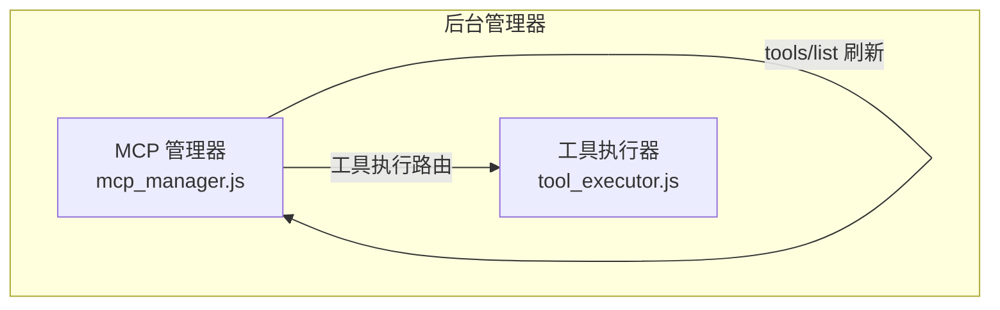
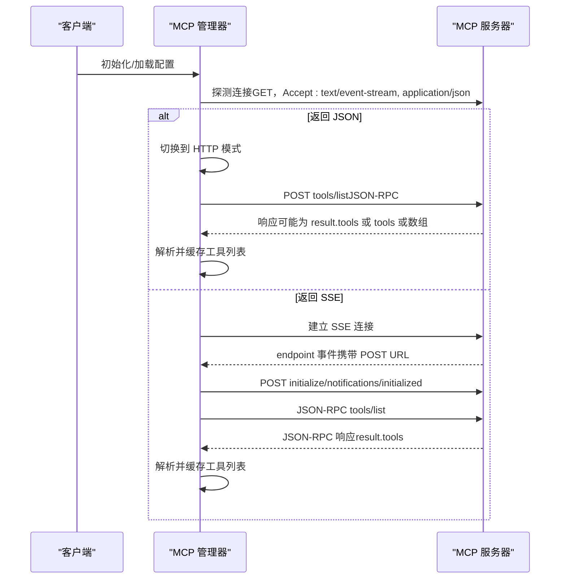
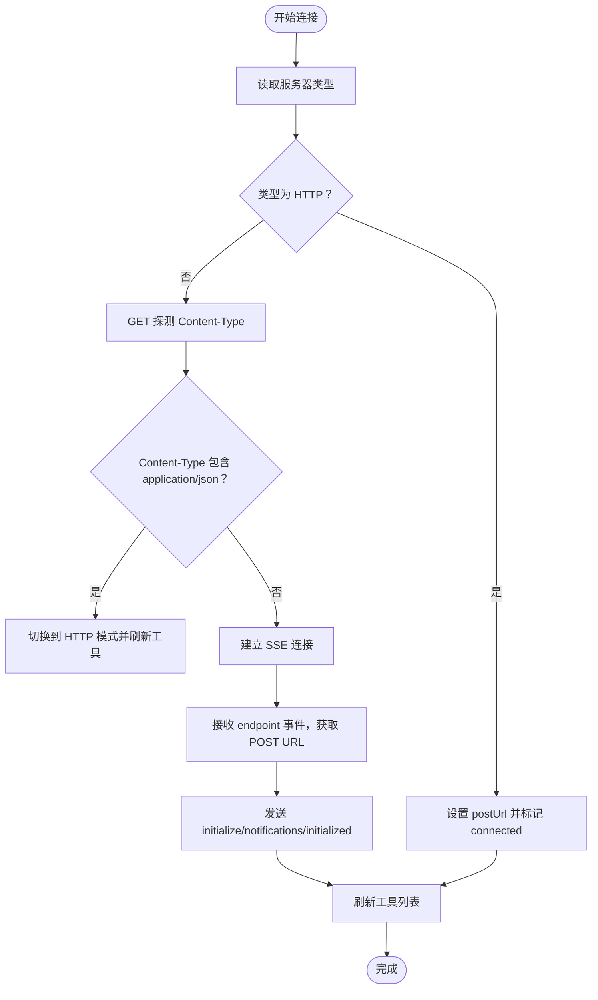
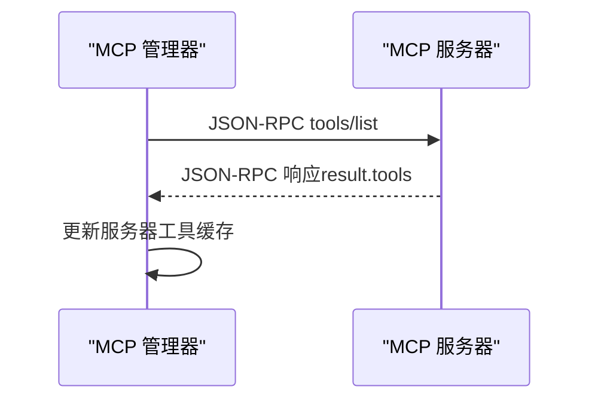
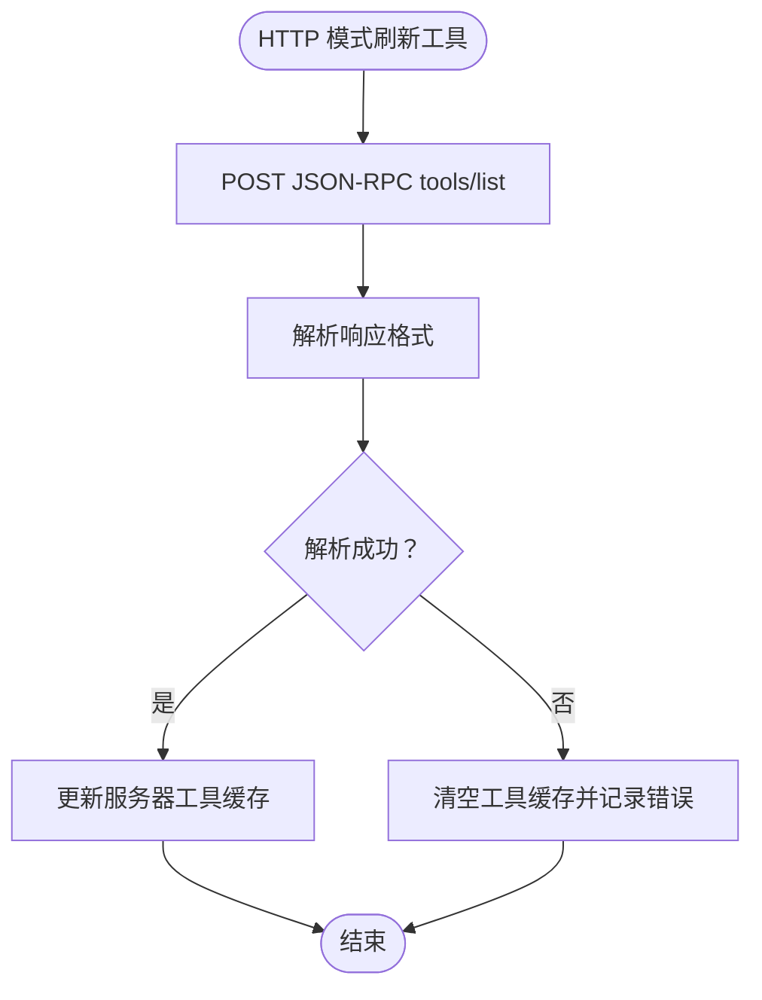
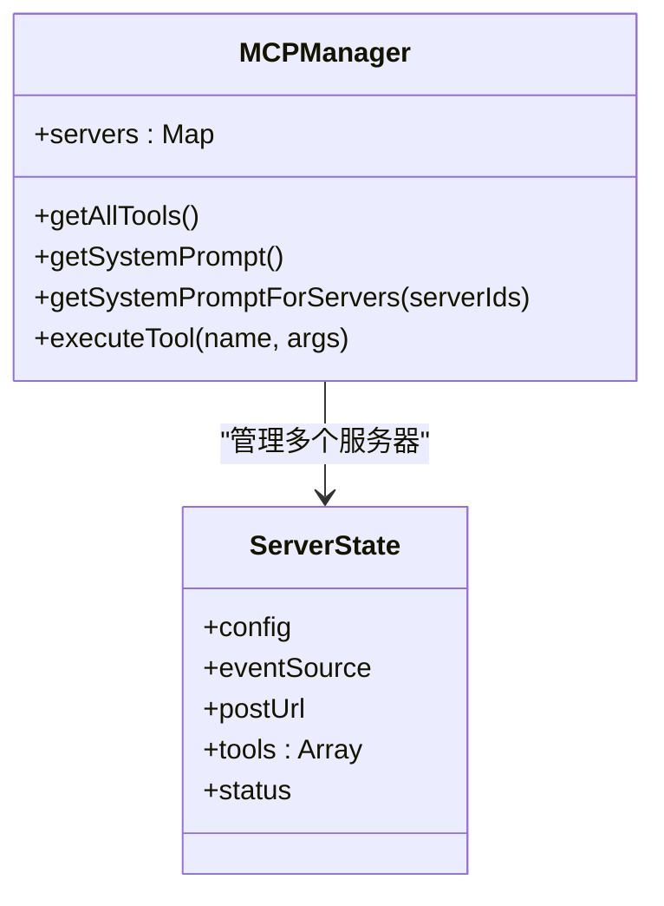
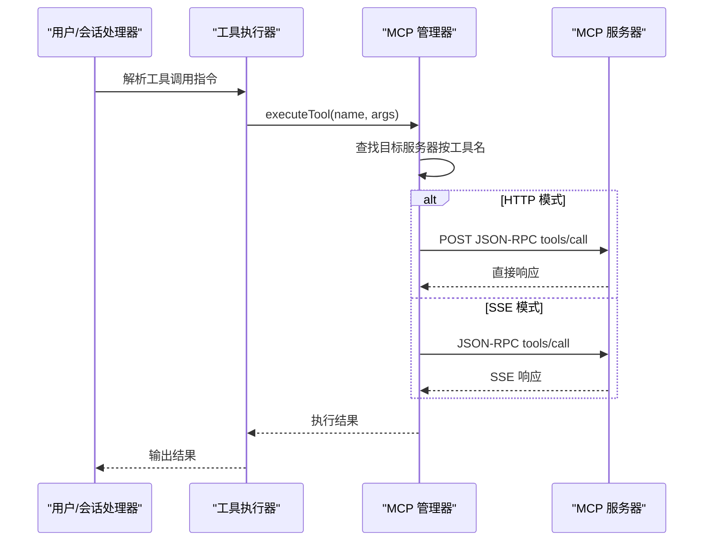
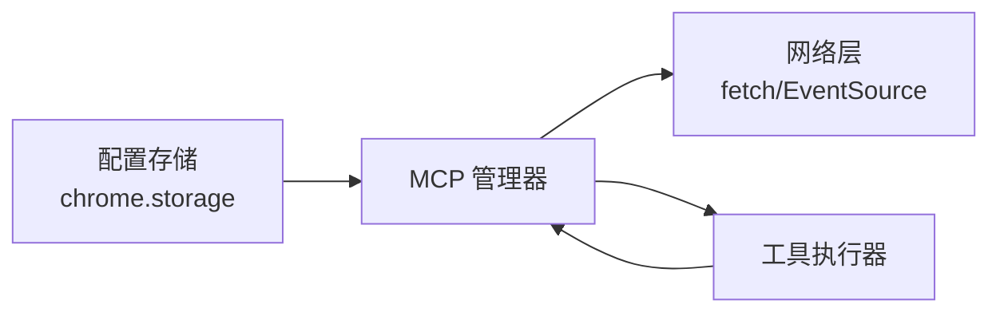

# 工具发现

<cite>
**本文引用的文件**
- [mcp_manager.js](file://background/managers/mcp_manager.js)
- [tool_executor.js](file://background/handlers/session/prompt/tool_executor.js)
</cite>

## 目录
1. [简介](#简介)
2. [项目结构](#项目结构)
3. [核心组件](#核心组件)
4. [架构总览](#架构总览)
5. [详细组件分析](#详细组件分析)
6. [依赖关系分析](#依赖关系分析)
7. [性能考量](#性能考量)
8. [故障排查指南](#故障排查指南)
9. [结论](#结论)
10. [附录：响应格式与客户端解析要点](#附录响应格式与客户端解析要点)

## 简介
本文件聚焦于 MCP（Model Context Protocol）工具发现机制的技术实现，围绕后台管理器中 refreshTools 与 refreshToolsHttp 的实现，系统阐述：
- SSE 模式与 HTTP 模式的连接与工具列表获取流程
- 多种响应格式的兼容性处理（标准 JSON-RPC、直接 tools 数组、result.tools、result 数组、直接数组）
- 工具元数据（名称、描述、输入模式）的解析与存储
- 工具列表缓存策略、刷新时机与错误处理
- 客户端解析逻辑与对不一致服务器实现的应对建议

## 项目结构
与工具发现直接相关的模块位于后台管理器目录，核心为 MCP 管理器类，负责：
- 服务器配置加载与连接
- SSE/HTTP 模式探测与切换
- 工具列表拉取与多格式解析
- 工具执行路由与结果返回

图表来源
- [mcp_manager.js](file://background/managers/mcp_manager.js#L71-L150)
- [mcp_manager.js](file://background/managers/mcp_manager.js#L152-L213)
- [tool_executor.js](file://background/handlers/session/prompt/tool_executor.js#L1-L49)

章节来源
- [mcp_manager.js](file://background/managers/mcp_manager.js#L1-L60)

## 核心组件
- MCP 管理器：负责服务器生命周期、连接模式选择、工具列表刷新与工具执行。
- 工具执行器：在会话提示阶段解析并执行工具调用指令。

章节来源
- [mcp_manager.js](file://background/managers/mcp_manager.js#L2-L6)
- [tool_executor.js](file://background/handlers/session/prompt/tool_executor.js#L4-L7)

## 架构总览
MCP 工具发现采用“模式自适应”设计：
- 首次连接时通过探测请求判断服务器是否返回 SSE 或直接 JSON
- 若返回 JSON，则自动切换到 HTTP 模式；否则建立 SSE 连接并等待 endpoint 事件以获得 POST URL
- 在 SSE 模式下，通过 JSON-RPC 请求获取工具列表；在 HTTP 模式下直接 POST tools/list 获取工具数组
- 对多种响应格式进行兼容解析，并将工具元数据存入内存缓存

图表来源
- [mcp_manager.js](file://background/managers/mcp_manager.js#L71-L150)
- [mcp_manager.js](file://background/managers/mcp_manager.js#L152-L213)
- [mcp_manager.js](file://background/managers/mcp_manager.js#L262-L285)

## 详细组件分析

### 1) 连接与模式探测（SSE/HTTP）
- 支持的服务器类型：默认 SSE；当配置 type 为 streamable_http 或 http 时强制 HTTP 模式
- 探测逻辑：首次连接发送 GET 请求并检查 Content-Type，若为 application/json 则切换至 HTTP 模式
- SSE 模式：建立 EventSource，监听 endpoint 事件以获取 POST URL，随后初始化会话并刷新工具
- HTTP 模式：直接使用 POST URL 发送 JSON-RPC 请求，立即刷新工具

图表来源
- [mcp_manager.js](file://background/managers/mcp_manager.js#L71-L150)
- [mcp_manager.js](file://background/managers/mcp_manager.js#L262-L285)

章节来源
- [mcp_manager.js](file://background/managers/mcp_manager.js#L71-L150)
- [mcp_manager.js](file://background/managers/mcp_manager.js#L215-L223)

### 2) 工具列表刷新（SSE 模式）
- 使用 JSON-RPC 请求 tools/list
- 期望响应为 JSON-RPC 结构，其中 result 中包含 tools 数组
- 成功后将 tools 存入对应服务器的内存缓存

图表来源
- [mcp_manager.js](file://background/managers/mcp_manager.js#L287-L306)
- [mcp_manager.js](file://background/managers/mcp_manager.js#L308-L351)

章节来源
- [mcp_manager.js](file://background/managers/mcp_manager.js#L287-L306)
- [mcp_manager.js](file://background/managers/mcp_manager.js#L308-L351)

### 3) 工具列表刷新（HTTP 模式）
- 直接向 POST URL 发送 JSON-RPC tools/list
- 兼容多种响应格式：
  - 标准 JSON-RPC：result.tools
  - 直接对象：tools
  - result 为数组：result
  - 直接数组：[]
- 将解析出的工具数组写入内存缓存；若解析失败则清空缓存并记录错误

图表来源
- [mcp_manager.js](file://background/managers/mcp_manager.js#L152-L213)

章节来源
- [mcp_manager.js](file://background/managers/mcp_manager.js#L152-L213)

### 4) 工具元数据解析与存储
- 支持字段：名称、描述、输入模式（inputSchema）
- 存储位置：每个服务器维护一个工具数组，元素为工具对象
- 提供聚合查询接口：getAllTools 可合并所有服务器工具并附加 _serverId 标识，便于后续执行定位

图表来源
- [mcp_manager.js](file://background/managers/mcp_manager.js#L2-L6)
- [mcp_manager.js](file://background/managers/mcp_manager.js#L407-L420)

章节来源
- [mcp_manager.js](file://background/managers/mcp_manager.js#L407-L420)
- [mcp_manager.js](file://background/managers/mcp_manager.js#L422-L477)

### 5) 工具执行与系统提示
- 工具执行：根据工具名在各服务器工具列表中查找目标服务器，再按当前模式发送 JSON-RPC tools/call
- 系统提示：根据已发现工具生成可读提示，包含工具名、描述及简化后的输入模式属性

图表来源
- [mcp_manager.js](file://background/managers/mcp_manager.js#L479-L525)
- [tool_executor.js](file://background/handlers/session/prompt/tool_executor.js#L9-L47)

章节来源
- [mcp_manager.js](file://background/managers/mcp_manager.js#L479-L525)
- [tool_executor.js](file://background/handlers/session/prompt/tool_executor.js#L9-L47)

## 依赖关系分析
- MCP 管理器依赖浏览器/扩展环境的存储与网络能力（fetch、EventSource、chrome.storage）
- 工具执行器依赖 MCP 管理器提供的执行接口
- 服务器类型配置决定运行时行为（SSE vs HTTP）

图表来源
- [mcp_manager.js](file://background/managers/mcp_manager.js#L21-L61)
- [mcp_manager.js](file://background/managers/mcp_manager.js#L479-L525)

章节来源
- [mcp_manager.js](file://background/managers/mcp_manager.js#L21-L61)
- [mcp_manager.js](file://background/managers/mcp_manager.js#L479-L525)

## 性能考量
- 工具列表缓存：每次刷新都会覆盖内存中的工具数组，避免重复解析与多次网络请求
- 模式切换：探测一次即可确定模式，减少不必要的连接尝试
- 超时控制：SSE 模式下的请求等待具备超时保护，防止挂起
- 建议优化：
  - 引入 TTL 缓存与增量刷新策略，降低频繁刷新带来的网络开销
  - 对工具列表变更事件进行监听（如服务器支持），触发定向刷新而非全量刷新

## 故障排查指南
- 连接失败
  - 检查服务器 URL 是否正确
  - 观察控制台日志中的 SSE 错误或 HTTP 错误
- 工具列表为空
  - 确认服务器是否返回了支持的响应格式
  - 检查服务器是否实现了 tools/list 方法
- 响应格式不一致
  - 客户端已兼容多种格式；若仍失败，记录服务器返回的键值以便定位问题
- 执行失败
  - 确认工具名是否存在且大小写匹配
  - 检查工具参数是否符合 inputSchema

章节来源
- [mcp_manager.js](file://background/managers/mcp_manager.js#L101-L149)
- [mcp_manager.js](file://background/managers/mcp_manager.js#L173-L212)
- [mcp_manager.js](file://background/managers/mcp_manager.js#L324-L350)
- [mcp_manager.js](file://background/managers/mcp_manager.js#L491-L506)

## 结论
该实现通过“模式自适应”的连接策略与多格式响应解析，有效兼容不同实现的 MCP 服务器，确保工具发现的稳定性与可用性。工具列表作为内存缓存，结合系统提示与执行路由，为上层会话提供了统一的工具调用体验。建议在未来版本中引入缓存 TTL 与增量刷新，进一步提升性能与可靠性。

## 附录：响应格式与客户端解析要点
- 标准 JSON-RPC（推荐）：result.tools 为工具数组
- 直接对象：tools 为工具数组
- result 为数组：result 即为工具数组
- 直接数组：顶层即为工具数组
- 错误处理：若响应包含 error 字段，客户端将标记状态为错误并清空工具缓存

客户端解析逻辑要点（路径参考）：
- SSE 模式工具列表解析与缓存：[mcp_manager.js](file://background/managers/mcp_manager.js#L287-L306)
- HTTP 模式工具列表解析与多格式兼容：[mcp_manager.js](file://background/managers/mcp_manager.js#L152-L213)
- 工具执行路由与结果返回：[mcp_manager.js](file://background/managers/mcp_manager.js#L479-L525)
- 工具调用指令解析与执行：[tool_executor.js](file://background/handlers/session/prompt/tool_executor.js#L9-L47)