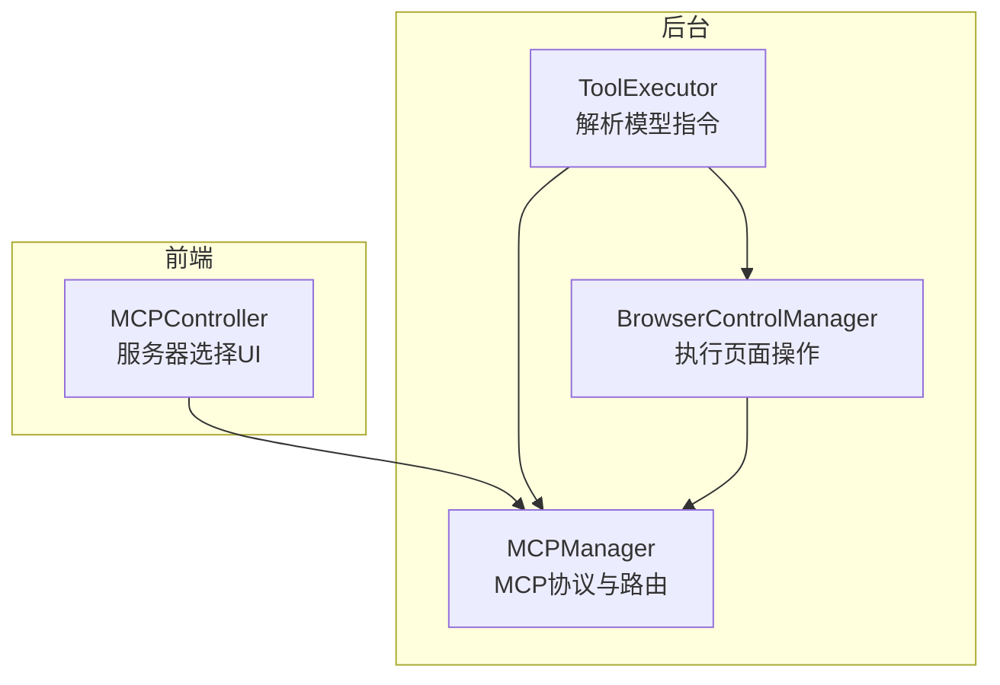
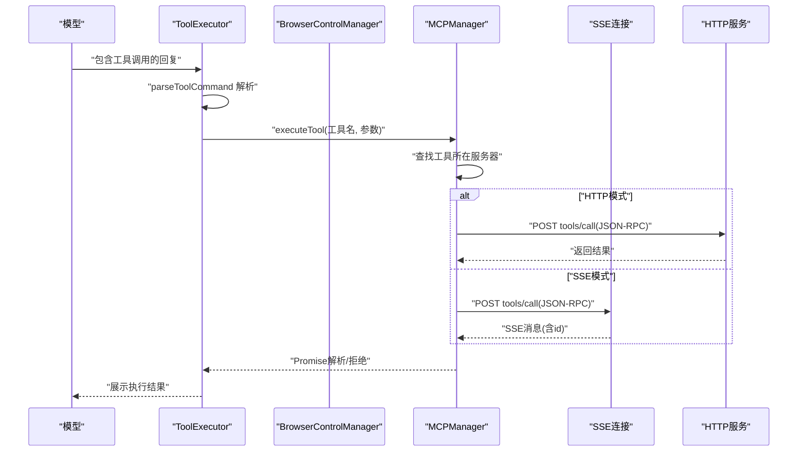
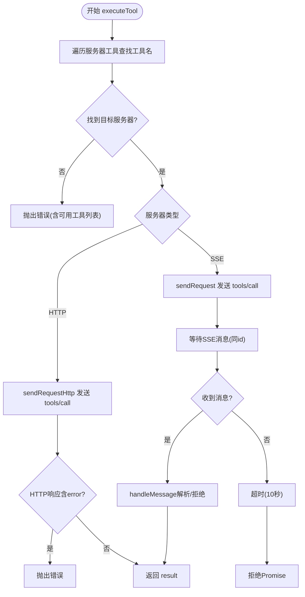
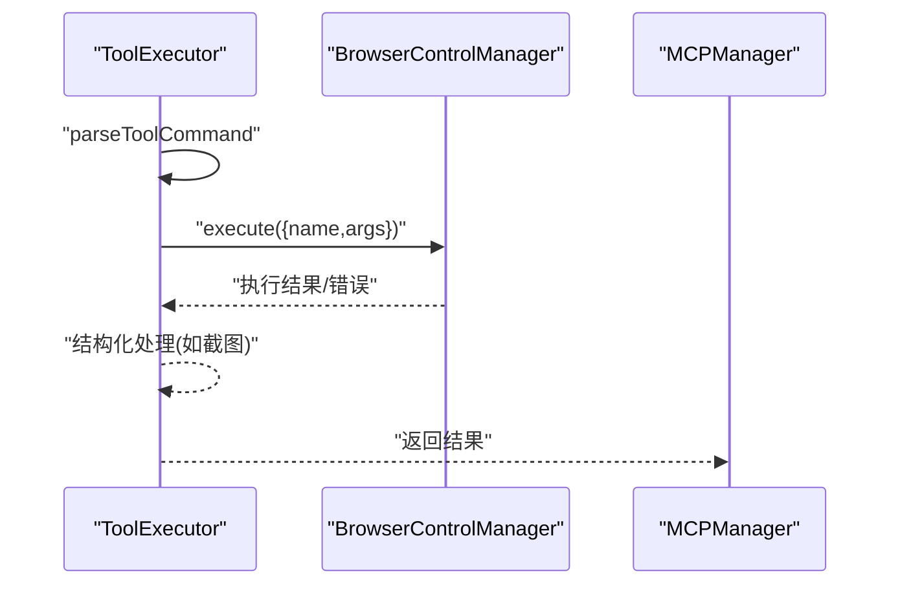
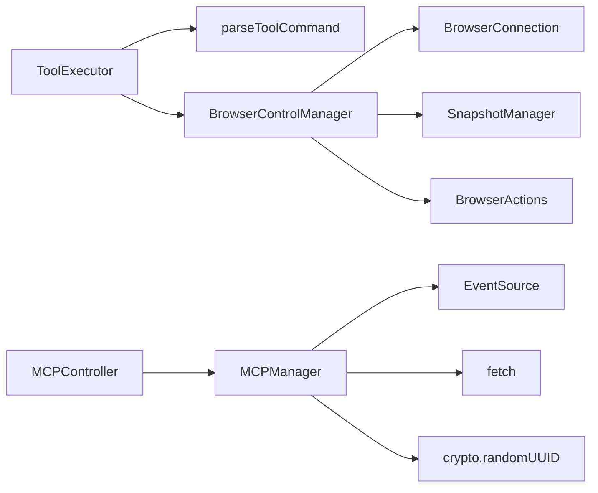

# 工具执行

<cite>
**本文引用的文件**
- [mcp_manager.js](file://background/managers/mcp_manager.js)
- [tool_executor.js](file://background/handlers/session/prompt/tool_executor.js)
- [utils.js](file://background/handlers/session/utils.js)
- [control_manager.js](file://background/managers/control_manager.js)
- [mcp_controller.js](file://sandbox/controllers/mcp_controller.js)
</cite>

## 目录
1. [简介](#简介)
2. [项目结构](#项目结构)
3. [核心组件](#核心组件)
4. [架构总览](#架构总览)
5. [详细组件分析](#详细组件分析)
6. [依赖关系分析](#依赖关系分析)
7. [性能考量](#性能考量)
8. [故障排查指南](#故障排查指南)
9. [结论](#结论)

## 简介
本文件聚焦于MCP（Model Context Protocol）协议在浏览器扩展中的工具执行端到端流程，围绕以下关键方法展开：
- 工具调用入口：executeTool
- 请求发送（SSE模式）：sendRequest
- 请求发送（HTTP模式）：sendRequestHttp
- 目标服务器路由与工具名称查找
- JSON-RPC tools/call 请求构造与发送
- HTTP模式与SSE模式下请求/响应处理差异
- pendingRequests 映射表在异步响应关联中的作用
- 执行结果解析、错误传播与超时处理
- 典型使用场景的序列图与工具执行上下文管理
- 性能优化建议

## 项目结构
与MCP工具执行直接相关的模块分布如下：
- 后台管理与协议层：MCPManager（连接、路由、请求、响应）
- 前端交互与选择：MCPController（服务器选择UI）
- 工具命令解析：parseToolCommand（从模型输出中提取工具调用）
- 工具执行器：ToolExecutor（将模型指令转为实际执行）
- 控制管理器：BrowserControlManager（具体页面操作工具的实现）

图表来源
- [mcp_controller.js](file://sandbox/controllers/mcp_controller.js#L1-L221)
- [tool_executor.js](file://background/handlers/session/prompt/tool_executor.js#L1-L49)
- [control_manager.js](file://background/managers/control_manager.js#L1-L159)
- [mcp_manager.js](file://background/managers/mcp_manager.js#L1-L530)

章节来源
- [mcp_manager.js](file://background/managers/mcp_manager.js#L1-L530)
- [mcp_controller.js](file://sandbox/controllers/mcp_controller.js#L1-L221)
- [tool_executor.js](file://background/handlers/session/prompt/tool_executor.js#L1-L49)
- [control_manager.js](file://background/managers/control_manager.js#L1-L159)
- [utils.js](file://background/handlers/session/utils.js#L1-L64)

## 核心组件
- MCPManager：负责MCP服务器配置加载、连接建立（SSE/HTTP自动探测）、工具列表刷新、JSON-RPC请求发送与响应等待、工具名称查找与路由、系统提示生成等。
- MCPController：前端服务器选择控制器，维护选中服务器集合，向后台查询状态并渲染列表。
- ToolExecutor：解析模型输出中的工具调用指令，调用控制管理器执行，并处理返回结果或错误。
- BrowserControlManager：封装Chrome DevTools连接与页面操作，作为具体工具的实际执行者。
- parseToolCommand：从模型输出文本中抽取工具名与参数。

章节来源
- [mcp_manager.js](file://background/managers/mcp_manager.js#L1-L530)
- [mcp_controller.js](file://sandbox/controllers/mcp_controller.js#L1-L221)
- [tool_executor.js](file://background/handlers/session/prompt/tool_executor.js#L1-L49)
- [control_manager.js](file://background/managers/control_manager.js#L1-L159)
- [utils.js](file://background/handlers/session/utils.js#L1-L64)

## 架构总览
MCP工具执行的关键路径：
- 模型输出包含工具调用指令 → ToolExecutor 解析 → 调用 MCPManager.executeTool
- executeTool 在已加载的工具清单中按名称查找目标服务器 → 判断服务器类型（SSE 或 HTTP）
- SSE 模式：通过 sendRequest 发送 JSON-RPC 请求，等待 SSE 事件中的同 id 响应；HTTP 模式：通过 sendRequestHttp 直接等待 HTTP 响应
- 响应到达后，MCPManager 的 handleMessage 将结果或错误传递给对应 pendingRequests 的 Promise，完成异步等待
- ToolExecutor 接收执行结果，进行结构化处理（如截图结果），并向 UI 展示

图表来源
- [tool_executor.js](file://background/handlers/session/prompt/tool_executor.js#L1-L49)
- [mcp_manager.js](file://background/managers/mcp_manager.js#L479-L525)
- [control_manager.js](file://background/managers/control_manager.js#L43-L158)

## 详细组件分析

### MCPManager：工具执行与协议处理
- 初始化与连接
  - 加载本地存储的MCP配置，逐个服务器尝试连接
  - 自动探测：若SSE探测返回JSON而非SSE，则切换为HTTP模式，使用POST直连
  - SSE模式：监听 endpoint 事件以获得POST URL，随后初始化会话并拉取工具列表
  - HTTP模式：直接使用POST URL拉取工具列表
- 工具名称查找与路由
  - executeTool 遍历所有服务器工具，按名称匹配目标服务器
  - 若未找到，抛出包含可用工具列表的错误
- 请求发送（SSE模式）
  - sendRequest 构造 JSON-RPC 请求，设置随机 id
  - 使用 pendingRequests 映射表保存 Promise 的 resolve/reject 与超时句柄
  - 通过 fetch 发送请求，实际响应由 SSE 连接的消息事件携带 id 返回
  - handleMessage 根据 id 取出对应 Promise 并 resolve/reject，清理映射与超时
  - 超时默认10秒，超时后删除映射并拒绝
- 请求发送（HTTP模式）
  - sendRequestHttp 构造 JSON-RPC 请求，直接发起HTTP POST
  - 等待并解析响应，若包含 error 字段则抛出错误
  - 成功时返回 result 字段
- 工具列表刷新
  - refreshTools 根据服务器类型选择 SSE 或 HTTP 刷新
  - refreshToolsHttp 支持多种响应格式（result.tools、tools、result数组、直接数组）
- 系统提示生成
  - getSystemPrompt/getSystemPromptForServers 生成面向模型的工具说明与调用格式

图表来源
- [mcp_manager.js](file://background/managers/mcp_manager.js#L479-L525)
- [mcp_manager.js](file://background/managers/mcp_manager.js#L308-L351)
- [mcp_manager.js](file://background/managers/mcp_manager.js#L229-L260)
- [mcp_manager.js](file://background/managers/mcp_manager.js#L370-L385)

章节来源
- [mcp_manager.js](file://background/managers/mcp_manager.js#L1-L530)

### ToolExecutor：模型指令到执行的桥接
- 从模型回复中解析工具调用（工具名与参数）
- 调用控制管理器执行工具
- 处理结构化结果（如截图工具返回图片+文本）
- 错误捕获并转换为可展示文本

图表来源
- [tool_executor.js](file://background/handlers/session/prompt/tool_executor.js#L1-L49)
- [control_manager.js](file://background/managers/control_manager.js#L43-L158)

章节来源
- [tool_executor.js](file://background/handlers/session/prompt/tool_executor.js#L1-L49)
- [utils.js](file://background/handlers/session/utils.js#L1-L64)
- [control_manager.js](file://background/managers/control_manager.js#L1-L159)

### MCPController：服务器选择与上下文
- 维护选中服务器集合，渲染服务器列表与标签
- 通过消息通道向后台请求MCP状态并更新UI
- 提供选中服务器ID集合，用于后续工具执行上下文

章节来源
- [mcp_controller.js](file://sandbox/controllers/mcp_controller.js#L1-L221)

## 依赖关系分析
- ToolExecutor 依赖 parseToolCommand 与 BrowserControlManager
- BrowserControlManager 依赖 BrowserConnection/SnapshotManager/BrowserActions
- MCPManager 依赖本地存储配置、EventSource、fetch、crypto.randomUUID
- MCPController 依赖窗口消息通道与DOM元素

图表来源
- [tool_executor.js](file://background/handlers/session/prompt/tool_executor.js#L1-L49)
- [utils.js](file://background/handlers/session/utils.js#L1-L64)
- [control_manager.js](file://background/managers/control_manager.js#L1-L159)
- [mcp_manager.js](file://background/managers/mcp_manager.js#L1-L530)
- [mcp_controller.js](file://sandbox/controllers/mcp_controller.js#L1-L221)

章节来源
- [mcp_manager.js](file://background/managers/mcp_manager.js#L1-L530)
- [tool_executor.js](file://background/handlers/session/prompt/tool_executor.js#L1-L49)
- [control_manager.js](file://background/managers/control_manager.js#L1-L159)
- [utils.js](file://background/handlers/session/utils.js#L1-L64)
- [mcp_controller.js](file://sandbox/controllers/mcp_controller.js#L1-L221)

## 性能考量
- 连接探测与回退
  - SSE探测失败或返回非SSE时自动切换HTTP模式，避免长时间等待
- 工具列表缓存
  - refreshTools/refreshToolsHttp 成功后缓存工具列表，减少重复请求
- 异步等待与超时
  - pendingRequests 映射表配合10秒超时，防止请求悬挂
- HTTP模式优势
  - 直接HTTP POST，无需SSE长连接，适合无SSE支持或需要快速响应的场景
- 结果解析健壮性
  - refreshToolsHttp 支持多种响应格式，提升兼容性

[本节为通用性能建议，不直接分析特定文件]

## 故障排查指南
- 服务器未就绪
  - 现象：抛出“服务器未就绪”错误
  - 排查：确认服务器配置、URL/endpoint 是否有效，SSE连接是否成功
- 工具未找到
  - 现象：抛出包含可用工具列表的错误
  - 排查：核对工具名大小写与拼写；确认服务器已正确加载工具列表
- SSE响应缺失
  - 现象：超时（10秒）后被拒绝
  - 排查：检查服务器是否通过SSE返回同id响应；确认网络与跨域策略
- HTTP响应错误
  - 现象：HTTP错误码或JSON-RPC error
  - 排查：检查POST URL、服务器端JSON-RPC实现、请求体格式
- UI选择问题
  - 现象：MCP服务器列表为空或状态异常
  - 排查：确认后台已返回状态；检查消息通道与UI渲染逻辑

章节来源
- [mcp_manager.js](file://background/managers/mcp_manager.js#L308-L351)
- [mcp_manager.js](file://background/managers/mcp_manager.js#L229-L260)
- [mcp_manager.js](file://background/managers/mcp_manager.js#L479-L525)
- [mcp_controller.js](file://sandbox/controllers/mcp_controller.js#L88-L99)

## 结论
本文梳理了MCP工具执行的完整端到端流程，明确了：
- 工具名称查找与目标服务器路由
- SSE与HTTP两种传输模式下的请求/响应差异
- pendingRequests 映射表在异步响应关联中的关键作用
- 执行结果解析、错误传播与超时处理机制
- 典型使用场景的序列图与上下文管理要点
- 面向性能的优化建议与常见问题排查路径

该实现为MCP协议在浏览器扩展中的落地提供了清晰的参考，既保证了与标准协议的兼容，又兼顾了实际部署中的灵活性与稳定性。