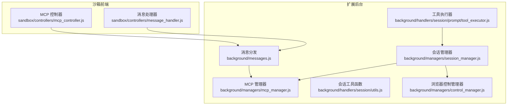
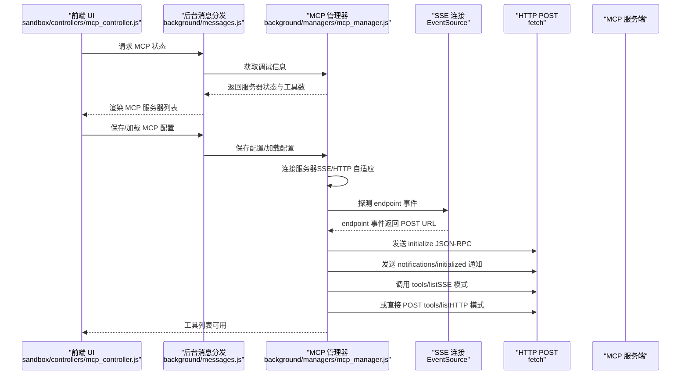
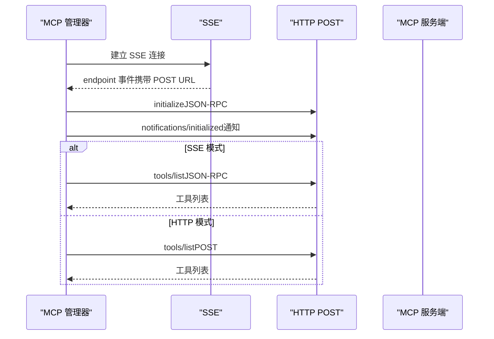
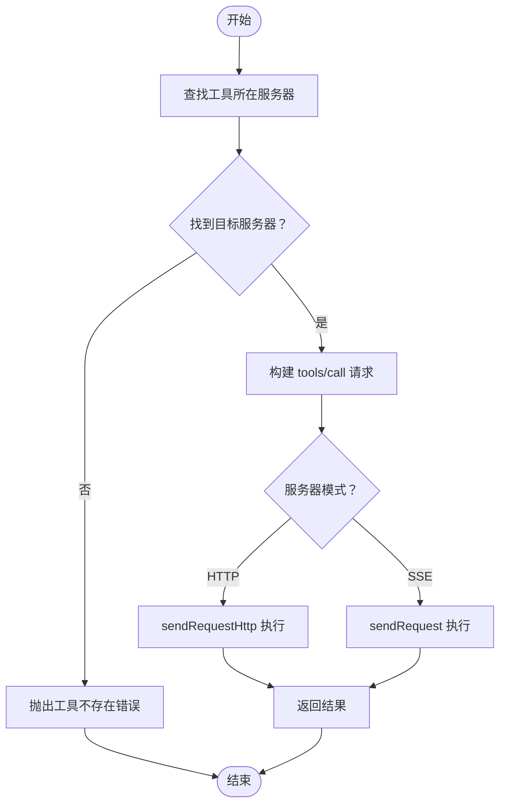
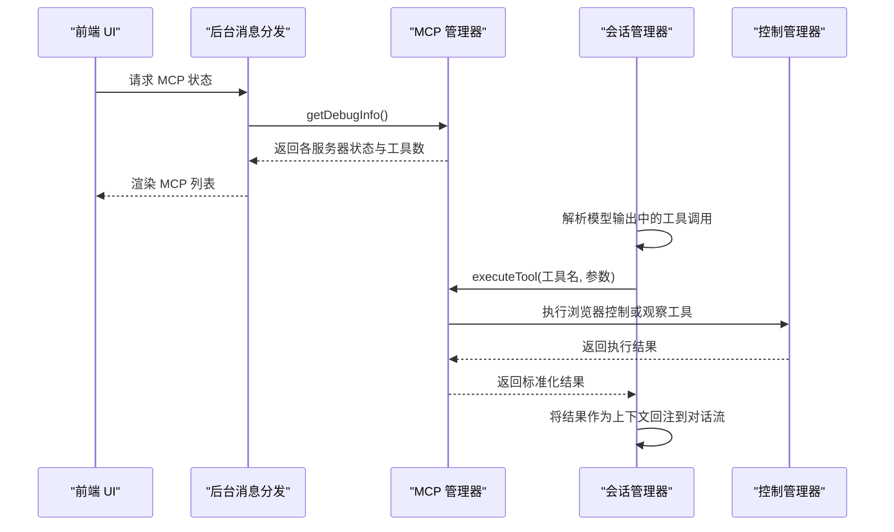
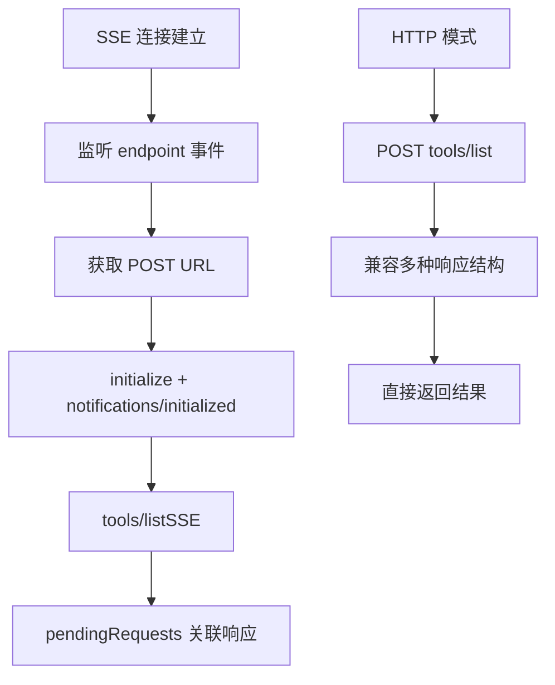
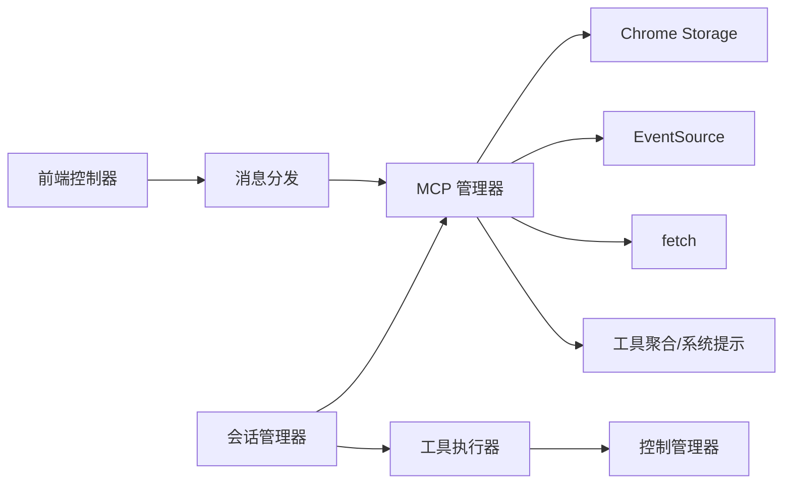

# 通信流程

<cite>
**本文引用的文件**
- [mcp_manager.js](file://background/managers/mcp_manager.js)
- [messages.js](file://background/messages.js)
- [session_manager.js](file://background/managers/session_manager.js)
- [tool_executor.js](file://background/handlers/session/prompt/tool_executor.js)
- [utils.js](file://background/handlers/session/utils.js)
- [mcp_controller.js](file://sandbox/controllers/mcp_controller.js)
- [message_handler.js](file://sandbox/controllers/message_handler.js)
- [control_manager.js](file://background/managers/control_manager.js)
- [manifest.json](file://manifest.json)
</cite>

## 目录
1. [简介](#简介)
2. [项目结构](#项目结构)
3. [核心组件](#核心组件)
4. [架构总览](#架构总览)
5. [详细组件分析](#详细组件分析)
6. [依赖关系分析](#依赖关系分析)
7. [性能考量](#性能考量)
8. [故障排查指南](#故障排查指南)
9. [结论](#结论)

## 简介
本文件围绕 Model Context Protocol（MCP）在扩展中的通信流程进行系统化技术说明，重点覆盖：
- 客户端（扩展后台）与服务器（MCP 服务端）之间的完整交互序列
- 会话初始化阶段的 initialize 与 notifications/initialized 握手协议
- 工具发现（tools/list）与工具执行（tools/call）的具体步骤
- 多服务器环境下的通信协调、请求路由与结果聚合机制
- 异步通信模式下的状态管理与上下文保持策略
- 性能优化、流量控制与错误恢复的最佳实践

## 项目结构
MCP 协议相关的核心实现集中在后台管理器与消息处理层，前端沙箱侧提供 UI 选择与状态展示，会话处理器负责将工具调用结果回注到对话流中。

图表来源
- [messages.js](file://background/messages.js#L41-L81)
- [mcp_manager.js](file://background/managers/mcp_manager.js#L1-L530)
- [session_manager.js](file://background/managers/session_manager.js#L76-L118)
- [tool_executor.js](file://background/handlers/session/prompt/tool_executor.js#L1-L49)
- [utils.js](file://background/handlers/session/utils.js#L1-L64)
- [mcp_controller.js](file://sandbox/controllers/mcp_controller.js#L1-L185)
- [message_handler.js](file://sandbox/controllers/message_handler.js#L75-L113)
- [control_manager.js](file://background/managers/control_manager.js#L1-L159)

章节来源
- [manifest.json](file://manifest.json#L1-L93)

## 核心组件
- MCP 管理器：负责服务器配置加载、连接建立、SSE/HTTP 模式探测、会话初始化、工具列表刷新与工具执行。
- 消息分发：后台消息入口，统一处理来自前端的 MCP 请求（保存配置、获取配置、获取工具、获取状态等）。
- 会话管理器：在对话生成过程中检测工具调用指令，触发 MCP 执行并将结果回注到对话流。
- 工具执行器：解析模型输出中的工具调用指令，驱动控制管理器执行具体动作。
- 浏览器控制管理器：封装 Chrome DevTools 连接与各类浏览器操作工具。
- MCP 前端控制器：提供 MCP 服务器选择 UI，向后台查询状态并渲染列表。

章节来源
- [mcp_manager.js](file://background/managers/mcp_manager.js#L1-L530)
- [messages.js](file://background/messages.js#L41-L81)
- [session_manager.js](file://background/managers/session_manager.js#L76-L118)
- [tool_executor.js](file://background/handlers/session/prompt/tool_executor.js#L1-L49)
- [mcp_controller.js](file://sandbox/controllers/mcp_controller.js#L1-L185)
- [control_manager.js](file://background/managers/control_manager.js#L1-L159)

## 架构总览
下图展示了从连接建立到会话初始化、工具发现与工具执行的端到端流程，包括 SSE/HTTP 两种传输模式的切换逻辑。

图表来源
- [mcp_controller.js](file://sandbox/controllers/mcp_controller.js#L88-L99)
- [messages.js](file://background/messages.js#L41-L81)
- [mcp_manager.js](file://background/managers/mcp_manager.js#L71-L150)
- [mcp_manager.js](file://background/managers/mcp_manager.js#L262-L285)
- [mcp_manager.js](file://background/managers/mcp_manager.js#L287-L306)
- [mcp_manager.js](file://background/managers/mcp_manager.js#L152-L213)

## 详细组件分析

### 1) 连接建立与会话初始化（initialize 与 notifications/initialized）
- 自动探测与连接：管理器根据配置自动连接每个服务器；若返回内容类型为 JSON，则切换至 HTTP 模式；否则使用 SSE。
- endpoint 事件：SSE 连接上监听 endpoint 事件以获取 POST URL，随后进入会话初始化。
- initialize：发送 JSON-RPC initialize，声明协议版本与客户端能力。
- notifications/initialized：发送通知表明客户端已就绪。
- 工具发现：在 SSE 模式下调用 tools/list；在 HTTP 模式下直接 POST tools/list 并兼容多种响应格式。

图表来源
- [mcp_manager.js](file://background/managers/mcp_manager.js#L71-L150)
- [mcp_manager.js](file://background/managers/mcp_manager.js#L262-L285)
- [mcp_manager.js](file://background/managers/mcp_manager.js#L287-L306)
- [mcp_manager.js](file://background/managers/mcp_manager.js#L152-L213)

章节来源
- [mcp_manager.js](file://background/managers/mcp_manager.js#L71-L150)
- [mcp_manager.js](file://background/managers/mcp_manager.js#L262-L285)
- [mcp_manager.js](file://background/managers/mcp_manager.js#L287-L306)
- [mcp_manager.js](file://background/managers/mcp_manager.js#L152-L213)

### 2) 工具发现与工具执行
- 工具发现：支持 SSE 与 HTTP 两种模式；HTTP 模式下兼容多种响应结构（result.tools、tools、result 数组、数组）。
- 工具执行：通过 executeTool 查找目标服务器，构造 tools/call 请求，按服务器模式选择 sendRequest 或 sendRequestHttp，并返回标准化结果。

图表来源
- [mcp_manager.js](file://background/managers/mcp_manager.js#L479-L525)

章节来源
- [mcp_manager.js](file://background/managers/mcp_manager.js#L479-L525)

### 3) 多服务器环境下的通信协调
- 状态聚合：MCP 管理器维护各服务器的连接状态、POST URL、工具列表；前端通过 MCP 状态接口一次性获取所有服务器信息。
- 工具聚合：getAllTools 将所有服务器工具汇总，附带 _serverId 标识，便于后续路由与回显。
- 会话集成：会话管理器在生成响应中检测工具调用指令，调用 MCP 管理器执行工具，并将结果作为上下文回注到对话流。

图表来源
- [messages.js](file://background/messages.js#L63-L67)
- [mcp_manager.js](file://background/managers/mcp_manager.js#L389-L403)
- [mcp_manager.js](file://background/managers/mcp_manager.js#L407-L420)
- [session_manager.js](file://background/managers/session_manager.js#L76-L118)
- [control_manager.js](file://background/managers/control_manager.js#L43-L157)

章节来源
- [messages.js](file://background/messages.js#L63-L67)
- [mcp_manager.js](file://background/managers/mcp_manager.js#L389-L403)
- [mcp_manager.js](file://background/managers/mcp_manager.js#L407-L420)
- [session_manager.js](file://background/managers/session_manager.js#L76-L118)
- [control_manager.js](file://background/managers/control_manager.js#L43-L157)

### 4) 异步通信模式下的状态管理与上下文保持
- SSE 模式：通过 EventSource 接收 endpoint 事件与常规消息；使用 pendingRequests 映射实现 JSON-RPC 请求/响应关联与超时控制。
- HTTP 模式：直接使用 fetch POST；refreshToolsHttp 兼容多种响应结构；sendRequestHttp 提供同步等待的直连响应。
- 上下文保持：会话管理器在工具执行前后更新上下文，确保后续消息能够携带最新上下文。

图表来源
- [mcp_manager.js](file://background/managers/mcp_manager.js#L116-L144)
- [mcp_manager.js](file://background/managers/mcp_manager.js#L324-L351)
- [mcp_manager.js](file://background/managers/mcp_manager.js#L152-L213)
- [mcp_manager.js](file://background/managers/mcp_manager.js#L229-L260)

章节来源
- [mcp_manager.js](file://background/managers/mcp_manager.js#L116-L144)
- [mcp_manager.js](file://background/managers/mcp_manager.js#L324-L351)
- [mcp_manager.js](file://background/managers/mcp_manager.js#L152-L213)
- [mcp_manager.js](file://background/managers/mcp_manager.js#L229-L260)

## 依赖关系分析
- MCP 管理器依赖：
  - 配置存储（Chrome Storage）用于保存/加载 mcpConfig
  - EventSource 与 fetch 用于 SSE/HTTP 通信
  - 工具聚合与系统提示生成
- 会话管理器依赖：
  - 工具命令解析（utils.js）
  - MCP 管理器执行工具
  - 控制管理器执行浏览器动作
- 前端控制器依赖：
  - 向后台请求 MCP 状态
  - 渲染服务器列表与标签

图表来源
- [mcp_manager.js](file://background/managers/mcp_manager.js#L21-L38)
- [messages.js](file://background/messages.js#L41-L81)
- [session_manager.js](file://background/managers/session_manager.js#L76-L118)
- [tool_executor.js](file://background/handlers/session/prompt/tool_executor.js#L1-L49)
- [control_manager.js](file://background/managers/control_manager.js#L1-L159)
- [mcp_controller.js](file://sandbox/controllers/mcp_controller.js#L88-L99)

章节来源
- [mcp_manager.js](file://background/managers/mcp_manager.js#L21-L38)
- [messages.js](file://background/messages.js#L41-L81)
- [session_manager.js](file://background/managers/session_manager.js#L76-L118)
- [tool_executor.js](file://background/handlers/session/prompt/tool_executor.js#L1-L49)
- [control_manager.js](file://background/managers/control_manager.js#L1-L159)
- [mcp_controller.js](file://sandbox/controllers/mcp_controller.js#L88-L99)

## 性能考量
- 连接自适应：优先探测 SSE endpoint，若服务端返回 JSON 则切换至 HTTP 模式，减少不必要的 SSE 开销。
- 请求超时：SSE 模式下对 JSON-RPC 请求设置超时，避免长时间挂起。
- 响应兼容：HTTP 模式下兼容多种响应结构，降低服务端差异带来的失败率。
- 工具聚合：一次性获取所有服务器工具，减少多次往返。
- 上下文复用：工具执行后及时更新上下文，避免重复计算与无效请求。

[本节为通用性能建议，不直接分析具体文件]

## 故障排查指南
- 无法建立连接
  - 检查服务器 URL 是否正确，确认 content-type 探测是否成功。
  - 若返回 JSON，确认是否正确切换至 HTTP 模式。
- 初始化失败
  - 确认 initialize 与 notifications/initialized 是否成功发送。
  - 检查 POST URL 是否已获取。
- 工具列表为空
  - 在 HTTP 模式下检查 tools/list 的响应结构是否被正确解析。
  - 在 SSE 模式下确认 tools/list 的 JSON-RPC 响应是否到达。
- 工具执行失败
  - 确认工具名称是否存在于目标服务器。
  - 检查工具参数是否符合 inputSchema。
  - 观察会话管理器的错误回注与日志输出。

章节来源
- [mcp_manager.js](file://background/managers/mcp_manager.js#L101-L149)
- [mcp_manager.js](file://background/managers/mcp_manager.js#L152-L213)
- [mcp_manager.js](file://background/managers/mcp_manager.js#L287-L306)
- [mcp_manager.js](file://background/managers/mcp_manager.js#L479-L525)
- [session_manager.js](file://background/managers/session_manager.js#L104-L113)

## 结论
该实现以 MCP 管理器为核心，结合 SSE/HTTP 双通道适配、请求/响应关联与超时控制，完成了从连接建立到会话初始化、工具发现与工具执行的完整闭环。通过工具聚合与上下文回注，实现了多服务器环境下的统一工具视图与一致的对话体验。建议在生产环境中进一步增强重试与断线重连策略、细化错误分类与用户反馈，并考虑引入请求去重与并发限制以提升稳定性与性能。