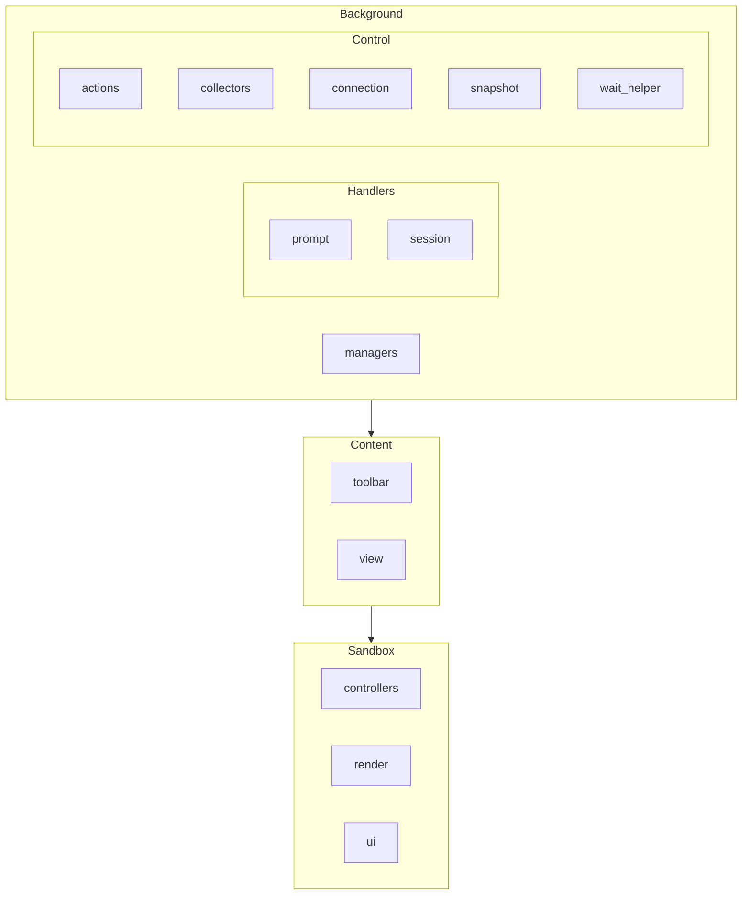
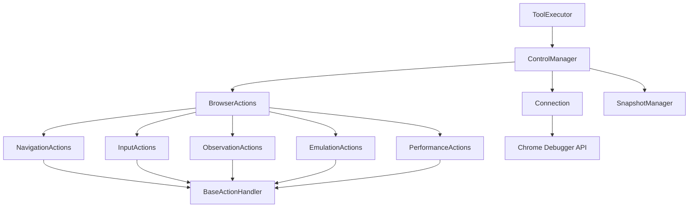
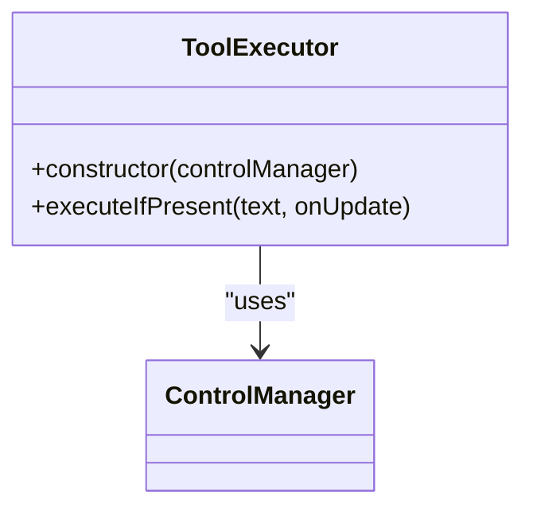
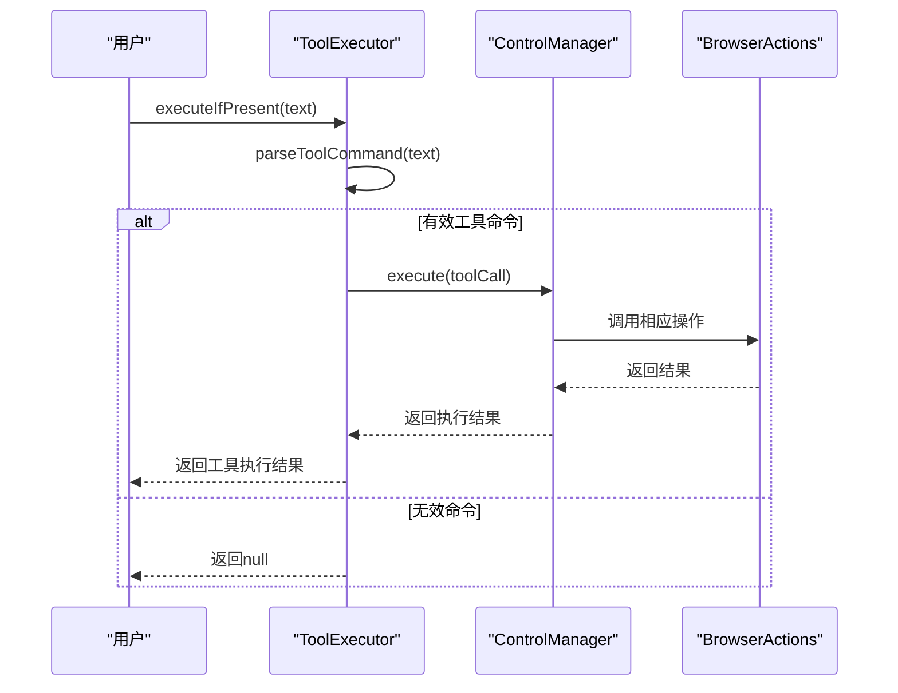
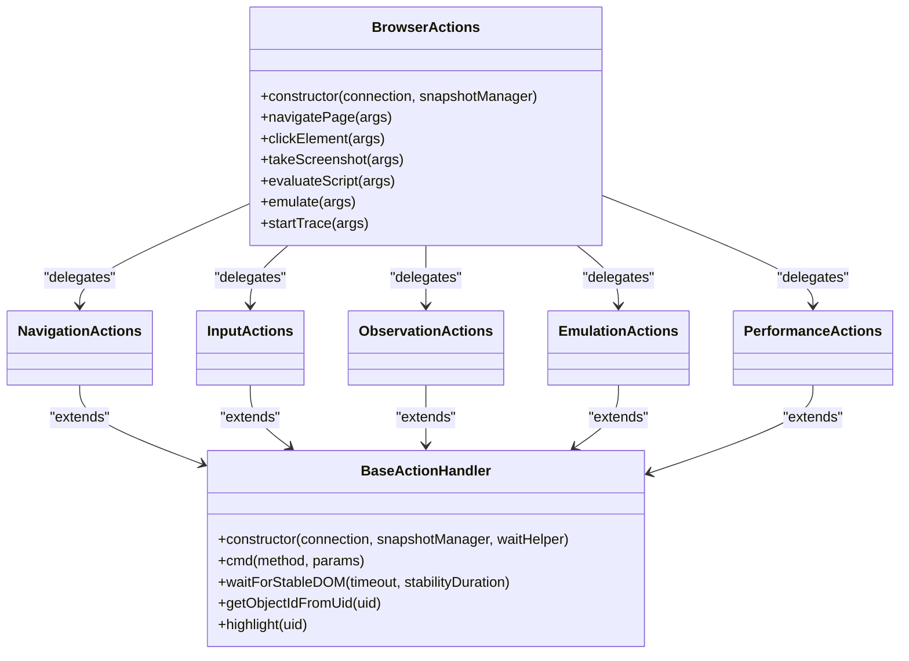
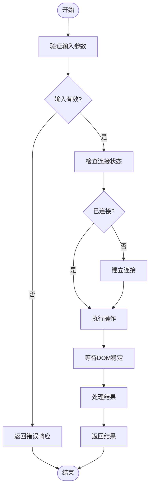
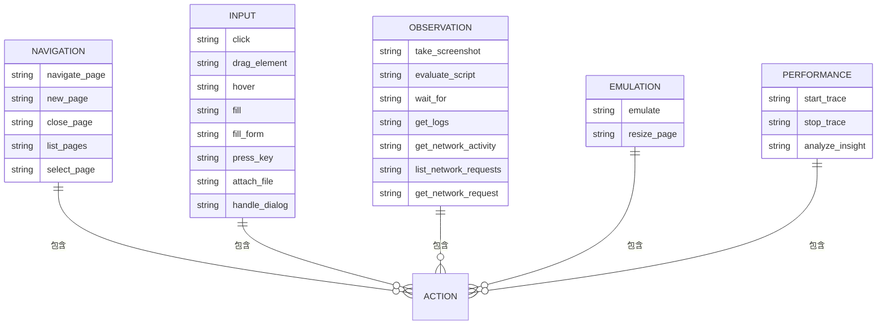
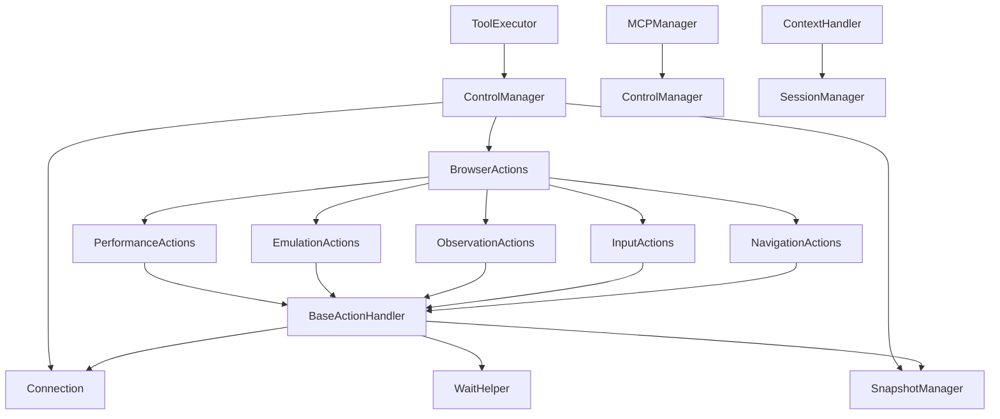
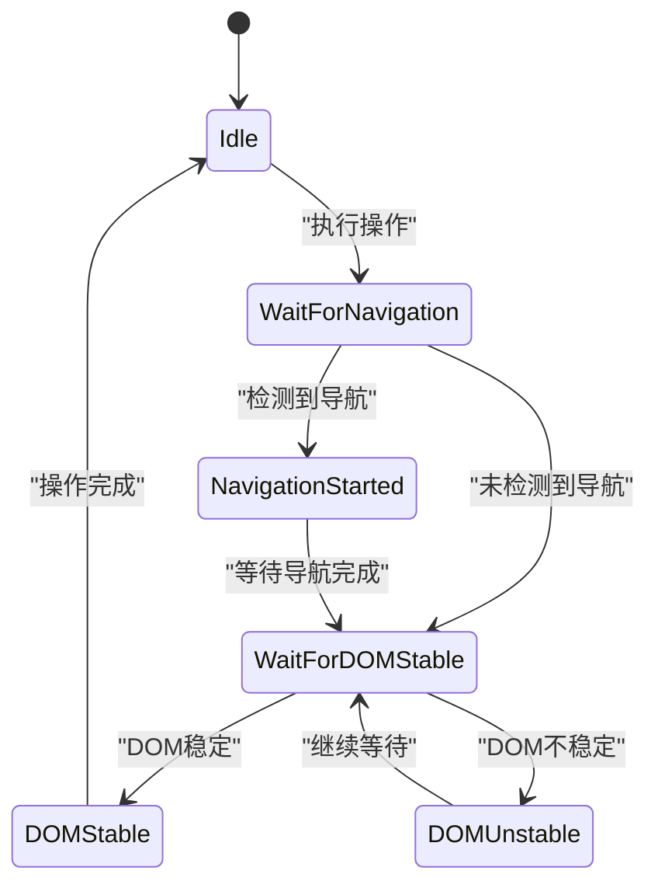
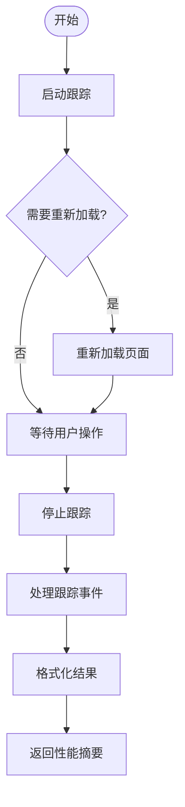

# MCP工具API

<cite>
**本文档引用的文件**  
- [tool_executor.js](file://background/handlers/session/prompt/tool_executor.js)
- [actions.js](file://background/control/actions.js)
- [mcp_manager.js](file://background/managers/mcp_manager.js)
- [control_manager.js](file://background/managers/control_manager.js)
- [connection.js](file://background/control/connection.js)
- [base.js](file://background/control/actions/base.js)
- [navigation.js](file://background/control/actions/navigation.js)
- [input.js](file://background/control/actions/input.js)
- [observation.js](file://background/control/actions/observation.js)
- [emulation.js](file://background/control/actions/emulation.js)
- [performance.js](file://background/control/actions/performance.js)
- [wait_helper.js](file://background/control/wait_helper.js)
- [utils.js](file://background/handlers/session/utils.js)
- [mouse.js](file://background/control/actions/input/mouse.js)
- [keyboard.js](file://background/control/actions/input/keyboard.js)
- [file.js](file://background/control/actions/input/file.js)
- [trace_processor.js](file://background/lib/trace_processor.js)
</cite>

## 目录
1. [简介](#简介)
2. [项目结构](#项目结构)
3. [核心组件](#核心组件)
4. [架构概述](#架构概述)
5. [详细组件分析](#详细组件分析)
6. [依赖分析](#依赖分析)
7. [性能考虑](#性能考虑)
8. [故障排除指南](#故障排除指南)
9. [结论](#结论)

## 简介
本文档详细描述了MCP（Model Control Protocol）工具API的接口规范和执行流程。基于`tool_executor.js`中的`ToolExecutor`类实现，文档化了工具命令解析、执行调度、结果处理的完整生命周期。详细说明了支持的工具类型（如浏览器控制、页面操作、数据提取等）及其参数格式，以及工具注册机制、执行上下文管理和沙箱隔离策略的技术细节。

## 项目结构
项目结构清晰地分为多个模块，包括后台处理、内容脚本、样式表、库文件、沙箱环境、服务和侧边栏等。核心的MCP工具API实现在`background`目录下的`handlers`和`control`子目录中。

**Diagram sources**
- [project_structure](file://project_structure)

**Section sources**
- [project_structure](file://project_structure)

## 核心组件
MCP工具API的核心组件包括`ToolExecutor`、`BrowserActions`、`MCPManager`和`ControlManager`。这些组件协同工作，实现了从工具调用到执行结果返回的完整流程。

**Section sources**
- [tool_executor.js](file://background/handlers/session/prompt/tool_executor.js#L1-L49)
- [actions.js](file://background/control/actions.js#L1-L55)
- [mcp_manager.js](file://background/managers/mcp_manager.js#L1-L530)
- [control_manager.js](file://background/managers/control_manager.js#L1-L159)

## 架构概述
MCP工具API的架构基于Chrome DevTools协议，通过`BrowserConnection`与浏览器建立调试会话，使用`SnapshotManager`捕获页面快照，并通过`BrowserActions`执行各种浏览器操作。

**Diagram sources**
- [tool_executor.js](file://background/handlers/session/prompt/tool_executor.js#L1-L49)
- [control_manager.js](file://background/managers/control_manager.js#L1-L159)
- [actions.js](file://background/control/actions.js#L1-L55)
- [connection.js](file://background/control/connection.js#L1-L147)

## 详细组件分析

### ToolExecutor分析
`ToolExecutor`是MCP工具调用的入口点，负责解析工具命令并执行相应的操作。

#### 类图

**Diagram sources**
- [tool_executor.js](file://background/handlers/session/prompt/tool_executor.js#L4-L48)

#### 执行流程序列图

**Diagram sources**
- [tool_executor.js](file://background/handlers/session/prompt/tool_executor.js#L9-L47)
- [control_manager.js](file://background/managers/control_manager.js#L43-L157)

**Section sources**
- [tool_executor.js](file://background/handlers/session/prompt/tool_executor.js#L1-L49)

### BrowserActions分析
`BrowserActions`是浏览器操作的门面类，聚合了各种具体的操作模块。

#### 类图

**Diagram sources**
- [actions.js](file://background/control/actions.js#L13-L54)
- [base.js](file://background/control/actions/base.js#L5-L63)

#### 操作执行流程

**Diagram sources**
- [control_manager.js](file://background/managers/control_manager.js#L43-L157)
- [wait_helper.js](file://background/control/wait_helper.js#L40-L90)

**Section sources**
- [actions.js](file://background/control/actions.js#L1-L55)
- [base.js](file://background/control/actions/base.js#L1-L64)

### 支持的工具类型

#### 浏览器控制工具

**Diagram sources**
- [navigation.js](file://background/control/actions/navigation.js#L6-L60)
- [input.js](file://background/control/actions/input.js#L16-L48)
- [observation.js](file://background/control/actions/observation.js#L7-L200)
- [emulation.js](file://background/control/actions/emulation.js#L14-L82)
- [performance.js](file://background/control/actions/performance.js#L13-L73)

#### 工具参数格式
| 工具名称 | 参数 | 类型 | 描述 |
|--------|------|------|------|
| navigate_page | url | string | 要导航到的URL |
| navigate_page | type | string | 导航类型 (back, forward, reload) |
| click | uid | string | 要点击的元素UID |
| click | dblClick | boolean | 是否双击 |
| fill | uid | string | 要填充的元素UID |
| fill | value | string | 要填充的值 |
| take_screenshot | filePath | string | 保存截图的文件路径 |
| evaluate_script | script | string | 要执行的JavaScript代码 |
| emulate | networkConditions | string | 网络条件 (Slow 3G, Fast 4G等) |
| emulate | cpuThrottlingRate | number | CPU节流速率 |
| emulate | geolocation | object | 地理位置覆盖 |

**Section sources**
- [navigation.js](file://background/control/actions/navigation.js#L6-L60)
- [input.js](file://background/control/actions/input.js#L16-L48)
- [observation.js](file://background/control/actions/observation.js#L7-L200)
- [emulation.js](file://background/control/actions/emulation.js#L14-L82)
- [performance.js](file://background/control/actions/performance.js#L13-L73)

## 依赖分析
MCP工具API的依赖关系清晰，各组件之间耦合度适中，便于维护和扩展。

**Diagram sources**
- [tool_executor.js](file://background/handlers/session/prompt/tool_executor.js#L4-L48)
- [control_manager.js](file://background/managers/control_manager.js#L1-L159)
- [actions.js](file://background/control/actions.js#L1-L55)
- [connection.js](file://background/control/connection.js#L1-L147)
- [mcp_manager.js](file://background/managers/mcp_manager.js#L1-L530)
- [context_handler.js](file://background/handlers/session/context_handler.js#L1-L21)

**Section sources**
- [tool_executor.js](file://background/handlers/session/prompt/tool_executor.js#L1-L49)
- [control_manager.js](file://background/managers/control_manager.js#L1-L159)
- [actions.js](file://background/control/actions.js#L1-L55)
- [connection.js](file://background/control/connection.js#L1-L147)
- [mcp_manager.js](file://background/managers/mcp_manager.js#L1-L530)
- [context_handler.js](file://background/handlers/session/context_handler.js#L1-L21)

## 性能考虑
MCP工具API在设计时充分考虑了性能因素，通过等待辅助器（WaitHelper）确保操作的稳定性和可靠性。

### 等待策略

**Diagram sources**
- [wait_helper.js](file://background/control/wait_helper.js#L40-L90)

### 性能监控
`PerformanceActions`类提供了性能监控功能，可以启动和停止性能跟踪，并分析关键性能指标。

**Diagram sources**
- [performance.js](file://background/control/actions/performance.js#L13-L73)
- [trace_processor.js](file://background/lib/trace_processor.js#L1-L98)

**Section sources**
- [performance.js](file://background/control/actions/performance.js#L1-L74)
- [trace_processor.js](file://background/lib/trace_processor.js#L1-L98)

## 故障排除指南
当MCP工具API出现问题时，可以参考以下故障排除步骤：

1. **检查连接状态**：确保浏览器连接正常，可以通过`ensureConnection`方法检查。
2. **验证工具命令**：确保工具命令格式正确，符合JSON规范。
3. **检查元素存在性**：在执行操作前，确保目标元素存在且可访问。
4. **查看日志**：通过`get_logs`工具获取详细的日志信息。
5. **网络活动监控**：使用`get_network_activity`和`list_network_requests`工具监控网络活动。

**Section sources**
- [control_manager.js](file://background/managers/control_manager.js#L20-L39)
- [observation.js](file://background/control/actions/observation.js#L129-L146)

## 结论
MCP工具API提供了一套完整的浏览器自动化解决方案，通过标准化的接口规范和执行流程，实现了对浏览器的全面控制。该API设计合理，结构清晰，易于扩展和维护，为开发者提供了强大的工具支持。