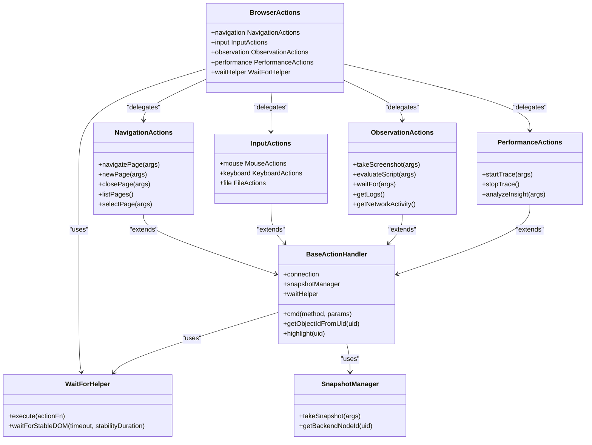

# 内置工具集

<cite>
**本文档中引用的文件**  
- [actions.js](file://background/control/actions.js)
- [base.js](file://background/control/actions/base.js)
- [input.js](file://background/control/actions/input.js)
- [navigation.js](file://background/control/actions/navigation.js)
- [observation.js](file://background/control/actions/observation.js)
- [performance.js](file://background/control/actions/performance.js)
- [mouse.js](file://background/control/actions/input/mouse.js)
- [keyboard.js](file://background/control/actions/input/keyboard.js)
- [file.js](file://background/control/actions/input/file.js)
- [wait_helper.js](file://background/control/wait_helper.js)
- [snapshot.js](file://background/control/snapshot.js)
- [trace_processor.js](file://background/lib/trace_processor.js)
- [mcp_manager.js](file://background/managers/mcp_manager.js)
- [tool_executor.js](file://background/handlers/session/prompt/tool_executor.js)
</cite>

## 目录
1. [简介](#简介)
2. [工具集架构概览](#工具集架构概览)
3. [输入模拟工具组](#输入模拟工具组)
4. [页面导航工具组](#页面导航工具组)
5. [DOM观察工具组](#dom观察工具组)
6. [性能分析工具组](#性能分析工具组)
7. [执行上下文与安全限制](#执行上下文与安全限制)
8. [错误处理与响应码](#错误处理与响应码)
9. [实际使用示例](#实际使用示例)

## 简介
本参考文档系统化地介绍了Gemini Nexus扩展中内置的MCP（Model Context Protocol）工具集。这些工具通过Chrome DevTools协议（CDP）实现，为AI模型提供了与浏览器环境交互的能力。工具集分为四大功能组：输入模拟（键盘、鼠标、文件上传）、页面导航、DOM观察和性能分析。每个工具都设计为可被AI模型通过JSON格式调用，并返回结构化的结果。

**Section sources**
- [actions.js](file://background/control/actions.js)
- [mcp_manager.js](file://background/managers/mcp_manager.js)

## 工具集架构概览
内置工具集采用分层架构设计，核心由`BrowserActions`类聚合多个功能模块。该类作为外观模式的实现，将具体的动作委托给`NavigationActions`、`InputActions`、`ObservationActions`和`PerformanceActions`等子模块。所有动作处理器都继承自`BaseActionHandler`，并共享一个`WaitHelper`实例来确保操作的稳定性和可靠性。



**Diagram sources**
- [actions.js](file://background/control/actions.js)
- [base.js](file://background/control/actions/base.js)

**Section sources**
- [actions.js](file://background/control/actions.js)
- [base.js](file://background/control/actions/base.js)

## 输入模拟工具组
输入模拟工具组允许AI模型模拟用户在页面上的各种交互行为，包括鼠标点击、拖拽、悬停，键盘输入以及文件上传。

### 鼠标操作工具
鼠标操作工具通过CDP的`Input.dispatchMouseEvent`命令实现，能够精确地模拟用户的鼠标行为。

#### clickElement
点击指定元素。

**输入参数schema:**
```json
{
  "uid": "string",
  "dblClick": "boolean"
}
```

**输出格式:** `Clicked element ${uid} at ${x},${y}${dblClick ? ' (Double Click)' : ''}`

**使用场景:** 用于模拟单击或双击DOM元素，如按钮、链接或可交互组件。

**Section sources**
- [mouse.js](file://background/control/actions/input/mouse.js)

#### dragElement
将一个元素拖拽到另一个元素上。

**输入参数schema:**
```json
{
  "from_uid": "string",
  "to_uid": "string"
}
```

**输出格式:** `Dragged element ${from_uid} to ${to_uid}.`

**使用场景:** 用于模拟拖放操作，如重新排序列表项或移动文件。

**Section sources**
- [mouse.js](file://background/control/actions/input/mouse.js)

#### hoverElement
将鼠标悬停在指定元素上。

**输入参数schema:**
```json
{
  "uid": "string"
}
```

**输出格式:** `Hovered element ${uid} at ${x},${y}`

**使用场景:** 用于触发元素的悬停效果，如显示工具提示或下拉菜单。

**Section sources**
- [mouse.js](file://background/control/actions/input/mouse.js)

### 键盘操作工具
键盘操作工具通过CDP的`Input.dispatchKeyEvent`和`Runtime.callFunctionOn`命令实现，能够模拟键盘输入和表单填写。

#### fillElement
向指定元素填充文本或选择值。

**输入参数schema:**
```json
{
  "uid": "string",
  "value": "string"
}
```

**输出格式:** `Filled element ${uid}`

**使用场景:** 用于填充输入框、文本域或选择下拉框。支持通过值或文本匹配选项。

**Section sources**
- [keyboard.js](file://background/control/actions/input/keyboard.js)

#### fillForm
批量填充表单中的多个元素。

**输入参数schema:**
```json
{
  "elements": [
    {
      "uid": "string",
      "value": "string"
    }
  ]
}
```

**输出格式:** `Form filled:\n${results.join('\n')}`

**使用场景:** 用于一次性填充整个表单，提高自动化效率。

**Section sources**
- [input.js](file://background/control/actions/input.js)

#### pressKey
按下指定的键盘按键。

**输入参数schema:**
```json
{
  "key": "string"
}
```

**支持的键值:** Enter, Backspace, Tab, Escape, Delete, ArrowDown, ArrowUp, ArrowLeft, ArrowRight, PageUp, PageDown, End, Home, Space

**输出格式:** `Pressed key: ${key}`

**使用场景:** 用于模拟特定的键盘操作，如提交表单或导航。

**Section sources**
- [keyboard.js](file://background/control/actions/input/keyboard.js)

### 文件操作工具
文件操作工具通过CDP的`DOM.setFileInputFiles`命令实现，用于向文件输入框附加文件。

#### attachFile
向指定的文件输入元素附加文件。

**输入参数schema:**
```json
{
  "uid": "string",
  "paths": ["string"]
}
```

**输出格式:** `Successfully attached ${paths.length} files to element ${uid}.`

**使用场景:** 用于自动化文件上传流程。

**Section sources**
- [file.js](file://background/control/actions/input/file.js)

## 页面导航工具组
页面导航工具组提供了对浏览器标签页和页面状态的控制能力。

#### navigatePage
导航到指定URL或执行后退、前进、刷新操作。

**输入参数schema:**
```json
{
  "url": "string",
  "type": "string"
}
```

**type可选值:** 'back', 'forward', 'reload', 或者不指定以进行URL导航

**输出格式:** 返回导航动作的描述，如 "Navigating to ${url}" 或 "Reloaded page"

**使用场景:** 用于控制页面的导航行为。

**Section sources**
- [navigation.js](file://background/control/actions/navigation.js)

#### newPage
创建一个新页面（标签页）。

**输入参数schema:**
```json
{
  "url": "string"
}
```

**输出格式:** `Created new page (id: ${tab.id}) loading ${targetUrl}`

**使用场景:** 用于打开新的浏览器标签页。

**Section sources**
- [navigation.js](file://background/control/actions/navigation.js)

#### closePage
关闭指定索引的页面。

**输入参数schema:**
```json
{
  "index": "number"
}
```

**输出格式:** `Closed page ${index}: ${tab.title || 'Untitled'}`

**使用场景:** 用于清理不再需要的标签页。

**Section sources**
- [navigation.js](file://background/control/actions/navigation.js)

#### listPages
列出当前窗口中的所有页面。

**输入参数schema:** 无

**输出格式:** 返回一个包含所有页面索引、标题和URL的字符串列表。

**使用场景:** 用于获取当前浏览器会话的状态。

**Section sources**
- [navigation.js](file://background/control/actions/navigation.js)

#### selectPage
切换到指定索引的页面。

**输入参数schema:**
```json
{
  "index": "number"
}
```

**输出格式:** `Switched to page ${index}: ${tab.title}`

**使用场景:** 用于在多个打开的标签页之间切换。

**Section sources**
- [navigation.js](file://background/control/actions/navigation.js)

## DOM观察工具组
DOM观察工具组提供了从页面中提取信息和状态的能力。

#### takeScreenshot
截取当前页面的屏幕截图。

**输入参数schema:**
```json
{
  "filePath": "string"
}
```

**输出格式:** 返回一个包含文本消息和Base64编码图像数据的对象。

**使用场景:** 用于获取页面的视觉状态，可用于视觉验证或作为AI模型的输入。

**Section sources**
- [observation.js](file://background/control/actions/observation.js)

#### evaluateScript
在页面上下文中执行JavaScript脚本。

**输入参数schema:**
```json
{
  "script": "string"
}
```

**输出格式:** 返回脚本执行结果的字符串表示，如果是对象则返回JSON字符串。

**使用场景:** 用于提取复杂的页面数据或与页面上的JavaScript框架交互。

**Section sources**
- [observation.js](file://background/control/actions/observation.js)

#### waitFor
等待指定文本出现在页面中。

**输入参数schema:**
```json
{
  "text": "string",
  "timeout": "number"
}
```

**输出格式:** `Found text "${text}".` 或 `Timeout waiting for text "${text}" after ${timeout}ms.`

**使用场景:** 用于等待异步内容加载完成。

**Section sources**
- [observation.js](file://background/control/actions/observation.js)

#### getLogs
获取页面的控制台日志和对话框状态。

**输入参数schema:** 无

**输出格式:** 返回格式化的日志字符串，如果存在未处理的对话框会特别提示。

**使用场景:** 用于调试页面错误或检查是否有需要处理的JavaScript对话框。

**Section sources**
- [observation.js](file://background/control/actions/observation.js)

#### getNetworkActivity
获取捕获的网络活动摘要。

**输入参数schema:** 无

**输出格式:** 返回网络活动的文本摘要。

**使用场景:** 用于监控页面的网络请求。

**Section sources**
- [observation.js](file://background/control/actions/observation.js)

#### listNetworkRequests
列出最近的网络请求。

**输入参数schema:**
```json
{
  "resourceTypes": ["string"],
  "limit": "number"
}
```

**输出格式:** 返回一个包含请求ID、方法、URL、状态和类型的字符串列表。

**使用场景:** 用于分析特定类型的网络请求。

**Section sources**
- [observation.js](file://background/control/actions/observation.js)

#### getNetworkRequest
获取特定网络请求的详细信息。

**输入参数schema:**
```json
{
  "requestId": "string"
}
```

**输出格式:** 返回包含请求和响应详细信息的JSON字符串。

**使用场景:** 用于深入分析单个网络请求。

**Section sources**
- [observation.js](file://background/control/actions/observation.js)

## 性能分析工具组
性能分析工具组提供了对页面性能指标的监控和分析能力。

#### startTrace
开始记录性能跟踪数据。

**输入参数schema:**
```json
{
  "reload": "boolean"
}
```

**输出格式:** `Performance trace started.` 或错误消息。

**使用场景:** 用于启动性能分析会话，可选择在开始时重新加载页面以获取干净的测量。

**Section sources**
- [performance.js](file://background/control/actions/performance.js)

#### stopTrace
停止性能跟踪并生成分析报告。

**输入参数schema:** 无

**输出格式:** 返回包含FCP、LCP、CLS等核心Web指标的格式化摘要。

**使用场景:** 用于结束性能分析并获取关键性能指标。

**Section sources**
- [performance.js](file://background/control/actions/performance.js)

#### analyzeInsight
（占位符）分析性能洞察。

**输入参数schema:**
```json
{
  "insightName": "string"
}
```

**输出格式:** 返回说明此功能需要完整前端集成的静态消息。

**使用场景:** 预留接口，用于未来实现更深入的性能分析。

**Section sources**
- [performance.js](file://background/control/actions/performance.js)

## 执行上下文与安全限制
所有工具都在浏览器扩展的后台上下文中执行，通过CDP与目标页面进行通信。工具执行需要用户授予扩展相应的权限。`WaitHelper`类确保了在执行操作后等待DOM稳定和潜在的页面导航完成，从而提高了操作的可靠性。`SnapshotManager`负责将DOM节点映射到唯一的UID，这是工具调用中定位元素的基础。

**Section sources**
- [wait_helper.js](file://background/control/wait_helper.js)
- [snapshot.js](file://background/control/snapshot.js)

## 错误处理与响应码
所有工具在执行失败时都会返回以`Error:`开头的错误消息。常见的错误包括无效的参数、找不到指定的元素（UID）、CDP命令执行失败以及超时。工具调用的预期响应时间取决于操作的复杂性和页面的性能，简单的操作通常在几百毫秒内完成，而涉及页面导航或性能跟踪的操作可能需要几秒到几十秒。目前的实现没有内置的重试策略，重试逻辑需要在调用层实现。

**Section sources**
- [base.js](file://background/control/actions/base.js)
- [input.js](file://background/control/actions/input.js)
- [navigation.js](file://background/control/actions/navigation.js)

## 实际使用示例
以下是如何在提示词中调用这些工具的示例：

```json
{
  "action": "call_tool",
  "tool": "click_element",
  "args": {
    "uid": "1_1",
    "dblClick": false
  }
}
```

当工具返回结果时，如`screenshot`工具，结果可能包含一个`image`字段。调用层（如`ToolExecutor`）会解析这个结构化结果，提取文本输出和Base64图像数据，并将其作为文件附加到后续的消息中。

**Section sources**
- [tool_executor.js](file://background/handlers/session/prompt/tool_executor.js)