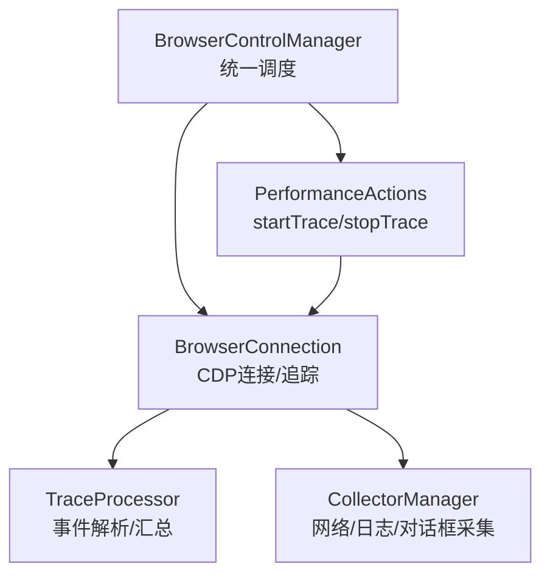
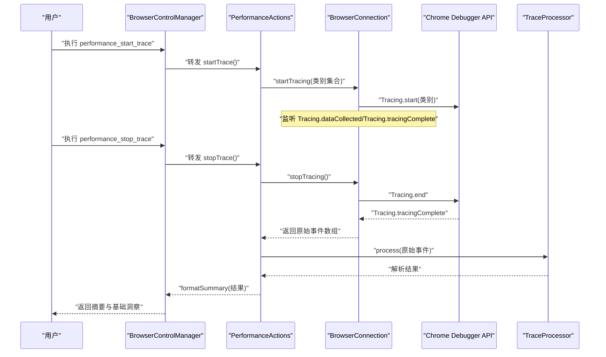
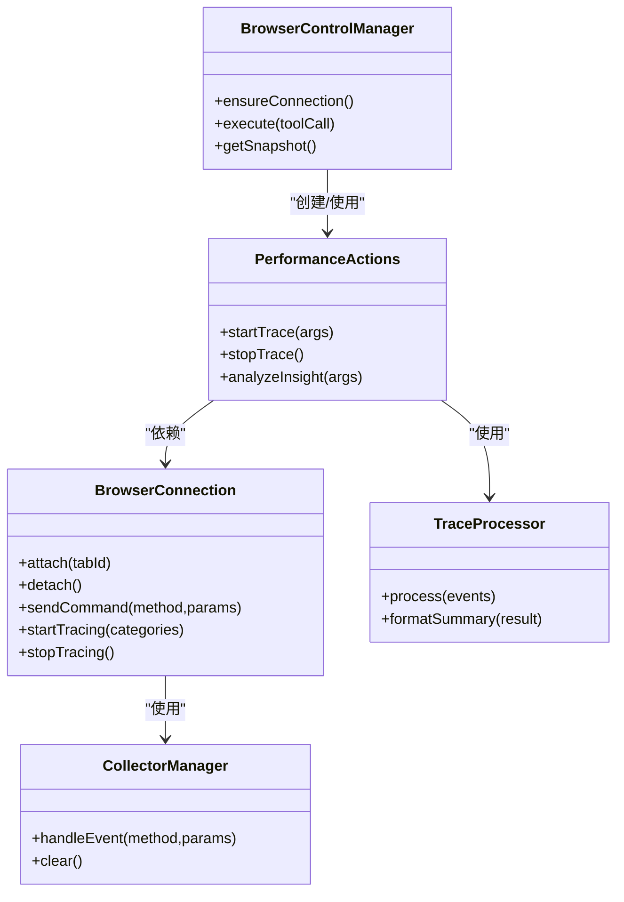

# 性能分析工具

<cite>
**本文引用的文件列表**
- [performance.js](file://background/control/actions/performance.js)
- [trace_processor.js](file://background/lib/trace_processor.js)
- [connection.js](file://background/control/connection.js)
- [control_manager.js](file://background/managers/control_manager.js)
- [base.js](file://background/control/actions/base.js)
- [collectors.js](file://background/control/collectors.js)
- [preamble.js](file://background/handlers/session/prompt/preamble.js)
- [manifest.json](file://manifest.json)
- [README.md](file://README.md)
</cite>

## 目录
1. [简介](#简介)
2. [项目结构](#项目结构)
3. [核心组件](#核心组件)
4. [架构总览](#架构总览)
5. [组件详解](#组件详解)
6. [依赖关系分析](#依赖关系分析)
7. [性能考量](#性能考量)
8. [故障排查指南](#故障排查指南)
9. [结论](#结论)
10. [附录](#附录)

## 简介
本文件为性能分析工具的详细参考文档，聚焦于性能追踪与洞察分析能力。内容覆盖以下方面：
- startTrace、stopTrace 等性能监控 API 的技术实现与使用方法
- 基于 Chrome DevTools Protocol（CDP）的性能数据采集机制
- 事件分类过滤策略与页面重载集成逻辑
- TraceProcessor 对原始性能事件的处理与汇总算法
- 实际应用示例：如何启动性能追踪、获取关键性能指标、分析性能瓶颈
- 性能数据的安全处理策略、内存消耗与调用频率限制
- 性能优化建议与常见问题解决方案

## 项目结构
该扩展采用模块化分层设计，性能分析功能位于后台（background）模块中，通过连接管理器与动作编排器协调执行。关键路径如下：
- 行为编排：BrowserControlManager 统一调度各动作
- 连接管理：BrowserConnection 负责与 CDP 通信、事件收集与追踪生命周期
- 性能动作：PerformanceActions 提供 startTrace/stopTrace 等接口
- 数据处理：TraceProcessor 解析原始事件并生成摘要
- 其他采集：CollectorManager 管理网络、日志、对话框等事件采集

图表来源
- [control_manager.js](file://background/managers/control_manager.js#L11-L16)
- [performance.js](file://background/control/actions/performance.js#L6-L11)
- [connection.js](file://background/control/connection.js#L8-L26)
- [trace_processor.js](file://background/lib/trace_processor.js#L9-L13)
- [collectors.js](file://background/control/collectors.js#L173-L197)

章节来源
- [README.md](file://README.md#L50-L66)
- [manifest.json](file://manifest.json#L6-L10)

## 核心组件
- 性能动作层（PerformanceActions）
  - 提供 startTrace、stopTrace、analyzeInsight 等 API
  - 使用连接层启动/停止 CDP Tracing 并驱动 TraceProcessor
- 连接层（BrowserConnection）
  - 管理 CDP 会话、启用所需域、接收 Tracing 事件
  - 维护追踪缓冲区与完成回调
- 数据处理层（TraceProcessor）
  - 解析导航起始时间、FCP/LCP/CLS/DCL/Load 等指标
  - 生成可读摘要与基础洞察提示
- 采集管理层（CollectorManager）
  - 网络请求、日志、对话框事件的持久化与查询
  - 与性能追踪事件并行运行，不参与追踪数据解析

章节来源
- [performance.js](file://background/control/actions/performance.js#L6-L73)
- [connection.js](file://background/control/connection.js#L8-L146)
- [trace_processor.js](file://background/lib/trace_processor.js#L9-L97)
- [collectors.js](file://background/control/collectors.js#L173-L197)

## 架构总览
下图展示了从用户触发到结果返回的完整流程，包括 CDP 事件收集、追踪缓冲、事件解析与摘要输出。

图表来源
- [control_manager.js](file://background/managers/control_manager.js#L115-L126)
- [performance.js](file://background/control/actions/performance.js#L13-L66)
- [connection.js](file://background/control/connection.js#L134-L145)
- [trace_processor.js](file://background/lib/trace_processor.js#L73-L96)

## 组件详解

### 性能动作：PerformanceActions
- 职责
  - startTrace：配置标准类别集合，启动 CDP Tracing；可选触发页面重载
  - stopTrace：停止 CDP Tracing，拉取原始事件，交由 TraceProcessor 处理并格式化摘要
  - analyzeInsight：提供基础启发式建议（受限于前端模拟）
- 关键点
  - 状态机：isRunning 防止并发追踪
  - 类别集合：包含 Blink 用户计时、DevTools 时间线、加载、延迟信息、V8 执行、Lighthouse 等
  - 页面重载：当 reload=true 且存在当前标签页时，触发 chrome.tabs.reload

章节来源
- [performance.js](file://background/control/actions/performance.js#L6-L73)

### 连接管理：BrowserConnection
- 职责
  - 维护 CDP 会话，启用 Network、Log、Runtime、Page、Audits 等域
  - 接收并聚合 Tracing.dataCollected 事件，等待 Tracing.tracingComplete
  - 将非追踪事件分发给 CollectorManager 与外部监听器
- 关键点
  - 事件路由：优先处理追踪事件，再分发给采集器与监听器
  - 会话安全：attach/detach 时清理追踪缓冲与采集器状态
  - 错误兜底：attach 失败（受限 URL）仍允许后续动作继续

章节来源
- [connection.js](file://background/control/connection.js#L8-L146)

### 数据处理：TraceProcessor
- 职责
  - 从原始事件中提取导航起始时间、URL
  - 计算 FCP、LCP、CLS、DCL、Load 等指标
  - 生成摘要字符串，包含基础洞察提示
- 关键点
  - 指标计算：以 navigationStart 为基准，单位转换为毫秒
  - CLS 聚合：仅统计无近期输入的布局偏移
  - 输出格式：包含 URL、事件数与各项指标，以及简要建议

章节来源
- [trace_processor.js](file://background/lib/trace_processor.js#L9-L97)

### 采集管理：CollectorManager
- 职责
  - 网络：记录请求、响应、大小、状态，支持按资源类型过滤
  - 日志：捕获 Console、异常与审计问题
  - 对话框：跟踪弹窗状态
- 关键点
  - 内存控制：网络请求队列上限裁剪，日志队列上限裁剪
  - 查询接口：提供最新条目列表与单个请求详情

章节来源
- [collectors.js](file://background/control/collectors.js#L4-L197)

### 行为编排：BrowserControlManager
- 职责
  - 统一入口：根据工具名分派到具体动作或采集器
  - 连接保障：确保当前活动标签可调试（排除受限 URL）
  - 错误处理：捕获并返回可读错误信息
- 关键点
  - 工具映射：performance_start_trace/start_trace、performance_stop_trace/stop_trace
  - 会话检查：attach 成功后才执行动作

章节来源
- [control_manager.js](file://background/managers/control_manager.js#L11-L159)

### 基类与辅助：BaseActionHandler
- 职责
  - 提供 cmd 方法封装 CDP 命令发送
  - 提供节点对象解析与高亮辅助（兼容性保留）
- 关键点
  - 与 waitHelper 协作，提供稳定 DOM 等等待能力

章节来源
- [base.js](file://background/control/actions/base.js#L5-L63)

### Prompt 文档：性能工具说明
- 职责
  - 在提示词中为 LLM 提供性能分析工具的可用方法与参数说明
- 关键点
  - start/stop 工具的参数与用途

章节来源
- [preamble.js](file://background/handlers/session/prompt/preamble.js#L94-L100)

## 依赖关系分析

图表来源
- [control_manager.js](file://background/managers/control_manager.js#L11-L16)
- [performance.js](file://background/control/actions/performance.js#L6-L11)
- [connection.js](file://background/control/connection.js#L8-L26)
- [trace_processor.js](file://background/lib/trace_processor.js#L9-L13)
- [collectors.js](file://background/control/collectors.js#L173-L197)

## 性能考量

- CDP 类别与事件体量
  - 类别集合包含大量时间线与执行事件，事件数量可能较大
  - 建议在不需要时减少类别或缩短追踪时长，避免内存压力
- 内存消耗
  - 追踪事件累积在内存中，直到 stopTracing 完成
  - CollectorManager 对网络与日志也有限制，但追踪事件未见裁剪策略
- 调用频率与并发
  - isRunning 状态防止重复启动
  - 建议在一次完整页面生命周期内完成 start/stop，避免跨页面混叠
- 网络与日志影响
  - 启用 Network/Log/Audits 等域会增加事件量，建议仅在需要时启用
- 输出与存储
  - stopTrace 返回摘要字符串，未缓存原始事件
  - 如需进一步分析，可在业务侧保存原始事件（注意内存）

章节来源
- [performance.js](file://background/control/actions/performance.js#L13-L44)
- [connection.js](file://background/control/connection.js#L134-L145)
- [collectors.js](file://background/control/collectors.js#L56-L61)

## 故障排查指南

- 无法启动追踪
  - 检查是否已连接到可调试标签页（受限 URL 会被拒绝）
  - 查看返回的错误信息，确认 isRunning 状态
- 无法停止追踪
  - 确认是否已启动追踪
  - 检查 CDP 命令是否成功，必要时重试
- 摘要为空或指标缺失
  - 确认页面确实产生导航与绘制事件
  - 检查类别集合是否包含所需事件
- 页面重载无效
  - 确认当前标签页存在且可重载
- 权限问题
  - 确认扩展具备 debugger 权限与 host_permissions

章节来源
- [control_manager.js](file://background/managers/control_manager.js#L20-L31)
- [performance.js](file://background/control/actions/performance.js#L13-L44)
- [connection.js](file://background/control/connection.js#L121-L132)
- [manifest.json](file://manifest.json#L6-L10)

## 结论
本性能分析工具通过 CDP Tracing 获取页面渲染与执行事件，结合 TraceProcessor 提取关键性能指标并生成摘要。其设计简洁、职责清晰，适合在扩展场景中进行快速性能诊断与基础洞察。若需更深入的分析，可在业务侧缓存原始事件并引入更复杂的指标计算与可视化。

## 附录

### API 使用示例（步骤说明）
- 启动性能追踪
  - 调用：performance_start_trace 或 start_trace
  - 参数：{ "reload": true/false }
  - 行为：启动 CDP Tracing；如 reload=true，将重载当前页面
- 停止性能追踪
  - 调用：performance_stop_trace 或 stop_trace
  - 行为：停止 CDP Tracing，返回包含 URL、事件数与指标的摘要
- 分析洞察
  - 调用：performance_analyze_insight
  - 行为：返回基础启发式建议（受限于前端模拟）

章节来源
- [preamble.js](file://background/handlers/session/prompt/preamble.js#L94-L100)
- [control_manager.js](file://background/managers/control_manager.js#L115-L126)

### 事件分类与过滤策略
- 默认类别集合包含：
  - Blink 用户计时、DevTools 时间线、加载、延迟信息、V8 执行、Lighthouse 等
- 过滤思路
  - 通过类别集合控制事件采集范围
  - 若事件过多，可考虑减少类别或缩短追踪窗口
- 注意事项
  - 导航与绘制事件是计算 FCP/LCP/CLS 的关键，应确保相应类别开启

章节来源
- [performance.js](file://background/control/actions/performance.js#L19-L24)

### TraceProcessor 处理与汇总算法
- 步骤
  - 解析 navigationStart 与 URL
  - 遍历事件，提取 FCP、LCP、CLS、DCL、Load
  - 计算值以 navigationStart 为基准，单位毫秒
  - 生成摘要字符串，包含基础建议
- 复杂度
  - 时间复杂度 O(N)，N 为事件数
  - 空间复杂度 O(1)，仅维护少量指标与 URL

章节来源
- [trace_processor.js](file://background/lib/trace_processor.js#L10-L71)
- [trace_processor.js](file://background/lib/trace_processor.js#L73-L96)

### 安全与隐私
- 权限
  - 需要 debugger 权限与 host_permissions
- 事件处理
  - 未对事件内容做敏感信息脱敏
  - 建议在业务侧对输出进行脱敏与最小化披露
- 存储
  - 建议仅在内存中处理，避免长期持久化

章节来源
- [manifest.json](file://manifest.json#L6-L10)