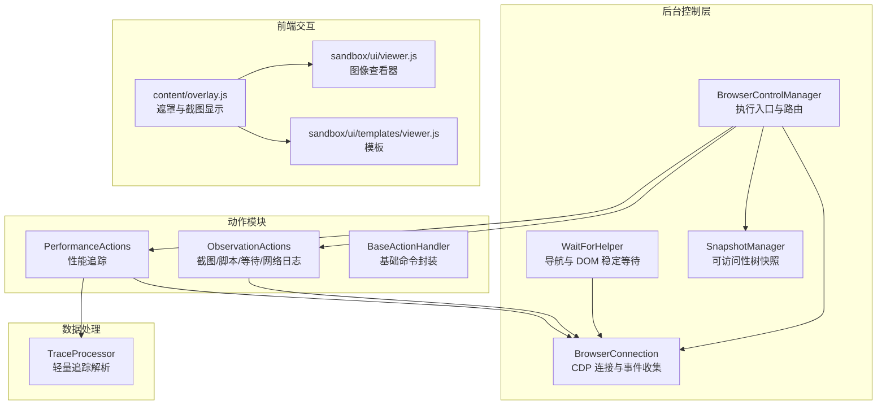
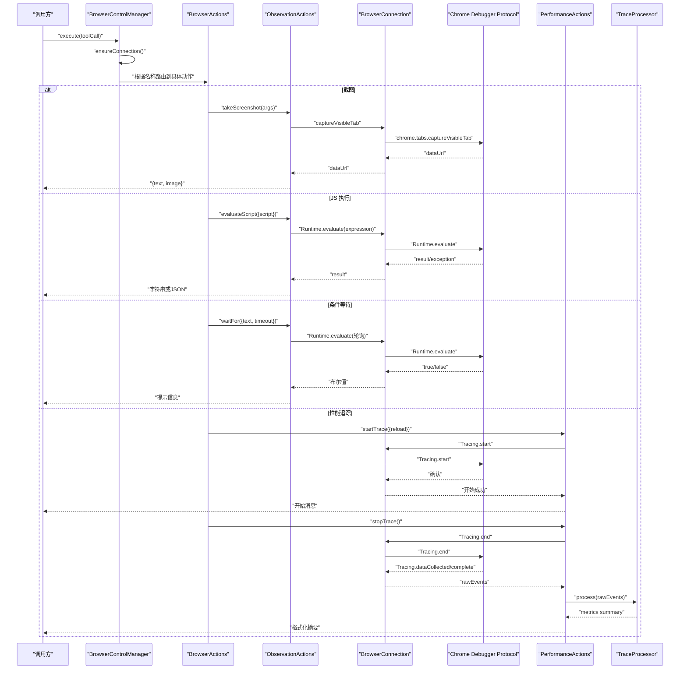
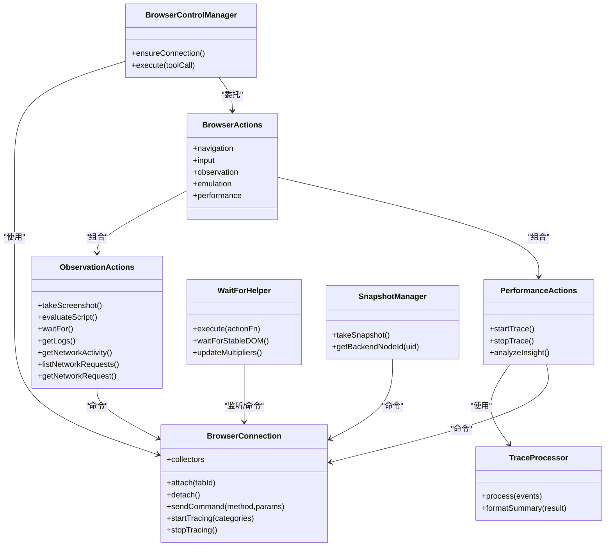

# 数据提取工具

<cite>
**本文引用的文件**
- [background/control/actions/observation.js](file://background/control/actions/observation.js)
- [background/control/actions/performance.js](file://background/control/actions/performance.js)
- [background/control/wait_helper.js](file://background/control/wait_helper.js)
- [background/lib/trace_processor.js](file://background/lib/trace_processor.js)
- [background/control/actions/base.js](file://background/control/actions/base.js)
- [background/control/connection.js](file://background/control/connection.js)
- [background/managers/control_manager.js](file://background/managers/control_manager.js)
- [background/control/actions.js](file://background/control/actions.js)
- [background/control/snapshot.js](file://background/control/snapshot.js)
- [background/managers/image_manager.js](file://background/managers/image_manager.js)
- [content/overlay.js](file://content/overlay.js)
- [sandbox/ui/viewer.js](file://sandbox/ui/viewer.js)
- [sandbox/ui/templates/viewer.js](file://sandbox/ui/templates/viewer.js)
</cite>

## 目录
1. [简介](#简介)
2. [项目结构](#项目结构)
3. [核心组件](#核心组件)
4. [架构总览](#架构总览)
5. [详细组件分析](#详细组件分析)
6. [依赖关系分析](#依赖关系分析)
7. [性能考量](#性能考量)
8. [故障排查指南](#故障排查指南)
9. [结论](#结论)
10. [附录](#附录)

## 简介
本文件为“数据提取工具”的详细参考文档，聚焦于页面观察与性能分析能力，覆盖以下关键能力：
- 数据采集 API：takeScreenshot（截图）、evaluateScript（JS 执行）、waitFor（条件等待）
- 性能监控 API：startTrace（开始追踪）、stopTrace（停止追踪）
- 内部机制说明：截图生成、JavaScript 执行、条件等待、性能追踪数据处理
- 实际应用示例：获取页面状态、执行自定义脚本、分析性能瓶颈
- 数据安全策略、资源消耗与调用频率限制建议、性能优化实践

## 项目结构
该工具基于 Chrome 扩展的后台服务工作线程（Service Worker）实现，通过 Chrome Debugger Protocol（CDP）与目标页面交互，提供浏览器控制、页面观察与性能分析能力。核心模块包括：
- 控制层：连接管理、动作分发、等待辅助
- 观察与性能：截图、JS 执行、条件等待、性能追踪
- 数据处理：轻量级追踪解析器
- 可视化与交互：沙盒图像查看器、内容脚本遮罩层

图表来源
- [background/managers/control_manager.js](file://background/managers/control_manager.js#L11-L159)
- [background/control/connection.js](file://background/control/connection.js#L8-L147)
- [background/control/actions.js](file://background/control/actions.js#L13-L55)
- [background/control/actions/observation.js](file://background/control/actions/observation.js#L5-L200)
- [background/control/actions/performance.js](file://background/control/actions/performance.js#L6-L74)
- [background/lib/trace_processor.js](file://background/lib/trace_processor.js#L9-L98)
- [background/control/wait_helper.js](file://background/control/wait_helper.js#L8-L148)
- [content/overlay.js](file://content/overlay.js#L51-L74)
- [sandbox/ui/viewer.js](file://sandbox/ui/viewer.js#L4-L36)
- [sandbox/ui/templates/viewer.js](file://sandbox/ui/templates/viewer.js#L1-L18)

章节来源
- [background/managers/control_manager.js](file://background/managers/control_manager.js#L11-L159)
- [background/control/connection.js](file://background/control/connection.js#L8-L147)

## 核心组件
- BrowserControlManager：统一入口，负责确保连接、路由到具体动作模块，并返回结果。
- BrowserConnection：维护 CDP 会话，启用所需域，收集事件，支持性能追踪的开始/结束与事件聚合。
- ObservationActions：提供 takeScreenshot、evaluateScript、waitFor 等观察类能力。
- PerformanceActions：提供 startTrace、stopTrace、analyzeInsight 等性能分析能力。
- TraceProcessor：从原始 CDP 事件中提取关键性能指标（FCP/LCP/CLS/DC/Load）并格式化摘要。
- WaitForHelper：等待导航完成与 DOM 稳定，考虑 CPU/网络倍数调整超时。
- SnapshotManager：生成可访问性树快照，便于后续节点高亮与交互定位。

章节来源
- [background/managers/control_manager.js](file://background/managers/control_manager.js#L11-L159)
- [background/control/connection.js](file://background/control/connection.js#L8-L147)
- [background/control/actions/observation.js](file://background/control/actions/observation.js#L5-L200)
- [background/control/actions/performance.js](file://background/control/actions/performance.js#L6-L74)
- [background/lib/trace_processor.js](file://background/lib/trace_processor.js#L9-L98)
- [background/control/wait_helper.js](file://background/control/wait_helper.js#L8-L148)
- [background/control/snapshot.js](file://background/control/snapshot.js#L9-L183)

## 架构总览
下图展示了从工具调用到最终结果输出的关键流程，包括截图、脚本执行、条件等待与性能追踪的数据流。

图表来源
- [background/managers/control_manager.js](file://background/managers/control_manager.js#L43-L157)
- [background/control/actions.js](file://background/control/actions.js#L13-L55)
- [background/control/actions/observation.js](file://background/control/actions/observation.js#L7-L127)
- [background/control/actions/performance.js](file://background/control/actions/performance.js#L13-L66)
- [background/control/connection.js](file://background/control/connection.js#L134-L145)
- [background/lib/trace_processor.js](file://background/lib/trace_processor.js#L10-L71)

## 详细组件分析

### 截图 takeScreenshot
- 功能概述
  - 使用可见标签页截图接口生成 PNG 数据，支持直接返回 Base64 或下载到本地。
  - 若提供文件路径参数，则自动提取安全文件名并通过下载 API 保存；否则返回文本提示与内嵌图像数据。
- 关键机制
  - 通过连接对象封装 CDP 命令，捕获错误并回退。
  - 下载时避免弹窗，直接保存至默认下载目录。
- 典型调用
  - 不带参数：返回包含文本提示与 Base64 的对象。
  - 带文件路径：尝试下载并返回下载结果与提示。
- 注意事项
  - 在受限 URL（如 chrome://）场景下可能无法附加调试器，但保留导航等降级能力。

章节来源
- [background/control/actions/observation.js](file://background/control/actions/observation.js#L7-L55)
- [background/managers/image_manager.js](file://background/managers/image_manager.js#L48-L96)

### JavaScript 执行 evaluateScript
- 功能概述
  - 在页面运行任意脚本表达式，支持顶层 await 与异常捕获，返回结构化结果（对象转 JSON，原始值转字符串）。
- 关键机制
  - 包装为异步 IIFE 并通过 Runtime.evaluate 执行，开启 awaitPromise 以支持异步。
  - 捕获异常并转换为可读错误信息；对 undefined 返回特殊标记。
- 典型调用
  - 获取元素数量：返回数值或字符串。
  - 获取复杂对象：返回 JSON 字符串。
- 注意事项
  - 脚本需在当前页面上下文中执行，受同源策略限制。

章节来源
- [background/control/actions/observation.js](file://background/control/actions/observation.js#L57-L96)
- [background/control/actions/base.js](file://background/control/actions/base.js#L14-L16)

### 条件等待 waitFor
- 功能概述
  - 在指定超时时间内轮询页面文本是否出现，适合等待动态内容加载完成。
- 关键机制
  - 通过 Runtime.evaluate 注入轮询逻辑，按固定间隔检查 document.body 文本。
  - 返回找到或超时提示。
- 典型调用
  - 等待特定文案出现，设置合理超时时间。
- 注意事项
  - 轮询间隔固定，超时过短可能导致误判；建议结合 DOM 稳定等待。

章节来源
- [background/control/actions/observation.js](file://background/control/actions/observation.js#L98-L127)

### 导航与 DOM 稳定等待 WaitForHelper
- 功能概述
  - 等待导航开始与完成，随后等待 DOM 稳定（MutationObserver），并支持 CPU/网络倍数调整超时。
- 关键机制
  - 启用 Page 域监听 frameStartedNavigating/loadEventFired。
  - 通过 Runtime.evaluate 注入 MutationObserver，检测无变更持续时间以判定稳定。
  - 提供超时上限与安全超时，防止长时间阻塞。
- 典型调用
  - 在执行点击/输入等动作后，调用等待以确保页面稳定再继续下一步。
- 注意事项
  - 对受限 URL（无法附加调试器）场景提供降级等待策略。

章节来源
- [background/control/wait_helper.js](file://background/control/wait_helper.js#L8-L148)

### 性能追踪 startTrace/stopTrace
- 功能概述
  - 开始/停止 CDP 性能追踪，聚合事件并计算关键指标（FCP/LCP/CLS/DC/Load），输出摘要。
- 关键机制
  - startTrace：启用追踪类别，可选触发页面重载。
  - stopTrace：等待 Tracing.tracingComplete，聚合事件交由 TraceProcessor 处理。
  - TraceProcessor：遍历事件，提取导航起点、首屏绘制、最大内容绘制候选、布局偏移与文档加载事件，计算指标并格式化摘要。
- 典型调用
  - start_trace -> 执行业务步骤 -> stop_trace -> 分析摘要。
- 注意事项
  - 追踪期间会显著增加内存与 CPU 占用，建议在必要时开启并尽快停止。

章节来源
- [background/control/actions/performance.js](file://background/control/actions/performance.js#L13-L66)
- [background/lib/trace_processor.js](file://background/lib/trace_processor.js#L10-L96)
- [background/control/connection.js](file://background/control/connection.js#L134-L145)

### 观测与网络能力
- 日志与网络活动
  - 提供获取日志、网络活动列表与请求详情的能力，支持请求体解码与类型判断。
- 典型调用
  - get_logs -> list_network_requests -> get_network_request

章节来源
- [background/control/actions/observation.js](file://background/control/actions/observation.js#L129-L200)

### 快照与节点高亮
- 功能概述
  - 生成可访问性树快照，映射 UID 到后端节点 ID，支持高亮反馈。
- 典型调用
  - take_snapshot -> 用于后续节点交互与可视化反馈。

章节来源
- [background/control/snapshot.js](file://background/control/snapshot.js#L27-L181)
- [background/control/actions/base.js](file://background/control/actions/base.js#L25-L62)

## 依赖关系分析

图表来源
- [background/managers/control_manager.js](file://background/managers/control_manager.js#L11-L159)
- [background/control/actions.js](file://background/control/actions.js#L13-L55)
- [background/control/actions/observation.js](file://background/control/actions/observation.js#L5-L200)
- [background/control/actions/performance.js](file://background/control/actions/performance.js#L6-L74)
- [background/lib/trace_processor.js](file://background/lib/trace_processor.js#L9-L98)
- [background/control/wait_helper.js](file://background/control/wait_helper.js#L8-L148)
- [background/control/snapshot.js](file://background/control/snapshot.js#L9-L183)

## 性能考量
- 截图与下载
  - 截图会生成大尺寸 Base64 数据，建议仅在需要时调用，并优先使用下载方式保存到磁盘而非内嵌聊天历史。
  - 大图下载可能触发系统弹窗，当前实现采用非弹窗模式，但仍建议控制调用频率。
- JavaScript 执行
  - 长耗时脚本会阻塞页面主线程，建议拆分执行与设置合理超时。
  - 异步脚本需注意 awaitPromise 的使用，避免未完成的 Promise 导致结果不一致。
- 条件等待
  - 轮询间隔固定，建议结合 WaitForHelper 的 DOM 稳定等待，减少无效轮询。
- 性能追踪
  - 追踪会显著增加内存与 CPU 占用，建议：
    - 仅在必要时开启，完成后立即停止；
    - 控制追踪范围与类别，避免无关事件；
    - 结合页面重载策略，确保事件完整性。
- 资源消耗与频率限制
  - 当前未实现显式的速率限制，建议：
    - 对截图与追踪设置最小间隔；
    - 对网络请求与日志获取设置批量上限；
    - 在受限 URL 场景下避免频繁重试。

[本节为通用指导，无需列出章节来源]

## 故障排查指南
- 截图失败
  - 现象：返回错误信息或空数据。
  - 排查：确认当前标签页可被调试器附加；检查权限与受限 URL；尝试重新执行。
- JS 执行异常
  - 现象：返回异常信息或 undefined。
  - 排查：检查脚本语法与作用域；确保页面上下文可用；查看异常堆栈。
- 等待超时
  - 现象：waitFor 返回超时提示。
  - 排查：适当增大超时；确认目标文本存在；结合 DOM 稳定等待。
- 追踪未结束
  - 现象：stop_trace 返回错误或无结果。
  - 排查：确认 start_trace 成功且 isRunning 状态正确；检查 Tracing.complete 是否到达；重试 stop_trace。
- 图像查看与遮罩
  - 现象：截图遮罩层显示异常或图像无法查看。
  - 排查：确认截图 Base64 正确；检查遮罩层样式与层级；验证图像查看器初始化。

章节来源
- [background/control/actions/observation.js](file://background/control/actions/observation.js#L7-L55)
- [background/control/actions/observation.js](file://background/control/actions/observation.js#L57-L96)
- [background/control/actions/observation.js](file://background/control/actions/observation.js#L98-L127)
- [background/control/actions/performance.js](file://background/control/actions/performance.js#L13-L66)
- [background/managers/image_manager.js](file://background/managers/image_manager.js#L48-L96)
- [content/overlay.js](file://content/overlay.js#L51-L74)
- [sandbox/ui/viewer.js](file://sandbox/ui/viewer.js#L4-L36)

## 结论
本数据提取工具通过 CDP 提供了完整的页面观察与性能分析能力，覆盖截图、脚本执行、条件等待与性能追踪等核心场景。其设计强调：
- 明确的动作分层与路由机制，便于扩展与维护；
- 轻量的追踪解析器，聚焦关键指标输出；
- 等待辅助模块提升自动化稳定性；
- 可访问性树快照与节点高亮增强交互体验。

建议在生产环境中结合频率控制、资源监控与错误恢复策略，以获得更稳健的自动化体验。

[本节为总结性内容，无需列出章节来源]

## 附录

### API 一览与使用要点
- 截图
  - 名称：take_screenshot
  - 参数：可选文件路径
  - 行为：截图并返回文本提示与图像数据，或下载到本地
- JS 执行
  - 名称：evaluate_script / run_script / run_javascript
  - 参数：script（字符串）
  - 行为：在页面执行脚本，返回结构化结果
- 条件等待
  - 名称：wait_for
  - 参数：text（目标文本）、timeout（毫秒）
  - 行为：轮询等待文本出现
- 性能追踪
  - 名称：start_trace / performance_start_trace
  - 参数：reload（是否重载页面）
  - 行为：开始追踪
  - 名称：stop_trace / performance_stop_trace
  - 行为：停止追踪并输出摘要
  - 名称：performance_analyze_insight
  - 行为：占位接口，提示参考摘要

章节来源
- [background/managers/control_manager.js](file://background/managers/control_manager.js#L63-L126)
- [background/control/actions/observation.js](file://background/control/actions/observation.js#L7-L127)
- [background/control/actions/performance.js](file://background/control/actions/performance.js#L13-L72)

### 数据安全与隐私
- 截图与下载
  - 截图数据以 Base64 形式传输，建议仅在受信任的会话中使用；下载时避免弹窗，降低用户感知风险。
- 日志与网络
  - 网络请求体与日志可能包含敏感信息，建议在分析后及时清理或脱敏。
- 会话与权限
  - 严格限制受限 URL 的调试器附加，避免越权访问；对受限场景提供降级能力。

章节来源
- [background/control/actions/observation.js](file://background/control/actions/observation.js#L24-L46)
- [background/control/connection.js](file://background/control/connection.js#L60-L106)

### 实际应用示例（步骤化）
- 获取页面状态
  - 步骤：调用 evaluate_script 获取页面标题/URL/元素计数等；结合 take_screenshot 保存关键截图。
- 执行自定义脚本
  - 步骤：编写脚本读取表单字段或动态内容；通过 evaluate_script 执行并解析结果。
- 分析性能瓶颈
  - 步骤：start_trace -> 执行业务流程 -> stop_trace -> 查看摘要（FCP/LCP/CLS/DC/Load）并定位问题。

章节来源
- [background/control/actions/observation.js](file://background/control/actions/observation.js#L57-L127)
- [background/control/actions/performance.js](file://background/control/actions/performance.js#L13-L66)
- [background/lib/trace_processor.js](file://background/lib/trace_processor.js#L73-L96)