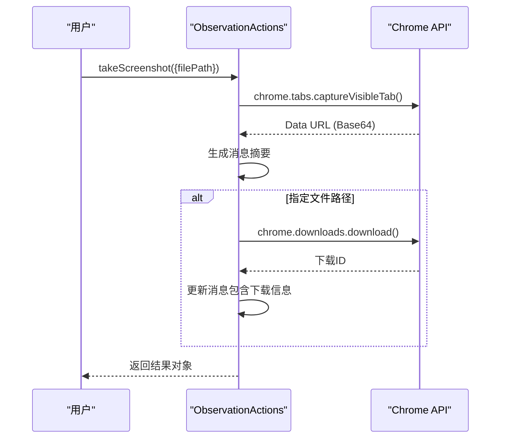
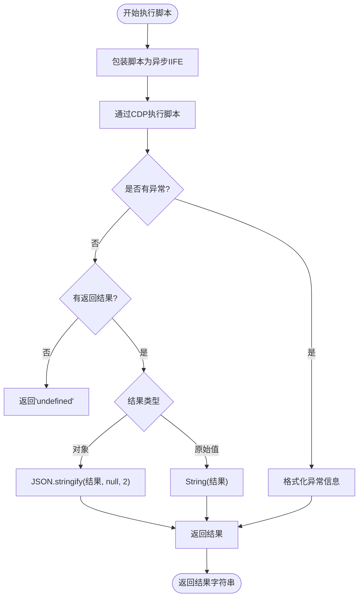
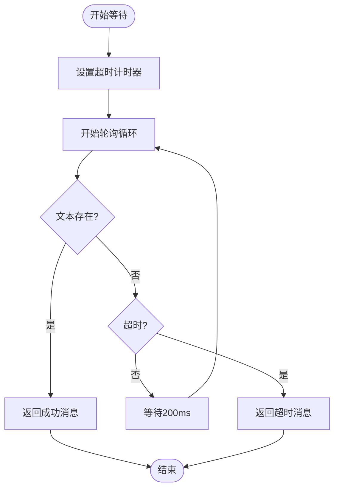
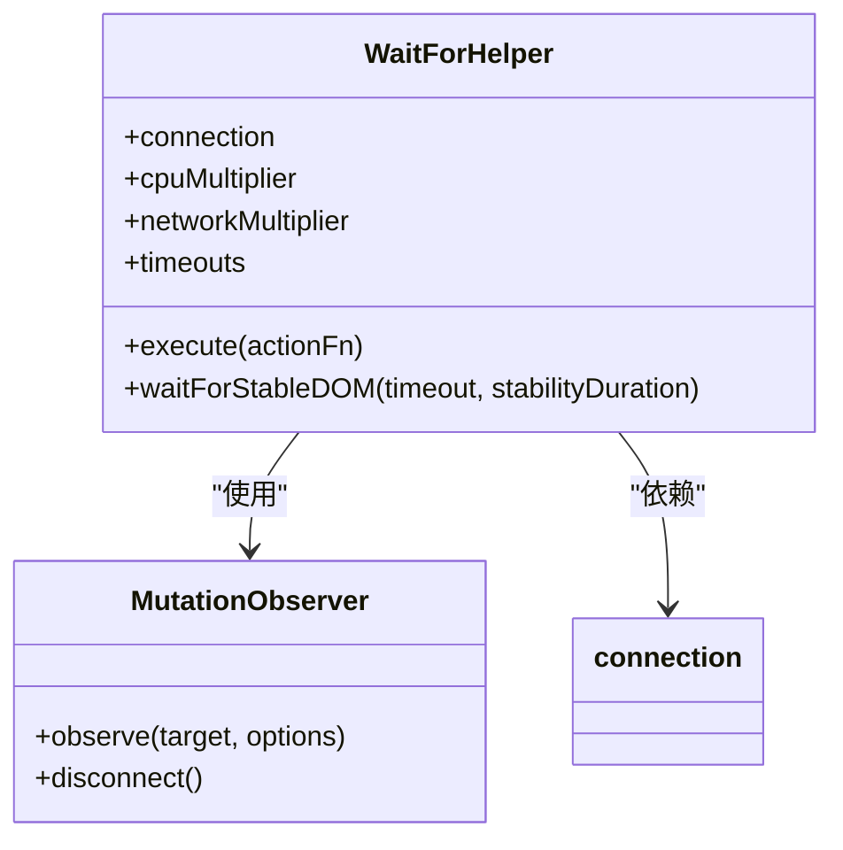
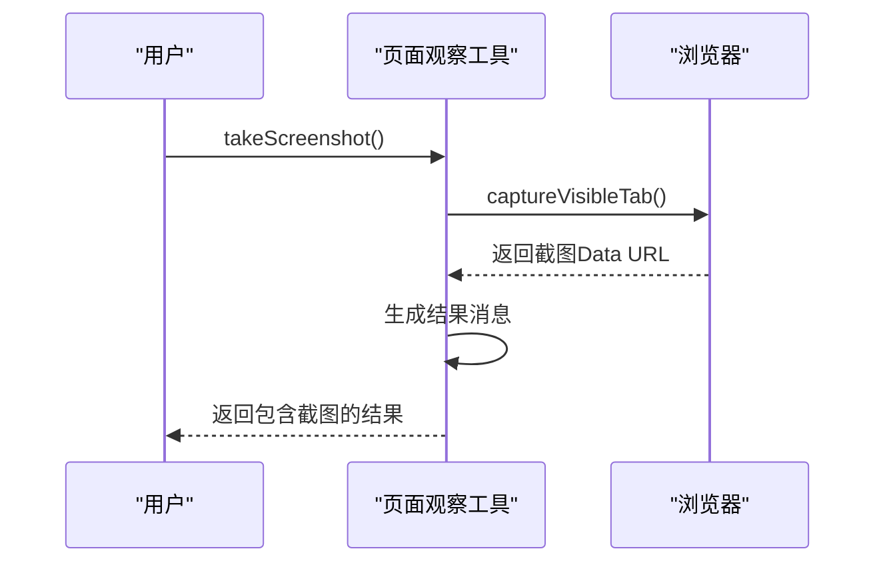
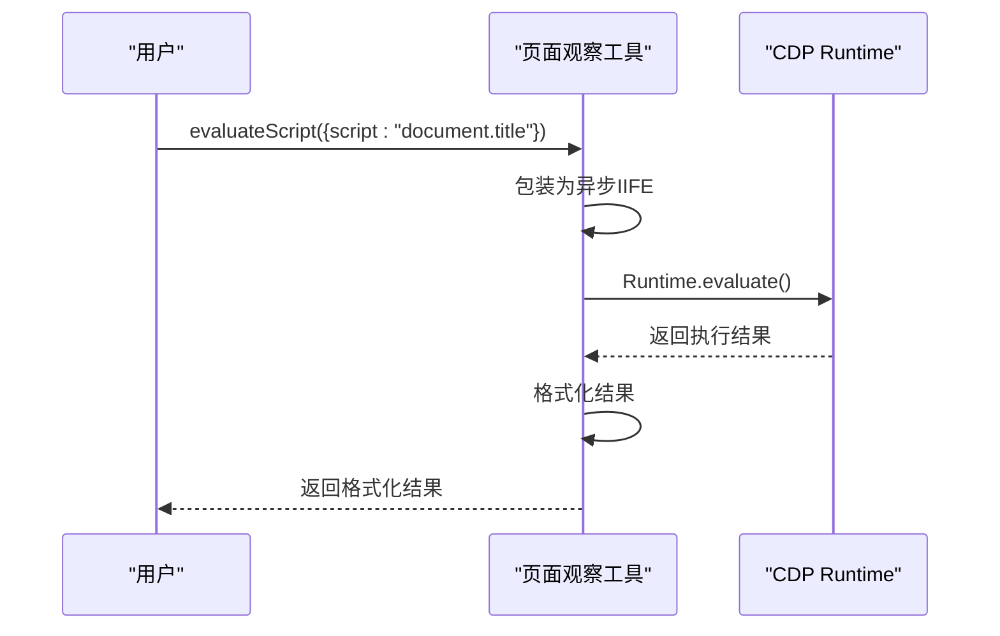
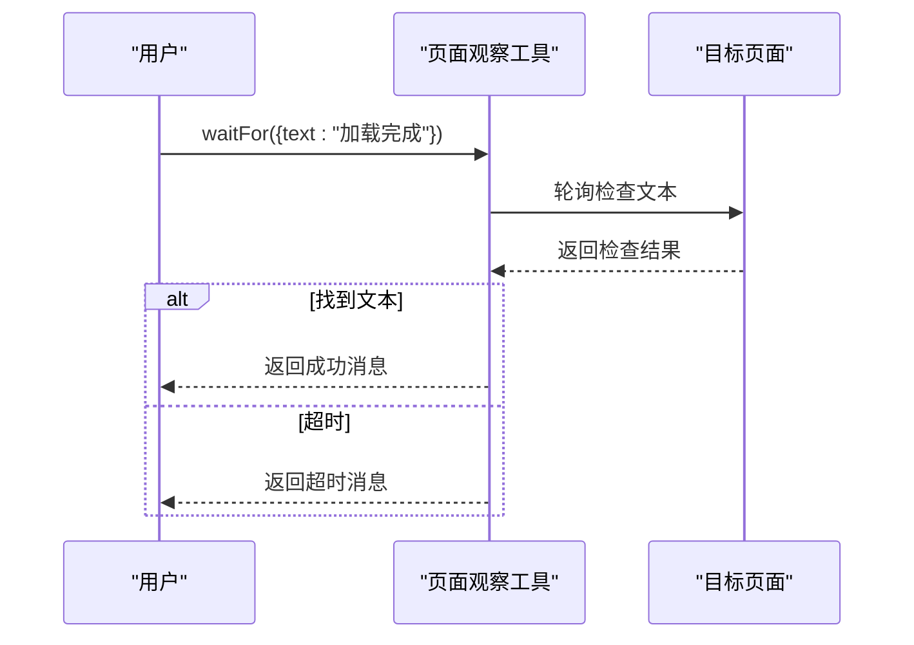
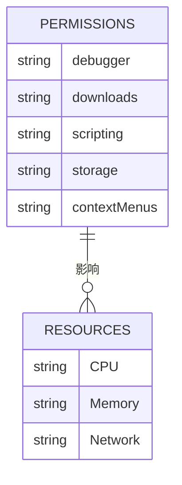
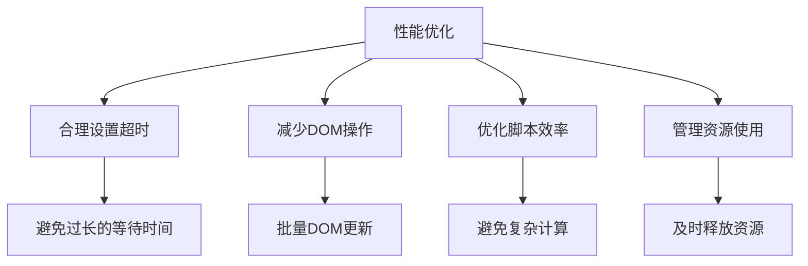
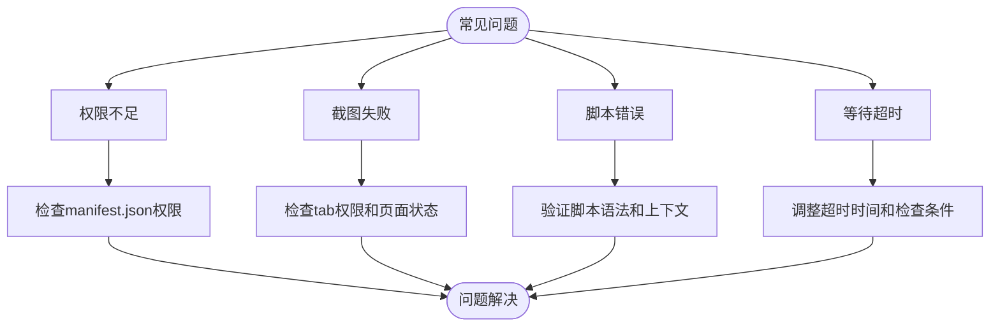

# 页面观察工具

<cite>
**本文档引用的文件**   
- [observation.js](file://background/control/actions/observation.js)
- [wait_helper.js](file://background/control/wait_helper.js)
- [snapshot.js](file://background/control/snapshot.js)
- [image_manager.js](file://background/managers/image_manager.js)
- [base.js](file://background/control/actions/base.js)
- [manifest.json](file://manifest.json)
- [connection.js](file://background/control/connection.js)
- [performance.js](file://background/control/actions/performance.js)
- [collectors.js](file://background/control/collectors.js)
- [trace_processor.js](file://background/lib/trace_processor.js)
</cite>

## 目录
1. [简介](#简介)
2. [核心功能](#核心功能)
3. [API技术实现](#api技术实现)
4. [DOM稳定检测原理](#dom稳定检测原理)
5. [实际应用示例](#实际应用示例)
6. [权限与资源消耗](#权限与资源消耗)
7. [性能优化建议](#性能优化建议)
8. [常见问题解决方案](#常见问题解决方案)

## 简介
页面观察工具是Gemini Nexus扩展的核心组件，提供全面的页面状态观察和数据提取能力。该工具集成了截图、脚本执行和条件等待等关键功能，使用户能够获取页面的视觉状态、提取结构化数据并等待特定内容加载。通过Chrome DevTools Protocol (CDP)与浏览器深度集成，该工具实现了高性能的页面观察和自动化操作。

## 核心功能
页面观察工具提供三大核心功能：截图(takeScreenshot)、脚本执行(evaluateScript)和条件等待(waitFor)。这些功能通过ObservationActions类实现，继承自BaseActionHandler，确保了统一的错误处理和连接管理。工具还集成了网络活动监控、日志收集和性能分析等辅助功能，为用户提供全面的页面观察能力。

**Section sources**
- [observation.js](file://background/control/actions/observation.js#L5-L55)
- [base.js](file://background/control/actions/base.js#L5-L11)

## API技术实现

### 截图功能实现
截图功能通过Chrome扩展的tabs.captureVisibleTab API实现，能够捕获当前可见标签页的完整截图。截图以PNG格式生成，并以Data URL(base64编码)形式返回。当指定文件路径时，系统会使用downloads.download API将截图保存到本地。

**Diagram sources**
- [observation.js](file://background/control/actions/observation.js#L7-L55)
- [image_manager.js](file://background/managers/image_manager.js#L48-L79)

### 脚本执行环境
脚本执行功能在安全的JavaScript沙箱环境中运行，通过Runtime.evaluate CDP命令执行。系统采用异步IIFE(立即调用函数表达式)包装用户脚本，支持顶级await语法，并确保返回值的正确捕获。错误处理机制通过try-catch块实现，将运行时错误作为字符串返回而非抛出异常。

**Diagram sources**
- [observation.js](file://background/control/actions/observation.js#L57-L96)
- [connection.js](file://background/control/connection.js#L121-L132)

### 条件等待机制
条件等待功能通过轮询机制实现，定期检查指定文本是否出现在页面DOM中。系统使用异步函数和setTimeout实现非阻塞轮询，每200毫秒检查一次页面内容，直到找到目标文本或达到超时限制(默认5000毫秒)。

**Diagram sources**
- [observation.js](file://background/control/actions/observation.js#L98-L127)

## DOM稳定检测原理
DOM稳定检测基于MutationObserver API实现，能够精确检测页面DOM的变化。系统通过观察document.body的属性变化、子节点变化和子树变化，当在指定时间段内(默认100毫秒)未检测到任何DOM变化时，认为页面已达到稳定状态。

**Diagram sources**
- [wait_helper.js](file://background/control/wait_helper.js#L97-L148)
- [connection.js](file://background/control/connection.js#L88-L98)

## 实际应用示例

### 获取页面视觉状态
通过takeScreenshot API获取页面当前视觉状态，可用于记录操作过程或分析页面布局。

**Section sources**
- [observation.js](file://background/control/actions/observation.js#L7-L55)

### 提取结构化数据
通过evaluateScript API执行JavaScript代码，提取页面中的结构化数据。

**Section sources**
- [observation.js](file://background/control/actions/observation.js#L57-L96)

### 等待特定内容加载
通过waitFor API等待特定内容在页面上出现，确保后续操作在正确时机执行。

**Section sources**
- [observation.js](file://background/control/actions/observation.js#L98-L127)

## 权限与资源消耗
页面观察工具需要多项浏览器权限才能正常工作，包括调试(debugger)、下载(downloads)和脚本执行(scripting)等。这些权限在manifest.json中声明，确保工具能够访问必要的Chrome API。

**Section sources**
- [manifest.json](file://manifest.json#L6-L10)
- [connection.js](file://background/control/connection.js#L88-L98)

## 性能优化建议
为确保页面观察工具的高效运行，建议遵循以下优化策略：合理设置超时时间、避免频繁的DOM操作、优化脚本执行效率和合理管理资源使用。

**Section sources**
- [wait_helper.js](file://background/control/wait_helper.js#L19-L34)
- [performance.js](file://background/control/actions/performance.js#L13-L44)

## 常见问题解决方案
针对页面观察工具使用过程中可能遇到的常见问题，提供以下解决方案：权限问题、截图失败、脚本执行错误和等待超时等。

**Section sources**
- [observation.js](file://background/control/actions/observation.js#L11-L14)
- [connection.js](file://background/control/connection.js#L124-L130)
- [base.js](file://background/control/actions/base.js#L59-L61)