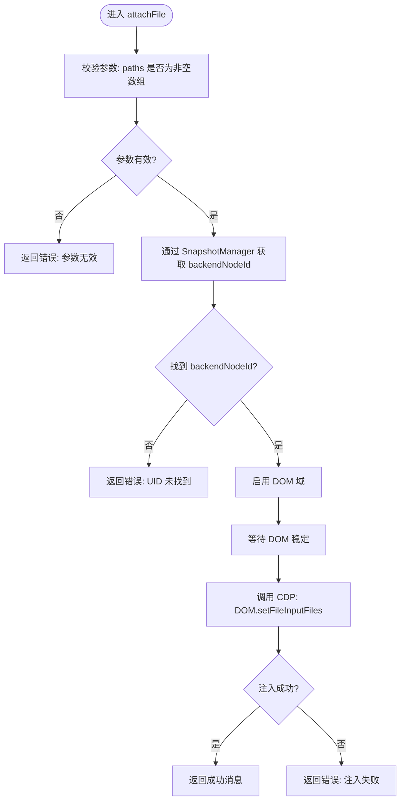

# 文件操作

<cite>
**本文引用的文件**
- [file.js](file://background/control/actions/input/file.js)
- [input.js](file://background/control/actions/input.js)
- [base.js](file://background/control/actions/base.js)
- [snapshot.js](file://background/control/snapshot.js)
- [image_manager.js](file://background/managers/image_manager.js)
- [tool_executor.js](file://background/handlers/session/prompt/tool_executor.js)
- [manifest.json](file://manifest.json)
- [input.js](file://content/toolbar/utils/input.js)
</cite>

## 目录
1. [简介](#简介)
2. [项目结构](#项目结构)
3. [核心组件](#核心组件)
4. [架构总览](#架构总览)
5. [详细组件分析](#详细组件分析)
6. [依赖关系分析](#依赖关系分析)
7. [性能考量](#性能考量)
8. [故障排查指南](#故障排查指南)
9. [结论](#结论)
10. [附录](#附录)

## 简介
本文件为“文件操作”功能的详细参考文档，重点围绕 attachFile 方法的实现机制展开，涵盖：
- API 参数结构：元素 UID、文件路径数组
- 执行逻辑：DOM 元素识别、CDP 命令调用、等待稳定 DOM
- 返回值格式：成功/失败消息
- 自动化文件上传原理：绕过原生文件选择对话框，直接通过 CDP 设置文件输入内容
- 实际使用示例：MCP 工具调用中上传截图或用户指定文件
- 权限要求与安全限制：activeTab 权限、受限页面限制
- 错误处理：非文件输入元素、文件大小限制等
- 与 image_manager 模块的集成方式

## 项目结构
文件操作功能位于后台控制层，采用分层设计：
- 控制层：BrowserControlManager 负责连接、快照与动作执行
- 动作层：InputActions 组合鼠标、键盘、文件三类动作；FileActions 实现 attachFile
- 快照层：SnapshotManager 提供 DOM 后端节点映射（UID <-> backendNodeId）
- 图像管理：ImageManager 支持截图捕获与 Base64 数据处理

图表来源
- [input.js](file://background/control/actions/input.js#L8-L14)
- [file.js](file://background/control/actions/input/file.js#L5-L30)
- [snapshot.js](file://background/control/snapshot.js#L9-L25)
- [image_manager.js](file://background/managers/image_manager.js#L4-L96)

章节来源
- [input.js](file://background/control/actions/input.js#L1-L62)
- [file.js](file://background/control/actions/input/file.js#L1-L31)
- [snapshot.js](file://background/control/snapshot.js#L1-L183)
- [image_manager.js](file://background/managers/image_manager.js#L1-L97)

## 核心组件
- FileActions.attachFile：接收 { uid, paths }，校验参数，解析 backendNodeId，调用 CDP DOM.setFileInputFiles 完成文件注入
- InputActions：聚合 FileActions，并提供统一的 attachFile 入口
- SnapshotManager：维护 UID 到 backendNodeId 的映射，用于 CDP 命令定位目标元素
- ImageManager：提供截图捕获与 Base64 数据转换能力，便于 MCP 工具返回图片+文本结果

章节来源
- [file.js](file://background/control/actions/input/file.js#L5-L30)
- [input.js](file://background/control/actions/input.js#L8-L14)
- [snapshot.js](file://background/control/snapshot.js#L23-L25)
- [image_manager.js](file://background/managers/image_manager.js#L63-L79)

## 架构总览
下图展示了从 MCP 工具调用到文件注入的完整流程，包括快照生成、元素定位、CDP 注入与结果返回。

图表来源
- [tool_executor.js](file://background/handlers/session/prompt/tool_executor.js#L22-L46)
- [input.js](file://background/control/actions/input.js#L48-L48)
- [file.js](file://background/control/actions/input/file.js#L18-L24)
- [snapshot.js](file://background/control/snapshot.js#L23-L25)

## 详细组件分析

### FileActions.attachFile 方法详解
- 输入参数
  - uid：字符串，来自快照生成的唯一标识符
  - paths：字符串数组，每个元素为文件路径（在当前实现中，CDP 接受的是路径列表）
- 执行步骤
  1) 参数校验：确保 paths 存在且为非空数组
  2) 获取 backendNodeId：通过 SnapshotManager 将 uid 解析为 backendNodeId
  3) 启用 DOM 域：保证后续 CDP 命令可用
  4) 等待 DOM 稳定：通过 waitHelper.execute 包裹命令，提升稳定性
  5) 调用 CDP：DOM.setFileInputFiles 设置文件输入元素的内容
  6) 返回结果：成功/失败消息
- 关键点
  - 该实现绕过了原生文件选择对话框，直接通过 CDP 注入文件数据，从而实现自动化文件上传
  - 若传入的不是文件输入元素，CDP 命令会失败，返回错误消息

图表来源
- [file.js](file://background/control/actions/input/file.js#L7-L28)

章节来源
- [file.js](file://background/control/actions/input/file.js#L7-L28)

### InputActions 与 FileActions 的组合
- InputActions 在构造时组合了 FileActions，并将 attachFile 请求转发给 FileActions
- 这种设计使 InputActions 成为文件操作的统一入口，便于扩展其他输入动作

章节来源
- [input.js](file://background/control/actions/input.js#L8-L14)
- [input.js](file://background/control/actions/input.js#L48-L48)

### SnapshotManager 的 UID 映射
- SnapshotManager 维护 uid -> backendNodeId 的映射表，用于 CDP 命令定位目标元素
- 该映射在 takeSnapshot 时建立，确保后续动作可精确定位 DOM 节点

章节来源
- [snapshot.js](file://background/control/snapshot.js#L23-L25)
- [snapshot.js](file://background/control/snapshot.js#L104-L110)

### 与 ImageManager 的集成
- ImageManager 提供截图捕获能力，返回包含 base64、类型与名称的对象
- ToolExecutor 在执行工具时，若结果为包含 image 字段的对象，会将其转换为文件附件返回给用户

章节来源
- [image_manager.js](file://background/managers/image_manager.js#L63-L79)
- [tool_executor.js](file://background/handlers/session/prompt/tool_executor.js#L28-L37)

## 依赖关系分析
- FileActions 依赖 BaseActionHandler 提供的连接与等待辅助能力
- FileActions 依赖 SnapshotManager 提供的 backendNodeId 解析
- InputActions 依赖 FileActions 提供的文件注入能力
- ToolExecutor 依赖 BrowserControlManager 执行工具并处理返回结果
- ImageManager 与 FileActions 无直接耦合，但可通过 MCP 工具链共同服务于“截图+上传”的场景

图表来源
- [base.js](file://background/control/actions/base.js#L5-L34)
- [file.js](file://background/control/actions/input/file.js#L5-L30)
- [input.js](file://background/control/actions/input.js#L8-L14)
- [snapshot.js](file://background/control/snapshot.js#L9-L25)
- [tool_executor.js](file://background/handlers/session/prompt/tool_executor.js#L4-L7)
- [image_manager.js](file://background/managers/image_manager.js#L4-L96)

章节来源
- [base.js](file://background/control/actions/base.js#L5-L34)
- [file.js](file://background/control/actions/input/file.js#L5-L30)
- [input.js](file://background/control/actions/input.js#L8-L14)
- [snapshot.js](file://background/control/snapshot.js#L9-L25)
- [tool_executor.js](file://background/handlers/session/prompt/tool_executor.js#L4-L7)
- [image_manager.js](file://background/managers/image_manager.js#L4-L96)

## 性能考量
- DOM 稳定性：通过 waitHelper.execute 包裹 CDP 命令，减少因页面动态变化导致的注入失败
- 快照开销：takeSnapshot 会启用 DOM 与 Accessibility 域并遍历 AX 树，建议仅在需要时调用
- 大量文件：paths 数组长度直接影响 CDP 命令的处理时间，应避免一次性传入过多文件

## 故障排查指南
- 非文件输入元素
  - 现象：CDP DOM.setFileInputFiles 报错
  - 原因：目标元素不是文件输入控件
  - 处理：确认 uid 对应的元素类型，必要时重新 take_snapshot 并核对元素角色
- UID 未找到
  - 现象：返回“UID 未找到，请先调用 take_snapshot”
  - 原因：未生成快照或快照已失效
  - 处理：先调用 take_snapshot，再进行 attachFile
- 参数无效
  - 现象：返回“paths 必须是非空字符串数组”
  - 原因：paths 缺失、非数组或为空
  - 处理：确保传入数组且至少包含一个有效路径
- 受限页面
  - 现象：无法连接到活动标签页
  - 原因：当前页面为 chrome://、edge:// 或 about: 开头的受限地址
  - 处理：切换到可访问的网页后重试
- 跨域文件访问
  - 说明：当前实现通过 CDP 设置文件输入内容，不涉及浏览器原生文件选择对话框，因此不受传统跨域限制影响
- 文件大小限制
  - 说明：当前实现未显式检查文件大小，过大文件可能导致 CDP 命令失败或页面卡顿
  - 建议：在调用前自行校验文件大小

章节来源
- [file.js](file://background/control/actions/input/file.js#L8-L10)
- [file.js](file://background/control/actions/input/file.js#L12-L13)
- [file.js](file://background/control/actions/input/file.js#L26-L28)
- [snapshot.js](file://background/control/snapshot.js#L27-L35)
- [control_manager.js](file://background/managers/control_manager.js#L24-L27)

## 结论
attachFile 方法通过 CDP 直接设置文件输入元素的内容，实现了无需用户交互的自动化文件上传。其关键在于：
- 正确的元素定位（基于快照生成的 UID）
- 稳定的 DOM 状态（waitHelper.execute）
- 合法的参数与目标元素类型

结合 ImageManager 的截图能力与 ToolExecutor 的工具执行框架，可在 MCP 场景中便捷地实现“截图上传”等自动化任务。

## 附录

### API 定义与参数说明
- 工具名：attachFile
- 参数对象字段
  - uid: 字符串，元素唯一标识符（来自快照）
  - paths: 字符串数组，文件路径列表
- 返回值
  - 成功：包含文件数量与元素 UID 的成功消息
  - 失败：包含具体错误原因的消息

章节来源
- [file.js](file://background/control/actions/input/file.js#L7-L28)

### 使用示例（MCP 工具调用）
- 上传用户指定文件
  - 步骤：先调用 take_snapshot 获取页面快照，记录目标文件输入元素的 uid；随后调用 attachFile，传入 uid 与 paths
  - 注意：paths 中的每个元素应为可被目标页面访问的有效路径
- 上传截图
  - 步骤：调用 ImageManager.captureScreenshot 获取 base64 数据；在 MCP 工具返回中，ToolExecutor 会将包含 image 字段的结果转换为文件附件返回给用户

章节来源
- [image_manager.js](file://background/managers/image_manager.js#L63-L79)
- [tool_executor.js](file://background/handlers/session/prompt/tool_executor.js#L28-L37)

### 权限要求与安全限制
- 权限
  - 当前 manifest 权限包含 script 执行与调试能力，满足 CDP 连接与 DOM 访问需求
- 安全限制
  - 受限页面（chrome://、edge://、about:）禁止连接
  - 不支持原生文件选择对话框，避免跨域文件访问问题

章节来源
- [manifest.json](file://manifest.json#L6-L10)
- [control_manager.js](file://background/managers/control_manager.js#L24-L27)