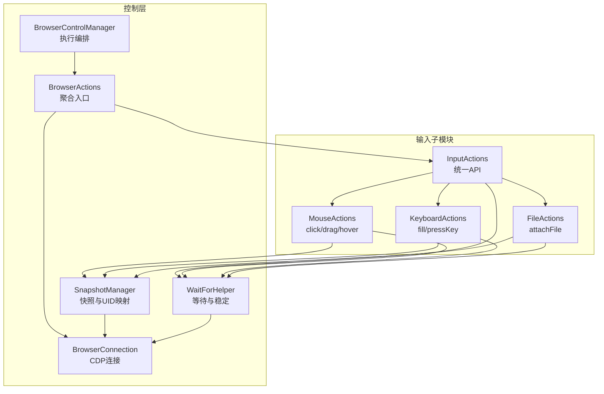
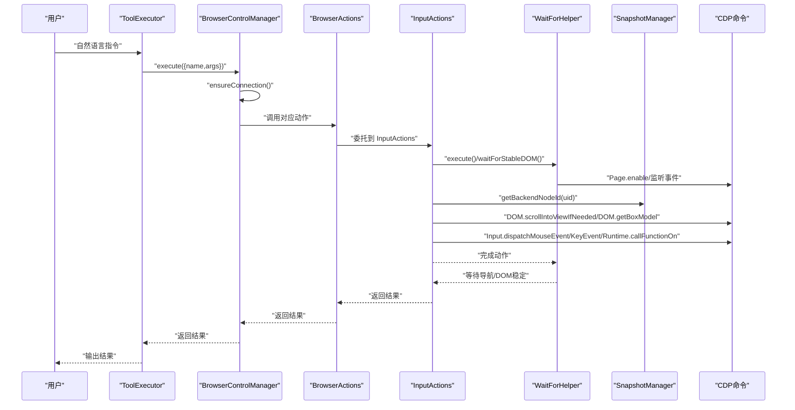
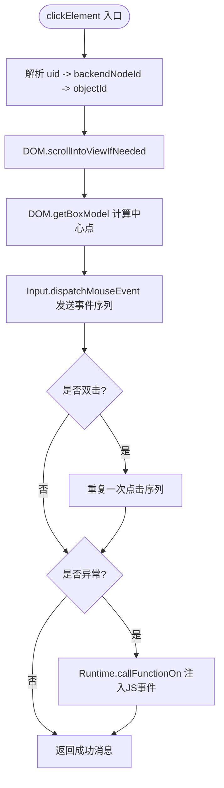
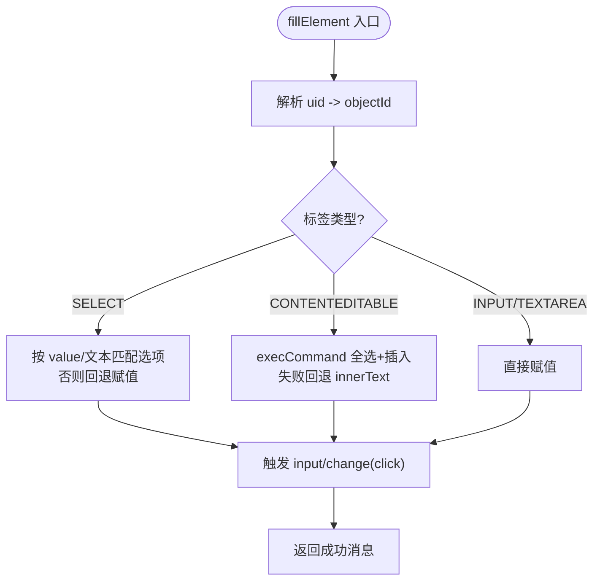
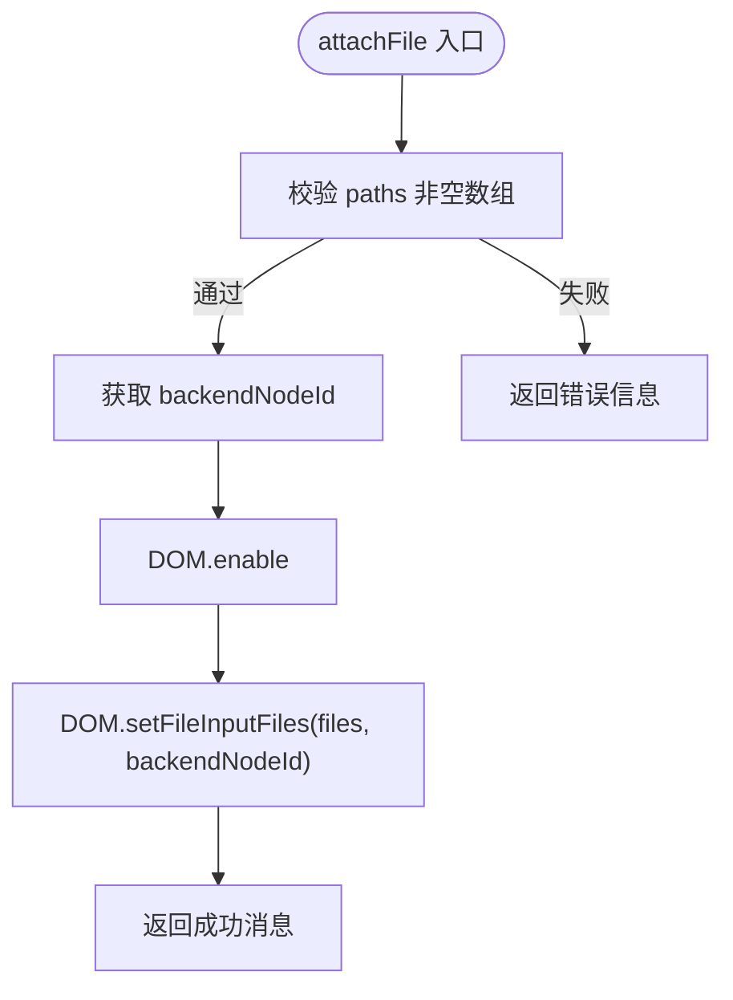
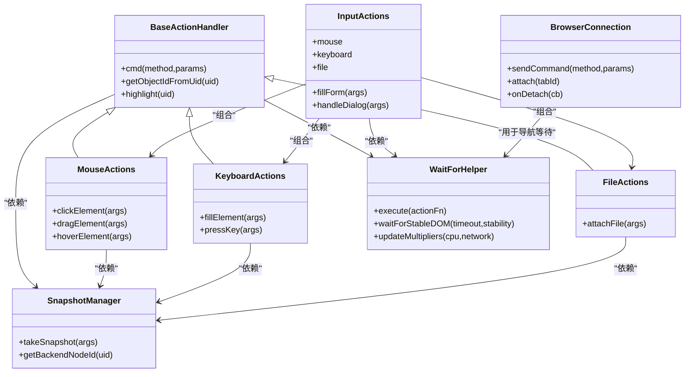

# 输入模拟工具

<cite>
**本文档引用的文件**
- [background/control/actions/input/mouse.js](file://background/control/actions/input/mouse.js)
- [background/control/actions/input/keyboard.js](file://background/control/actions/input/keyboard.js)
- [background/control/actions/input/file.js](file://background/control/actions/input/file.js)
- [background/control/actions/input.js](file://background/control/actions/input.js)
- [background/control/actions/base.js](file://background/control/actions/base.js)
- [background/control/wait_helper.js](file://background/control/wait_helper.js)
- [background/control/snapshot.js](file://background/control/snapshot.js)
- [background/control/connection.js](file://background/control/connection.js)
- [background/managers/control_manager.js](file://background/managers/control_manager.js)
- [background/handlers/session/prompt/tool_executor.js](file://background/handlers/session/prompt/tool_executor.js)
- [content/toolbar/utils/input.js](file://content/toolbar/utils/input.js)
</cite>

## 目录
1. [简介](#简介)
2. [项目结构](#项目结构)
3. [核心组件](#核心组件)
4. [架构总览](#架构总览)
5. [详细组件分析](#详细组件分析)
6. [依赖关系分析](#依赖关系分析)
7. [性能考量](#性能考量)
8. [故障排除指南](#故障排除指南)
9. [结论](#结论)
10. [附录：API 参考](#附录api-参考)

## 简介
本文件为“输入模拟工具”的权威参考文档，覆盖鼠标、键盘与文件上传三类输入操作。重点说明以下 API 的参数结构、执行逻辑与返回值：
- clickElement：点击元素（支持单击与双击）
- dragElement：拖拽元素（从起点到终点）
- hoverElement：悬停元素
- fillElement：填充元素（含 SELECT、TEXTAREA、INPUT、可编辑区域等）
- pressKey：按下指定按键（含特殊键映射）
- attachFile：为文件输入控件附加本地文件路径

文档同时解释这些工具如何通过 Chrome DevTools 协议（CDP）与页面元素交互，包括坐标计算、事件分发与 DOM 操作；提供自然语言指令中的调用示例；说明错误处理机制、超时策略与权限要求，并针对常见问题（元素不可见、坐标偏移等）给出解决方案。

## 项目结构
输入模拟工具位于后台控制模块中，采用分层设计：
- 基类与通用能力：BaseActionHandler 提供 CDP 命令封装、对象解析与高亮反馈
- 输入子模块：MouseActions、KeyboardActions、FileActions 分别实现鼠标、键盘、文件操作
- 组合入口：InputActions 聚合并暴露统一 API，包含表单批量填充与对话框处理
- 等待与稳定：WaitForHelper 负责导航等待与 DOM 稳定性检测
- 快照与 UID：SnapshotManager 提供无障碍树快照与 UID 映射
- 连接管理：BrowserConnection 管理 CDP 连接与事件监听
- 执行编排：BrowserControlManager 与 ToolExecutor 负责工具调用与执行流程

图表来源
- [background/managers/control_manager.js](file://background/managers/control_manager.js#L11-L49)
- [background/control/actions/input.js](file://background/control/actions/input.js#L8-L14)
- [background/control/wait_helper.js](file://background/control/wait_helper.js#L8-L34)
- [background/control/snapshot.js](file://background/control/snapshot.js#L9-L25)
- [background/control/connection.js](file://background/control/connection.js#L8-L26)

章节来源
- [background/managers/control_manager.js](file://background/managers/control_manager.js#L11-L49)
- [background/control/actions/input.js](file://background/control/actions/input.js#L8-L14)
- [background/control/wait_helper.js](file://background/control/wait_helper.js#L8-L34)
- [background/control/snapshot.js](file://background/control/snapshot.js#L9-L25)
- [background/control/connection.js](file://background/control/connection.js#L8-L26)

## 核心组件
- BaseActionHandler：提供 cmd() 命令封装、getObjectIdFromUid() 解析对象 ID、highlight() 可视化高亮、以及对 waitHelper 的依赖注入
- MouseActions：实现点击、拖拽、悬停，基于 DOM.getBoxModel 计算中心点，使用 Input.dispatchMouseEvent 发送鼠标事件
- KeyboardActions：实现 fillElement（兼容 SELECT/CONTENTEDITABLE/INPUT/TEXTAREA）、pressKey（特殊键映射与字符键）
- FileActions：实现 attachFile，使用 DOM.setFileInputFiles 设置文件路径数组
- InputActions：组合上述三个子模块，提供统一 API，并新增 fillForm 批量填充与 handleDialog 对话框处理
- WaitForHelper：等待导航开始/结束、DOM 稳定，支持 CPU/网络倍数调整
- SnapshotManager：生成无障碍树快照，维护 uid->backendNodeId 映射
- BrowserConnection：管理 CDP 会话、事件监听与命令发送
- ToolExecutor：解析自然语言中的工具调用并执行

章节来源
- [background/control/actions/base.js](file://background/control/actions/base.js#L5-L34)
- [background/control/actions/input/mouse.js](file://background/control/actions/input/mouse.js#L5-L70)
- [background/control/actions/input/keyboard.js](file://background/control/actions/input/keyboard.js#L5-L74)
- [background/control/actions/input/file.js](file://background/control/actions/input/file.js#L5-L29)
- [background/control/actions/input.js](file://background/control/actions/input.js#L8-L61)
- [background/control/wait_helper.js](file://background/control/wait_helper.js#L8-L90)
- [background/control/snapshot.js](file://background/control/snapshot.js#L9-L47)
- [background/control/connection.js](file://background/control/connection.js#L8-L38)
- [background/handlers/session/prompt/tool_executor.js](file://background/handlers/session/prompt/tool_executor.js#L4-L47)

## 架构总览
输入模拟工具通过以下链路工作：
- 用户通过自然语言触发工具调用（ToolExecutor）
- BrowserControlManager 确保连接可用并执行对应动作
- InputActions 调用 Mouse/Keyboard/File 子模块
- 子模块通过 SnapshotManager 获取 backendNodeId，解析为 objectId
- 使用 CDP 命令（DOM、Input、Runtime、Page、DOM）与页面交互
- WaitForHelper 在关键步骤等待导航与 DOM 稳定
- 返回结构化结果字符串或错误信息

图表来源
- [background/handlers/session/prompt/tool_executor.js](file://background/handlers/session/prompt/tool_executor.js#L9-L47)
- [background/managers/control_manager.js](file://background/managers/control_manager.js#L43-L84)
- [background/control/actions/input.js](file://background/control/actions/input.js#L16-L48)
- [background/control/wait_helper.js](file://background/control/wait_helper.js#L40-L90)
- [background/control/snapshot.js](file://background/control/snapshot.js#L23-L25)
- [background/control/actions/input/mouse.js](file://background/control/actions/input/mouse.js#L11-L47)
- [background/control/actions/input/keyboard.js](file://background/control/actions/input/keyboard.js#L10-L71)
- [background/control/actions/input/file.js](file://background/control/actions/input/file.js#L15-L24)

## 详细组件分析

### MouseActions（鼠标输入）
- clickElement(uid, dblClick=false)
  - 参数：uid（元素唯一标识），dblClick（是否双击）
  - 执行逻辑：
    1) 通过 SnapshotManager 获取 backendNodeId 并解析 objectId
    2) DOM.scrollIntoViewIfNeeded 确保元素可见
    3) DOM.getBoxModel 获取四边形盒模型，计算内容区中心点 (x,y)
    4) 使用 Input.dispatchMouseEvent 发送 mouseMoved、mousePressed、mouseReleased
    5) 若 dblClick，则重复一次点击序列
    6) 异常时回退到 Runtime.callFunctionOn 注入 JS 事件（mousedown/mouseup/click）
  - 返回值：成功消息或 JS 回退提示
- dragElement(from_uid, to_uid)
  - 参数：from_uid、to_uid
  - 执行逻辑：
    1) 分别获取起点与终点的盒模型中心点
    2) 先 mouseMoved 到起点并按下
    3) 分步移动（10 步）模拟拖拽轨迹
    4) 在终点释放
  - 返回值：成功消息或错误信息
- hoverElement(uid)
  - 参数：uid
  - 执行逻辑：计算中心点并发送 mouseMoved；随后通过 waitForStableDOM 等待 DOM 稳定
  - 返回值：成功消息或错误信息

图表来源
- [background/control/actions/input/mouse.js](file://background/control/actions/input/mouse.js#L7-L70)

章节来源
- [background/control/actions/input/mouse.js](file://background/control/actions/input/mouse.js#L7-L147)

### KeyboardActions（键盘输入）
- fillElement(uid, value)
  - 参数：uid、value
  - 执行逻辑：
    1) 通过 Runtime.callFunctionOn 注入函数，根据标签类型分别处理：
       - SELECT：优先按 value 匹配，再按可见文本匹配，否则回退赋值
       - CONTENTEDITABLE：使用 document.execCommand('selectAll','insertText') 替换/插入文本，失败时回退 innerText
       - INPUT/TEXTAREA：直接赋值
    2) 触发 input/change 事件，部分场景额外触发 click 事件
  - 返回值：成功消息
- pressKey(key)
  - 参数：key（支持 Enter、Backspace、Tab、Escape、Delete、方向键、PageUp/Down、End/Home、Space 等）
  - 执行逻辑：
    1) 若为预定义键，使用 Input.dispatchKeyEvent 发送 keyDown/keyUp
    2) 若为单字符，自动构造 text/key 字段发送
    3) 不支持的键抛出错误
  - 返回值：成功消息或错误信息

图表来源
- [background/control/actions/input/keyboard.js](file://background/control/actions/input/keyboard.js#L7-L74)

章节来源
- [background/control/actions/input/keyboard.js](file://background/control/actions/input/keyboard.js#L7-L116)

### FileActions（文件上传）
- attachFile(uid, paths)
  - 参数：uid、paths（非空字符串数组）
  - 执行逻辑：
    1) 校验 paths 类型与长度
    2) 通过 SnapshotManager 获取 backendNodeId
    3) 确保 DOM 域启用
    4) 使用 DOM.setFileInputFiles 设置文件列表
  - 返回值：成功消息或错误信息

图表来源
- [background/control/actions/input/file.js](file://background/control/actions/input/file.js#L7-L29)

章节来源
- [background/control/actions/input/file.js](file://background/control/actions/input/file.js#L7-L31)

### InputActions（统一入口与表单）
- 组合子模块：mouse、keyboard、file
- 新增 API：
  - fillForm({ elements[] })：批量填充，每个元素需包含 uid 与 value
  - handleDialog({ accept=true, promptText })：接受或关闭 JavaScript 对话框

章节来源
- [background/control/actions/input.js](file://background/control/actions/input.js#L8-L61)

### BaseActionHandler（基础能力）
- cmd(method, params)：通过连接发送 CDP 命令
- getObjectIdFromUid(uid)：解析 backendNodeId 并返回 objectId，同时触发 Overlay 高亮
- highlight(uid)：可视化高亮目标节点（Gemini 蓝色）

章节来源
- [background/control/actions/base.js](file://background/control/actions/base.js#L5-L62)

### WaitForHelper（等待与稳定）
- execute(actionFn)：执行动作并等待导航开始/结束，随后等待 DOM 稳定
- waitForStableDOM(timeout, stabilityDuration)：基于 MutationObserver 等待 DOM 稳定
- updateMultipliers(cpu, network)：根据网络/CPU 仿真调整超时

章节来源
- [background/control/wait_helper.js](file://background/control/wait_helper.js#L8-L148)

### SnapshotManager（快照与 UID）
- takeSnapshot(args)：生成无障碍树快照，分配稳定 uid，并建立 uid->backendNodeId 映射
- getBackendNodeId(uid)：查询映射

章节来源
- [background/control/snapshot.js](file://background/control/snapshot.js#L27-L181)

### BrowserConnection（CDP 连接）
- 管理调试器会话、事件监听、命令发送
- 支持 tracing 事件收集

章节来源
- [background/control/connection.js](file://background/control/connection.js#L8-L38)

### ToolExecutor（自然语言到工具调用）
- 解析自然语言中的工具命令，调用 BrowserControlManager 执行
- 支持结构化结果（如截图）与错误处理

章节来源
- [background/handlers/session/prompt/tool_executor.js](file://background/handlers/session/prompt/tool_executor.js#L9-L47)

## 依赖关系分析

图表来源
- [background/control/actions/base.js](file://background/control/actions/base.js#L5-L34)
- [background/control/actions/input/mouse.js](file://background/control/actions/input/mouse.js#L5-L70)
- [background/control/actions/input/keyboard.js](file://background/control/actions/input/keyboard.js#L5-L74)
- [background/control/actions/input/file.js](file://background/control/actions/input/file.js#L5-L29)
- [background/control/actions/input.js](file://background/control/actions/input.js#L8-L14)
- [background/control/wait_helper.js](file://background/control/wait_helper.js#L8-L34)
- [background/control/snapshot.js](file://background/control/snapshot.js#L9-L25)
- [background/control/connection.js](file://background/control/connection.js#L8-L26)

## 性能考量
- CPU/网络仿真：EmulationActions 可设置 CPU 限速与网络条件，WaitForHelper 会根据倍数动态调整等待时间，避免在受限环境下误判超时
- 导航等待：WaitForHelper 监听 Page.frameStartedNavigating/Page.loadEventFired，确保动作后页面完全加载
- DOM 稳定：通过 MutationObserver 等待无变更窗口，减少竞态条件
- 拖拽步进：dragElement 使用固定步数模拟平滑拖拽，平衡性能与真实感

章节来源
- [background/control/actions/emulation.js](file://background/control/actions/emulation.js#L14-L46)
- [background/control/wait_helper.js](file://background/control/wait_helper.js#L19-L34)
- [background/control/actions/input/mouse.js](file://background/control/actions/input/mouse.js#L103-L109)

## 故障排除指南
- 元素不可见/坐标偏移
  - 现象：点击/拖拽无效或坐标不正确
  - 处理：clickElement/dragElement/hoverElement 已在内部调用 DOM.scrollIntoViewIfNeeded；若仍失败，工具会回退到 JS 事件注入（JS Fallback）
  - 建议：先执行滚动或等待页面加载后再操作
- 未找到 UID
  - 现象：报错提示 UID 不存在
  - 处理：请先调用快照接口生成 UID 映射后再进行操作
- 对话框弹出
  - 现象：页面出现确认/提示对话框导致后续操作阻塞
  - 处理：使用 handleDialog 接口接受或关闭对话框
- 权限限制
  - 现象：在 chrome://、about: 等受限页面无法连接
  - 处理：ensureConnection 会检查并拒绝受限 URL；请切换到可访问的网页
- 文件上传失败
  - 现象：attachFile 报错
  - 处理：确认 paths 为非空数组且元素为字符串；确保 DOM 域已启用；目标元素为 file input
- 键盘按键不支持
  - 现象：pressKey 报错
  - 处理：仅支持预定义的特殊键或单字符；请检查 key 是否在支持列表中

章节来源
- [background/control/actions/input/mouse.js](file://background/control/actions/input/mouse.js#L51-L69)
- [background/control/snapshot.js](file://background/control/snapshot.js#L23-L25)
- [background/control/actions/input.js](file://background/control/actions/input.js#L50-L60)
- [background/managers/control_manager.js](file://background/managers/control_manager.js#L24-L27)
- [background/control/actions/input/file.js](file://background/control/actions/input/file.js#L7-L10)
- [background/control/actions/input/keyboard.js](file://background/control/actions/input/keyboard.js#L105-L107)

## 结论
输入模拟工具以 CDP 为核心，结合快照与等待机制，实现了稳健的鼠标、键盘与文件上传自动化。其设计强调：
- 可靠性：物理事件失败时自动回退到 JS 注入
- 可观测性：高亮反馈与 DOM 稳定等待
- 可扩展性：统一入口与模块化子组件
- 易用性：自然语言指令驱动，适合 AI 直接调用

## 附录：API 参考

### clickElement(uid, dblClick=false)
- 参数
  - uid: string，元素唯一标识（来自快照）
  - dblClick: boolean，是否双击，默认 false
- 行为
  - 计算元素中心点并发送鼠标事件序列；异常时回退 JS 事件
- 返回
  - 成功消息或 JS 回退提示

章节来源
- [background/control/actions/input/mouse.js](file://background/control/actions/input/mouse.js#L7-L70)

### dragElement(from_uid, to_uid)
- 参数
  - from_uid: string，起始元素 UID
  - to_uid: string，目标元素 UID
- 行为
  - 计算起点与终点中心点，发送按下、移动（10 步）、释放事件
- 返回
  - 成功消息或错误信息

章节来源
- [background/control/actions/input/mouse.js](file://background/control/actions/input/mouse.js#L72-L119)

### hoverElement(uid)
- 参数
  - uid: string，元素 UID
- 行为
  - 计算中心点并发送 mouseMoved；等待 DOM 稳定
- 返回
  - 成功消息或错误信息

章节来源
- [background/control/actions/input/mouse.js](file://background/control/actions/input/mouse.js#L121-L145)

### fillElement(uid, value)
- 参数
  - uid: string，元素 UID
  - value: string，要填入的值
- 行为
  - 根据标签类型选择策略：SELECT（按 value/文本匹配）、CONTENTEDITABLE（execCommand+回退）、INPUT/TEXTAREA（直接赋值）
  - 触发 input/change 事件
- 返回
  - 成功消息

章节来源
- [background/control/actions/input/keyboard.js](file://background/control/actions/input/keyboard.js#L7-L74)

### pressKey(key)
- 参数
  - key: string，支持的键名或单字符
- 行为
  - 预定义键使用 CDP keyDown/keyUp；单字符自动构造 text/key
- 返回
  - 成功消息或错误信息

章节来源
- [background/control/actions/input/keyboard.js](file://background/control/actions/input/keyboard.js#L76-L114)

### attachFile(uid, paths)
- 参数
  - uid: string，文件输入元素 UID
  - paths: string[]，本地文件路径数组（非空）
- 行为
  - 确保 DOM 域启用，调用 DOM.setFileInputFiles 设置文件
- 返回
  - 成功消息或错误信息

章节来源
- [background/control/actions/input/file.js](file://background/control/actions/input/file.js#L7-L29)

### fillForm(elements[])
- 参数
  - elements: Array<{ uid, value }>，每个元素包含 UID 与值
- 行为
  - 逐项调用 fillElement，跳过无效条目并汇总结果
- 返回
  - 汇总结果字符串

章节来源
- [background/control/actions/input.js](file://background/control/actions/input.js#L22-L44)

### handleDialog(accept=true, promptText)
- 参数
  - accept: boolean，是否接受
  - promptText: string，提示框文本（可选）
- 行为
  - 调用 Page.handleJavaScriptDialog 处理对话框
- 返回
  - 成功消息或错误信息（提示是否有对话框）

章节来源
- [background/control/actions/input.js](file://background/control/actions/input.js#L50-L60)

### 自然语言调用示例
- “点击页面中的登录按钮”
  - 工具名：click
  - 参数：{ uid: "1_42" }
- “在用户名输入框中填入 admin，在密码输入框中填入 123456”
  - 工具名：fill_form
  - 参数：{ elements: [{ uid: "1_101", value: "admin" }, { uid: "1_102", value: "123456" }] }
- “上传头像文件到头像输入框”
  - 工具名：attach_file
  - 参数：{ uid: "1_201", paths: ["/home/user/avatar.jpg"] }
- “按回车键提交表单”
  - 工具名：press_key
  - 参数：{ key: "Enter" }
- “将文件夹中的多个文件添加到上传控件”
  - 工具名：attach_file
  - 参数：{ uid: "1_301", paths: ["/home/user/a.txt", "/home/user/b.pdf"] }

章节来源
- [background/handlers/session/prompt/tool_executor.js](file://background/handlers/session/prompt/tool_executor.js#L9-L47)
- [background/managers/control_manager.js](file://background/managers/control_manager.js#L52-L84)