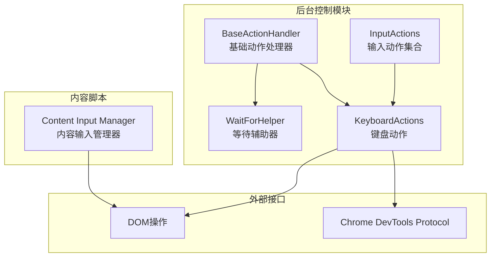
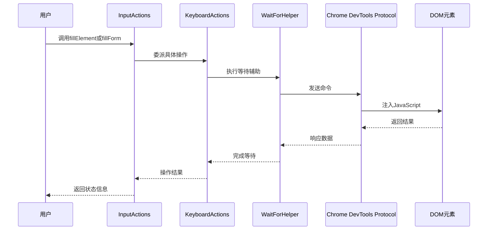
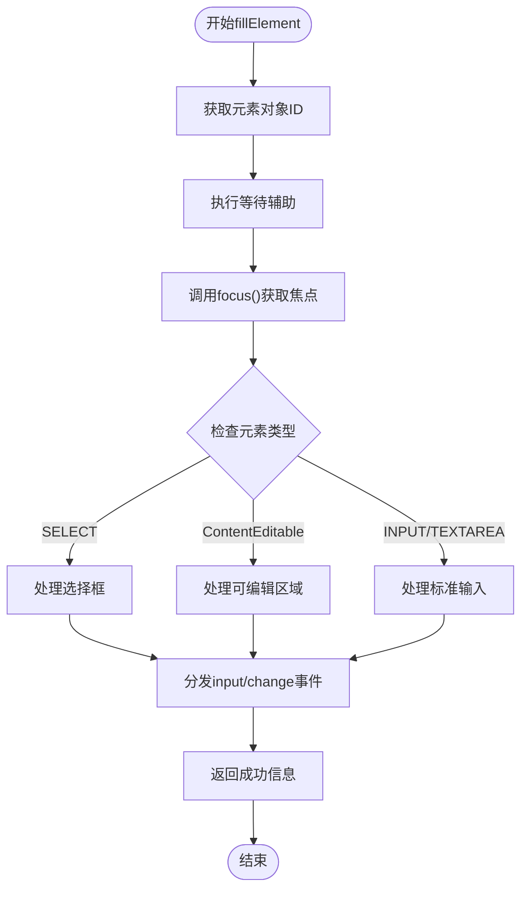
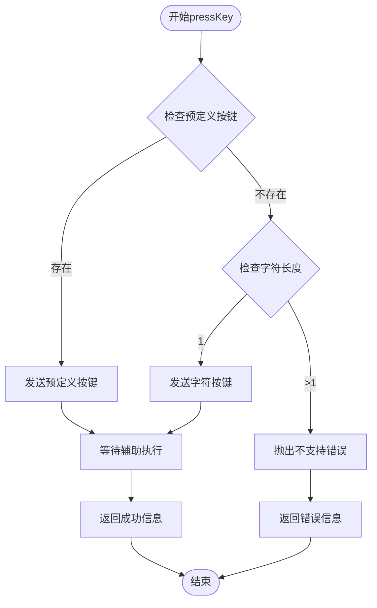
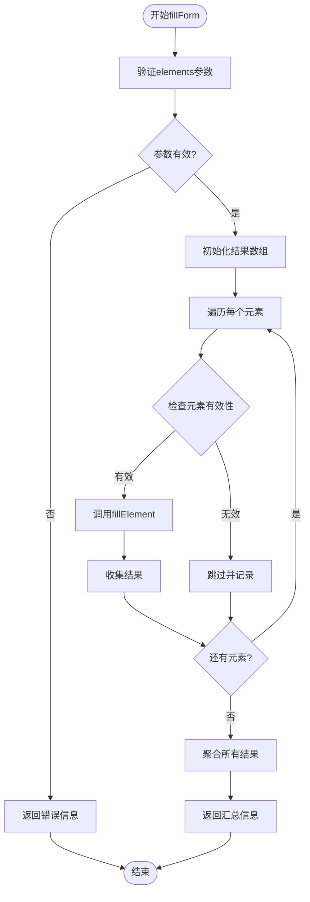
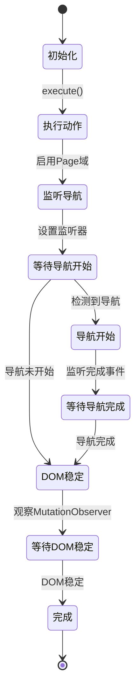
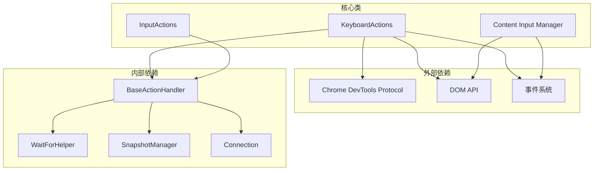

# 键盘操作

<cite>
**本文档引用的文件**
- [keyboard.js](file://background/control/actions/input/keyboard.js)
- [input.js](file://background/control/actions/input.js)
- [base.js](file://background/control/actions/base.js)
- [wait_helper.js](file://background/control/wait_helper.js)
- [input.js](file://content/toolbar/utils/input.js)
</cite>

## 目录
1. [简介](#简介)
2. [项目结构](#项目结构)
3. [核心组件](#核心组件)
4. [架构概览](#架构概览)
5. [详细组件分析](#详细组件分析)
6. [依赖关系分析](#依赖关系分析)
7. [性能考虑](#性能考虑)
8. [故障排除指南](#故障排除指南)
9. [结论](#结论)

## 简介

本文档提供了键盘操作工具的详细参考文档，重点涵盖 `fillElement`、`pressKey` 和 `fillForm` 等核心方法。这些方法是浏览器控制功能的重要组成部分，允许AI助手通过自然语言指令直接操作网页元素，实现文本输入、快捷键触发和表单批量填充等功能。

键盘操作工具基于Chrome DevTools Protocol (CDP) 实现，通过JavaScript注入的方式直接操作DOM元素，确保与现代前端框架（如React、Vue等）的兼容性。该工具集成了智能等待机制，能够处理动态加载的内容和复杂的页面交互场景。

## 项目结构

键盘操作功能位于扩展程序的后台控制模块中，采用分层架构设计：

**图表来源**
- [keyboard.js](file://background/control/actions/input/keyboard.js#L1-L116)
- [input.js](file://background/control/actions/input.js#L1-L62)
- [base.js](file://background/control/actions/base.js#L1-L64)

**章节来源**
- [keyboard.js](file://background/control/actions/input/keyboard.js#L1-L116)
- [input.js](file://background/control/actions/input.js#L1-L62)
- [base.js](file://background/control/actions/base.js#L1-L64)

## 核心组件

键盘操作工具包含三个核心组件，每个组件都有特定的职责和功能：

### KeyboardActions 类
负责具体的键盘操作实现，包括文本输入和按键操作。

### InputActions 类  
提供统一的输入操作接口，组合了鼠标、键盘和文件操作功能。

### WaitForHelper 类
管理异步操作的等待和超时机制，确保操作的可靠性和稳定性。

**章节来源**
- [keyboard.js](file://background/control/actions/input/keyboard.js#L5-L116)
- [input.js](file://background/control/actions/input.js#L8-L62)
- [wait_helper.js](file://background/control/wait_helper.js#L8-L148)

## 架构概览

键盘操作工具采用分层架构，从底层的CDP通信到高层的业务逻辑，形成了完整的操作链路：

**图表来源**
- [input.js](file://background/control/actions/input.js#L20-L44)
- [keyboard.js](file://background/control/actions/input/keyboard.js#L7-L74)
- [wait_helper.js](file://background/control/wait_helper.js#L40-L90)

## 详细组件分析

### KeyboardActions.fillElement 方法

`fillElement` 是键盘操作的核心方法，负责将指定值填入到具有特定UID的DOM元素中。

#### 参数结构
- `uid`: 字符串类型，表示目标元素的唯一标识符
- `value`: 任意类型，要输入到元素中的值

#### 执行逻辑

**图表来源**
- [keyboard.js](file://background/control/actions/input/keyboard.js#L7-L74)

#### 元素类型处理策略

1. **选择框 (SELECT)**: 支持按值属性或可见文本匹配选项
2. **可编辑区域 (ContentEditable)**: 使用execCommand进行文本插入，提供撤销历史支持
3. **标准输入框**: 直接设置value属性

#### 输入事件模拟
方法会自动触发以下事件以确保框架兼容性：
- `input` 事件：通知值发生变化
- `change` 事件：通知值确认
- `click` 事件：特定于选择框的点击事件

**章节来源**
- [keyboard.js](file://background/control/actions/input/keyboard.js#L7-L74)

### KeyboardActions.pressKey 方法

`pressKey` 方法用于模拟键盘按键操作，支持预定义的功能键和字符输入。

#### 支持的按键映射

| 按键名称 | 功能描述 | 用途示例 |
|---------|----------|----------|
| Enter | 回车键 | 提交表单、确认操作 |
| Backspace | 退格键 | 删除字符、清除输入 |
| Tab | 切换键 | 表单字段间导航 |
| Escape | 退出键 | 关闭弹窗、取消操作 |
| Delete | 删除键 | 删除选中内容 |
| ArrowUp/Down/Left/Right | 方向键 | 导航菜单、选择选项 |
| PageUp/Down | 翻页键 | 页面滚动导航 |
| Home/End | 行首尾键 | 快速定位光标 |
| Space | 空格键 | 选择复选框、继续滚动 |

#### 执行流程

**图表来源**
- [keyboard.js](file://background/control/actions/input/keyboard.js#L76-L115)

**章节来源**
- [keyboard.js](file://background/control/actions/input/keyboard.js#L76-L115)

### InputActions.fillForm 方法

`fillForm` 方法提供批量表单填充功能，可以同时处理多个输入元素。

#### 参数结构
- `elements`: 数组类型，包含要填充的元素对象数组
- 每个元素对象包含：
  - `uid`: 字符串类型，目标元素的唯一标识符
  - `value`: 任意类型，要输入到元素中的值

#### 批量处理逻辑

**图表来源**
- [input.js](file://background/control/actions/input.js#L22-L44)

#### 错误处理机制
- **参数验证**: 确保elements参数为非空数组
- **元素验证**: 检查每个元素是否包含有效的uid和value
- **异常捕获**: 捕获单个元素填充过程中的异常
- **结果聚合**: 将所有操作结果聚合为统一的返回格式

**章节来源**
- [input.js](file://background/control/actions/input.js#L22-L44)

### WaitForHelper 类详解

`WaitForHelper` 类提供了智能等待和超时控制机制，确保操作的可靠性和稳定性。

#### 等待策略

**图表来源**
- [wait_helper.js](file://background/control/wait_helper.js#L40-L90)

#### 超时配置
- **DOM稳定等待**: 3000ms（可受CPU倍数影响）
- **稳定持续时间**: 100ms（可受CPU倍数影响）
- **导航检测时间**: 200ms（可受CPU倍数影响）
- **导航完成等待**: 15000ms（可受网络倍数影响）

**章节来源**
- [wait_helper.js](file://background/control/wait_helper.js#L8-L148)

### 内容脚本输入管理器

内容脚本中的 `InputManager` 类提供了额外的文本输入功能，支持更精细的文本操作。

#### 主要功能
- **源元素捕获**: 识别当前活动的输入元素
- **文本插入**: 支持替换和追加两种模式
- **范围选择**: 精确控制文本选择范围
- **事件分发**: 触发input事件以通知框架

**章节来源**
- [input.js](file://content/toolbar/utils/input.js#L4-L134)

## 依赖关系分析

键盘操作工具的依赖关系体现了清晰的分层架构：

**图表来源**
- [keyboard.js](file://background/control/actions/input/keyboard.js#L3-L4)
- [input.js](file://background/control/actions/input.js#L3-L6)
- [base.js](file://background/control/actions/base.js#L3-L11)

### 组件耦合度分析

- **低耦合**: 各组件职责明确，相互独立
- **高内聚**: 相关功能集中在同一类中
- **依赖方向**: 从上层到下层逐级依赖
- **接口清晰**: 通过明确的方法签名和返回值

**章节来源**
- [base.js](file://background/control/actions/base.js#L1-L64)
- [keyboard.js](file://background/control/actions/input/keyboard.js#L1-L116)
- [input.js](file://background/control/actions/input.js#L1-L62)

## 性能考虑

### 等待机制优化
- **智能等待**: 根据CPU和网络条件调整超时时间
- **导航检测**: 自动检测页面导航并等待其完成
- **DOM稳定**: 使用MutationObserver观察DOM变化

### 内存管理
- **对象清理**: 及时释放JavaScript对象引用
- **监听器管理**: 正确添加和移除事件监听器
- **资源回收**: 避免内存泄漏

### 错误恢复
- **重试机制**: 对于临时性错误提供重试机会
- **降级策略**: 在功能不可用时提供替代方案
- **异常隔离**: 防止单个操作影响整体系统稳定性

## 故障排除指南

### 常见问题及解决方案

#### 元素未找到
**症状**: 抛出"Node with uid not found"错误
**原因**: 元素UID无效或元素已从DOM中移除
**解决方案**: 
1. 确保在操作前执行页面快照
2. 验证元素UID的有效性
3. 检查元素是否存在于当前DOM中

#### 输入验证失败
**症状**: 表单提交被阻止或显示验证错误
**原因**: 输入值不符合表单验证规则
**解决方案**:
1. 检查输入值的数据类型和格式
2. 验证必填字段是否已填充
3. 确认输入值在允许范围内

#### 动态内容加载
**症状**: 操作在内容加载完成前执行
**原因**: 页面仍在异步加载内容
**解决方案**:
1. 使用WaitForHelper的等待功能
2. 实施重试机制
3. 检查元素的可交互状态

#### 富文本编辑器兼容性
**症状**: 文本插入不生效或格式丢失
**原因**: 富文本编辑器有特殊的编辑API
**解决方案**:
1. 使用ContentEditable元素的特殊处理逻辑
2. 优先使用execCommand进行文本插入
3. 提供回退机制（直接设置innerText）

### 调试技巧

#### 日志记录
- 启用详细的日志输出
- 记录关键操作的时间戳
- 跟踪异步操作的执行顺序

#### 状态监控
- 监控页面导航状态
- 观察DOM变化事件
- 检查元素的生命周期

#### 性能分析
- 分析操作执行时间
- 监控内存使用情况
- 评估重试次数的影响

**章节来源**
- [base.js](file://background/control/actions/base.js#L25-L34)
- [wait_helper.js](file://background/control/wait_helper.js#L81-L86)

## 结论

键盘操作工具提供了强大而灵活的浏览器控制能力，通过 `fillElement`、`pressKey` 和 `fillForm` 三个核心方法，实现了从简单文本输入到复杂表单批量填充的完整功能覆盖。

### 主要优势
- **跨框架兼容**: 通过事件分发确保与各种前端框架的兼容性
- **智能等待**: 自动处理页面异步加载和导航
- **错误处理**: 完善的异常捕获和恢复机制
- **扩展性**: 清晰的架构设计便于功能扩展

### 最佳实践
- 在操作前确保元素可用性
- 合理使用等待机制
- 实施适当的错误处理策略
- 考虑用户体验和性能影响

该工具集为AI驱动的浏览器自动化提供了坚实的基础，能够满足各种复杂的网页操作需求。